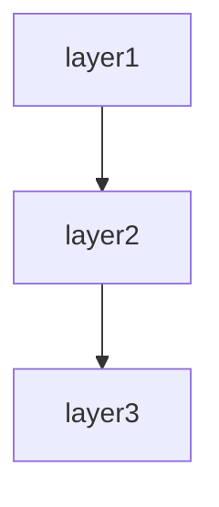

# Batch-system spec template

This template defines the chapter outline for the spec of a scheduled or event-driven background-processing system.

Designed for COBOL + JCL, cron / systemd timers, Spring Batch, Apache Airflow, Celery, Sidekiq, AWS Batch, AWS Lambda scheduled runs, ETL data pipelines, etc.

---

## Chapter outline

### Chapter 1: Overview

<!-- meta: business purpose of the batch system as a whole. -->

#### 1.1 Business purpose
- The business problem this batch system solves
- Position in the business cycle (monthly, weekly, daily, real-time)

#### 1.2 Major job groups
- Major job categories (aggregation, transfer, integrity check, etc.)
- Representative jobs per category

#### 1.3 Related systems
- Sources of input data
- Consumers of output data

---
---

### Chapter 2: Feature specifications

<!-- meta: consolidated feature-level view of the system. Maps features to screens, routes, and data. -->

#### 2.1 Feature catalogue table

| Feature ID | Feature name | Category | Related items (screens/endpoints/jobs/APIs) | Auth required | Summary | Confidence |
|------------|-------------|----------|-------------------------------------------|-------------|---------|-----------|
| F-001 | (feature) | (category) | (related items) | yes/no | 1-line summary | 🟢/🟡/🔴 |
| F-002 | (feature) | (category) | (related items) | yes/no | 1-line summary | 🟢/🟡/🔴 |
| ... | ... | ... | ... | ... | ... | ... |

The catalogue table exhaustively lists every feature. Confidence labels:
- 🟢 **VERIFIED**: Feature purpose confirmed by reading the actual code (screen, controller, or service file).
- 🟡 **INFERRED**: Feature mechanically grouped from endpoint path prefix or class naming convention.
- 🔴 **ASSUMED**: Feature inferred from use-case description; code evidence is indirect.

#### 2.2 Per-feature processing definitions

For each feature listed above, describe the processing flow structured as below. Generate at minimum the top-5 features by complexity or business criticality; list the remainder in the catalogue table only.

##### F-001: {Feature name}

**Overview**
- Business value this feature provides
- Which user / system role uses it

**Trigger**
- User action / system event / external call that initiates this feature

**Pre-conditions**
- Conditions that must hold before execution

**Main flow**
1. Step 1 [REF: src/path:line]
2. Step 2 [REF: src/path:line]
3. ...

**Alternative flows**
- Alt-1: When [condition] → [behaviour] [REF: src/path:line]

**Error handling**
- Error type → system behaviour [REF: src/path:line]

**Post-conditions**
- State of the system after successful execution

**Related business rules**
- → Ch? (Domain rules section) cross-reference

**Related chapters**
- → Ch? (Screen details / Routes / Data model) cross-reference

**Confidence**: 🟢/🟡/🔴

---

### Chapter 3: Architecture overview

<!-- meta: structure of the batch execution platform. -->

#### 3.1 Technology stack
- Language / framework
- Scheduler (cron / Airflow / Spring Batch / JCL, etc.)
- Job runtime (on-prem / cloud / container)

#### 3.2 Job execution model
- One-shot / chained / DAG-driven
- Parallelism
- Resource allocation

#### 3.3 Input/output data stores
- Database / file storage / message queue
- Data formats (CSV, JSON, XML, fixed-length, Parquet, etc.)

---

### Chapter 4: Job catalogue

<!-- meta: inventory of all jobs. The pillar of verification. -->

#### 4.1 Job catalogue
| Job ID | Job name | Kind | Frequency | Expected runtime | Primary data |
|---------|---------|------|---------|------------|------------|
| JOB-001 | Daily sales aggregation | aggregation | daily 02:00 | 30 min | sales |
| JOB-002 | User deactivation | integrity | monthly (1st) | 2 hours | users |
| ... | ... | ... | ... | ... | ... |

#### 4.2 Per-job details
For each job, describe:
- Business purpose
- Input data source
- Processing
- Output destination
- Execution user / privileges
- Execution host / container image
- Resource requirements (CPU / memory / disk)

---

### Chapter 5: Triggers and schedule

<!-- meta: when and on what trigger each job runs. -->

#### 5.1 Schedule definitions
| Job ID | Schedule expression | Timezone | Business days only |
|---------|----------------|-----------|------------|
| JOB-001 | `0 2 * * *` (cron) | Asia/Tokyo | yes |
| ... | ... | ... | ... |

#### 5.2 Event triggers
- File-arrival triggers
- Message-arrival triggers
- Upstream-job completion triggers

#### 5.3 Business-calendar handling
- Business-day / non-business-day handling
- Special handling at month start / end
- Holiday-calendar source

---

### Chapter 6: Data flow

<!-- meta: input → transform → output. Make data movement traceable. -->

#### 6.1 Data-flow diagram
- Data flow across major jobs (Mermaid notation, etc.)
- Path from data sources to final outputs

#### 6.2 Per-job data I/O
For each job:
- Input data
  - Source (table / file / API)
  - Expected count / size
  - Extraction conditions
- Processing
  - Main logic
  - Aggregation unit
  - Exceptional-data handling
- Output data
  - Destination
  - Format
  - Hand-off to downstream jobs

#### 6.3 Intermediate-data management
- Work tables / temporary files
- Retention period / cleanup policy

---

### Chapter 7: Error handling and retry policy

<!-- meta: behaviour on failure, including idempotency. -->

#### 7.1 Error classification
| Error kind | Example | Retryable? | Response |
|----------|----|-----------|------|
| Input-data anomaly | malformed format | not retryable | log anomaly separately, continue downstream |
| Transient system failure | DB connection failure | retry up to 3 times | alert on final failure |
| Data-integrity anomaly | duplicate key | not retryable | fail the entire job |
| ... | ... | ... | ... |

#### 7.2 Retry specification
- Retry interval (fixed / exponential backoff)
- Maximum retry count
- Logic that decides whether an error is retryable

#### 7.3 Idempotency
- Idempotency guarantees per job
- Whether the same input may be processed multiple times
- Presence of a checkpoint mechanism

#### 7.4 Error notifications
- Notification channels (email / Slack / PagerDuty)
- Notification levels (WARN / ERROR / CRITICAL)
- Notification body templates

---

### Chapter 8: Recovery procedures

<!-- meta: incident runbook. Detailed enough that an operator can act on it. -->

#### 8.1 Recovery per failure scenario
| Scenario | Blast radius | Recovery steps | Expected recovery time |
|---------|---------|---------|------------|
| Job-execution failure | single job | check input → manual re-run | 30 min |
| Data corruption | propagates downstream | restore from backup → re-run | 4 hours |
| ... | ... | ... | ... |

#### 8.2 Partial re-run
- Whether the job can resume from the interruption point
- How to use the checkpoint mechanism

#### 8.3 Undo operations
- How to cancel the result of an already-executed job
- Data-correction commands

#### 8.4 RTO / RPO
- Expected Recovery Time Objective
- Expected Recovery Point Objective

---

### Chapter 9: Operations calendar and dependencies

<!-- meta: temporal dependencies between jobs. -->

#### 9.1 Job-dependency graph
- DAG diagram (Mermaid notation, etc.)
- Dependency conditions (on success / on failure / on completion)

#### 9.2 Execution timeline
- One day's job schedule visualised on a timeline
- Identification of peak time windows

#### 9.3 Monthly / yearly cycles
- Day-of-month for monthly batches
- Fiscal-year rollover processing
- End-of-period processing

---

### Chapter 10: Monitoring / alerts

<!-- meta: what the operators look at. -->

#### 10.1 Monitoring items
| Target | Method | Threshold | Action |
|---------|---------|---------|------|
| Job success/failure | log parsing | immediate on failure | alert |
| Job duration | metrics | expected duration + 20% | warning |
| Record count | aggregation query | past mean ± 30% | warning |
| ... | ... | ... | ... |

#### 10.2 Log specification
- Log output format
- Log destination
- Retention period
- Searchability (structured logs / indexes)

#### 10.3 Dashboards
- Links to primary dashboards
- Displayed items

---

### Chapter 11: System design

<!-- meta: architectural decisions, cross-cutting concerns, module dependencies, and design trade-offs derived from code. Complements Architecture overview (which describes WHAT) by explaining WHY and HOW cross-cutting concerns are handled. -->

#### 11.1 Architecture Decision Records (ADR)

Code-derived record of design decisions. Confidence is typically low since rationale is rarely written in code; use Question Bank integration for SME confirmation.

| ID | Topic | Decision (as observed in code) | Rationale (inferred) | Alternatives (inferred) | Confidence | Supporting REF |
|----|-------|------------------------------|---------------------|----------------------|-----------|---------------|
| ADR-001 | (topic) | (decision) | (inferred rationale) | (inferred alternatives) | 🟢/🟡/🔴 | [REF: ...] |
| ... | ... | ... | ... | ... | ... | ... |

Extraction strategy:
- Search for design-related comments (`// Why:`, `# Reason:`, `/* Decision: */`)
- Read README / CONTRIBUTING / design docs for explicit rationale
- When no explicit rationale exists, mark 🔴 ASSUMED and add `[ASK SME]`

[CONFIDENCE: LOW — ADR entries are almost always inferred unless explicitly documented]

#### 11.2 Module / component dependency

Import/require/include graph extracted from source code. Enumerates dependencies between layers or modules.

**Extraction approach:**

| Language | Pattern | Example | Confidence |
|----------|---------|---------|-----------|
| Python | `rg "^import |^from "` then filter to own project | `import app.models` → depends on `app.models` | 🟢 |
| TypeScript/JS | `rg "^(import |const .* = require\()"` | `import { User } from '../models'` | 🟢 |
| Java/Kotlin | `rg "^import "` | `import com.example.service.UserService` | 🟢 |
| Ruby | `rg "^(require |require_relative )"` | `require_relative 'models/user'` | 🟢 |
| Go | `rg ""github\.com/.*/"` filtered to own module | `"project/internal/service"` | 🟢 |
| PHP | `rg "^(use |require_once )"` | `use App\Service\UserService` | 🟢 |
| C# | `rg "^(using |using static )"` | `using Project.Data.Models` | 🟢 |

Render the result as a Mermaid graph:

Label each edge with the dependency strength (direct / transitive / circular). Flag circular dependencies explicitly.

[🟢 VERIFIED] — import statements are mechanically extractable with near-zero false positives.

#### 11.3 Cross-cutting design patterns

Code-wide patterns that span multiple modules.

| Pattern | Detection method | Example REF | Confidence |
|---------|----------------|-------------|-----------|
| Error handling strategy | Search for `try`/`catch`/`except`/`raise`/`throw` patterns, custom exception classes | [REF: src/errors.py:1-50] | 🟢 |
| Logging approach | Search for `logger`/`logging`/`console.log`/`print`/`warn` calls | [REF: src/middleware/logging.py:10-30] | 🟢 |
| Validation pattern | Search for decorators (`@validate`/`@assert`), validator classes, assertions | [REF: src/validators/] | 🟢 |
| Dependency injection | Constructor injection / DI container / service provider | [REF: src/di/container.py:1-80] | 🟡 |
| Retry / resilience | Search for `retry`/`backoff`/`timeout`/`circuit_breaker` patterns | [REF: src/utils/retry.py] | 🟡 |
| Batch / chunk processing | Search for `batch`/`chunk`/`bulk` in method/class names | [REF: src/jobs/batch_processor.py] | 🟢 |

For each pattern found, note:
- **Consistency**: Does the whole project use one pattern, or are multiple approaches mixed?
- **Coverage**: Are there modules that SHOULD use this pattern but don't?
- **Exceptions**: Any deliberate deviations from the pattern?

[🟢 VERIFIED for most patterns] — language-level constructs (try/catch, import patterns) are mechanically detectable.

#### 11.4 Security design

Security-related mechanisms observed in code. Detailed auth flows go in the Authentication chapter; this section covers the remaining security posture.

| Aspect | Detection method | Confidence |
|--------|----------------|-----------|
| Input sanitisation | Search for `escape`/`sanitize`/`strip_tags`/parameterised queries | 🟡 |
| Secrets management | Search for `.env`/`secrets`/`vault` references, env-var reads for credentials | 🟢 |
| Encryption at rest | Search for `encrypt`/`decrypt`/`hash`/`bcrypt`/`argon2` calls | 🟢 |
| Transport security | Search for HTTPS/TLS/SSL configuration | 🟡 |
| CORS / CSP | Search for CORS middleware, Content-Security-Policy headers | 🟢 |
| Authorisation guards | Cross-reference with auth chapter; note any unauthorised endpoints | 🟢 |

→ Detailed auth flows → see Chapter ? (Authentication and authorisation)

[🟢 VERIFIED for most — security code is explicit and searchable]

#### 11.5 Performance design

Performance-related patterns and potential bottlenecks detected in code. **Does not include benchmarks** (not extractable from code alone).

| Pattern | Detection method | Confidence |
|---------|----------------|-----------|
| Caching | Search for `cache`/`redis`/`memcache`/`memoize`/`lru_cache` | 🟢 |
| N+1 prevention | Search for `eager_load`/`includes`/`prefetch`/`select_related` | 🟢 |
| Async processing | Search for `async`/`await`/`thread`/`worker`/`queue`/`celery`/`sidekiq` | 🟢 |
| Bulk operations | Search for `bulk_`/`batch_`/`chunk` methods | 🟢 |
| Connection pooling | Search for `pool`/`connection_limit`/`max_connections` | 🟡 |
| Query optimisation | Search for `EXPLAIN`/`index`/`materialized view` hints | 🟡 |
| Concurrency control | Search for `lock`/`mutex`/`transaction`/`optimistic`/`pessimistic` | 🟢 |

For each pattern, list which files/modules use it. Note modules that might need these patterns but don't use them (potential performance debt).

[🟢 VERIFIED for most patterns — code-level keywords are mechanically searchable]

#### 11.6 Integration design

External-system integration patterns. Detailed per-integration specs go in the External-system integration chapter; this section provides the overarching design.

| Aspect | Detection method | Confidence |
|--------|----------------|-----------|
| External HTTP calls | Search for `requests`/`HTTPX`/`axios`/`fetch`/`HttpClient` calls | 🟢 |
| Message queue usage | Search for `publish`/`subscribe`/`produce`/`consume`/`rabbit`/`kafka`/`sqs` | 🟢 |
| File-based integration | Search for file read/write with specific formats (CSV/XML/JSON/Parquet) | 🟢 |
| Protocol distribution | Classify external calls by protocol (REST / GraphQL / gRPC / SOAP) | 🟢 |
| Resiliency | Search for `timeout`/`retry`/`fallback`/`circuit_breaker` around external calls | 🟡 |

→ Detailed per-integration specs → see Chapter ? (External-system integration)

[🟢 VERIFIED — external call code is explicit]

#### 11.7 Known trade-offs and constraints

Technical trade-offs and constraints visible in code comments.

| Marker | Detection method | Meaning | Example |
|--------|----------------|---------|---------|
| `TODO` | `rg "TODO"` (with context) | Planned improvement; may indicate known limitation | `// TODO: paginate this query` |
| `FIXME` | `rg "FIXME"` | Defect or known issue | `# FIXME: race condition on concurrent writes` |
| `HACK` / `WORKAROUND` | `rg "HACK|WORKAROUND"` | Deliberate suboptimal solution | `/* HACK: SDK bug, remove after v2 upgrade */` |
| `XXX` | `rg "XXX"` | Something suspicious that needs review | `// XXX: this silently ignores errors` |
| `OPTIMIZE` | `rg "OPTIMIZE|PERF|SLOW"` | Performance concern | `# OPTIMIZE: N+1 query, eager-load` |
| `@deprecated` / `DEPRECATED` | Search for deprecation markers | Planned removal | `@deprecated use createV2 instead` |

→ Critical items → see Chapter ? (Known constraints and unresolved items)

For each marker, include the surrounding context (next 2 lines) to explain the trade-off. Group by severity (CRITICAL / MAJOR / MINOR).

[🟢 VERIFIED — markers are mechanically extractable; context needs manual review for accurate grouping]

---

### Chapter 12: Known constraints and unresolved items

<!-- meta: spec credibility safeguard. -->

#### 12.1 Known technical constraints
- Maximum concurrency
- Maximum data volume that can be processed
- Known performance issues

#### 12.2 Unresolved items
- Place the `abandoned` entries from the Question Bank here

---

## Customisation guidance

### COBOL + JCL
- Add a "JCL step details" section to Chapter 3.
- Add a "COPYBOOK specification" section to Chapter 5.

### Apache Airflow
- Rewrite Chapter 8 around "DAG definitions".
- Explicitly state the SLA of each DAG in Chapter 9.

### Data pipeline (ETL)
- Restructure Chapter 5 into three sections: Extract / Transform / Load.
- Add a separate chapter for schema-change management.

### Primarily event-driven
- Rewrite Chapter 4 around "event definitions".
- Replace the dependency graph in Chapter 8 with an event-flow diagram.

Customisation is finalised in dialogue with the user after Phase 1 template selection.
