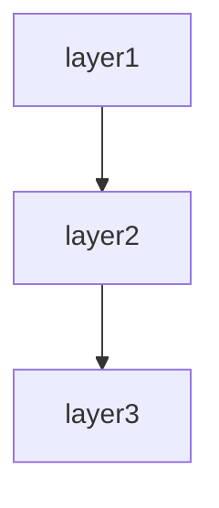

# Web application spec template

This template defines the chapter outline for the spec of a web system that the user operates through screens.

Designed for typical web applications: PHP (Laravel/Symfony/CakePHP), Python (Django/Flask), Ruby (Rails), Node.js (Next.js/Nuxt/Express), Java (Spring MVC), ASP.NET MVC, etc.

---

## Chapter outline

### Chapter 1: Overview

<!-- meta: bird's-eye view of the whole system. A 3-minute "what is this" for the reader. -->

#### 1.1 System purpose
- The business problem this system solves
- Primary users / stakeholders
- Position in the business

#### 1.2 Main use cases
- Use case 1: ...
- Use case 2: ...
- 3 to 5 use cases

#### 1.3 High-level architecture diagram
- High-level component diagram of the system
- Use Mermaid notation when appropriate

---
### Chapter 2: Feature specifications

<!-- meta: consolidated feature-level view of the system. Maps features to screens, routes, and data. -->

#### 2.1 Feature catalogue table

| Feature ID | Feature name | Category | Related items (screens/endpoints/jobs/APIs) | Auth required | Summary | Confidence |
|------------|-------------|----------|-------------------------------------------|-------------|---------|-----------|
| F-001 | (feature) | (category) | (related items) | yes/no | 1-line summary | 🟢/🟡/🔴 |
| F-002 | (feature) | (category) | (related items) | yes/no | 1-line summary | 🟢/🟡/🔴 |
| ... | ... | ... | ... | ... | ... | ... |

The catalogue table exhaustively lists every feature. Confidence labels:
- 🟢 **VERIFIED**: Feature purpose confirmed by reading the actual code (screen, controller, or service file).
- 🟡 **INFERRED**: Feature mechanically grouped from endpoint path prefix or class naming convention.
- 🔴 **ASSUMED**: Feature inferred from use-case description; code evidence is indirect.

#### 2.2 Per-feature processing definitions

For each feature listed above, describe the processing flow structured as below. Generate at minimum the top-5 features by complexity or business criticality; list the remainder in the catalogue table only.

##### F-001: {Feature name}

**Overview**
- Business value this feature provides
- Which user / system role uses it

**Trigger**
- User action / system event / external call that initiates this feature

**Pre-conditions**
- Conditions that must hold before execution

**Main flow**
1. Step 1 [REF: src/path:line]
2. Step 2 [REF: src/path:line]
3. ...

**Alternative flows**
- Alt-1: When [condition] → [behaviour] [REF: src/path:line]

**Error handling**
- Error type → system behaviour [REF: src/path:line]

**Post-conditions**
- State of the system after successful execution

**Related business rules**
- → Ch? (Domain rules section) cross-reference

**Related chapters**
- → Ch? (Screen details / Routes / Data model) cross-reference

**Confidence**: 🟢/🟡/🔴

---

### Chapter 3: Architecture overview

<!-- meta: design decisions and overall structure. Capture WHY this shape. -->

#### 3.1 Adopted framework / libraries
- Language, framework, and major libraries
- Version information

#### 3.2 Architecture pattern
- MVC / Clean architecture / Hexagonal, etc.
- Reason for adoption (to the extent it can be inferred)

#### 3.3 Directory structure
- Responsibility of each major directory
- Conventions (naming rules, placement rules)

#### 3.4 Dependencies
- External systems / APIs
- Database / cache / message queue

---

### Chapter 4: Screens and screen transitions

<!-- meta: UI structure from the user's perspective. -->

#### 4.1 Screen list
| Screen ID | Screen name | URL | Auth required | Required role |
|-------|-------|-----|---------|---------|
| SC-001 | Login | /login | no | - |
| SC-002 | Dashboard | /dashboard | yes | regular user or higher |
| ... | ... | ... | ... | ... |

#### 4.2 Screen-transition diagram
- Major transition paths (Mermaid notation, etc.)
- Exceptional transitions (errors, session timeout)

#### 4.3 Details of each screen
For each screen, describe:
- Displayed elements
- Input fields and their validation
- Actions (behaviour when buttons are pressed)
- Display conditions (role, data state)

---

### Chapter 5: Routes / endpoints

<!-- meta: full list of HTTP routes. The pillar of inventory-based verification. -->

#### 5.1 Web screen routes
| Method | Path | Controller::Action | Auth | Summary |
|---------|------|-----------------------|------|------|
| GET | / | HomeController::index | optional | Top page |
| GET | /users/{id} | UserController::show | required | User details |
| ... | ... | ... | ... | ... |

#### 5.2 Internal API / Ajax endpoints
- Ajax / Fetch APIs called from the screens
- Response format

#### 5.3 Per-route middleware
- Applied middleware and the order of processing

---

### Chapter 6: Data model

<!-- meta: structure and semantics of persisted data. -->

#### 6.1 ER diagram
- Relations between key entities
- Use Mermaid notation, etc.

#### 6.2 Entity list
Per entity:
- Table / class name
- Field list (type, nullability, default, business meaning)
- Indexes
- Foreign keys
- Relations (1:1, 1:N, N:N)

#### 6.3 Key domain rules
- Invariants
- State transitions (state machines)
- Business rules (e.g. "withdrawn users are excluded from search results")

---

### Chapter 7: Authentication and authorisation

<!-- meta: security core. Omissions here are critical. -->

#### 7.1 Authentication method
- Session / token / OAuth / SSO
- Password-hash algorithm
- Session timeout

#### 7.2 Authorisation model
- Roles and permissions
- Role hierarchy
- Where authorisation checks are implemented

#### 7.3 Authorisation flow
- Request → authorisation decision → execute / deny flow
- Behaviour on authorisation failure

#### 7.4 Session management
- Session store
- Conditions for session invalidation
- Concurrent-login control

---

### Chapter 8: External-system integration

<!-- meta: boundaries and failure propagation. -->

#### 8.1 Integration partners
| Partner | Protocol | Purpose | Behaviour on failure |
|-------|----------|------|----------|
| Payment gateway | HTTPS REST | Payment processing | Retry 3 times; notify on failure |
| ... | ... | ... | ... |

#### 8.2 Details per integration
- Authentication method (API key, OAuth, etc.)
- Request / response example
- Timeout / retry policy
- Idempotency (or lack thereof)
- Fallback behaviour on failure

---

### Chapter 9: Operations settings

<!-- meta: deployment, environment variables, monitoring. -->

#### 9.1 Environment composition
- Environment list (dev, staging, prod)
- Differences between environments

#### 9.2 Environment variables / configuration values
| Variable | Required | Default | Purpose |
|-------|------|----------|------|
| DB_HOST | required | - | Database connection target |
| ... | ... | ... | ... |

#### 9.3 Deployment procedure
- Build procedure
- Deploy command
- Rollback procedure

#### 9.4 Monitoring / logging
- Monitoring targets (liveness, performance, errors)
- Log destination and retention period
- Alert conditions

#### 9.5 Backup / restore
- Backup target
- Frequency and generation management
- Restore procedure

---

### Chapter 10: System design

<!-- meta: architectural decisions, cross-cutting concerns, module dependencies, and design trade-offs derived from code. Complements Architecture overview (which describes WHAT) by explaining WHY and HOW cross-cutting concerns are handled. -->

#### 10.1 Architecture Decision Records (ADR)

Code-derived record of design decisions. Confidence is typically low since rationale is rarely written in code; use Question Bank integration for SME confirmation.

| ID | Topic | Decision (as observed in code) | Rationale (inferred) | Alternatives (inferred) | Confidence | Supporting REF |
|----|-------|------------------------------|---------------------|----------------------|-----------|---------------|
| ADR-001 | (topic) | (decision) | (inferred rationale) | (inferred alternatives) | 🟢/🟡/🔴 | [REF: ...] |
| ... | ... | ... | ... | ... | ... | ... |

Extraction strategy:
- Search for design-related comments (`// Why:`, `# Reason:`, `/* Decision: */`)
- Read README / CONTRIBUTING / design docs for explicit rationale
- When no explicit rationale exists, mark 🔴 ASSUMED and add `[ASK SME]`

[CONFIDENCE: LOW — ADR entries are almost always inferred unless explicitly documented]

#### 10.2 Module / component dependency

Import/require/include graph extracted from source code. Enumerates dependencies between layers or modules.

**Extraction approach:**

| Language | Pattern | Example | Confidence |
|----------|---------|---------|-----------|
| Python | `rg "^import |^from "` then filter to own project | `import app.models` → depends on `app.models` | 🟢 |
| TypeScript/JS | `rg "^(import |const .* = require\()"` | `import { User } from '../models'` | 🟢 |
| Java/Kotlin | `rg "^import "` | `import com.example.service.UserService` | 🟢 |
| Ruby | `rg "^(require |require_relative )"` | `require_relative 'models/user'` | 🟢 |
| Go | `rg ""github\.com/.*/"` filtered to own module | `"project/internal/service"` | 🟢 |
| PHP | `rg "^(use |require_once )"` | `use App\Service\UserService` | 🟢 |
| C# | `rg "^(using |using static )"` | `using Project.Data.Models` | 🟢 |

Render the result as a Mermaid graph:

Label each edge with the dependency strength (direct / transitive / circular). Flag circular dependencies explicitly.

[🟢 VERIFIED] — import statements are mechanically extractable with near-zero false positives.

#### 10.3 Cross-cutting design patterns

Code-wide patterns that span multiple modules.

| Pattern | Detection method | Example REF | Confidence |
|---------|----------------|-------------|-----------|
| Error handling strategy | Search for `try`/`catch`/`except`/`raise`/`throw` patterns, custom exception classes | [REF: src/errors.py:1-50] | 🟢 |
| Logging approach | Search for `logger`/`logging`/`console.log`/`print`/`warn` calls | [REF: src/middleware/logging.py:10-30] | 🟢 |
| Validation pattern | Search for decorators (`@validate`/`@assert`), validator classes, assertions | [REF: src/validators/] | 🟢 |
| Dependency injection | Constructor injection / DI container / service provider | [REF: src/di/container.py:1-80] | 🟡 |
| Retry / resilience | Search for `retry`/`backoff`/`timeout`/`circuit_breaker` patterns | [REF: src/utils/retry.py] | 🟡 |
| Batch / chunk processing | Search for `batch`/`chunk`/`bulk` in method/class names | [REF: src/jobs/batch_processor.py] | 🟢 |

For each pattern found, note:
- **Consistency**: Does the whole project use one pattern, or are multiple approaches mixed?
- **Coverage**: Are there modules that SHOULD use this pattern but don't?
- **Exceptions**: Any deliberate deviations from the pattern?

[🟢 VERIFIED for most patterns] — language-level constructs (try/catch, import patterns) are mechanically detectable.

#### 10.4 Security design

Security-related mechanisms observed in code. Detailed auth flows go in the Authentication chapter; this section covers the remaining security posture.

| Aspect | Detection method | Confidence |
|--------|----------------|-----------|
| Input sanitisation | Search for `escape`/`sanitize`/`strip_tags`/parameterised queries | 🟡 |
| Secrets management | Search for `.env`/`secrets`/`vault` references, env-var reads for credentials | 🟢 |
| Encryption at rest | Search for `encrypt`/`decrypt`/`hash`/`bcrypt`/`argon2` calls | 🟢 |
| Transport security | Search for HTTPS/TLS/SSL configuration | 🟡 |
| CORS / CSP | Search for CORS middleware, Content-Security-Policy headers | 🟢 |
| Authorisation guards | Cross-reference with auth chapter; note any unauthorised endpoints | 🟢 |

→ Detailed auth flows → see Chapter ? (Authentication and authorisation)

[🟢 VERIFIED for most — security code is explicit and searchable]

#### 10.5 Performance design

Performance-related patterns and potential bottlenecks detected in code. **Does not include benchmarks** (not extractable from code alone).

| Pattern | Detection method | Confidence |
|---------|----------------|-----------|
| Caching | Search for `cache`/`redis`/`memcache`/`memoize`/`lru_cache` | 🟢 |
| N+1 prevention | Search for `eager_load`/`includes`/`prefetch`/`select_related` | 🟢 |
| Async processing | Search for `async`/`await`/`thread`/`worker`/`queue`/`celery`/`sidekiq` | 🟢 |
| Bulk operations | Search for `bulk_`/`batch_`/`chunk` methods | 🟢 |
| Connection pooling | Search for `pool`/`connection_limit`/`max_connections` | 🟡 |
| Query optimisation | Search for `EXPLAIN`/`index`/`materialized view` hints | 🟡 |
| Concurrency control | Search for `lock`/`mutex`/`transaction`/`optimistic`/`pessimistic` | 🟢 |

For each pattern, list which files/modules use it. Note modules that might need these patterns but don't use them (potential performance debt).

[🟢 VERIFIED for most patterns — code-level keywords are mechanically searchable]

#### 10.6 Integration design

External-system integration patterns. Detailed per-integration specs go in the External-system integration chapter; this section provides the overarching design.

| Aspect | Detection method | Confidence |
|--------|----------------|-----------|
| External HTTP calls | Search for `requests`/`HTTPX`/`axios`/`fetch`/`HttpClient` calls | 🟢 |
| Message queue usage | Search for `publish`/`subscribe`/`produce`/`consume`/`rabbit`/`kafka`/`sqs` | 🟢 |
| File-based integration | Search for file read/write with specific formats (CSV/XML/JSON/Parquet) | 🟢 |
| Protocol distribution | Classify external calls by protocol (REST / GraphQL / gRPC / SOAP) | 🟢 |
| Resiliency | Search for `timeout`/`retry`/`fallback`/`circuit_breaker` around external calls | 🟡 |

→ Detailed per-integration specs → see Chapter ? (External-system integration)

[🟢 VERIFIED — external call code is explicit]

#### 10.7 Known trade-offs and constraints

Technical trade-offs and constraints visible in code comments.

| Marker | Detection method | Meaning | Example |
|--------|----------------|---------|---------|
| `TODO` | `rg "TODO"` (with context) | Planned improvement; may indicate known limitation | `// TODO: paginate this query` |
| `FIXME` | `rg "FIXME"` | Defect or known issue | `# FIXME: race condition on concurrent writes` |
| `HACK` / `WORKAROUND` | `rg "HACK|WORKAROUND"` | Deliberate suboptimal solution | `/* HACK: SDK bug, remove after v2 upgrade */` |
| `XXX` | `rg "XXX"` | Something suspicious that needs review | `// XXX: this silently ignores errors` |
| `OPTIMIZE` | `rg "OPTIMIZE|PERF|SLOW"` | Performance concern | `# OPTIMIZE: N+1 query, eager-load` |
| `@deprecated` / `DEPRECATED` | Search for deprecation markers | Planned removal | `@deprecated use createV2 instead` |

→ Critical items → see Chapter ? (Known constraints and unresolved items)

For each marker, include the surrounding context (next 2 lines) to explain the trade-off. Group by severity (CRITICAL / MAJOR / MINOR).

[🟢 VERIFIED — markers are mechanically extractable; context needs manual review for accurate grouping]

---

### Chapter 11: Known constraints and unresolved items

<!-- meta: spec credibility safeguard. -->

#### 11.1 Known technical constraints
- Performance ceilings (concurrent connections, response time)
- Known bugs / workarounds

#### 11.2 Unresolved items
- Place the `abandoned` entries from the Question Bank here
- For each item, record "why it could not be resolved", "current inference", "what is needed to resolve it in the future"

---

## Customisation guidance

This template assumes a standard web application. Customise as the actual project requires.

### Multi-tenant / SaaS
- Add a "tenant isolation" section to Chapter 6.

### Many background jobs
- Insert a "background jobs" chapter between Chapter 7 and Chapter 8 (see `templates/batch-system.md` for the outline).

### Multi-language support
- Add an "internationalisation (i18n)" section to Chapter 3.

### A mobile app is also offered
- Split Chapter 4 into "Web routes" and "Mobile API".

Customisation is finalised in dialogue with the user after Phase 1 template selection.
