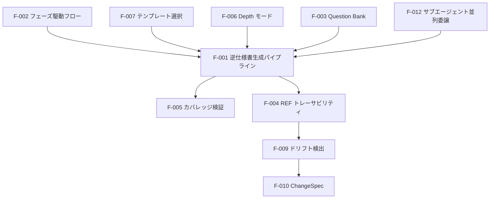

# 第2章: 機能仕様

## Sources Read

- `skills/specback/SKILL.md` (lines 12-38, 69-104)
- `skills/specback/phase-0-setup.md` (lines 1-60)
- `skills/specback/phase-1-recon.md` (lines 1-80)
- `skills/specback/phase-2-wbs.md` (lines 1-60)
- `skills/specback/phase-3-investigate.md` (lines 140-226)
- `skills/specback/phase-4-verify.md` (lines 1-80)
- `skills/specback/phase-5-dialogue.md` (lines 1-60)
- `skills/specback/phase-6-deliver.md` (lines 1-80)
- `skills/specback/phase-7-drift.md` (lines 1-58)
- `skills/specback/phase-7c-changespec.md` (lines 1-60)
- `skills/specback/phase-6-5-deepdive.md` (lines 1-40)
- `skills/specback/question-bank.md` (lines 1-60)
- `skills/specback/state-management.md` (lines 1-40)
- `skills/specback/subagent-behavior.md` (lines 1-30)
- `skills/specback/agents/chapter-investigator.md` (lines 159-184)
- `skills/specback/references/template-catalog.md` (lines 7-30, 102-127)
- `skills/specback/scripts/coverage-check.py` (lines 332-366, 681)
- `skills/specback/scripts/detect-drift.py` (lines 75-147)
- `skills/specback/scripts/source-map.py` (lines 1-30)
- `skills/specback/scripts/build-trace.py` (lines 1-30)
- `skills/specback/scripts/snapshot-hashes.py` (lines 1-30)
- `specs/01-overview.md` (lines 63-190)

## 2.1 機能カタログ

specback は「既存コードベースから仕様書を逆生成する」フレームワークである。以下に、本スキルが提供する全機能をカタログとして列挙する。Auth required の列は本スキルに認証概念が存在しないため全て `no`（不適用）とする。

| Feature ID | Feature name | Category | Related items (phases/scripts) | Auth required | Summary | Confidence |
|------------|-------------|----------|-------------------------------|-------------|---------|-----------|
| F-001 | 逆仕様書生成パイプライン | core | Phase 0→7, scripts/*.py | no | コード解析→インベントリ→トレース→章執筆→検証→納品の一貫パイプライン | 🟢 |
| F-002 | フェーズ駆動のゴール指向フロー | core | Phase 0-7c, state.json | no | 全フェーズが goal.json を参照し、状態管理しながら進行する | 🟢 |
| F-003 | Question Bank による不確実性管理 | quality | question-bank.md, questions.json | no | 疑問を3時点で蓄積し、対話で解決・abandoned 判定する | 🟢 |
| F-004 | REF トレーサビリティ | quality | build-trace.py, trace.json, [REF:] | no | 仕様書の各記述をコード箇所に REF で対応付ける | 🟢 |
| F-005 | 機械的カバレッジ検証 (Phase 4) | quality | coverage-check.py, coverage-report.json | no | 章ごとの品質ゲート（本文行数・REF数・Mermaid数・Sources Read）を機械検証 | 🟢 |
| F-006 | Depth モード | core | phase-1-recon.md, phase-3-investigate.md | no | comprehensive / outline / interactive の3モードで生成深度を選択 | 🟢 |
| F-007 | テンプレート選択とカスタム対応 | core | template-catalog.md, templates/*.md | no | 4標準テンプレート＋ユーザー自前テンプレート＋章の追加削除 | 🟢 |
| F-008 | マルチスコープ（モノレポ）対応 | core | state-management.md, .specback-{name}/ | no | スコープ単位で状態ディレクトリを分離しモノレポを扱う | 🟢 |
| F-009 | ドリフト検出 (Phase 7) | maintenance | detect-drift.py, phase-7-drift.md | no | コード変更を検出し、影響を受ける仕様章を特定する | 🟢 |
| F-010 | ChangeSpec (Phase 7c) | maintenance | change-spec.py, phase-7c-changespec.md | no | ドリフト時の変更仕様書を生成・適用する | 🟢 |
| F-011 | ディープダイブ (Phase 6.5) | core | phase-6-5-deepdive.md | no | outline/interactive モードで深掘り章をオンデマンド生成 | 🟢 |
| F-012 | サブエージェント並列委譲 | performance | phase-3-investigate.md (STEP G), subagent-behavior.md | no | 各章を独立サブエージェントへ並列委譲し生成時間を短縮 | 🟢 |
| F-013 | 多言語ソースマップ抽出 (v2) | core | source-map.py, source_map_v2/*.py | no | tree-sitter ベースの15言語抽出器＋ファイルレベルフォールバック | 🟢 |

## 2.2 主要機能の処理定義

機能間の関係を俯瞰する:



### F-001: 逆仕様書生成パイプライン

**Overview**
- specback の中核機能。既存コードベースを解析し、保守・引き継ぎ・納品に使える仕様書を自動生成する。
- コード→仕様の方向（Spec Driven Development の対称版）を提供する。 [REF: skills/specback/SKILL.md:14-16]

**Trigger**
- ユーザーが `specback` スキルを起動し、対象プロジェクトのパスを指定する。

**Pre-conditions**
- 解析対象のコードベースがローカルに存在する。
- ホストエージェント（OpenCode / Claude Code / Codex CLI 等）がスキルを読み込める状態にある。

**Main flow**
1. Phase 0 でゴール（出力言語・読者・粒度・Depth モード）を対話で確定し、`.specback/goal.json` に永続化する [REF: skills/specback/phase-0-setup.md:1-60]
2. Phase 1 でコードベースを偵察し、テンプレートを選定して `.specback/recon-report.md` を生成する [REF: skills/specback/phase-1-recon.md:1-80]
3. Phase 2 でインベントリ（抽出単位の列挙）と WBS（章割り当て）を機械的に構築する [REF: skills/specback/phase-2-wbs.md:1-60]
4. Phase 3 で各章をサブエージェントへ並列委譲し、`.specback/drafts/` にドラフトを書く [REF: skills/specback/phase-3-investigate.md:140-226]
5. Phase 4 でカバレッジと品質ゲートを機械検証し、不足をループバックする [REF: skills/specback/phase-4-verify.md:1-80]
6. Phase 5 で Question Bank の未解決疑問をユーザー対話で解決する [REF: skills/specback/phase-5-dialogue.md:1-60]
7. Phase 6 で最終仕様書を出力先（デフォルト `.specback/final/`）に納品する [REF: skills/specback/phase-6-deliver.md:1-80]

**Alternative flows**
- Alt-1: `depth_mode=outline` / `interactive` の場合、Phase 3 は概観テーブル主体の OUT-A〜OUT-D 手順に置き換わる [REF: skills/specback/phase-3-investigate.md:230-266]
- Alt-2: 途中中断した場合、state.json の current_phase から再開できる [REF: skills/specback/state-management.md:1-40]

**Error handling**
- 解析対象が空・非コードの場合 → Phase 1 で偵察結果が空になり、ユーザーに再確認を求める（🔴 ASSUMED）

**Post-conditions**
- `{output_dir}/` に章構成の仕様書一式（00-metadata.md / 01-overview.md / ... / traceability.md）が生成される。

パイプラインを構成する機械処理の連鎖は以下のようになる [REF: skills/specback/scripts/build-inventory-from-sourcemap.py:5-15] [REF: skills/specback/scripts/build-trace.py:1-12]:

```bash
# Phase 2 以降の機械処理チェーン（各フェーズで起動）
python3 skills/specback/scripts/source-map.py --target . --output .specback/source-map.json
python3 skills/specback/scripts/build-inventory-from-sourcemap.py \
  --source-map .specback/source-map.json --output .specback/inventory.json
python3 skills/specback/scripts/build-trace.py \
  --specback-dir .specback --target-dir-for-required drafts
```

**Related chapters**
- → 第3章（モジュール構成）: パイプラインを構成するモジュール群
- → 第11章（内部構造）: スクリプト群の実装詳細
- → 第12章（システム設計）: パイプライン設計判断

**Confidence**: 🟢

### F-002: フェーズ駆動のゴール指向フロー

**Overview**
- 8フェーズ（0, 1, 2, 3, 4, 5, 6, 6.5, 7, 7b, 7c）の明確な進行フロー。各フェーズが独立した detail ファイルを持ち、状態は state.json で管理される。 [REF: skills/specback/SKILL.md:70-83]

**Trigger**
- Phase N の開始時に、対応する detail ファイル（`phase-N-*.md`）を読み込む。

**Pre-conditions**
- 前フェーズの完了が state.json に記録されている。

**Main flow**
1. `goal.json` を全フェーズが参照する（ゴール変更は Phase 0 の再実行が必要） [REF: skills/specback/SKILL.md:25-38]
2. 各フェーズ終了時に state.json の phase_progress と session_history を更新する
3. 再開時は state-management.md の phase→ファイル対応表に従い、current_phase の detail ファイルを読み込む [REF: skills/specback/state-management.md:1-40]

ゴール定義の実体は以下のような JSON である [REF: skills/specback/phase-0-setup.md:1-60]:

```json
{
  "output_language": "ja",
  "output_dir": "specs",
  "primary_reader": "maintenance_developer",
  "depth_mode": "comprehensive"
}
```

**Alternative flows**
- Alt-1: Phase 7 でドリフト検出 → Phase 7b で REF 自動修正 → Phase 7c で ChangeSpec と、保守系フェーズが分岐する [REF: skills/specback/phase-7-drift.md:1-58]

**Error handling**
- state.json が壊れている場合 → 再開不能のため Phase 0 から再実行（🔴 ASSUMED）

**Post-conditions**
- 全フェーズの完了履歴が state.json の session_history に蓄積される。

**Related chapters**
- → 第7章（設定オプション）: goal.json / state.json のフィールド仕様

**Confidence**: 🟢

### F-003: Question Bank による不確実性管理

**Overview**
- コードからは確定できない仕様上の疑問を、3時点（Phase 1 末・Phase 3・Phase 4）で蓄積し、Phase 5 の対話で解決する。回答不能なものは `abandoned` として最終仕様書の未確定事項に記録する。 [REF: skills/specback/question-bank.md:1-60]

**Trigger**
- サブエージェントが調査中に不明点に遭遇し、questions.json へ詳細質問を返す。
- メインエージェントが Phase 5 で未解決疑問をユーザーに提示する。

**Pre-conditions**
- questions.json に未解決（`open` または `skipped`）の疑問が存在する。

**Main flow**
1. 疑問を `critical` / `important` / `nice-to-have` の深刻度で分類する [REF: skills/specback/subagent-behavior.md:1-30]
2. critical は該当セクションの記述をブロック、重要度が低いものは推測マーカー付きで先行執筆する
3. Phase 5 で選択肢ベースの対話（AskUserQuestion）により解決する [REF: skills/specback/phase-5-dialogue.md:1-60]
4. 回答を questions.json に `answered` として記録し、仕様書へ反映する
5. 回答不能なものは `abandoned` とし、第99章「未確定事項」に集約する [REF: specs/99-unresolved.md:1-37]

**Alternative flows**
- Alt-1: 明らかに同一の疑問は自動マージされる（類似はマージせずユーザー判断） [REF: skills/specback/SKILL.md:33]

**Error handling**
- ユーザーが回答を保留した場合 → `skipped` として保持し、次回セッションで再提示する（🔴 ASSUMED）

**Post-conditions**
- 全ての重要疑問が answered / abandoned に確定し、仕様書の不確実性が解消される。

**Related chapters**
- → 第99章（未確定事項）: abandoned 集約先
- → 第5章（公開APIカタログ）: questions.json のスキーマ

**Confidence**: 🟢

### F-005: 機械的カバレッジ検証 (Phase 4)

**Overview**
- 仕様書の各章が品質ゲート（本文行数・REF数・コードブロック数・Mermaid数・Sources Read数）を満たすかを、coverage-check.py が機械的に検証する。ゲート未達の章は失敗として報告され、ループバックで修正する。 [REF: skills/specback/scripts/coverage-check.py:332-366]

**Trigger**
- Phase 4 開始時に `coverage-check.py` を実行する。

**Pre-conditions**
- `.specback/drafts/` に全章のドラフトが存在する。
- `inventory.json` / `trace.json` / `goal.json` が存在する。

**Main flow**
1. 各章の本文行数をカウント（コードブロック行は 0.5 重みで加算）する [REF: skills/specback/scripts/coverage-check.py:290-329]
2. `[REF: path:line]` の数をカウントする
3. `## Sources Read` のファイル数をカウントする（`- ` 箇条書きのみ認識） [REF: skills/specback/scripts/coverage-check.py:83-84]
4. 閾値（デフォルト: 200行 / 10 REF / 3 コードブロック / 1 Mermaid / 5 Sources Read）と比較する
5. テンプレート種別に応じてカバレッジ閾値を自動調整する（Library/SDK は covered-by 0.3 / MECE 0.4） [REF: skills/specback/scripts/coverage-check.py:568-605]
6. 失敗章があれば Phase 3 へループバックし、なければ Phase 5 へ進む

**Alternative flows**
- Alt-1: カスタム成果物（user_custom_deliverables）には同じ重み付けでゲートを適用する [REF: skills/specback/phase-4-verify.md:1-80]

**Error handling**
- ゲート未達章が存在する状態で完了宣言した場合 → 契約違反として即座に Phase 4 失敗をトリガーする（Phase 3 progression gate） [REF: skills/specback/phase-3-investigate.md:293-296]

実行例は以下の通りである [REF: skills/specback/scripts/coverage-check.py:1-34]:

```bash
# Phase 4 の検証実行（JSON 出力で機械処理可能）
python3 skills/specback/scripts/coverage-check.py \
  --specback-dir .specback --output-dir .specback --output-format json

# 閾値を明示指定する場合
python3 skills/specback/scripts/coverage-check.py \
  --min-refs-per-chapter 10 --min-lines-per-chapter 200 \
  --min-mermaid-per-chapter 1 --min-sources-read-per-chapter 5
```

**Post-conditions**
- `coverage-report.json` に全章のメトリクスとゲート結果が記録される。

**Related chapters**
- → 第7章（設定オプション）: 閾値の環境変数・CLI フラグ
- → 第99章（未確定事項）: Library/SDK テンプレートの低カバレッジの構造的説明

**Confidence**: 🟢

### F-009: ドリフト検出 (Phase 7)

**Overview**
- 納品後にコードが変更された際、影響を受ける仕様書の章を検出する。Git 差分またはソースハッシュの差分を基に、トレース情報から影響範囲を特定する。 [REF: skills/specback/phase-7-drift.md:1-58]

**Trigger**
- ユーザーが Phase 7 を起動する（コード変更後）。
- CI パイプラインで定期実行する。

**Pre-conditions**
- 初期生成時に `trace.json` と `source-hashes.json` が作成されている。
- `detect-drift.py` が実行可能な状態にある。

**Main flow**
1. `git diff --name-status`（またはハッシュ差分）で変更ファイルを列挙する [REF: skills/specback/scripts/detect-drift.py:75-77]
2. 変更ファイルを解析し、影響を受ける仕様セクションを特定する [REF: skills/specback/scripts/detect-drift.py:120-147]
3. 影響レベル（直接/間接/なし）を判定する
4. `drift-report.md` を生成し、ユーザーに提示する

**Alternative flows**
- Alt-1: Git が無いプロジェクト → `snapshot-hashes.py` で生成したソースハッシュを比較する [REF: skills/specback/scripts/snapshot-hashes.py:1-30]
- Alt-2: CI から差分をパイプで渡す [REF: skills/specback/phase-7-drift.md:69-72]

**Error handling**
- trace.json が存在しない → ドリフト検出不能の警告を出し、初期生成を促す（🔴 ASSUMED）

**Post-conditions**
- 影響章リストと推奨アクション（REF 自動修正 / ChangeSpec 生成）が drift-report.md に記録される。

**Related chapters**
- → 第12章（システム設計）: ハッシュ方式と Git 方式の設計判断
- → 第10章（移行ガイド）: バージョン間のドリフト対応

**Confidence**: 🟢

### F-004: REF トレーサビリティ

**Overview**
- 仕様書の各記述に `[REF: path:line]` 形式のコード参照を埋め込み、記述とコードの対応関係を機械的に検証可能にする。コード変更時に「どの記述が影響を受けるか」の追跡を可能にし、ドキュメントの陳腐化を防止する。 [REF: skills/specback/scripts/build-trace.py:1-30]

**Trigger**
- Phase 3 で各章のドラフトを書く際、サブエージェントがコード箇所を引用する。
- Phase 7b（REF 自動修正）でドリフト後の REF を更新する。

**Pre-conditions**
- ソースマップ（source-map.json）が生成済みである。
- 参照先のファイルが実在し、行番号が妥当である。

**Main flow**
1. サブエージェントが本文中に `[REF: path:start-end]` を埋め込む [REF: skills/specback/agents/chapter-investigator.md:159-184]
2. `build-trace.py` が全章の REF を収集し、`trace.json`（ソース単位×仕様セクションの対応表）を生成する
3. Phase 4 で REF の存在（該当ファイル・行）を機械検証する
4. コード変更後、Phase 7 で影響章を特定し、Phase 7b で REF を自動修正する [REF: skills/specback/phase-7c-changespec.md:1-60]

**Alternative flows**
- Alt-1: REF が壊れた場合 → `fix-refs.py` が行番号を再計算して修正する

**Error handling**
- 参照先ファイルが存在しない → coverage-check.py が失敗として報告し、修正を促す（🟡 INFERRED）

**Post-conditions**
- `trace.json` に全 REF の対応関係が記録され、ドリフト検出の入力となる。

**Related chapters**
- → 第3章（モジュール構成）: trace.json を生成するスクリプト群
- → 第12章（システム設計）: トレーサビリティ設計の判断

**Confidence**: 🟢

### F-006: Depth モード

**Overview**
- 生成深度を 3 モードから選択できる。comprehensive は全章を深掘り（各章 200 行以上）、outline は概観テーブル主体、interactive はユーザー対話で深掘り箇所を選ぶ。ファイル数（約200ファイル）に基づき自動選択される。 [REF: skills/specback/phase-1-recon.md:1-80]

**Trigger**
- Phase 0 のゴール定義、または Phase 1 の偵察後の自動判定で選択される。

**Pre-conditions**
- 対象コードベースのファイル数・規模が把握されている。

**Main flow**
1. Phase 1 でファイル数をカウントし、閾値（約200ファイル）を超える場合は comprehensive を推奨する
2. 選択結果を goal.json の `depth_mode` に記録する
3. Phase 3 でモードに応じた執筆手順（STEP A-F / OUT-A〜OUT-D）を適用する [REF: skills/specback/phase-3-investigate.md:22-39]

**Alternative flows**
- Alt-1: interactive モードでは Phase 6.5（ディープダイブ）で深掘り章をオンデマンド生成できる [REF: skills/specback/phase-6-5-deepdive.md:1-40]

**Error handling**
- ファイル数カウントの閾値判定にテスト・設定ファイルも含まれる（Q-003 で確認済み） [REF: specs/99-unresolved.md:13]

**Post-conditions**
- 選択されたモードに応じた粒度の仕様書が生成される。

**Related chapters**
- → 第7章（設定オプション）: goal.json の depth_mode フィールド
- → 第6章（使用例）: 各モードの実例

**Confidence**: 🟢

### F-008: マルチスコープ（モノレポ）対応

**Overview**
- モノレポ内の複数サービスに対して、スコープ単位で状態ディレクトリ（`.specback-{scope-name}/`）を分離して仕様書を生成する。スコープごとに goal.json / state.json / drafts を独立させ、サービス間の干渉を防ぐ。 [REF: skills/specback/state-management.md:1-40]

**Trigger**
- Phase 1 でモノレポが検出された場合に有効化される。

**Pre-conditions**
- 対象スコープ（サービス/パッケージ）の境界が判別できる。

**Main flow**
1. モノレポを検出し、スコープ単位で状態ディレクトリを分離する
2. 各スコープで独立したセッションとして Phase 0 から進行する
3. スクリプト実行時は `--specback-dir` で対象スコープの状態ディレクトリを指定する

**Alternative flows**
- Alt-1: 単一スコープの場合は従来通り `.specback/` を使用する

**Error handling**
- スコープ判定が曖昧な場合 → Phase 1 でユーザーに確認する（🟡 INFERRED）

**Post-conditions**
- スコープごとに独立した仕様書一式が生成される。

**Related chapters**
- → 第6章（使用例）: モノレポ利用例
- → 第8章（互換性）: 対応リポジトリ形態

**Confidence**: 🟢

### F-012: サブエージェント並列委譲

**Overview**
- Phase 3 で各章の調査・執筆を独立した chapter-investigator サブエージェントへ委譲し、全章を単一ターンで並列ディスパッチすることで生成時間を短縮する（壁時計時間が 1/並列度 にスケール）。 [REF: skills/specback/phase-3-investigate.md:140-226]

**Trigger**
- Phase 3 開始時、`task` ツールが利用可能な環境で自動適用される。

**Pre-conditions**
- ホストエージェントの `task` ツールが利用可能である。

**Main flow**
1. 全章分の task() 呼び出しを単一ターンで連続発行する（並列ディスパッチ） [REF: skills/specback/phase-3-investigate.md:186-220]
2. 各サブエージェントが章ドラフトを `.specback/drafts/` に直接書き込む
3. 全結果をまとめて受信し、詳細質問を questions.json に追記する
4. `task` ツールが無い環境ではメインエージェントが STEP A-F を自前実行する [REF: skills/specback/phase-3-investigate.md:226]

**Alternative flows**
- Alt-1: プロンプトキャッシュが共有されないため、トークン消費はメイン実行の 5〜10 倍になる点に注意する [REF: skills/specback/phase-3-investigate.md:222]

**Error handling**
- 一部のサブエージェントが失敗した場合 → 失敗章のみ再委譲する（🟡 INFERRED）

**Post-conditions**
- 全章のドラフトが並列で完成し、Phase 4 の検証に進める。

**Related chapters**
- → 第9章（拡張ポイント）: サブエージェント定義の拡張
- → 第12章（システム設計）: 並列委譲アーキテクチャの判断

**Confidence**: 🟢

## この章で生じた詳細質問

<!-- DETAIL_QUESTIONS
1. category: spec_missing, severity: important — カタログの F-006 Depth モードと F-011 ディープダイブの関係が、対話選択と自動選択の両方を含んでおり境界が曖昧。選択ロジックの明確化が必要か？
2. category: spec_missing, severity: nice-to-have — F-008 マルチスコープ対応の状態ディレクトリ分離（.specback-{name}/）は phase ドキュメントのどこで定義されているか。参照箇所の明記が必要。
3. category: architecture_decision, severity: important — カタログの Auth required 列は specback に認証概念が無いため全て no としたが、テンプレートの意図する「機能への認証要件」の記述方針を確認したい。
-->
