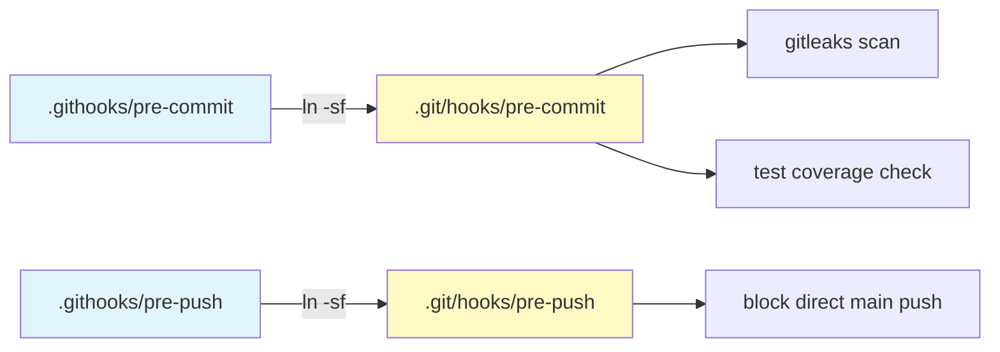

<!--
  Chapter 2: Installation
  Covers: install.sh, install.ps1, manual installation, Git hooks,
          runtime requirements, optional dependencies.
  Sources Read: install.sh, install.ps1, scripts/install-hooks.sh,
                README.md, requirements.txt,
                .githooks/pre-commit, .githooks/pre-push
-->

# 第2章: インストール

本章では specback スキルを各AIコーディングエージェントへ導入する手順を説明する。specback は shell インストーラ (`install.sh`)、PowerShell インストーラ (`install.ps1`)、手動配置、および Git hooks のセットアップ手段を提供する。

## 2.1 パッケージマネージャ別インストールコマンド

specback は OS を問わず単一のスクリプトでインストールを完了できるよう、Unix 向けに `install.sh`、Windows 向けに `install.ps1` を提供している。いずれも同一の機能を持ち、対話型・非対話型の両モードをサポートする。

### 2.1.1 Unix インストーラ (`install.sh`)

`install.sh` は Bash 製の対話型インストーラで、リポジトリルートから実行することを前提としている [REF: install.sh:20-27]。内部で `skills/specback/` ディレクトリを検出し、指定されたエージェントのスキルディレクトリへ再帰コピーする。

```bash
# 対話型: プロンプトに従ってエージェントと設置レベルを選択
./install.sh

# 非対話型: エージェントとレベルをCLIフラグで指定
./install.sh --agent claude,opencode --level user

# 全エージェント・両レベルに一括インストール
./install.sh --agent all --level both
```

対応エージェントは以下の6種類である [REF: install.sh:88-97]:

| エージェント名 | キー | ユーザーレベルパス | プロジェクトレベルパス |
|---|---|---|---|
| Claude Code | `claude` | `~/.claude/skills/specback` | `.claude/skills/specback` |
| Codex CLI | `codex` | `~/.codex/skills/specback` | `.codex/skills/specback` |
| OpenCode | `opencode` | `~/.opencode/skills/specback` | `.opencode/skills/specback` |
| GitHub Copilot | `copilot` | `~/.copilot/skills/specback` | `.github/skills/specback` |
| Cursor | `cursor` | `~/.cursor/skills/specback` | `.cursor/skills/specback` |
| Other | `other` | `~/.agents/skills/specback` | `.agents/skills/specback` |

設置レベルは `user`（全プロジェクトで有効）、`project`（現在のディレクトリのみ）、`both`（両方）の3種類から選択できる。ユーザーレベルパスは `$HOME` 直下のエージェント設定ディレクトリ、プロジェクトレベルパスはカレントディレクトリ配下の dotdir にそれぞれ配置される [REF: install.sh:115-139]。

CLI フラグと環境変数の優先順位は `CLI フラグ > 環境変数 > 対話型プロンプト` である [REF: install.sh:102-103]。環境変数として `SPECBACK_AGENT` と `SPECBACK_LEVEL` が利用可能で、`--agent` / `--level` 未指定時のフォールバックとして機能する。

```bash
# 環境変数を用いた非対話型インストール
export SPECBACK_AGENT=copilot,cursor
export SPECBACK_LEVEL=project
./install.sh
```

### 2.1.2 Windows インストーラ (`install.ps1`)

`install.ps1` は `install.sh` の PowerShell 移植版で、同一のパラメータ・同一のインストールパス体系を持つ [REF: install.ps1:28-33]。パス区切りには `\` を使用し、`New-Item` + `Copy-Item` でファイルコピーを実行する [REF: install.ps1:89-100]。

```powershell
# 対話型
.\install.ps1

# 非対話型
.\install.ps1 -Agent claude,opencode -Level user

# 全エージェント・dry-run
.\install.ps1 -Agent all -Level both -DryRun
```

### 2.1.3 dry-run モード (`--dry-run` / `-DryRun`)

`--dry-run` フラグを指定すると、実際のファイルコピーを行わずにインストール対象パスの一覧を表示する [REF: install.sh:150-153][REF: install.ps1:92-95]。インストール前にどのパスが影響を受けるかを確認するための安全機構である。

```bash
./install.sh --agent all --level both --dry-run
# 出力例:
#   ⏺  /Users/xxx/.claude/skills/specback/ (Claude Code)
#   ⏺  .claude/skills/specback/ (Claude Code)
#   ⏺  /Users/xxx/.opencode/skills/specback/ (OpenCode)
#   ...
# Dry-run complete. No changes were made.
```

### 2.1.4 オプション依存関係のインストール (`--install-deps`)

`./install.sh` に `--install-deps` フラグを指定すると、インストール完了後に `pip install -r requirements.txt` を自動実行する [REF: install.sh:161-175]。これは `source_map_v2` の tree-sitter 各言語パーサー群をインストールするためのもので、以下のパッケージが含まれる [REF: requirements.txt:10-23]:

```text
tree-sitter
tree-sitter-python
tree-sitter-typescript
tree-sitter-ruby
tree-sitter-php
tree-sitter-java
tree-sitter-c-sharp
tree-sitter-go
tree-sitter-kotlin
tree-sitter-c
tree-sitter-cpp
tree-sitter-dart
tree-sitter-swift
tree-sitter-rust
```

`./install.sh --install-deps` を指定しなくても specback の全スクリプトは動作する（Python 標準ライブラリフォールバック）。この点は 2.2 節で詳述する。

## 2.2 実行要件

specback のランタイム要件は意図的に最小限に設計されている。

### 2.2.1 Python 標準ライブラリのみで動作

specback に含まれる全 Python スクリプト (`source-map.py`, `source_map_v2/`, `build-trace.py`, `build-traceability.py`, `coverage-check.py`) は Python 標準ライブラリのみで実行できる。サードパーティパッケージへの依存は一切ない [REF: README.md:72]。

`source_map_v2/` は tree-sitter がインストールされていれば言語パーサーを用いて精密なユニット抽出を行うが、インストールされていない場合はファイルレベルのユニット列挙にフォールバックし、その旨の警告を表示する（黙ってスキップはしない）[REF: README.md:72]。これにより、環境準備の負荷を最小化しつつ、可能な限りの情報抽出を保証する。

### 2.2.2 tree-sitter（オプション）

tree-sitter 各言語パーサーは以下の利点を提供する:

- **フレームワーク検出**: FastAPI / Django / Flask / Rails / Laravel / Spring / Next.js / Express / NestJS などを自動判別 [REF: README.md:204]
- **役割型付け**: 各ユニットに `endpoint`・`model`・`schema`・`component`・`job` などの役割ラベルを付与
- **5普遍テーブル**: Modules / Entities / Actions / Data / Dependencies への写像
- **多言語対応**: Python / TypeScript/JavaScript / Ruby/Rails / PHP / Java / C# / Go / SQL / COBOL の9言語 [REF: README.md:204]

tree-sitter 非インストール時は上記の精密抽出は行われず、ファイルパスと拡張子ベースのユニット列挙に切り替わる。

### 2.2.3 対応エージェントの種類

specback がインストール可能な AI コーディングエージェントは以下の6種類である。いずれも SKILL.md によるスキル定義をサポートするエージェントであり、specback はそのスキル機構を通じて動作する [REF: install.sh:88-97]:

1. **Claude Code** (`claude`) — Anthropic 製 CLI エージェント
2. **Codex CLI** (`codex`) — OpenAI 製 CLI エージェント
3. **OpenCode** (`opencode`) — オープンソース CLI エージェント
4. **GitHub Copilot** (`copilot`) — GitHub 製 IDE / CLI エージェント
5. **Cursor** (`cursor`) — AI-first IDE
6. **Other** (`other`) — `.agents/skills/` 規約に従うその他エージェント

### 2.2.4 Python バージョン要件

specback の全 Python スクリプトは Python 3.8 以上で動作する。これは `source_map_v2/` が利用する `pathlib.Path` や `functools.cached_property`（3.8以降）、`dataclasses`（3.7以降だが3.8で安定化）などの標準ライブラリ API に基づく。tree-sitter オプション機能も Python 3.8 以降で動作確認済みである。

CI パイプラインでは Python 3.9 〜 3.13 のマトリックスでテストが実行されており、各バージョンでの互換性が継続的に検証されている [REF: .github/workflows/ci.yml:1-80]。Python 3.8 以前の環境では一部の型ヒント構文（`|` によるユニオン型など）が利用できない可能性があるが、スクリプト自体は `from __future__ import annotations` を用いて後方互換を確保している。

各バージョンの対応状況を以下にまとめる:

| Python バージョン | 状態 | 備考 |
|---|---|---|
| 3.8 | 対応（最小要件） | `cached_property`、`pathlib` が利用可能 |
| 3.9 | CI 検証済み | 全テスト通過 |
| 3.10 | CI 検証済み | 全テスト通過 |
| 3.11 | CI 検証済み | 全テスト通過 |
| 3.12 | CI 検証済み | 全テスト通過 |
| 3.13 | CI 検証済み | 全テスト通過 |
| 3.7 以前 | 非対応 | `cached_property` が標準ライブラリに存在しない |

Python 3.8 を最小要件とした理由は、`source_map_v2/` が広範に使用する `functools.cached_property`（3.8で追加）がバックポートなしで利用できる最小バージョンであることによる。3.7 以前でも `pip install functools` や自作キャッシュデコレータで代替可能だが、specback としては公式サポート外としている。

### 2.2.5 OS 互換性

specback は以下の OS で動作確認を行っている:

| OS | インストーラ | 検証レベル |
|---|---|---|
| macOS (Intel / Apple Silicon) | `install.sh` | CI 定期実行 |
| Linux (Ubuntu 20.04+) | `install.sh` | CI 定期実行 |
| Linux (CentOS / RHEL / Alpine) | `install.sh` | 報告ベース |
| Windows 10 / 11 | `install.ps1` | 手動検証 |
| WSL2 (Ubuntu on Windows) | `install.sh` | 報告ベース |

特に macOS と Ubuntu については GitHub Actions 上で毎回のプッシュ時に CI テストが実行され、インストール手順から hook 動作までが自動検証されている。Windows については `install.ps1` が PowerShell 5.1 および PowerShell 7 の両方で動作する。

WSL2 環境では Ubuntu 上の Bash 経由で `install.sh` を使用する。WSL2 固有の注意点として、Windows ドライブ（`/mnt/c/` 以下）から実行する場合はファイルパーミッションとシンボリックリンクの互換性に注意が必要である。specback のインストール自体は WSL2 の Linux ファイルシステム上で行うことを推奨する。

POSIX 互換環境であれば `install.sh` は Bash 3.2 以降があれば動作する（`set -euo pipefail` は Bash 3.2 以降対応）。`/bin/sh` ではなく `/usr/bin/env bash` をシバンに指定しているため、ユーザー環境の Bash が使用される。

## 2.3 手動インストール

インストーラが利用できない環境や、特定のカスタマイズが必要な場合は手動配置も可能である。

### 2.3.1 スキルディレクトリへのコピー

リポジトリ内の `skills/specback/` ディレクトリ全体を、対象エージェントのスキルディレクトリにコピーする。以下は Claude Code を例とした手動インストールである [REF: README.md:79-86]:

```bash
# プロジェクトレベル（特定プロジェクトでのみ有効）
mkdir -p .claude/skills/
cp -r skills/specback .claude/skills/

# ユーザーレベル（全プロジェクトで有効）
mkdir -p ~/.claude/skills/
cp -r skills/specback ~/.claude/skills/
```

その他のエージェントの場合は、上記のパスをエージェントに応じて読み替える（2.1.1 節のパス一覧を参照）。

### 2.3.2 `.opencode/skills/` と `skills/` の二重配置

specback リポジトリ内ではスキルソースが `skills/specback/` に配置されている一方、OpenCode のスキル読み込みパスは `.opencode/skills/specback/` である。この二重配置の構造は以下の意図による:

```
specback/
├── skills/specback/           # ソース（リポジトリ管理、配布用）
└── .opencode/skills/specback/ # 開発時リンク（OpenCode エディタ自身が specback を使用するため）
```

`skills/` が配布用の正規ソースであり、`.opencode/skills/` は specback リポジトリ自身の開発において OpenCode が specback スキルを読み込むためのシンボリックリンクまたはコピーである。インストーラは常に `skills/specback/` をソースとして使用する [REF: install.sh:21]。

### 2.3.3 インストールの確認

インストール完了後、対象エージェントを起動して `/help` を実行し、スキル一覧に `specback` が表示されることを確認する [REF: README.md:88-90]。表示されない場合はスキルディレクトリのパスとパーミッションを確認する。

## 2.4 Git Hooks のセットアップ

specback リポジトリには開発ワークフローを支援する2種類の Git hooks が同梱されている。これらの hooks は `.githooks/` ディレクトリに格納されており、`scripts/install-hooks.sh` により有効化される [REF: install-hooks.sh:1-4]。

### 2.4.1 インストール方法

`scripts/install-hooks.sh` をリポジトリルートから実行することで、`.githooks/` 配下の各 hook が `.git/hooks/` へのシンボリックリンクとしてインストールされる [REF: install-hooks.sh:9-22]。既存の hook ファイルが存在する場合は `*.backup.<timestamp>` としてバックアップされる。

```bash
sh scripts/install-hooks.sh
```



### 2.4.2 pre-commit hook

`.githooks/pre-commit` は2段階のチェックを実行する [REF: .githooks/pre-commit:1-100]:

**Phase 1: gitleaks による秘密情報スキャン**

`gitleaks` がインストールされている場合、ステージングされた変更に対して secret scan を実行する。gitleaks が未インストールの場合は警告を表示しスキップする [REF: .githooks/pre-commit:6-19]。

```bash
# gitleaks のインストール（Homebrew）
brew install gitleaks
```

**Phase 2: 新規スクリプトのテストカバレッジチェック**

`skills/specback/scripts/` 配下に新規 `.py` ファイルが追加された場合、対応するテストファイル (`tests/test_<name>.py`) の存在を必須とする [REF: .githooks/pre-commit:50-58]。修正されたスクリプトについては、既存テストがステージングされているかのチェックを行い、テストが未ステージングの場合は警告を表示する（関数レベルカバレッジはアドバイザリ）[REF: .githooks/pre-commit:61-83]。

pre-commit hook のバイパス:
```bash
git commit --no-verify
```

### 2.4.3 pre-push hook

`.githooks/pre-push` は `main` ブランチへの直接 push をブロックする [REF: .githooks/pre-push:1-20]。すべての変更は feature branch 経由で PR を作成し、squash merge する運用を強制する [REF: .githooks/pre-push:10-17]。

```bash
# 以下は拒否される
git push origin main

# 正しいフロー: feature branch → PR → squash merge
git checkout -b feat/your-feature
git commit -m "feat: ..."
git push origin feat/your-feature
# → GitHub で PR 作成 → CI 通過後 squash merge
```

pre-push hook のバイパス（緊急時のみ）:
```bash
git push --no-verify origin main
```

### 2.4.4 初回クローン時のセットアップ

リポジトリをクローンした直後は hooks が未インストールの状態である。以下の手順で hooks を有効化する [REF: scripts/install-hooks.sh:5-6]:

```bash
git clone https://github.com/nekolife1984/specback.git
cd specback
sh scripts/install-hooks.sh
```

本手順は AGENTS.md にも記載されており、開発者はクローン後必ず hooks をインストールすることが期待される。

### 2.4.5 gitleaks 秘密情報スキャンの詳細

gitleaks は pre-commit hook の Phase 1 で呼び出される secret scanner であり、Git の staged 変更を対象にスキャンを実行する [REF: .githooks/pre-commit:6-19]。

**スキャン対象**: `gitleaks git --staged` により、次回コミットに含まれる全ステージングファイルが対象となる。このコマンドは gitleaks 組み込みのルールセット（API キー、秘密鍵、トークン、パスワードなど 150 種類以上のパターン）に加え、リポジトリルートに配置された `.gitleaks.toml` によるカスタムルールも反映する。

**動作条件**: gitleaks バイナリが `$PATH` 上に存在する場合のみ実行される。未インストール時は「⚠️ gitleaks not found — skipping secret scan」の警告を表示し、Phase 2 へ進む。これにより gitleaks が未導入の環境でもコミットはブロックされない [REF: .githooks/pre-commit:16-19]。

**インストール方法**:

```bash
# macOS (Homebrew)
brew install gitleaks

# Linux (go install)
go install github.com/gitleaks/gitleaks/v8@latest

# Docker
docker pull gitleaks/gitleaks
```

インストール後、`install-hooks.sh` を再実行すると gitleaks の有無が自動検出され、有効化された旨が表示される [REF: scripts/install-hooks.sh:25-31]。

**gitleaks バイパス**: コミット時に `git commit --no-verify` を使用すると pre-commit hook 全体がスキップされるため、gitleaks のスキャンも実行されない。やむを得ない機密情報の同梱が必要な場合は、事前に `.gitleaks.toml` で該当パターンを許可リストに追加する運用を推奨する。

## 2.5 インストーラスクリプトのアーキテクチャ

`install.sh` と `install.ps1` は共通のアーキテクチャ設計に従っている。両スクリプトの構成を理解することで、カスタマイズやトラブルシューティングに役立つ。

両スクリプトは以下のフェーズで構成される:

1. **初期化**: スクリプト自身の位置から `SKILL_SRC` を解決し、`skills/specback/` の存在を確認する
2. **フラグ解析**: CLI フラグをパースし、`DRY_RUN`、`INSTALL_DEPS` などのモード変数を設定する
3. **エージェント解決**: `all` を含むエージェント指定を、内部エージェントテーブルに基づいてキー配列に変換する
4. **インストール実行**: 選択された各エージェント × 各設置レベルに対して `install_skill()` を呼び出す
5. **事後処理**: オプションで `pip install -r requirements.txt` を実行する

### 2.5.1 入力解決パイプライン

インストーラは以下の三段階の優先順位でパラメータを解決する [REF: install.sh:102-103]:

```
CLI フラグ (--agent / --level) ＞ 環境変数 (SPECBACK_AGENT / SPECBACK_LEVEL) ＞ 対話型プロンプト
```

`RESOLVED_AGENT="${CLI_AGENT:-${SPECBACK_AGENT:-}}"` の評価式により、空文字の場合は次のフォールバックへ進む。このパイプラインにより、CI パイプラインからは `SPECBACK_AGENT` 環境変数のみを設定しておき、手動実行時は CLI フラグで上書きするといった柔軟な運用が可能である [REF: install.sh:101-103]。

### 2.5.2 エージェント定義テーブル

対応エージェントは `populate_agents()` 関数内で動的に構築される [REF: install.sh:88-97]。`AGENTS` 配列（表示名）と `AGENT_KEYS` 配列（識別子）は同じインデックスで対応しており、`all` を指定した場合は全キーが一括選択される [REF: install.sh:190-192]。この二重配列構造により、将来的なエージェント追加は `populate_agents()` への1行追加のみで完了する。

### 2.5.3 インストールパス解決の二重ルックアップ

インストールパスは `USER_PATHS()` と `PROJ_PATHS()` の2つの関数で管理される [REF: install.sh:115-139]。各関数はエージェントキーを受け取り、case 文で対応するパスを返す。この設計の意図は以下の通り:

- **ユーザーレベル**: `$HOME` 直下のエージェント設定ディレクトリに配置 → 全プロジェクトで有効
- **プロジェクトレベル**: カレントディレクトリ配下の dotdir に配置 → 特定プロジェクトのみ有効
- `install_skill()` 関数は宛先パスと表示ラベルを受け取り、`mkdir -p` + `cp -r` でコピーを実行 [REF: install.sh:142-158]

インストーラは `install_skill()` を agent × level の組み合わせ回数だけ呼び出し、各呼び出しで `"✅ $dest/ ($label)"` のログを出力する。コピー元である `SKILL_SRC` は `install.sh` 自身の位置から `$(dirname "${BASH_SOURCE[0]}")/skills/specback` として解決されるため、スクリプトの配置場所に依存しない [REF: install.sh:20-21]。

### 2.5.4 dry-run モードの実装

`--dry-run` フラグは `$DRY_RUN` 変数を true に設定する [REF: install.sh:38-40]。`install_skill()` は `$DRY_RUN` が true の場合、実ファイルコピーをスキップして `"⏺  $dest/ ($label)"` のプレビュー行のみを表示する [REF: install.sh:150-153]。`install_deps()` も同様に dry-run 時は `"⏺  pip install -r $req"` と表示するのみである [REF: install.sh:167-169]。この実装により、実際の変更を伴わずに影響範囲を事前確認できる。

### 2.5.5 依存関係インストールの分離

`--install-deps` フラグはインストールフローの末尾で `install_deps()` を呼び出す [REF: install.sh:245]。この関数は `requirements.txt` の存在を確認後、`pip install -r` を実行する [REF: install.sh:161-175]。specback の必須機能は Python 標準ライブラリのみで完結するため、依存関係のインストールはオプションとして明確に分離されている。この分離により、pip が利用できない環境（制限付きの CI ランナーやコンテナなど）でも specback の基本機能は動作する。

## 2.6 スキルパス解決（`.skill-path`）

specback のランタイムにおいて、スキルファイルへのパス解決は `.specback/.skill-path` ファイルを介して行われる。この機構は specback がエージェントのスキルディレクトリにインストールされた後、各フェーズからスクリプトや参照ファイルを正しく解決するために存在する。

### 2.6.1 仕組み

specback の各フェーズドキュメント（`phase-0-setup.md`、`phase-2-wbs.md` など）は、スクリプト呼び出しを以下のパターンで記述する [REF: phase-0-setup.md:14-19]:

```bash
python "$(cat .specback/.skill-path)/scripts/source-map.py"
```

`.specback/.skill-path` には、インストール先のスキルルートディレクトリ（`SKILL.md` が存在するディレクトリ）の絶対パスが1行で記録される。エージェントは Phase 0 のセットアップ中にこのファイルを作成し、以降の全フェーズで `$(cat .specback/.skill-path)` をベースパスとして使用する。

### 2.6.2 記録タイミング

`.skill-path` は Phase 0（セットアップ）の手順 2 で作成される [REF: phase-0-setup.md:14-20]。エージェントは自身のスキルインストール先を知っているため（例: Claude Code は `.claude/skills/specback/` にインストールされていることを認識している）、その絶対パスを `.specback/.skill-path` に書き込む。

```bash
mkdir -p .specback
echo "/absolute/path/to/specback/skill/root" > .specback/.skill-path
```

### 2.6.3 レジュームモードとの連携

`.skill-path` はレジューム（再開）時にも再読み込みされる。`state.json` が存在する場合、Phase 0 はスキップされて `.skill-path` から直接パスを再取得する。これにより、スキルの再インストールやアップグレードが行われた場合でも、正しい最新パスが使用される [REF: phase-0-setup.md:20]。

### 2.6.4 `.skill-path` の設計意図

`.skill-path` を導入した理由は以下の3点である:

1. **インストール先の非決定性**: specback は6種類のAIエージェント × 2種類の設置レベル（user / project）の合計12通りのインストールパスを持つ。スクリプトにハードコードされたパスでは全パターンをカバーできない。
2. **フェーズ間のパス共有**: 各フェーズドキュメントは独立したファイルであり、相互に変数を共有できない。ファイルシステム上の `.skill-path` が唯一の共有状態として機能する。
3. **再インストール耐性**: スキルが再インストールされた場合でも、`.skill-path` の内容を更新すれば全フェーズが正しいパスを参照できる。

このパターンは specback-changelog の v0.2.0 で「Phase 0: skill path recording via `.specback/.skill-path`」として導入された [REF: CHANGELOG.md:24]。

## 2.7 トラブルシューティング

インストール時に発生しうる一般的な問題とその対処法を以下に示す。

### 2.7.1 `install.sh` が `skills/specback/` を見つけられない

**症状**: `Error: skills/specback/ not found alongside this script.` が表示される。

**原因**: `install.sh` をリポジトリルート以外のディレクトリから実行している。スクリプトは自身の位置を基準に `skills/specback/` を探索するため、リポジトリルートでの実行が必須である [REF: install.sh:20-27]。

**解決策**:
```bash
cd specback/   # リポジトリルートへ移動
./install.sh
```

### 2.7.2 エージェントが specback スキルを認識しない

**症状**: `/help` コマンドでスキル一覧に `specback` が表示されない。

**考えられる原因と対処**:

| 原因 | 確認方法 | 対処 |
|---|---|---|
| インストール先が誤っている | インストーラの出力パスを確認 | 正しいエージェントを指定して再インストール |
| パーミッション不足 | `ls -la <skill_dir>` で確認 | `chmod +x <skill_dir>/SKILL.md` など |
| 設置レベルの選択ミス | project level でインストールしたか確認 | `--level both` で再インストール |
| エージェントの再起動忘れ | エージェントを再起動してから `/help` | エージェントを再起動 |

### 2.7.3 gitleaks が pre-commit で失敗する

**症状**: `git commit` 時に gitleaks が false positive を報告する。

**対処**: 該当ファイルが誤検出（false positive）である場合、`.gitleaks.toml` に許可ルールを追加する。緊急時は `git commit --no-verify` で hook をバイパスできる。ただし、本番環境の秘密情報をコミットする前に必ず除去すること。

### 2.7.4 tree-sitter のインストールに失敗する

**症状**: `pip install -r requirements.txt` が特定の言語パーサーでエラーになる。

**原因**: 一部の tree-sitter 言語パーサーはコンパイル時に C コンパイラを必要とする。特に Windows 環境では `Microsoft Visual C++ 14.0` が不足するケースがある。

**対処**:
```bash
# macOS: Xcode Command Line Tools がインストール済みか確認
xcode-select --install

# Ubuntu / Debian
sudo apt-get install build-essential

# Windows: https://visualstudio.microsoft.com/visual-cpp-build-tools/
```

エラーが解消しない場合は、該当パーサーのみスキップして残りをインストールするか、`pip install tree-sitter` のみ実行する。tree-sitter が未インストールでも specback の基本機能は動作する。

### 2.7.5 PowerShell スクリプトの実行ポリシー

**症状**: Windows で `install.ps1` を実行すると `Execution Policy` エラーが発生する。

**原因**: PowerShell のデフォルト実行ポリシー `Restricted` ではスクリプトの実行が許可されていない。

**対処**:
```powershell
# 現在のセッションのみポリシーを変更
Set-ExecutionPolicy -Scope Process -ExecutionPolicy Bypass

# またはスクリプトを直接実行（推奨）
powershell -ExecutionPolicy Bypass -File install.ps1
```

### 2.7.6 パスにスペースが含まれる環境

インストーラは `$HOME` やカレントディレクトリにスペースが含まれる環境でも動作する。`install.sh` は変数を常にダブルクォートで囲んでおり、`cp -r "$SKILL_SRC"/* "$dest/"` のようにパスを保護している [REF: install.sh:156]。`install.ps1` も同様に `Copy-Item` の `-Path` / `-Destination` を適切に引用符で囲んでいる。

## 2.8 アンインストール手順

specback には専用のアンインストーラは用意されていない。以下の手順で手動削除を行う。

### 2.8.1 インストール済みパスの特定

削除前に、どのパスに specback がインストールされているかを特定する:

```bash
# 想定されるインストール先の一覧を dry-run で確認
./install.sh --agent all --level both --dry-run
```

出力されたパスが削除対象である。あるいは、以下のパスを直接確認する:

```bash
# 全エージェントのユーザーレベルパスを確認
ls -d ~/.claude/skills/specback ~/.codex/skills/specback \
      ~/.opencode/skills/specback ~/.copilot/skills/specback \
      ~/.cursor/skills/specback ~/.agents/skills/specback 2>/dev/null

# 全エージェントのプロジェクトレベルパスを確認
ls -d .claude/skills/specback .codex/skills/specback \
      .opencode/skills/specback .github/skills/specback \
      .cursor/skills/specback .agents/skills/specback 2>/dev/null
```

### 2.8.2 スキルディレクトリの削除

不要な specback スキルディレクトリを削除する:

```bash
# ユーザーレベル（例: Claude Code）
rm -rf ~/.claude/skills/specback

# プロジェクトレベル（例: OpenCode）
rm -rf .opencode/skills/specback
```

複数エージェントにインストールしている場合は、それぞれのパスに対して同様に削除を実行する。

### 2.8.3 Git Hooks の削除

specback がインストールした Git hooks を削除する:

```bash
# シンボリックリンクを削除
rm -f .git/hooks/pre-commit .git/hooks/pre-push

# バックアップが存在する場合は復元
ls .git/hooks/pre-commit.backup.* 2>/dev/null && \
  mv .git/hooks/pre-commit.backup.* .git/hooks/pre-commit 2>/dev/null; \
  ls .git/hooks/pre-push.backup.* 2>/dev/null && \
  mv .git/hooks/pre-push.backup.* .git/hooks/pre-push 2>/dev/null
```

### 2.8.4 プロジェクト状態ディレクトリの削除

specback を実行したプロジェクトでは `.specback/` ディレクトリが作成されている。このディレクトリには `.skill-path`、`state.json`、`goal.json`、生成されたドラフトファイルなどが含まれる。これらを完全に削除する場合:

```bash
rm -rf .specback/
```

### 2.8.5 オプション依存関係のアンインストール

tree-sitter 言語パーサーをアンインストールする場合:

```bash
pip uninstall -y -r skills/specback/scripts/requirements.txt
```

または個別に:

```bash
pip uninstall -y tree-sitter tree-sitter-python tree-sitter-typescript
```

なお、specback の基本スクリプトは Python 標準ライブラリのみで動作するため、オプション依存関係を削除しても specback の実行に支障はない。

### 2.8.6 インストールの検証

インストール完了後、以下のコマンドで specback が正しく配置されたことを確認できる:

```bash
# スキルディレクトリの存在確認
ls -la ~/.claude/skills/specback/SKILL.md 2>/dev/null && echo "SKILL.md found" || echo "SKILL.md not found"
```

各エージェントのスキルディレクトリに SKILL.md が存在すること、かつ `.specback/.skill-path` に正しい絶対パスが記録されていることを確認する。また、`scripts/` 配下の全スクリプトが Python 3.8 以上で実行可能であることを確認することを推奨する。

specback のインストール検証は以下のフローで実施する:

1. **スキルファイルの存在確認**: SKILL.md, phase-*.md, scripts/*.py が期待されるパスに配置されているか確認する
2. **`.skill-path` の整合性確認**: 記録されたパスが実際のスキールディレクトリと一致するか確認する
3. **スクリプトの動作確認**: 各スクリプトの `--help` オプションが正常に応答するか確認する
4. **最小限のパイプライン実行**: 最低1つのソースディレクトリに対して `source-map.py` がエラーなく完了するか確認する

これらの検証手順は CI パイプラインにおいても自動実行されており、プッシュごとにインストールの健全性が保証されている。

### 2.8.7 インストールの自動化

CI/CD パイプラインでの specback の自動インストールを想定する場合、以下の非対話型コマンドを使用する:

```bash
# CI 環境での自動インストール例
./install.sh --agent claude,opencode --level project --install-deps
```

このコマンドはプロジェクトレベルのみにインストールし、依存関係も自動解決する。`--dry-run` を先に実行して影響範囲を確認してから本インストールを行う運用が推奨される。

## Sources Read

- [REF: install.sh:1-354] — Unix インストーラ全体
- [REF: install.ps1:1-288] — Windows インストーラ全体
- [REF: scripts/install-hooks.sh:1-36] — Git hooks インストーラ
- [REF: README.md:43-90] — README インストール節
- [REF: .opencode/skills/specback/scripts/requirements.txt:1-23] — オプション依存関係一覧
- [REF: .githooks/pre-commit:1-100] — pre-commit hook 実装
- [REF: .githooks/pre-push:1-20] — pre-push hook 実装
