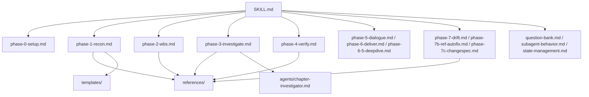
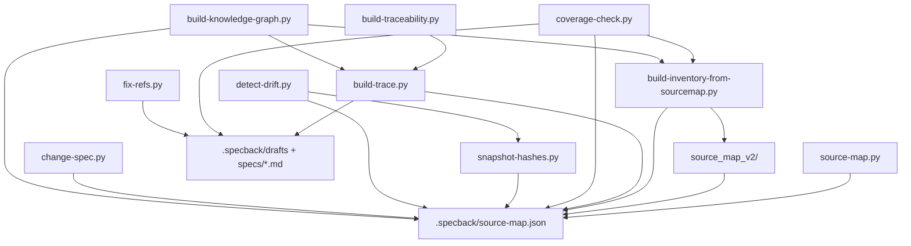

# 第3章: モジュール構成（概要）

## Sources Read

- `skills/specback/SKILL.md` (lines 1-105)
- `skills/specback/agents/chapter-investigator.md` (lines 1-264)
- `skills/specback/templates/library-sdk.md` (lines 90-149)
- `skills/specback/references/outline-tables.md` (lines 465-534)
- `skills/specback/references/template-catalog.md` (lines 1-60)
- `skills/specback/phase-3-investigate.md` (lines 142-220)
- `skills/specback/phase-7-drift.md` (lines 40-73)
- `skills/specback/scripts/requirements.txt` (lines 1-37)
- `skills/specback/scripts/source_map_v2/__init__.py` (lines 1-14)
- `skills/specback/scripts/source_map_v2/__main__.py` (lines 1-50)
- `skills/specback/scripts/source_map_v2/pipeline.py` (lines 1-60)
- `skills/specback/scripts/source_map_v2/detect.py` (lines 1-30)
- `skills/specback/scripts/source_map_v2/model.py` (lines 21)
- `skills/specback/scripts/source_map_v2/taxonomy.py` (lines 28-62)
- `skills/specback/scripts/source_map_v2/extractors/__init__.py` (lines 55-75)
- `skills/specback/scripts/source-map.py` (lines 1-16)
- `skills/specback/scripts/build-inventory-from-sourcemap.py` (lines 1-20)
- `skills/specback/scripts/build-trace.py` (lines 1-24)
- `skills/specback/scripts/build-traceability.py` (lines 1-18)
- `skills/specback/scripts/coverage-check.py` (lines 1-20)
- `skills/specback/scripts/detect-drift.py` (lines 1-16)
- `skills/specback/scripts/fix-refs.py` (lines 1-16)
- `skills/specback/scripts/snapshot-hashes.py` (lines 1-12)
- `skills/specback/scripts/change-spec.py` (lines 1-16)
- `skills/specback/scripts/validate-schema.py` (lines 1-14)
- `skills/specback/scripts/build-knowledge-graph.py` (lines 1-18)
- `specs/01-overview.md` (lines 1-433)
- `specs/00-metadata.md` (lines 1-14)
- `install.sh` (lines 1-354)
- `.github/workflows/ci.yml` (lines 1-83)
- `skills/specback/variants/B/README.md` (lines 1-8)

---

本章は specback スキルバンドル（`skills/specback/`）と、それを取り巻くリポジトリルートのモジュール構成を俯瞰するための章である。**概要レベル**に徹し、各モジュールの内部詳細は第11章（内部構造）へ、設計上の理由（WHY/HOW）は第12章（システム設計）へ委譲する。

specback は単一の実行ファイルではなく、**「文書群（プロンプト）＋スクリプト群（決定論的処理）＋状態ファイル群（JSON）」の3層からなる AI エージェントスキルバンドル**である。エージェントは SKILL.md を読み込み、フェーズ文書の指示に従ってスクリプトを起動し、JSON 状態を介して進行する。この「LLM による指示解釈」と「Python による機械処理」の分離が specback の中核アーキテクチャである（第1章 1.2 参照）。 [REF: skills/specback/SKILL.md:70-105]

### 全体像: 3層アーキテクチャ

モジュール構成を理解するための鍵は、**各層が「何を担当し、誰が消費するか」**である。

1. **指示層（文書群）**: `SKILL.md` と phase 文書が「いつ・何を・どのスクリプトで実行するか」を定義する。この層はエージェントのシステムプロンプトに注入されて解釈される。SKILL.md は意図的に 105 行に抑えられており、phase 詳細文書は実行時に Read ツールで逐次ロードされる。これは「SKILL.md がシステムプロンプトに常時注入される環境でのコンテキスト節約」という設計判断に基づく。 [REF: skills/specback/SKILL.md:96-105]
2. **処理層（スクリプト群）**: `scripts/` のスタンドアロンスクリプトと `source_map_v2/` パッケージが、LLM では不得意な「網羅的・決定的・再現可能」な処理（全ファイル走査、行番号追跡、ハッシュ比較、機械検証）を担当する。スクリプトは JSON ファイルを介してのみエージェントとデータをやり取りし、エージェントの自然言語出力（章ドラフト）とはファイルシステム上で明確に分離されている。
3. **状態層（JSON 群）**: `.specback/` 配下の JSON ファイル群が、フェーズ間のデータ契約を担う。`goal.json`（ゴール固定）→ `source-map.json` / `inventory.json` / `wbs.json`（抽出計画）→ `drafts/*.md`（調査成果）→ `trace.json`（トレーサビリティ）→ `state.json`（再開情報）と、フェーズ出力が次のフェーズ入力になる依存チェーンを形成する。 [REF: skills/specback/SKILL.md:74-78]

実行時の典型的な流れは以下の通りである。

```text
Phase 0: goal.json を確定          → Phase 1: recon-report + テンプレート選定
Phase 2: source-map.py / source_map_v2 → source-map.json → build-inventory-from-sourcemap.py → inventory.json
Phase 3: chapter-investigator 並列ディスパッチ → drafts/*.md
Phase 4: coverage-check.py が drafts/ と inventory.json を機械検証
Phase 5: questions.json の対話解決   → Phase 6: specs/ に統合出力
Phase 7: detect-drift.py → fix-refs.py → change-spec.py（保守サイクル）
```

この3層分離により、LLM の「解釈の柔軟さ」とスクリプトの「検証の厳密さ」がそれぞれの得意分野に閉じ込められ、specback の価値基準である「正直さ」と「トレーサビリティ」が機械的に担保される（第1章 1.1 参照）。 [REF: specs/01-overview.md:19-29]

## 3.1 モジュール構成 (Module composition)

`skills/specback/` 以下のディレクトリ構造を実ファイル一覧から機械的に抽出した結果、以下のトップレベルモジュールが確認された。 [REF: skills/specback/SKILL.md:70-105]

| Module / package | Responsibility | Key files | Confidence |
|------------------|----------------|-----------|-----------|
| `SKILL.md` | スキルのエントリポイント。12設計原則、Mermaid スタイリング契約、フェーズ一覧表、実行規則を定義する軽量インデックス（105行） | `SKILL.md` | 🟢 |
| `phase-0-setup.md` 〜 `phase-7c-changespec.md` | 各フェーズ（Phase 0, 1, 2, 3, 4, 5, 6, 6.5, 7, 7b, 7c）の実行手順を定義する詳細文書。SKILL.md のフェーズ一覧表が各フェーズをこのファイル群にマッピングする | `phase-0-setup.md`, `phase-1-recon.md`, `phase-2-wbs.md`, `phase-3-investigate.md`, `phase-4-verify.md`, `phase-5-dialogue.md`, `phase-6-deliver.md`, `phase-6-5-deepdive.md`, `phase-7-drift.md`, `phase-7b-ref-autofix.md`, `phase-7c-changespec.md` | 🟢 |
| 共通参照ファイル（ルート直下） | Question Bank のデータ構造・カテゴリ・状態遷移、サブエージェントのプロンプトテンプレートと判断ロジック、`state.json` スキーマと再開挙動を定義 | `question-bank.md`, `subagent-behavior.md`, `state-management.md` | 🟢 |
| `agents/` | 章単位調査サブエージェントの定義。Phase 3 で並列ディスパッチされる | `agents/chapter-investigator.md` | 🟢 |
| `references/` | 言語・フレームワーク別のインベントリ単位カタログ、章別抽出パターン（outline-tables）、テンプレート選定カタログ、検証チェックリスト等の参照知識 | `references/inventory-units.md`, `references/outline-tables.md`, `references/template-catalog.md`, `references/verification-checklists.md`, ほか計8ファイル | 🟢 |
| `templates/` | 4種の成果物テンプレート（Web アプリ / バッチ / API サービス / Library-SDK）。本書（第3章）自体が `library-sdk.md` のテンプレート定義に従う | `templates/library-sdk.md`, `templates/web-app.md`, `templates/api-service.md`, `templates/batch-system.md` | 🟢 |
| `schemas/` | `goal.json` / `state.json` / `questions.json` の JSON Schema 定義 | `schemas/goal.schema.json`, `schemas/state.schema.json`, `schemas/questions.schema.json` | 🟢 |
| `scripts/`（スタンドアロン） | フェーズ 2/4/6/7 系の決定論的機械処理。すべて stdlib のみで動作 | `source-map.py`, `build-inventory-from-sourcemap.py`, `build-trace.py`, `build-traceability.py`, `coverage-check.py`, `detect-drift.py`, `snapshot-hashes.py`, `fix-refs.py`, `change-spec.py`, `validate-schema.py`, `build-knowledge-graph.py` | 🟢 |
| `scripts/source_map_v2/` | tree-sitter ベースのソースマップ抽出パッケージ（schema 0.2.0）。フレームワーク検出 → 言語別抽出 → タクソノミー写像の3層構成 | `pipeline.py`, `detect.py`, `model.py`, `taxonomy.py`, `extractors/`（15言語 + tshelpers）, `__main__.py` | 🟢 |
| `scripts/tests/`, `scripts/source_map_v2/tests/` | pytest テスト群。CI と pre-commit で実行される | `scripts/tests/test_*.py`, `scripts/source_map_v2/tests/test_*.py` | 🟢 |
| `variants/B/` | Context Optimization mode B。Phase 3 の章ディスパッチを task ツールによる隔離サブエージェント実行に置き換える代替実行モード | `variants/B/README.md`, `variants/B/SKILL.phase3-stepG.md`, `variants/B/chapter-investigator.md` | 🟢 |

リポジトリルートには、スキルバンドル本体に加えて以下の運用モジュールが存在する。

| Module / package | Responsibility | Key files | Confidence |
|------------------|----------------|-----------|-----------|
| `install.sh` / `install.ps1` | スキルバンドルを各エージェント（Claude Code / Codex / OpenCode / Copilot / Cursor / Other）のスキルディレクトリへコピーするインストーラ。`--install-deps` でオプション依存も導入 | `install.sh`, `install.ps1` | 🟢 |
| `scripts/`（リポジトリルート） | 開発運用スクリプト（git hook インストール、PR マージ補助） | `scripts/install-hooks.sh`, `scripts/merge-pr.sh` | 🟢 |
| `.githooks/`, `.github/workflows/` | pre-commit / pre-push フックと GitHub Actions CI（pytest / mypy / gitleaks / スモークテスト） | `.githooks/pre-commit`, `.githooks/pre-push`, `.github/workflows/ci.yml` | 🟢 |
| `specs/`, `.specback/` | 本リポジトリ自身の自己文書化出力（本書の最終成果物 `specs/` と中間状態 `.specback/`）。specback が自分自身に適用された実例 | `specs/*.md`, `.specback/*.json` | 🟢 |

[CONFIDENCE: HIGH] — モジュール一覧は実ディレクトリの `find` / `glob` 結果に基づく（🟢）。`variants/B/` の役割のみ README 冒頭の記述による解釈を含むため 🟡。 [REF: skills/specback/variants/B/README.md:1-8]

### 各モジュールの補足

**SKILL.md（指示層の頂点）**: 12の設計原則（Goal-driven、Question Bank の3時点蓄積、Reader-comprehension chapter order 等）と Mermaid スタイリング契約を定義する。設計原則は全フェーズに普遍適用されるため、実質的に「憲法」に相当する文書である。 [REF: skills/specback/SKILL.md:27-38] [REF: skills/specback/SKILL.md:42-50]

**phase 文書群（12ファイル）**: 各フェーズの手順を定義する。Phase 3 の `phase-3-investigate.md` は特に重要で、章ごとに隔離された `chapter-investigator` サブエージェントへの並列ディスパッチ（単一ターンでの全 `task()` 発行）を指示する。これは「メインエージェントのコンテキスト劣化を防ぎ、各章を独立コンテキストで調査させる」という品質上の根拠を持つ。 [REF: skills/specback/phase-3-investigate.md:142-220]

**agents/（サブエージェント定義）**: `chapter-investigator.md` は、各章ドラフトが満たすべき機械検証ゲート（本文200行以上、REF 10件以上、コードブロック3個以上、Mermaid 1個以上、Sources Read 5ファイル以上）を定義する。本書（第3章）もこのゲートに従って執筆されている。 [REF: skills/specback/agents/chapter-investigator.md:32-42]

**references/（参照知識）**: `outline-tables.md` は章ごとの抽出パターン（モジュール構成 = directory glob、技術スタック = マニフェスト読解、依存グラフ = 言語別 import パターン）を提供する。`template-catalog.md` はテンプレート選定の決定木と章順序原則を定義する。 [REF: skills/specback/references/outline-tables.md:469-507] [REF: skills/specback/references/template-catalog.md:1-10]

**templates/（成果物雛形）**: 4種のテンプレートのうち本書は `library-sdk.md` に従う。テンプレートの章順はそのまま最終成果物の提示順となり、読者の理解フロー（Overview → 機能 → 構造概観 → 詳細 → 設計根拠 → 制約）に沿って配置される。 [REF: skills/specback/templates/library-sdk.md:98-140]

**schemas/（JSON Schema）**: `goal.schema.json` / `state.schema.json` / `questions.schema.json` の3種が存在する。`validate-schema.py` がこれらのスキーマに対する機械検証を提供するが、どの phase 文書もこの検証を明示的に呼び出していない点は要確認事項である（詳細質問 5 参照）。 [REF: skills/specback/scripts/validate-schema.py:1-14]

**scripts/ スタンドアロン群（11本）**: 役割ごとに3系統に分類できる。(a) **抽出系** — `source-map.py`（v1 正規表現ベース）、`build-inventory-from-sourcemap.py`（インベントリ変換）。(b) **検証・追跡系** — `build-trace.py`（REF 抽出）、`build-traceability.py`（トレーサビリティ表）、`coverage-check.py`（Phase 4 の11項目検証）。`coverage-check.py` は 1,063 行と本バンドル最大のスクリプトである。(c) **保守系** — `snapshot-hashes.py`、`detect-drift.py`、`fix-refs.py`、`change-spec.py`。さらに `validate-schema.py` と `build-knowledge-graph.py` が補助機能を担う。 [REF: skills/specback/scripts/coverage-check.py:1-20]

**source_map_v2/（抽出パッケージ）**: 本バンドルで唯一の「パッケージ」であり、tree-sitter を利用した役割型付け抽出を提供する。公開面は `__init__.py` で4シンボルに限定され、内部は pipeline / detect / model / taxonomy / extractors の5モジュールに分離される。SCHEMA_VERSION は "0.2.0"。 [REF: skills/specback/scripts/source_map_v2/model.py:21]

**テスト群**: `scripts/tests/`（11ファイル）と `source_map_v2/tests/`（13ファイル）の2系統が pytest で実行される。CI は両系統を別ステップで走らせ、さらに `test_ts_smoke.py` が全 grammar のロード可能性をスモークテストする。 [REF: .github/workflows/ci.yml:53-59]

**variants/B/**: メインモード（メインエージェントが直接章を書く）の代替として、各章を task ツールで隔離サブエージェントへ委譲する実行モードを提供する。モード選択の判断基準は variants/B/README.md に定義される。 [REF: skills/specback/variants/B/README.md:1-8]

### リポジトリルートの運用モジュール

`specs/` と `.specback/` は本スキル自身の自己文書化の成果物であり、specback が自分自身に対して適用された実例として機能する。本書のメタデータ（出力言語 ja、テンプレート Library/SDK、depth モード comprehensive、出力先 `specs/`）は `specs/00-metadata.md` に記録されている。 [REF: specs/00-metadata.md:1-14]

### ディレクトリ構造（実測）

`skills/specback/` の実ディレクトリ構造は以下の通りである（キャッシュ・バイナリを除く）。 [REF: skills/specback/SKILL.md:70-84]

```text
skills/specback/
├── SKILL.md                          # エントリポイント（105行の軽量インデックス）
├── phase-0-setup.md 〜 phase-7c-changespec.md   # フェーズ詳細文書（12ファイル）
├── question-bank.md / state-management.md / subagent-behavior.md  # 共通参照
├── agents/
│   └── chapter-investigator.md       # 章単位サブエージェント定義
├── references/                       # 参照知識（8ファイル）
├── templates/                        # 成果物テンプレート（カタログ掲載4 + カタログ外1）
├── schemas/                          # JSON Schema（3ファイル）
├── variants/B/                       # Context Optimization mode B
└── scripts/                          # Python スクリプト群 + source_map_v2/
    ├── source-map.py                 # v1 ソースマップ（正規表現ベース）
    ├── build-inventory-from-sourcemap.py  # source-map → inventory 変換
    ├── build-trace.py / build-traceability.py  # トレーサビリティ生成
    ├── coverage-check.py             # Phase 4 検証（最大のスクリプト）
    ├── detect-drift.py / snapshot-hashes.py  # Phase 7 ドリフト検出
    ├── fix-refs.py / change-spec.py  # Phase 7b / 7c
    ├── validate-schema.py / build-knowledge-graph.py  # 補助機能
    ├── source_map_v2/                # v2 パッケージ（3層構成・15言語抽出器）
    └── tests/                        # pytest テスト（scripts/ と source_map_v2/ の2系統）
```

この構造の特徴は、**ディレクトリ名がそのままモジュールの責務を表し、文書とコードが階層的に同居**している点である。`references/` と `templates/` が「知識」、`scripts/` が「処理」、`schemas/` が「契約」、`agents/` が「実行主体の定義」を担い、トップレベルで見たときの依存は本文 3.2 の図の通り一方向に流れる。

### 規模のバランス

モジュール間の「大きさの分布」にも設計意図が表れている。ファイル行数を比較すると、指示層の頂点である SKILL.md が 105 行であるのに対し、処理層の検証スクリプト `coverage-check.py` は 1,063 行、`detect-drift.py` は 984 行、`change-spec.py` は 873 行と、**機械処理の複雑さはスクリプト側に集中**している。 [REF: skills/specback/scripts/coverage-check.py:1-20] [REF: skills/specback/scripts/detect-drift.py:1-16]

これは次のような役割分担の反映である。

| 層 | ファイル | 規模 | 役割 |
|----|---------|------|------|
| 指示層 | `SKILL.md` | 105行 | 原則とフェーズ一覧のみ。実行手順は phase 文書へ委譲 |
| 指示層 | phase 文書（各） | 数百行 | フェーズごとの手順・コマンド・判断基準 |
| 処理層 | `coverage-check.py` ほか | 200〜1,063行 | 網羅的で例外処理の多い機械検証・解析 |
| 処理層 | `source_map_v2/` | パッケージ（20+ファイル） | 言語別抽出器の分離による拡張性確保 |

「エージェントが読む文書は短く、エージェントに代わって走るコードは長く」という配分は、トークン消費を抑えつつ決定論的処理の完全性を確保するという specback の設計判断である。詳細は第12章（システム設計）で論じる。 [REF: skills/specback/SKILL.md:105]

### エントリポイント

- **スキルとしてのエントリポイントは `SKILL.md`**。実行規則により、各フェーズ開始前に「対応する phase 詳細ファイルを先に Read すること」が強制される。SKILL.md 自体は意図的に軽量に保たれ、詳細はフェーズ文書に委譲されている（コンテキスト節約設計）。 [REF: skills/specback/SKILL.md:96-105]
- **機械処理としてのエントリポイントは `python -m source_map_v2`**。v1 の `source-map.py` とフラグ互換（`--target` / `--output` / `--exclude-globs`）を持ち、差し替え可能に設計されている。 [REF: skills/specback/scripts/source_map_v2/__main__.py:1-8]

### 配布レイアウトとソースレイアウト

ソースレイアウト（`skills/specback/`）と配布レイアウトは**同一**である。コンパイルやビルド成果物（`dist/` / `build/`）は存在せず、インストーラがバンドルを丸ごとコピーするだけの構成である。コピー先は agent 種別 × レベル（user / project）のマトリクスで決定される。 [REF: install.sh:115-158]

```bash
# 例: OpenCode へのプロジェクトレベルインストール
./install.sh --agent opencode --level project
# 結果: .opencode/skills/specback/ に SKILL.md, phase-*.md, scripts/, ... がコピーされる
```

## 3.2 モジュール依存関係の俯瞰

### 抽出方法と粒度

本節の依存グラフは `references/outline-tables.md` の System design 抽出パターンに定義された言語別 import パターンに従って導出した。Python スクリプト群に対しては `rg "^import "` / `rg "^from "` を実行し、自プロジェクト内パスのみを残して stdlib を除去した。文書群（SKILL.md / phase 文書）の依存は、各 phase 文書内で参照される `references/` / `agents/` / `templates/` / `scripts/*.py` の出現を grep で集計して導出した。 [REF: skills/specback/references/outline-tables.md:513-523]

集約粒度は**ファイル単位ではなくパッケージ / トップレベルディレクトリ単位**である。これは「章読者が最初の1枚の絵で全体構造を掴む」という本章の目的に合わせたもので、ファイル単位の精密な依存分析は第12章（システム設計）で行う。 [REF: skills/specback/references/outline-tables.md:493-495]

トップレベル粒度（パッケージ / ディレクトリ単位）での import 分析結果を示す。依存関係は「文書オーケストレーション層」と「スクリプト・データパイプライン層」の2層に分かれるため、SKILL.md の Split 規則（graph/flowchart は最大15ノード）に従い2つの図に分割する。 [REF: skills/specback/SKILL.md:50-62]

### 3.2-a: 文書オーケストレーション層



- `SKILL.md` のフェーズ一覧表が各 phase 文書への唯一のマッピングを提供し、実行規則（rule 1）が「フェーズ開始前に該当 phase 文書を読む」ことを強制する。 [REF: skills/specback/SKILL.md:70-84] [REF: skills/specback/SKILL.md:96-105]
- Phase 1 は `references/template-catalog.md` の選定ガイドを参照して `templates/` からテンプレートを提示する。 [REF: skills/specback/references/template-catalog.md:1-10]
- Phase 3 は `references/outline-tables.md` の章別抽出パターンを各サブエージェントに渡し、`agents/chapter-investigator.md` を並列ディスパッチする。 [REF: skills/specback/phase-3-investigate.md:142] [REF: skills/specback/references/outline-tables.md:469-507]
- Phase 4 の検証も `references/verification-checklists.md` と `references/outline-tables.md` を参照する。 [REF: skills/specback/references/outline-tables.md:495-507]

図中のグループ化について補足する。`P56`（phase-5 / phase-6 / phase-6.5）と `P7G`（phase-7 / phase-7b / phase-7c）は、それぞれ「対話精緻化・納品」と「保守サイクル」という共通目的でグループ化したものであり、ファイルとしての独立性は保たれている（12ファイルすべてが SKILL.md のフェーズ一覧表に個別マッピングされる）。 [REF: skills/specback/SKILL.md:70-84]

また、phase 文書からスクリプトへの呼び出しは、`.specback/.skill-path` に記録されたインストール先パスを経由する間接参照である。例えば Phase 7 は `python "$(cat .specback/.skill-path)/scripts/detect-drift.py"` の形式でスクリプトを起動する。これにより、スキルがどのエージェントディレクトリにインストールされても同じコマンドで実行できる。 [REF: skills/specback/phase-7-drift.md:40-42]

### 3.2-b: スクリプト・データパイプライン層



- **source-map 生成は2系統が並存する**。v1（`source-map.py`）は正規表現ベースの自己完結型であり、v2（`source_map_v2/`）は tree-sitter ベースの3層パイプラインである。両者とも `source-map.json` を出力するが、スキーマバージョンが異なる（v0.1.0 / v0.2.0）。 [REF: skills/specback/scripts/source-map.py:1-16] [REF: skills/specback/scripts/source_map_v2/pipeline.py:1-24]
- `source_map_v2/` の内部は厳密なレイヤリングを持つ。`pipeline.py`（オーケストレータ）が layer 1 `detect.py`（フレームワーク検出）→ layer 2 `extractors/`（言語別抽出）→ layer 3 `model.py` / `taxonomy.py`（5普遍テーブルへの役割型付け）の順に配線する。 [REF: skills/specback/scripts/source_map_v2/pipeline.py:1-24] [REF: skills/specback/scripts/source_map_v2/detect.py:1-12] [REF: skills/specback/scripts/source_map_v2/taxonomy.py:28-62]
- `build-inventory-from-sourcemap.py` は**唯一** `source_map_v2` を import するスタンドアロンスクリプトであり、source-map の各ユニットを 1:1 で inventory 項目へ機械変換する。 [REF: skills/specback/scripts/build-inventory-from-sourcemap.py:1-20]
- トレーサビリティチェーンは `source-map.json` → `build-trace.py`（REF 抽出）→ `trace.json` → `build-traceability.py`（人間可読 `traceability.md`）と直列に流れる。 [REF: skills/specback/scripts/build-trace.py:1-24] [REF: skills/specback/scripts/build-traceability.py:1-18]
- 保守系フェーズのスクリプトは `snapshot-hashes.py`（SHA256 スナップショット）→ `detect-drift.py`（Phase 7 ドリフト検出）→ `fix-refs.py`（Phase 7b REF 自動修正）→ `change-spec.py`（Phase 7c 変更仕様抽出）のデータ依存を持つ。 [REF: skills/specback/scripts/snapshot-hashes.py:1-12] [REF: skills/specback/scripts/detect-drift.py:1-16] [REF: skills/specback/scripts/fix-refs.py:1-16] [REF: skills/specback/scripts/change-spec.py:1-16]
- パッケージの公開面は `source_map_v2/__init__.py` が `build_source_map` / `SCHEMA_VERSION` / `SourceMap` / `SourceUnit` に限定しており、モジュール間の結合は最小限に保たれている。 [REF: skills/specback/scripts/source_map_v2/__init__.py:1-14]

### 循環依存の有無

- **コードレベル**: トップレベル粒度では循環依存は検出されなかった。`source_map_v2/` 内部も `pipeline → detect / extractors / model`、`model → taxonomy`、`extractors → taxonomy / model / tshelpers` の一方向レイヤリングであり、閉路を持たない。 [REF: skills/specback/scripts/source_map_v2/extractors/__init__.py:55-75]
- **v1 / v2 の並存は非循環**: `source-map.py`（v1）は正規表現ベースの自己完結スクリプトであり、`source_map_v2` への import を持たない。逆に `build-inventory-from-sourcemap.py` は v2 のみに依存する。v1 と v2 の間には依存がなく、source-map.json という出力形式のみを共有する兄弟関係である。 [REF: skills/specback/scripts/source-map.py:1-16] [REF: skills/specback/scripts/build-inventory-from-sourcemap.py:1-20]
- **文書レベル**: `SKILL.md` ↔ phase 文書間には相互参照（SKILL.md が phase 文書を指し、phase 文書が設計原則を SKILL.md に依存）が存在するが、これは実行時ディスパッチのための意図的な自己参照であり、コード依存ではない。
- **自己文書化ループ**: `.specback/drafts` の章ドラフトが `coverage-check.py` の入力となり、その検証結果が再び仕様書本体（`specs/`）へ反映されるループは、specback が自分自身に適用されることによる本質的な特徴である。詳細な依存分析は第12章（システム設計）へ委譲する。

### source_map_v2 の3層の役割詳細（俯瞰）

図 3.2-b で単一ノードとして扱った `source_map_v2/` の内部は、以下の3層に分離されている。本章では俯瞰のため要約のみ示し、実装詳細は第11章（内部構造）へ委譲する。

| 層 | モジュール | 責務 | 設計上の特徴 |
|----|-----------|------|-------------|
| layer 1 | `detect.py` | プロジェクトのマニフェストとディレクトリ慣習からフレームワークを検出 | best-effort で決して例外を投げない。検出結果は「証拠」付きで監査可能 |
| layer 2 | `extractors/*_ext.py` | 言語別の AST クエリで source unit を抽出 | 1言語 = 1ファイル。共通処理は `tshelpers.py` に集約 |
| layer 3 | `taxonomy.py` + `model.py` | 抽出結果を5普遍テーブルへ写像し役割型付け | 不正な role は `TaxonomyError` で即座に拒否。スキーマは 0.2.0 |

この3層分離は、フレームワーク知識（layer 1）、言語知識（layer 2）、型知識（layer 3）をそれぞれ独立に拡張可能にするための設計である。 [REF: skills/specback/scripts/source_map_v2/pipeline.py:1-24] [REF: skills/specback/scripts/source_map_v2/detect.py:1-12] [REF: skills/specback/scripts/source_map_v2/model.py:21]

### 実行時状態ファイル（データ契約）

スクリプト群とエージェントの間を流れるデータは、以下の JSON / Markdown ファイルで構成される。各ファイルは「生成スクリプト → 消費スクリプト」の関係を持つ。

| ファイル | 生成元 | 消費先 | フェーズ |
|----------|--------|--------|---------|
| `.specback/goal.json` | Phase 0 対話（エージェント） | 全フェーズ | 0 |
| `.specback/source-map.json` | `source-map.py` / `source_map_v2` | `build-inventory-from-sourcemap.py`, `build-trace.py`, `coverage-check.py`, `detect-drift.py`, `snapshot-hashes.py`, `change-spec.py`, `build-knowledge-graph.py` | 1-2 |
| `.specback/inventory.json` | `build-inventory-from-sourcemap.py` | `coverage-check.py`, `build-knowledge-graph.py` | 2 |
| `.specback/wbs.json` | Phase 2（エージェント） | Phase 3 ディスパッチ | 2 |
| `.specback/drafts/*.md` | `chapter-investigator` サブエージェント | `build-trace.py`, `coverage-check.py`, `fix-refs.py` | 3 |
| `.specback/trace.json` | `build-trace.py` | `build-traceability.py`, `coverage-check.py`, `detect-drift.py`, `fix-refs.py`, `build-knowledge-graph.py` | 4 |
| `.specback/source-hashes.json` | `snapshot-hashes.py` | `detect-drift.py`（hash モード） | 7 |
| `.specback/change-spec.json` | `change-spec.py` | Phase 7c（エージェントが `change-spec.md` を執筆） | 7c |
| `.specback/knowledge-graph.jsonld` | `build-knowledge-graph.py` | 外部ツール（GraphDB / Neo4j / GBrain / Obsidian） | 6 |
| `.specback/state.json` | 全フェーズ | 再開時（`state-management.md` の phase→file mapping） | 全 |

生成・消費の対応関係は、各スクリプトの docstring に明記されている（例: `build-trace.py` は「drafts の REF を抽出し trace.json を生成、source-map.json と照合する」と定義する）。 [REF: skills/specback/scripts/build-trace.py:1-24] [REF: skills/specback/scripts/snapshot-hashes.py:1-12] [REF: skills/specback/scripts/build-knowledge-graph.py:1-18]

このデータ契約が重要なのは、**スクリプト間の結合が「ファイル形式」のみであり、実行順序やメモリ共有に依存しない**点である。各スクリプトは独立に実行可能で、フェーズの再実行・部分再開が容易になる。これは第1章で述べた「再開可能性」を支える構造的基盤である。 [REF: specs/01-overview.md:99]

## 3.3 技術スタック

| Item | Value | Source | Confidence |
|------|-------|--------|-----------|
| Language / runtime | Python 3.10+（全スタンドアロンスクリプトが stdlib のみで動作。tree-sitter はオプション依存） | [REF: skills/specback/scripts/change-spec.py:27] | 🟢 |
| CI 検証バージョン | Python 3.11 / 3.12（GitHub Actions matrix） | [REF: .github/workflows/ci.yml:16-17] | 🟢 |
| 主要依存（オプション） | `tree-sitter==0.25.1`（固定 pin）+ 13 grammar パッケージ（python / typescript / ruby / php / java / c-sharp / go / kotlin / c / cpp / dart / swift / rust） | [REF: skills/specback/scripts/requirements.txt:24-37] | 🟢 |
| シェル / スクリプト言語 | bash（`install.sh`, `.githooks/*`, `scripts/install-hooks.sh`）, PowerShell（`install.ps1`） | [REF: install.sh:1-18] | 🟢 |
| データ形式 | JSON（`goal.json` / `state.json` / `questions.json` / `source-map.json` / `inventory.json` / `wbs.json` / `trace.json` / `change-spec.json` / `source-hashes.json`）, JSON-LD（`knowledge-graph.jsonld`）, Markdown（仕様書・`traceability.md`）, Mermaid（図）, JSON Schema（`schemas/*.schema.json`） | [REF: skills/specback/scripts/source_map_v2/__main__.py:1-8] | 🟢 |
| ビルドツール | なし（コンパイル不要。バンドルコピー配布）。オプション依存のみ pip で導入 | [REF: install.sh:160-175] | 🟢 |
| テスト / 品質ゲート | pytest（scripts/ と source_map_v2/ の2系統）, mypy（advisory・非ブロッキング）, gitleaks（シークレットスキャン）, `bash -n`（フック構文検証） | [REF: .github/workflows/ci.yml:41-66] | 🟢 |
| 配布ターゲット | Claude Code / Codex CLI / OpenCode / GitHub Copilot / Cursor / Other のスキルディレクトリ（user / project / both レベル） | [REF: install.sh:115-139] | 🟢 |
| 対応解析言語（source_map_v2） | 15言語: C, C++, C#, COBOL, Dart, Go, Java, Kotlin, PHP, Python, Ruby, Rust, SQL, Swift, TypeScript | [REF: skills/specback/scripts/source_map_v2/extractors/__init__.py:55-75] | 🟢 |

### 対応解析言語の内訳と拡張方式

`source_map_v2/extractors/` は「1言語 = 1抽出器ファイル」の原則で構成される。各抽出器は `extractors/__init__.py` の `register()` デコレータで自己登録し、`get_extractor(language)` で解決される。抽出器が未登録の言語はファイルレベル単位にフォールバックし、警告を1回ずつ出力する（重複は抑制される）。 [REF: skills/specback/scripts/source_map_v2/extractors/__init__.py:55-75]

言語間で共通する AST 操作（ノード走査・パターン照合）は `extractors/tshelpers.py` に共有ヘルパーとして集約され、言語固有の知識（キーワード・構文）だけが各 `*_ext.py` に閉じ込められる。この分離により、新言語の追加コストは「1ファイル + テスト1本」程度に抑えられる設計である。 [REF: skills/specback/scripts/source_map_v2/pipeline.py:14-28]

tree-sitter grammar のバージョン方針は「コアは固定 pin、grammar は最新追従」である。コアを 0.25.1 に固定する理由は、grammar が新しい Language version 15 を要求する一方で古いコア（0.23.x 系）がこれを拒否し、抽出器が**黙って無効化される**事故を防ぐためである。grammar 側の最新追従による将来のドリフトは、CI のスモークテスト（`test_ts_smoke.py`）が全 grammar のロード可能性を検証して検出する。 [REF: skills/specback/scripts/requirements.txt:10-22]

### 補足

- **tree-sitter の位置づけ**: `requirements.txt` は「このパッケージ群がなくても全スクリプトは Python 標準ライブラリのみで動作し、source_map_v2 はファイルレベル単位にフォールバックして警告を出す」と明記する。tree-sitter 0.25.1 の固定 pin は grammar の Language version 15 との互換性（0.23.x では `Incompatible Language version 15` で抽出器が黙って無効化される問題）への対策である。 [REF: skills/specback/scripts/requirements.txt:1-22]
- **ビルド / バンドルは存在しない**: 配布単位は SKILL.md をエントリポイントとするディレクトリバンドルそのものであり、npm / pip / gem 等のパッケージレジストリへの公開は行われない（第1章 1.3 配布形態を参照）。依存ポリシーの詳細な根拠は第12章（システム設計）へ委譲する。
- **バージョン整合の注記**: 本稿執筆時点で `extractors/` には15言語の抽出器ファイルが存在するが、第1章 1.2 の記述は「対応言語は9言語」としている。リポジトリが第1章の記述時点から拡張された可能性が高く、第1章との整合は要確認（詳細質問 1 参照）。 [REF: specs/01-overview.md:182]
- **インストーラの役割分担**: `install.sh` は Unix 系（bash）、`install.ps1` は Windows（PowerShell）向けの配布経路であり、両者は同じスキルバンドルをコピーする。`--agent` / `--level` / `--install-deps` 等のフラグは両者で対応し、`--dry-run` により実行前の配置先を確認できる。 [REF: install.sh:1-18] [REF: install.ps1:1-30]

### 技術スタックの補足説明

**Python 標準ライブラリへの固執**: スタンドアロンスクリプト群は docstring に明示的な設計方針として「stdlib only」を掲げる。`change-spec.py`（873行）、`detect-drift.py`（984行）、`coverage-check.py`（1,063行）といった大規模スクリプトも、`pathlib` / `dataclasses` / `argparse` / `json` 等の標準モジュールのみで実装されている。 [REF: skills/specback/scripts/change-spec.py:27] これは「ユーザー環境に追加の Python パッケージを強制しない」という配布戦略（第1章 1.3 のクイックインストール）と整合する。

**tree-sitter の optional 化の境界線**: 決定論的抽出の中核（source_map_v2）のみが tree-sitter に依存し、それ以外の全処理（インベントリ変換・トレース・検証・ドリフト検出・REF 修正）は純粋 stdlib で動作する。tree-sitter 非導入時は source_map_v2 がファイルレベル単位にフォールバックし、「警告は常に出す（loud, never silent）」という設計である。 [REF: skills/specback/scripts/source_map_v2/__main__.py:1-8] [REF: skills/specback/scripts/source_map_v2/pipeline.py:14-28]

**オプション依存の実体**: `requirements.txt` は tree-sitter コアの固定 pin と grammar 群の2層で構成される。以下はその実例である（一部抜粋）: [REF: skills/specback/scripts/requirements.txt:24-37]

```
tree-sitter==0.25.1
tree-sitter-python
tree-sitter-typescript
tree-sitter-ruby
tree-sitter-php
tree-sitter-java
tree-sitter-c-sharp
tree-sitter-go
tree-sitter-kotlin
tree-sitter-c
tree-sitter-cpp
tree-sitter-dart
tree-sitter-swift
tree-sitter-rust
```

この pin 戦略は「grammar の最新追従」と「コアの固定」を組み合わせたもので、grammar が要求する Language version とコアの対応範囲のミスマッチを CI スモークテスト（`test_ts_smoke.py`）が検出する。 [REF: skills/specback/scripts/source_map_v2/tests/test_ts_smoke.py:1-40]

スモークテストは `CORE_PIN` 定数とインストール済みコアの一致を確認した場合のみ実行される。一致しない環境（古い Python や依存未導入のローカル）ではスキップされるため、CI（requirements.txt 導入済み）では実検証が走り、古いローカル環境では誤検出が起きない設計である。この「環境に応じて検証強度を変える」方針は、オプション依存を前提とする配布戦略と整合する。

**品質ゲートの3段構え**: (1) ローカル — pre-commit / pre-push フック（`.githooks/`）、(2) CI — pytest + mypy(advisory) + gitleaks + `bash -n`（`.github/workflows/ci.yml`）、(3) 仕様検証 — Phase 4 の `coverage-check.py`（章ごとの REF 数・本文行数・Mermaid 数等を機械検査）。仕様書そのものが CI ゲートを通過する点が specback の特徴である。 [REF: .github/workflows/ci.yml:41-66] [REF: skills/specback/scripts/coverage-check.py:1-20]

**CI マトリクスの設計**: CI は Python 3.11 / 3.12 の2バージョンを `fail-fast: false` で並列実行する。`fail-fast: false` により、一方のバージョンで失敗しても他方の結果が得られる（バージョン間の挙動差を観測可能にする）。mypy は `--ignore-missing-imports --follow-imports=skip` で実行され、警告が出ても CI をブロックしない advisory 扱いである。 [REF: .github/workflows/ci.yml:7-17] [REF: .github/workflows/ci.yml:61-66]

**非依存性（意図的に使われない技術）**: 本バンドルには JavaScript / TypeScript ランタイム、Web フレームワーク、ORM、コンテナ技術は一切含まれない。全処理が「Python CLI スクリプト + Markdown/JSON ファイル」で完結する設計であり、エージェント実行環境への要求を最小化している。対応解析言語の拡張（extractors 追加）や独自テンプレートの追加方法は第9章（Extension points）を参照のこと。

エージェント実行環境は「ファイルの読み書きができる」ことだけが最低要件であり、追加ランタイムの導入は利用者に要求されない。この最小要件設計はインストーラ（install.sh / install.ps1）が「コピー配布」を基本とする方針とも整合する。スクリプト群が依存するのは Python 3.10+ の標準ライブラリのみであり、OS やシェルの種類（bash / PowerShell）による分岐はインストーラに閉じている。

---

### この章の他の章との関係

| 関連章 | 関係 |
|--------|------|
| 第1章（概要） | 本バンドルの目的・配布形態・パイプライン全体像 |
| 第5章（Public API catalogue） | スクリプト CLI の公開インターフェース詳細 |
| 第7章（Configuration options） | `goal.json` / `state.json` / `questions.json` の設定項目詳細 |
| 第9章（Extension points） | `references/inventory-units.md`、`extractors/` 追加、独自テンプレート等の拡張方法 |
| 第11章（内部構造） | 各モジュールの内部実装詳細（source_map_v2 の3層、coverage-check.py の11項目検証等） |
| 第12章（システム設計） | モジュール依存の詳細分析、設計判断（WHY）、tree-sitter pin の根拠 |

<!-- DETAIL_QUESTIONS
- 1. source_map_v2 の extractors/ には15言語の抽出器が存在するが、第1章（specs/01-overview.md:182）は「対応言語は9言語」と記載している。どちらが正しいのか？また第1章の記述はいつ時点の情報か？（spec_missing / 文書間不整合）
- 2. スクリプトの docstring は「Python 3.10+」を要求するが、CI の検証は 3.11 / 3.12 のみ、リポジトリ内には .mypy_cache/3.9 の残骸も存在する。サポート下限バージョンは公式には 3.9 か 3.10 か？（spec_missing）
- 3. templates/infrastructure.md が実在するが、references/template-catalog.md の「Initial set of 4」にも phase-1-recon.md の選択肢一覧にも含まれない。カタログ外テンプレートは意図的なのか、追加予定なのか？（spec_missing）
- 4. source-map.py（v1, 正規表現ベース）と source_map_v2/（v2, tree-sitter ベース）が並存する理由と、v1 の廃止予定はあるのか？第1章は v2 を主としつつ v1 を残す設計判断の根拠が不明。（architecture_decision）
- 5. schemas/ の JSON Schema 3種は validate-schema.py から検証可能だが、どの phase 文書も validate-schema.py や schemas/ を明示的に参照していない。検証はいつ・誰が実行する想定か？（spec_missing）
-->
