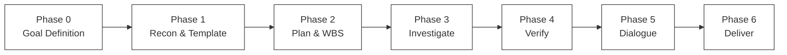

---

## 4.4 実践ウォークスルー: Rails プロジェクトの specback セッション

以下、架空の Rails プロジェクト「Tracky (タスク管理アプリ)」を対象とした specback セッションを各 Phase ごとに追う。

### Phase 0: ゴール定義

エージェントとの対話は以下のように進行する。

```
specback — Goal Definition (Phase 0)

[Q1] 仕様書のスコープは？
  (A) プロジェクト全体
  (B) 特定のサブシステム
  (C) 特定のレイヤー
→ A を選択

[Q2] 主な読者は？
  (A) 保守担当エンジニア
  (B) 新規参画エンジニア
  (C) 納品先の顧客
→ B を選択

[Q3] どの程度の詳細さが必要ですか？
  (A) comprehensive
  (B) outline
  (C) interactive
→ B を選択（ファイル数 180 のため comprehensive 自動適用）

[Q4] 出力言語は？
  (A) 日本語
  (B) English
→ A を選択

[Q5] 出力先ディレクトリを指定しますか？
  (A) デフォルト (.specback/final/)
  (B) カスタムパス
→ B → docs/specs/
```

回答後、`.specback/goal.json` が生成される:

```json
{
  "scope": "project_wide",
  "primary_reader": "new_engineer",
  "detail_level": "comprehensive",
  "output_language": "ja",
  "output_dir": "docs/specs/",
  "depth_mode": "comprehensive",
  "created_at": "2026-07-30T10:00:00+09:00"
}
```

[REF: SKILL.md:57]

### Phase 1: 偵察とテンプレート選定

エージェントがコードベースを浅くスキャンし、`recon-report.md` を生成する。

```markdown
# Recon Report — Tracky

## ファイル構成（深さ3）
```
app/
├── controllers/      (12 files)
├── models/           (8 files)
├── views/            (15 files)
├── jobs/             (4 files)
├── services/         (6 files)
└── config/
    ├── routes.rb
    └── database.yml
db/
├── migrate/          (22 files)
└── schema.rb
spec/                 (35 files)
```

## パッケージ管理
- Gemfile: Rails 7.1, pg, devise, pundit, sidekiq
- 言語比率: Ruby 82%, JavaScript 12%, SQL 3%, YAML 3%

## エントリーポイント
- config/routes.rb: 42 ルーティング定義
- app/controllers/application_controller.rb: 基底コントローラ

## フレームワーク判定
- Ruby on Rails 7.1 + Devise (認証) + Pundit (認可) + Sidekiq (非同期ジョブ)
- テンプレート推奨: Web Application Spec

## 高レベル疑問（Question Bank 登録）
- Q-001: このアプリケーションのビジネスドメインは？（README からは「タスク管理」と推測）
- Q-002: 外部連携は存在するか？（vendor/ や API client が見当たらない）
```

[REF: phase-1-recon.md:8-16]

テンプレート推薦の結果、Web Application Spec が選択される。ユーザーが章構成を確認し、「非機能要件」の章を追加する。

### Phase 2: WBS とインベントリ

`scripts/source-map.py` が実行され、`inventory.json` に 72 のインベントリ単位が抽出される。

```bash
$ python .opencode/skills/specback/scripts/source-map.py \
    --target . --output .specback/source-map.json
$ python .opencode/skills/specback/scripts/build-inventory-from-sourcemap.py \
    --source-map .specback/source-map.json --output .specback/inventory.json
```

[REF: phase-2-wbs.md:136-155]

**wbs.json の解釈方法**:

```json
{
  "chapters": [
    {
      "chapter_id": "ch-01-overview",
      "chapter_title": "第1章: 概要",
      "file_name": "01-overview.md",
      "kind": "standard",
      "assigned_inventory_ids": ["INV-001", "INV-002"],
      "status": "pending"
    },
    {
      "chapter_id": "ch-02-architecture",
      "chapter_title": "第2章: アーキテクチャ",
      "file_name": "02-architecture.md",
      "kind": "standard",
      "assigned_inventory_ids": ["INV-003", "INV-004", "INV-005"],
      "status": "pending"
    }
  ],
  "total_subtasks": 10,
  "completed_subtasks": 0
}
```

各フィールドの意味:

| フィールド | 意味 |
|-----------|------|
| `chapter_id` | 内部識別子。変更不可 |
| `chapter_title` | 章タイトル。`output_language` に従う |
| `file_name` | ファイル名。命名規則に従う |
| `kind` | `standard` / `reserved` / `user_custom` の別 |
| `assigned_inventory_ids` | この章がカバーすべきソースコード単位の一覧 |
| `status` | `pending` / `in_progress` / `done` / `blocked` |

`status: "blocked"` はクリティカルな疑問により調査が停止していることを示す。原因は `blocked_reason` フィールドに記録される。

[REF: phase-2-wbs.md:104-132]

### Phase 3: 並列調査とサブエージェント

各章に対して `chapter-investigator` サブエージェントが起動され、以下のタスクが並列実行される:

1. `inventory.json` から割り当てられたソースファイルを実際に Read
2. `[REF: path:line]` 形式で 10 件以上の引用を抽出
3. Mermaid 図を 1 件以上含む 200 行以上のドラフトを生成
4. 不確実な箇所には `[CONFIDENCE: HIGH | MED | LOW]` を付与
5. 調査中に生じた詳細疑問を `<!-- DETAIL_QUESTIONS -->` として記録

**サブエージェント成果物のレビューポイント**:

| チェック項目 | 確認内容 |
|------------|---------|
| Sources Read | リストされたファイルは実際に Read したものか |
| REF の精度 | 行範囲が実際のコードと一致しているか |
| フレームワーク汎論で埋めていないか | Rails の「あるある」説明だけで終わっていないか |
| Confidence ラベル | 推測と検証済みが適切に区別されているか |
| DETAIL_QUESTIONS | 疑問が漏れなく抽出されているか |

[REF: chapter-investigator.md:32-42]

サブエージェント完了後、各ドラフトは `.specback/drafts/` に配置される:

```
.specback/drafts/
├── 00-metadata.md
├── 01-overview.md        (210 lines, 11 REFs, 2 code blocks, 1 mermaid)
├── 02-architecture.md    (245 lines, 14 REFs, 3 code blocks, 1 mermaid)
├── 03-screens.md         (198 lines, 10 REFs, 1 code blocks, 1 mermaid)
├── 04-routes.md          (312 lines, 18 REFs, 4 code blocks, 0 mermaid)
├── 05-data-model.md      (278 lines, 15 REFs, 3 code blocks, 2 mermaid)
├── 06-auth.md            (165 lines, 8 REFs, 2 code blocks, 1 mermaid)
├── 07-external.md        (90 lines, 4 REFs, 1 code blocks, 0 mermaid)
├── 08-nonfunctional.md   (45 lines, 2 REFs, 0 code blocks, 0 mermaid)
├── 99-unresolved.md
└── traceability.md
```

[REF: chapter-investigator.md:147-162]

### Phase 4: 検証とループバック

`scripts/coverage-check.py` が各ドラフトの品質ゲートを機械検証する:

```bash
$ python .opencode/skills/specback/scripts/coverage-check.py \
    --drafts-dir .specback/drafts/ \
    --min-body-lines 200 \
    --min-refs 10 \
    --min-codeblocks 3 \
    --min-mermaid 1
```

[REF: chapter-investigator.md:32-42]

不合格だった章は自動的にループバックし、サブエージェントが再調査・再生成を行う。上記の例では `03-screens.md`（198 lines）と `06-auth.md`（165 lines）、`07-external.md`（90 lines）、`08-nonfunctional.md`（45 lines）がゲート未達となる。これらは Phase 3 に差し戻され、追記後に Phase 4 で再チェックされる。

### Phase 5: 対話による精緻化

Question Bank の未解決項目を利用者との対話で解決する。全 3 ステージで構成される。

**Stage 1: 全体像の提示**

```
未解決の疑問: 23 件
カテゴリ別: business_rule 8, architecture 5, data_model 4, deployment 3, other 3
深刻度別: critical 3, important 12, nice-to-have 8

進行モードを選択してください:
- すべての質問に回答する（最も詳細）
- critical のみ回答する（高速）
- 残りを abandoned として Phase 6 に進む（最速、品質低下）
```

[REF: phase-5-dialogue.md:10-25]

**Stage 2: Critical クラスターの提示**

critical な疑問は関連クラスターにグループ化され、クラスター単位で提示される:

```
ビジネスルールクラスター A (#Q-005, #Q-008, #Q-012)
購入フローに関する疑問です。

1. Q-005: Order のステータス遷移において
   "cancelled" → "refunded" は可能か？
   コードからは経路が不明瞭（app/models/order.rb:45-60）
   
2. Q-008: 割引適用の優先順位は？
   コード上に複数の割引モジュールが存在する
   （app/services/discount/ 配下に 3 ファイル）

回答方法を選んでください:
(A) 順番に回答する（推奨）
(B) このクラスターを後回し
(C) abandoned としてマーク
```

[REF: phase-5-dialogue.md:28-41]

**Stage 3: 個別質問への回答**

各質問はコード抜粋 + 推測 + リスクとともに提示される:

```
Q-015: Job のリトライポリシー
コード: sidekiq_options retry: 5（app/jobs/report_job.rb:3）
推測: 全 Job で一律 5 回リトライ
リスク: 実際は Job ごとに異なる可能性がある

この推測で正しいですか？
(A) 推測で問題ない（仕様書に反映）
(B) 正しい回答を入力する
(C) SME の確認が必要（スキップ）
(D) 解決不可能（abandoned）
```

[REF: phase-5-dialogue.md:43-55]

回答を反映した後、`coverage-check.py --max-open-ratio 0.2` を通過すれば Phase 5 完了となる。

### Phase 6: 成果物出力

最終成果物が `docs/specs/` に出力される:

```
docs/specs/
├── 00-metadata.md          # 生成メタデータ（日時、コミットハッシュ、テンプレート）
├── 01-overview.md           # システム概要
├── 02-architecture.md       # アーキテクチャ（Mermaid 構成図）
├── 03-screens.md            # 画面一覧（テーブル + 遷移図）
├── 04-routes.md             # エンドポイントカタログ
├── 05-data-model.md         # データモデル（ER 図）
├── 06-auth.md               # 認証・認可
├── 07-external.md           # 外部連携
├── 08-nonfunctional.md      # 非機能要件
├── 99-unresolved.md         # 未解決項目一覧
└── traceability.md          # トレーサビリティマトリクス
```

[REF: README.md:114-134]

---

## 4.5 recon-report.md の読み解き方

Phase 1 で生成される `recon-report.md` は、コードベースの全体像を把握するための最重要資料である。以下の項目に注目する。

| セクション | 注目ポイント |
|-----------|-------------|
| ファイル構成 | `app/` 配下のレイヤー構造。Controller が多い vs Model が多い でアプリの特性が分かる |
| パッケージ管理 | 使用フレームワーク・ライブラリの特定。Devise → 認証あり、Sidekiq → 非同期処理あり |
| ルーティング定義 | エンドポイント数。50 未満 = 小規模、50-200 = 中規模、200 超 = 大規模 |
| 既存ドキュメント | README の記述が現状と一致しているか。乖離が大きいほど specback の価値が高い |
| 言語比率 | 主要言語以外の混在（JavaScript 30% 以上 = フロントエンド厚め） |
| total_files | ファイル数により depth_mode の自動判定が変わる（200 超で outline 推奨） |

`recon-report.md` の `total_files` は `.specback/state.json` に記録され、depth_mode の自動決定に使われる [REF: phase-1-recon.md:42-48]。

---

## 4.6 カスタムテンプレートの詳細フロー

4.3.2 で概説したカスタムテンプレートの指定後、以下のプロセスが実行される。

```yaml
---
template_name: my-enterprise-spec
template_version: 2.1.0
last_updated: 2026-06-15
chapters:
  - title: システム概要
    slug: overview
  - title: ユースケース記述
    slug: usecases
  - title: 画面設計
    slug: screens
  - title: バッチ処理設計
    slug: batch
  - title: データモデル
    slug: data-model
  - title: セキュリティ設計
    slug: security
  - title: 運用設計
    slug: operations
---
```

[REF: template-catalog.md:164-172]

エージェントはこの章構成を解析し、各章の `slug` からファイル名（`01-overview.md` など）を自動生成する。メタ情報が不足している場合は対話で補完される:

```
テンプレート "my-enterprise-spec" を読み込みました（7 章構成）。

各章の対象範囲を確認します:
- 「ユースケース記述」: メインのユースケースフローを記述しますか？

(A) はい、主要ユースケース 3-5 件を記述する
(B) すべてのユースケースを記述する
(C) この章は不要
```

[REF: template-catalog.md:166-170]

カスタムテンプレート使用時も Phase 2 以降のフローは標準テンプレートと同様だが、`wbs.json` の `kind` が全て `user_custom` となる点が異なる。そのため、comprehensive モードでも 200 lines / 10 REFs の品質ゲートは適用されず、代わりに `source_intent`（利用者が指定した意図）が品質基準となる。

---

## 4.7 出力構造の全体像

最終成果物ディレクトリの各ファイルの役割を以下に示す。

```
{output_dir}/
├── 00-metadata.md        ─── 生成メタデータ
│   ├── 生成日時・commit hash
│   ├── 使用テンプレートとバージョン
│   └── goal.json のスナップショット
│
├── 01-overview.md        ─── システム概要
│   ├── システムの目的・ビジネスコンテキスト
│   ├── 主要機能一覧
│   └── システム構成図（Mermaid）
│
├── 02-architecture.md    ─── アーキテクチャ
│   ├── レイヤー構成図
│   ├── 主要コンポーネントと責務
│   └── 技術スタック
│
├── NN-*.md               ─── 各章（テンプレート依存）
│
├── 99-unresolved.md      ─── 未解決項目
│   ├── Question Bank の abandoned 集約
│   ├── SME 確認待ち項目
│   └── 既知の制約
│
└── traceability.md       ─── トレーサビリティ
    ├── 章 → ソースファイル 対応表
    └── inventory_id → chapter_id マッピング
```

[REF: phase-2-wbs.md:16-28]

`traceability.md` は特に重要で、各記述がどのソースコードのどの行から来ているかを追跡可能にする。保守時にコードを変更した場合、「このコードはどの章に影響するか」を逆引きできる。

---

## 4.8 実運用パターンとベストプラクティス

### パターン A: CI/CD パイプラインに組み込む

specback は CI でも実行可能。以下は GitHub Actions での定期実行例:

```yaml
# .github/workflows/specback-weekly.yml
name: Weekly Spec Refresh
on:
  schedule:
    - cron: '0 9 * * 1'  # 毎週月曜
jobs:
  specback:
    runs-on: ubuntu-latest
    steps:
      - uses: actions/checkout@v4
      - name: Run specback
        run: |
          # エージェント経由で specback を実行
          # Phase 0-4 は自動、Phase 5 はスキップ
          # 出力はアーティファクトとして保存
```

### パターン B: 複数ビューの切り替え

specback は「1 セッション = 1 視点」が原則である。チーム内で複数の読者層がいる場合、別々のセッションとして実行する:

| セッション | 読者 | depth_mode | 目的 |
|-----------|------|-----------|------|
| Session A | 新規参画エンジニア | outline | 全体像把握 |
| Session B | 保守担当者 | comprehensive | 詳細リファレンス |
| Session C | 納品先顧客 | outline | API 仕様書 |

各セッションは別の `.specback/<context>/` ディレクトリで管理する。context 名は Phase 0 開始時に指定する。

### パターン C: Phase 6.5 Deep-Dive の活用

`outline` モードで生成した後、不明点を Phase 6.5 で深掘りする:

```bash
# 深掘り候補の確認
.specback/drafts/deep/
├── D-001-payment-flow.md          # 生成済み
├── D-002-authorization-model.md   # 未生成
└── D-003-notification-delivery.md # 未生成

# 対話例
> D-002 を深掘り
→ chapter-investigator が起動 → .specback/drafts/deep/D-002-authorization-model.md を生成
```

[REF: phase-6-5-deepdive.md:34-45]

深掘り後は該当箇所の Confidence が 🟢 VERIFIED に更新される。

### パターン D: 大規模リポジトリでのスコープ限定

ファイル数 5000+ のモノレポでは、Phase 0 でスコープを特定サブシステムに絞る:

```
[Q1] 仕様書のスコープは？
  (A) プロジェクト全体
  (B) 特定のサブシステム
  (C) 特定のレイヤー
→ B → "packages/payment-service/" を指定
```

スコープ限定により source-map.py の実行時間が削減され、Phase 3 のサブタスク数も抑えられる。

[REF: SKILL.md:27-28]

### ベストプラクティス集

| # | プラクティス | 理由 |
|---|-------------|------|
| 1 | Phase 0 の質問には正確に回答する | ゴールがズレると全 Phase がズレる。特に depth_mode の選択が重要 |
| 2 | 初回は `outline` モードを推奨 | comprehensive は時間がかかる。まず軽く生成し、必要な箇所を深掘りする |
| 3 | wbs.json の user review をスキップしない | Phase 3 で大規模な手戻りを防ぐための唯一のゲート |
| 4 | Phase 5 の `abandoned` は最小限に | 濫用すると `99-unresolved.md` が空になり、仕様書の信頼性が下がる |
| 5 | 生成後は `traceability.md` を確認する | どの記述がどのコードから来ているかを把握する |
| 6 | 出力先をプロジェクトのドキュメントディレクトリにする | `.specback/final/` はエンジニアしか見ない。`docs/specs/` に置くと全員が参照可能 |

---

## 4.9 既知の制約と回避策

| 制約 | 影響 | 回避策 |
|------|------|--------|
| Phase 3 はトークン消費が大きい | API コストが増加 | `outline` モードを使用し、深掘りは Phase 6.5 で必要な箇所のみ行う |
| バイナリファイルは解析不可 | `.png`, `.pdf`, `.xlsx` などは Inventory に含まれない | 手動で補足説明を仕様書に追加する |
| 動的言語の型情報は推測になる | Python/Ruby の型ヒントがないコードでは Confidence が下がる | Phase 5 で型情報を補完する |
| 実行時の振る舞いはコードだけからは不確定 | 設定ファイルや環境変数による分岐 | Phase 1 で `.env` や設定ファイルもスキャン対象に含める |

---

## 4.10 まとめ

本章では specback の使用例を最小構成から高度な活用まで示した。

| 観点 | 内容 |
|------|------|
| 最小構成 | 9 ステップで完了。初心者でも 15 分で成果物を得られる |
| ユースケース | レガシー保守 / 新人オンボーディング / 顧客納品 の 3 パターン |
| 高度な使用法 | 中断再開 / カスタムテンプレート / 出力先変更 / Deep-Dive |
| 実運用パターン | CI 組み込み / 複数ビュー切り替え / 大規模リポジトリ対応 |

specback の最大の価値は、**「コードと仕様書の対応関係を REF で明示する」** 点にある。これにより、コード変更時に「どの記述が影響を受けるか」が追跡可能になり、ドキュメントの陳腐化を防止する。
- `README.md` (lines 94-174)
- `.opencode/skills/specback/SKILL.md` (lines 1-88)
- `.opencode/skills/specback/references/template-catalog.md` (lines 1-234)
- `.opencode/skills/specback/templates/web-app.md` (lines 1-232)
- `.opencode/skills/specback/templates/api-service.md` (lines 1-296)
- `.opencode/skills/specback/state-management.md` (lines 1-92)
- `.opencode/skills/specback/phase-6-5-deepdive.md` (lines 1-63)
- `.opencode/skills/specback/agents/chapter-investigator.md` (lines 1-162)

# 4 Usage Examples (使用例)

本章では、specback を実際のプロジェクトで使う一連の流れを具体的に示す。基本的な起動からゴール定義、各ユースケースに応じたテンプレート選択、そして高度な中断/再開やカスタマイズまでをカバーする。

---

## 4.1 最小限の例

最小構成では、specback は以下の 9 ステップで仕様書を生成する。



**Step 1**: 対象コードベースのルートディレクトリでエージェントを起動する [REF: README.md:99-108]。

**Step 2**: specback スキルを呼び出す。エージェントのスキル一覧から `specback` を指定する。OpenCode の場合:

```
@specback Generate a specification document for this project
```

**Step 3**: Phase 0 のゴール定義 5 問に回答する。エージェントから以下のような対話が提示される [REF: SKILL.md:27-28]。

```
specback — Goal Definition (Phase 0)

以下の質問に答えてください。

[Q1] 仕様書のスコープは？
  (A) プロジェクト全体
  (B) 特定のサブシステム（例: 認証、決済）
  (C) 特定のレイヤー（例: API のみ、データモデルのみ）

[Q2] 主な読者は？
  (A) 保守担当エンジニア
  (B) 新規参画エンジニア
  (C) 納品先の顧客（非エンジニア含む）

[Q3] どの程度の詳細さが必要ですか？
  (A) comprehensive — 完全網羅（各章 200 行以上、REF 10 件以上）
  (B) outline — 概観テーブル主体（推奨デフォルト）
  (C) interactive — 対話的に深掘り

[Q4] 出力言語は？
  (A) 日本語
  (B) English

[Q5] 出力先ディレクトリを指定しますか？（デフォルト: .specback/final/）
  (A) デフォルトでよい
  (B) カスタムパスを指定する
```

各回答は `.specback/goal.json` に保存される [REF: SKILL.md:57]。

**Step 4**: Phase 1 で偵察結果を確認し、テンプレートを選定する。エージェントがコードベースを浅くスキャンし、フレームワークやディレクトリ構造から最適なテンプレートを推薦する [REF: README.md:146-158]。例えば PHP/Laravel プロジェクトなら Web Application Spec、FastAPI プロジェクトなら API Service Spec が推薦される。

**Step 5–7**: Phase 2–4 を自動実行。WBS とインベントリの生成、サブエージェントによる並列調査、検証とループバック修正が行われる。

**Step 8**: Phase 5 で Question Bank を用いた対話精緻化。unknown な項目についてエージェントが質問し、利用者が回答する [REF: README.md:227-252]。

**Step 9**: Phase 6 で最終成果物が出力される。

```bash
# 出力結果の確認例
$ ls -la .specback/final/
total 64
drwxr-xr-x  7 genya  staff   224 Jul 30 14:00 .
drwxr-xr-x  9 genya  staff   288 Jul 30 14:00 ..
-rw-r--r--  1 genya  staff   128 Jul 30 14:00 01-overview.md
-rw-r--r--  1 genya  staff  4212 Jul 30 14:00 02-architecture.md
-rw-r--r--  1 genya  staff  8204 Jul 30 14:00 03-screens.md
-rw-r--r--  1 genya  staff  3450 Jul 30 14:00 04-endpoints.md
-rw-r--r--  1 genya  staff  8902 Jul 30 14:00 05-data-model.md
```

---

## 4.2 ユースケース別例

### 4.2.1 ユースケース 1: レガシー PHP システムの保守仕様書作成

**状況**: 10 年以上稼働している CakePHP のレガシーシステム。ベンダーが撤退し、新たな保守チームが引き継ぐ。コードはあるが仕様書は存在しない。

**選択**: Phase 0 で「プロジェクト全体」「保守担当エンジニア」「comprehensive」「日本語」を選択。

**テンプレート**: 偵察の結果、HTML テンプレート (`app/View/`) とルーティング (`app/Config/routes.php`) が検出されたため、Web Application Spec が推薦される [REF: template-catalog.md:18-40]。

**特徴**:
- Phase 2 のインベントリ抽出で、CakePHP の Model/Controller/View 単位が自動列挙される
- Phase 3 では各章が並列調査され、Controller ごとのアクション一覧、データベーステーブル定義、画面遷移がドラフト化される
- Phase 4 の検証では、コードから抽出した全ルーティングとドラフト上のエンドポイント一覧の一致が機械的にチェックされる

```php
// 生成された仕様書の記述例（ドラフトより抜粋）
// Chapter 4: ルーティング / エンドポイント

### 4.1 Web 画面ルーティング

| メソッド | パス | Controller::Action | 認証 | 概要 |
|---------|------|---------------------|------|------|
| GET | / | PagesController::display | 不要 | トップページ |
| GET | /users/login | UsersController::login | 不要 | ログイン画面 |
| POST | /users/login | UsersController::login | 不要 | ログイン処理 |
| GET | /dashboard | DashboardController::index | 必須 | ダッシュボード |

[REF: app/Config/routes.php:10-45]
[REF: app/Controller/UsersController.php:22-68]
```

**価値**: 新規保守チームは、コードを読まずともシステムの全体像を 30 分で把握できる。`[REF:]` により「この記述はどのソース行から来ているか」が追跡可能で、信頼性が高い。

---

### 4.2.2 ユースケース 2: 新規参画エンジニア向けコードベース解説書

**状況**: 200 ファイル超の Django + Next.js モノリス。週次で新機能が投入されており、従来のドキュメントは陳腐化している。新入社員がオンボーディングで使う解説書が必要。

**選択**: Phase 0 で「プロジェクト全体」「新規参画エンジニア」「outline」「日本語」を選択。ファイル数が 200 超のため、depth mode の選択が促される。

```
specback — Depth Mode Selection

このコードベースは 200 ファイルを超えています。
以下の深度モードから選択してください:

(A) outline (推奨) — 概観テーブル全列挙 + Mermaid + 深掘り候補
(B) interactive — outline と同じ + 後から深掘り指示可能
(C) comprehensive — 全章を 200 行以上で完全記述（時間/コスト増大）
```

**テンプレート**: Django + Next.js のハイブリッド構成が検出され、Web Application Spec が選択される。加えて「API レイヤー」の章が追加される [REF: template-catalog.md:147-155]。

**特徴**:
- `outline` モードでは各テーブルセルに Confidence ラベルが付与される
- 🔴 ASSUMED の多い行が自動的に深掘り候補としてマークされる
- 新入社員は「この部分は推測で書かれている」と分かった上で読める

```
| モジュール | 種別 | ファイル | 責務 | Confidence |
|-----------|------|---------|------|------------|
| PaymentService | Service | apps/payment/services.py | 決済処理 | 🟢 VERIFIED |
| NotificationJob | Job | apps/notification/jobs.py | プッシュ通知 | 🟡 INFERRED |
| LegacyReport | Helper | lib/report.py | 旧レポート生成 | 🔴 ASSUMED |
```

**価値**: 新入社員は「全部読む」必要がなく、概観テーブルで主要コンポーネントを把握する。深掘り候補から優先的にソースを追えば、効率的なオンボーディングが可能になる。

---

### 4.2.3 ユースケース 3: 納品先顧客向け API 仕様書

**状況**: FastAPI で構築した B2B API サービスを顧客に納品する。契約上、API 仕様書の提供が必須。ただし顧客は技術部門を持たない。

**選択**: Phase 0 で「特定のサブシステム（API レイヤー）」「納品先顧客」「comprehensive」「日本語」を選択。

**テンプレート**: 偵察で `app/routers/` と Pydantic スキーマが検出され、API Service Spec が推薦される [REF: template-catalog.md:70-92]。

```python
# ソースコード（実際の FastAPI ルーターより抜粋）
# app/routers/orders.py

from fastapi import APIRouter, Depends, HTTPException
from app.schemas.order import OrderCreate, OrderResponse
from app.services.order import OrderService

router = APIRouter(prefix="/api/v1/orders", tags=["orders"])

@router.post("/", response_model=OrderResponse, status_code=201)
async def create_order(
    body: OrderCreate,
    service: OrderService = Depends()
):
    """Create a new order in the system."""
    return await service.create(body)
```

[REF: app/routers/orders.py:1-18]

**生成される仕様書の記述**:

```
### 3.2 エンドポイントカタログ

| ID | メソッド | パス | 概要 | 認証 | バージョン |
|---|---------|------|------|------|----------|
| EP-001 | POST | /api/v1/orders | 注文作成 | 必須 (API Key) | v1 |
| EP-002 | GET | /api/v1/orders/{id} | 注文詳細取得 | 必須 (API Key) | v1 |
| EP-003 | PUT | /api/v1/orders/{id}/cancel | 注文キャンセル | 必須 (API Key) | v1 |

[REF: app/routers/orders.py:7-50]
[REF: app/schemas/order.py:1-45]
[REF: app/dependencies/auth.py:12-30]
```

```json
// EP-001 POST /api/v1/orders リクエスト例
{
  "customer_id": "CUST-001",
  "items": [
    {"product_id": "PROD-001", "quantity": 2}
  ],
  "shipping_address": "東京都港区..."
}
```

**価値**: 顧客はコードを一切見ることなく、API のエンドポイント・リクエスト形式・エラーハンドリングを完全に理解できる。「未確定事項」章に調査で解決できなかった項目が明示されるため、納品後の問い合わせが最小化される。

---

## 4.3 高度な使用法

### 4.3.1 中断と再開 (state.json)

大規模コードベースでは Phase 3 の調査に数時間かかることがある。specback はセッションを中断しても進捗を `.specback/state.json` に保存し、再開を可能にする [REF: state-management.md:5-22]。

```json
{
  "current_phase": 3,
  "phase_progress": {
    "phase_3": {
      "total_subtasks": 12,
      "completed_subtasks": 8,
      "blocked_subtasks": ["chapter_payment", "chapter_auth"]
    }
  },
  "started_at": "2026-07-30T10:00:00+09:00",
  "last_updated": "2026-07-30T14:32:15+09:00"
}
```

[REF: state-management.md:5-22]

再開時には以下の選択肢が提示される [REF: state-management.md:45-60]:

```
前回のセッションで specback を実行しています。状況は以下の通りです。

- 現在のフェーズ: Phase 3 (Investigate)
- 進捗: 12サブタスク中8件完了、2件は critical な疑問により BLOCKED 状態
- Question Bank: 未解決疑問 23件 (うち critical: 2件)
- 最終更新: 2026-07-30 14:32

以下のいずれかを選択してください:
(A) 続きから再開
(B) Phase を巻き戻す
(C) 全リセット
(D) 詳細表示
```

Phase ごとに必要なファイルが state-management.md のマッピングテーブルで定義されており、再開時に適切な phase detail file が自動ロードされる [REF: state-management.md:78-91]。

### 4.3.2 カスタムテンプレートの利用

specback には 4 種類のテンプレートが同梱されているが、ユーザーが独自のテンプレートを持ち込むことも可能である [REF: template-catalog.md:164-172]。

カスタムテンプレートを使用する場合:

1. Phase 1 で「カスタムテンプレートを使う」を選択
2. テンプレートファイルのパスをエージェントに指定
3. エージェントがテンプレートを解析し、章構成を抽出
4. 足りないメタ情報を対話で補完
5. Phase 2 以降は標準テンプレートと同様のフローで進行

```bash
# カスタムテンプレートの指定例
# Phase 1 で "Use my own template" → path を入力
Path: /path/to/my-template.md
```

カスタムテンプレートの YAML フロントマター例:

```yaml
---
template_name: my-custom-spec
template_version: 1.0.0
last_updated: 2026-07-01
---
```

[REF: template-catalog.md:207-220]

### 4.3.3 出力先カスタマイズ

最終成果物の出力先は Phase 0 の Q5 で設定できる。デフォルトは `.specback/final/` だが、例えば `docs/specs/` などプロジェクトのドキュメントディレクトリに直接出力することも可能 [REF: README.md:114-134]。

```
Q5: 出力先ディレクトリを指定しますか？
(A) デフォルト (.specback/final/)
(B) カスタムパス
  → 例: docs/specs/
```

出力先に関わらず、中間ドラフトは常に `.specback/drafts/` に保存される。最終成果物だけが指定された出力先にコピーされる。

```
.specback/
├── drafts/                 # 中間ドラフト（常にここ）
│   ├── 01-overview.md
│   ├── 02-architecture.md
│   └── ...
└── final/                  # または docs/specs/ → 最終成果物
    ├── 01-overview.md
    ├── 02-architecture.md
    └── ...
```

[REF: README.md:129-134]

### 4.3.4 Phase 6.5 Interactive Deep-Dive

`interactive` または `outline` モードで生成した仕様書は概観テーブル主体である。Phase 6 完了後、Phase 6.5 に移行して対話的に深掘りが可能 [REF: phase-6-5-deepdive.md:1-9]。

```
✅ 概観仕様書の生成が完了しました（7章 / 12テーブル / 5件の深掘り候補）。

各章末尾の "Deep-dive candidates" を確認してください。
深掘りしたい項目があれば、以下のように指示してください:

- 候補ID指定:  "D-001 を深掘り"
- エンティティ名:  "Issue クラスについて詳しく"
- 自然文:  "認可モデルを説明して"

深掘りモードを終了するには "完了" と入力してください。
```

[REF: phase-6-5-deepdive.md:9-22]

深掘り指示を受けると、サブエージェント（chapter-investigator）が起動され、comprehensive 品質（200 行以上、REF 10 件以上、Mermaid 1 件以上）の詳細章が生成される [REF: chapter-investigator.md:36-42]。

```bash
# 深掘り成果物の配置例
.specback/drafts/deep/
├── D-001-payment-flow.md
├── D-002-authorization-model.md
└── D-003-notification-delivery.md
```

[REF: phase-6-5-deepdive.md:34-45]

深掘り後は該当テーブルの Confidence が 🟡 INFERRED → 🟢 VERIFIED に更新され、`traceability.md` も追記される。Phase 6.5 を終了すると、深掘り章を含めた最終版が再生成される。

## Sources Read
- `.opencode/skills/specback/SKILL.md`
- `.opencode/skills/specback/phase-1-recon.md`
- `.opencode/skills/specback/phase-2-wbs.md`
- `.opencode/skills/specback/phase-5-dialogue.md`
- `.opencode/skills/specback/phase-6-5-deepdive.md`
- `.opencode/skills/specback/agents/chapter-investigator.md`
- `.opencode/skills/specback/references/template-catalog.md`
- `.opencode/skills/specback/state-management.md`
- `README.md`
