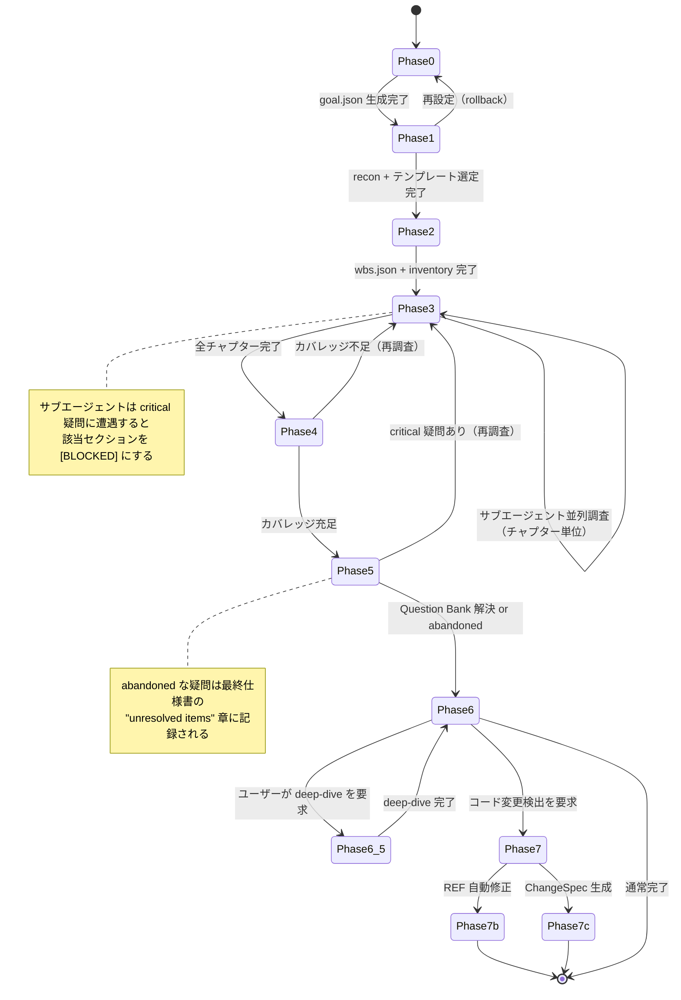
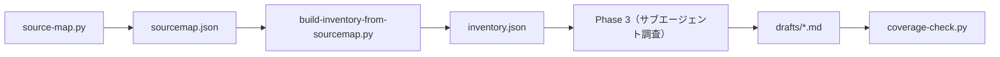

# 第5章: 公開APIカタログ

specback は従来のライブラリやフレームワークのように関数シグネチャやクラスを公開するのではなく、**ファイルシステム上の規約**によってAPIを定義する。エージェントは `.specback/` ディレクトリ以下のJSONファイルを読み書きし、スキルディレクトリ内の Markdown ファイルを手順書として読み込む。本章ではそれら「公開API」の一覧、モジュール構造、安定度レベルを規定する。

---

## 5.1 公開APIカタログ

以下が specback の公開APIである。APIと呼べるものはすべてファイルまたはデータ構造として表現され、エージェントとユーザーの間の契約となる。

| API名 | 種類 | シグネチャ | 概要 | 安定度 |
|-------|------|-----------|------|-------|
| SKILL.md | skill definition | エージェントの system prompt に注入 | スキルの軽量エントリポイント。11の設計原則、フェーズ概要テーブル、実行ルールを定義 | stable |
| Phase 0 (setup) | phase file | `phase-0-setup.md` → エージェントが Read | 目標定義ダイアログ、`goal.json` 生成、言語選択 | stable |
| Phase 1 (recon) | phase file | `phase-1-recon.md` → エージェントが Read | shallow reconnaissance、テンプレート選定、depth mode 決定 | stable |
| Phase 2 (WBS) | phase file | `phase-2-wbs.md` → エージェントが Read | インベントリ列挙、WBS 生成、チャプター分割 | stable |
| Phase 3 (investigate) | phase file | `phase-3-investigate.md` → エージェントが Read | サブエージェント並列調査、ドラフト生成 | stable |
| Phase 4 (verify) | phase file | `phase-4-verify.md` → エージェントが Read | カバレッジチェック、品質ゲート評価 | stable |
| Phase 5 (dialogue) | phase file | `phase-5-dialogue.md` → エージェントが Read | Question Bank 解決、ユーザー対話 | stable |
| Phase 6 (deliver) | phase file | `phase-6-deliver.md` → エージェントが Read | 最終仕様書出力、traceability matrix 生成 | stable |
| Phase 6.5 (deep-dive) | phase file | `phase-6-5-deepdive.md` → エージェントが Read | オンデマンド deep-dive チャプター生成 | beta |
| Phase 7 (drift) | phase file | `phase-7-drift.md` → エージェントが Read | コード変更検出、drift report 生成 | beta |
| Phase 7b (REF auto-fix) | phase file | `phase-7b-ref-autofix.md` → エージェントが Read | REF 参照の自動修正 | experimental |
| Phase 7c (ChangeSpec) | phase file | `phase-7c-changespec.md` → エージェントが Read | 変更箇所の仕様書自動生成 | experimental |
| Question Bank | data structure | `.specback/questions.json` (JSON ファイル) | 疑問の構造化管理。7カテゴリ、3 severity、status 遷移 | stable |
| state.json | data structure | `.specback/state.json` (JSON ファイル) | セッション進行管理・再開。current_phase, phase_progress, session_history | stable |
| goal.json | data structure | `.specback/goal.json` (JSON ファイル) | 出力言語・読者・粒度・視点・既存ドキュメント戦略・出力先を定義 | stable |
| Template Catalog | reference | `references/template-catalog.md` | 4種類のテンプレート定義（Webアプリ/バッチ/API/ライブラリ）+ 複合プロジェクトの扱い | stable |
| Inventory Units | reference | `references/inventory-units.md` | 言語/フレームワークごとの inventory unit 一覧 | stable |
| Sub-agent Prompt | reference | `references/subagent-prompt.md` | サブエージェントへの完全なプロンプトテンプレート | stable |
| Verification Checklists | reference | `references/verification-checklists.md` | 検証項目チェックリスト | stable |
| Question Categories | reference | `references/question-categories.md` | Question Bank カテゴリの詳細定義 | stable |
| Script: source-map | script | `scripts/source-map.py` (CLI) | ソースコード構造の解析 | stable |
| Script: build-inventory | script | `scripts/build-inventory-from-sourcemap.py` (CLI) | ソースマップから inventory 生成 | stable |
| Script: coverage-check | script | `scripts/coverage-check.py` (CLI) | チャプターカバレッジチェック | stable |
| Script: detect-drift | script | `scripts/detect-drift.py` (CLI) | コード変更検出 | beta |
| Script: fix-refs | script | `scripts/fix-refs.py` (CLI) | REF 参照自動修正 | experimental |
| Script: change-spec | script | `scripts/change-spec.py` (CLI) | 変更仕様書生成 | experimental |

**補足**：上記の「シグネチャ」は従来のプログラミングAPIにおける関数シグネチャではない。エージェントが Read/Write/Bash ツールを通じてこれらのファイルにアクセスする方法を示す。各 phase file は SKILL.md の phase overview テーブル ([REF: SKILL.md:55-67]) によって対応づけられ、エージェントは state.json の `current_phase` を元に該当ファイルを動的にロードする ([REF: state-management.md:76-91])。

---

## 5.2 モジュール構造

specback のモジュールは**スキルディレクトリ**と**ランタイムディレクトリ**の2階層で構成される。

### 5.2.1 スキルディレクトリ構造

スキルディレクトリ（例：`.opencode/skills/specback/`）には specback の全定義が格納される。

```
.opencode/skills/specback/
├── SKILL.md                      # エントリポイント（system prompt に注入）
├── phase-0-setup.md              # Phase 0: Setup & Goal
├── phase-1-recon.md              # Phase 1: Recon & Template
├── phase-2-wbs.md                # Phase 2: Plan & WBS
├── phase-3-investigate.md        # Phase 3: Investigate
├── phase-4-verify.md             # Phase 4: Verify
├── phase-5-dialogue.md           # Phase 5: Refine via Dialogue
├── phase-6-deliver.md            # Phase 6: Deliver
├── phase-6-5-deepdive.md         # Phase 6.5: Interactive Deep-Dive
├── phase-7-drift.md              # Phase 7: Drift Detection
├── phase-7b-ref-autofix.md       # Phase 7b: REF Auto-Fix
├── phase-7c-changespec.md        # Phase 7c: ChangeSpec
├── state-management.md           # state.json スキーマ + 再開動作
├── question-bank.md              # Question Bank データ構造 + 操作手順
├── subagent-behavior.md          # サブエージェントプロンプト + 決定論理
├── templates/                    # テンプレートカタログ
│   ├── web-app.md
│   ├── batch-system.md
│   ├── api-service.md
│   └── library-sdk.md
├── references/                   # 参照資料
│   ├── template-catalog.md
│   ├── inventory-units.md
│   ├── subagent-prompt.md
│   ├── verification-checklists.md
│   ├── question-categories.md
│   ├── outline-tables.md
│   ├── drift-detection.md
│   └── change-specification.md
├── scripts/                      # ユーティリティスクリプト
│   ├── source-map.py
│   ├── build-inventory-from-sourcemap.py
│   ├── coverage-check.py
│   ├── detect-drift.py
│   ├── fix-refs.py
│   ├── change-spec.py
│   ├── build-trace.py
│   ├── build-traceability.py
│   ├── build-knowledge-graph.py
│   ├── snapshot-hashes.py
│   ├── requirements.txt
│   ├── source_map_v2/            # ソースマップエンジン（言語別 extractor）
│   │   ├── __init__.py
│   │   ├── __main__.py
│   │   ├── model.py
│   │   ├── detect.py
│   │   ├── pipeline.py
│   │   ├── taxonomy.py
│   │   └── extractors/           # 11言語対応
│   │       ├── python_ext.py, swift_ext.py, typescript_ext.py, ...
│   │       └── tests/
│   └── tests/                    # スクリプトのテスト
│       ├── test_build_inventory_from_sourcemap.py
│       ├── test_coverage_check_output_dir.py
│       ├── test_fix_refs.py
│       ├── test_detect_drift.py
│       ├── test_change_spec.py
│       ├── ... (計 8 ファイル)
├── agents/                       # サブエージェント定義
│   └── chapter-investigator.md
└── variants/                     # 実験的バリアント
    └── B/
        ├── README.md
        ├── SKILL.phase3-stepG.md
        └── chapter-investigator.md
```

### 5.2.2 ランタイムディレクトリ構造

`.specback/` ディレクトリは specback が実行時に生成するワーキングディレクトリである。プロジェクトルート直下に作成される。

```
.specback/
├── .skill-path                   # スキルディレクトリの絶対パス（解決用）
├── goal.json                     # 目標定義（Phase 0 で生成）
├── state.json                    # セッション状態（全 Phase で更新）
├── questions.json                # Question Bank（Phase 1, 3, 5 で更新）
├── trace.json                    # 操作トレース（Phase 2+ で追記）
├── recon-report.md               # 偵察レポート（Phase 1 で生成）
├── wbs.json                      # WBS定義（Phase 2 で生成）
├── inventory.json                # インベントリ一覧（Phase 2 で生成）
├── drafts/                       # チャプタードラフト格納先
│   ├── 01-overview.md
│   ├── 02-architecture.md
│   ├── 03-public-api-catalogue.md
│   └── ...
├── final/                        # 最終仕様書出力先（デフォルト）
│   ├── 01-overview.md
│   ├── 02-architecture.md
│   ├── ...
│   ├── 00-metadata.md
│   ├── 99-unresolved.md
│   └── traceability.md
└── drift/                        # Drift 検出関連（Phase 7）
    └── drift-report.md
```

**drafts/ と final/ の役割分担**：

| ディレクトリ | 役割 | 生成 Phase | 編集者 | 保持ポリシー |
|-------------|------|-----------|--------|------------|
| `.specback/drafts/` | 中間生成物。調査中のチャプターを格納。未解決セクションに `[BLOCKED]` や `[CONFIDENCE: LOW]` を含む可能性がある | Phase 3 | サブエージェント（自動生成） | 全セッションで保持。再開時に再読込 |
| `.specback/final/` | 最終成果物。すべての `[BLOCKED]` が解決され、`[CONFIDENCE]` が確認された完成版 | Phase 6 | エージェント（自動生成） | 出力先がカスタム指定されていなければここ。1セッション1セット |

ユーザーが Phase 0 でカスタム出力先（例：`docs/specs`）を指定した場合、`final/` ディレクトリではなくそのパスに直接出力される。drafts は常に `.specback/drafts/` に留まる ([REF: phase-0-setup.md:84-89])。

---

## 5.3 JSON Schema（データAPI詳細）

specback の3つの主要 JSON ファイルのスキーマを以下に示す。

### goal.json

```json
{
  "output_language": "en",
  "output_dir": ".specback",
  "primary_reader": "maintenance_developer",
  "reader_action": "code_change",
  "granularity": "medium",
  "perspectives": ["functional_correctness", "operational"],
  "existing_docs": "none",
  "free_text_notes": "...",
  "user_custom_deliverables": ["manual.md"],
  "depth_mode": "comprehensive"
}
```

必須項目は `output_language`（`"en"` | `"ja"`）。その他 enum フィールドは言語非依存の English enum 値で保持される ([REF: phase-0-setup.md:101-115])。`depth_mode` は Phase 1 で追加され、`"comprehensive"` | `"outline"` | `"interactive"` のいずれか ([REF: phase-1-recon.md:42-48])。

### state.json

```json
{
  "current_phase": 3,
  "phase_progress": {
    "phase_3": {
      "total_subtasks": 12,
      "completed_subtasks": 8,
      "blocked_subtasks": ["chapter_payment", "chapter_auth"]
    }
  },
  "started_at": "2026-05-01T10:00:00+09:00",
  "last_updated": "2026-05-01T14:32:15+09:00",
  "session_history": [
    {"timestamp": "2026-05-01T10:00:00+09:00", "phase": 0, "event": "started"},
    {"timestamp": "2026-05-01T10:15:00+09:00", "phase": 1, "event": "transitioned"}
  ]
}
```

`current_phase` をキーに state-management.md の phase→file マッピングテーブルから該当 Phase の detail file を特定し、再開時に動的にロードする ([REF: state-management.md:5-21])。

### questions.json

```json
{
  "id": "Q-042",
  "generated_at_phase": "investigation",
  "category": "business_rule",
  "body": "Is the 3-retry of this payment process driven by a technical constraint or a business requirement?",
  "evidence": {
    "file": "src/payment/PaymentRetryHandler.php",
    "lines": "45-58",
    "code_excerpt": "for ($i = 0; $i < 3; $i++) { ... }"
  },
  "related_inventory_ids": ["INV-027"],
  "severity": "important",
  "resolution_type": "ask_sme",
  "status": "open",
  "answer": null,
  "answerer": null,
  "answered_at": null,
  "related_question_ids": []
}
```

7つの標準カテゴリ（`business_rule`, `architecture_decision`, `data_model_intent`, `external_integration`, `naming_history`, `operational_requirement`, `security_compliance`）を持ち、severity は `critical` / `important` / `nice-to-have` の3段階。status 遷移は `open → asked → answered | abandoned` ([REF: question-bank.md:29-53])。

---

## 5.4 フェーズ状態遷移図

以下の Mermaid 図は specback の全フェーズと状態遷移を示す。四角形がフェーズ、ひし形が分岐・判断、矢印が遷移方向を表す。色指定は一切行わず、ホストのテーマパレットに従う ([REF: SKILL.md:41-49])。



---

## 5.5 サブエージェント決定論理

Phase 3 において、サブエージェントは調査中に疑問に遭遇した場合、以下の決定論理に従う ([REF: subagent-behavior.md:46-61])。

```
疑問を検出
├── severity == "critical" ?
│   ├── YES → 該当セクションを [BLOCKED: see Q-XXX] に設定
│   │         疑問を Question Bank に登録
│   │         残りのチャプターを可能な限り完了
│   │         完了報告
│   └── NO  → [CONFIDENCE: LOW; ASSUMED: <inference>] マーカを付与
│              推測でベストエフォート完了
│              疑問を Question Bank に登録
│              完了報告
```

この決定論理により、critical な未解決疑問が最終成果物に紛れ込むことを防止する。各 `[BLOCKED]` セクションは Phase 5 の対話フェーズで解決される。

### 5.5.1 並列ディスパッチ機構

Phase 3 では、チャプターごとに独立したサブエージェント（chapter-investigator）が `task()` ツールを通じて並列起動される ([REF: phase-3-investigate.md:124-168])。各サブエージェントは以下の特性を持つ：

- **分離されたコンテキスト**: 各チャプターは独立した LLM コンテキストで処理され、相互干渉を防止する ([REF: agents/chapter-investigator.md:4-8])。
- **一括ディスパッチ**: 全チャプターの `task()` 呼び出しは1ターンで発行され、ランタイムの並列プールが同時実行する ([REF: phase-3-investigate.md:172-199])。
- **直接ファイル書き込み**: サブエージェントは Write ツールで `drafts/` に直接チャプターを書き込み、戻り値には Key Findings と Detail Questions のみを含める ([REF: phase-3-investigate.md:207])。

並列度はランタイムの Task ツールのプールサイズに依存する。例えば同時実行数5の場合、8チャプターの調査は最大2バッチ（約8分）で完了する。

### 5.5.2 品質ゲートの委譲

サブエージェントは以下の品質基準を自律的に満たす必要がある ([REF: agents/chapter-investigator.md:32-42])：

| 項目 | 最低要件 |
|------|---------|
| 本文行数（コードブロック・コメント除く） | ≥ 200行 |
| `[REF: path:line]` 引用数 | ≥ 10、正確な行範囲付き |
| フェンス付きコードブロック | ≥ 3 |
| Mermaid 図 | ≥ 1 |
| Sources Read セクションのファイル数 | ≥ 5 |

これらの要件を満たさないチャプターは Phase 4 で `coverage-check.py` により reject され、Phase 3 に差し戻される。

### 5.5.3 疑問解決フロー

疑問の解決は以下のフローで進行する：

1. **Phase 3 調査中**: サブエージェントが疑問を検出し、severity に応じて BLOCKED または CONFIDENCE マーカを付与する。
2. **Phase 5 対話**: 未解決疑問は Question Bank からユーザーに提示され、回答が得られるまで管理される。
3. **Phase 5 → Phase 3 ループバック**: critical 疑問が解決された場合、該当チャプターが再調査される ([REF: phase-3-investigate.md:122])。
4. **abandoned 経路**: 回答不能と判断された疑問は `abandoned` ステータスに遷移し、最終仕様書の unresolved items 章に記録される ([REF: SKILL.md:34-36])。

---

## 5.6 安定度レベル

specback の各APIは以下の安定度レベルで分類される。各APIは experimental → beta → stable の経路で昇格する。昇格は OSS リリース後のユーザーフィードバックと実運用での実績に基づき判断される。

### stable（後方互換性保証）

以下のAPIは安定しており、後方互換性を保って変更される。

| API | 保証内容 |
|-----|---------|
| フェーズ定義（Phase 0–6） | ファイル名・手順の大枠は変更しない。内部ステップの追加は許容 |
| goal.json schema | `output_language` の必須性、enum 値セットは維持 |
| state.json schema | `current_phase`, `phase_progress`, `session_history` 構造は維持 |
| questions.json schema | `id`, `category`, `severity`, `status` フィールドは維持。カテゴリ追加は許容 |
| 4テンプレート構造 | `templates/*.md` のファイル名と章構成は維持 |
| 参照資料 | `references/*.md` の存在は保証（内容拡充は許容） |
| Script: source-map | `scripts/source-map.py` のCLIインターフェースと出力形式は維持 |
| Script: build-inventory | `scripts/build-inventory-from-sourcemap.py` の入出力形式は維持 |
| Script: coverage-check | `scripts/coverage-check.py` のチェック項目と終了コードは維持 |
| FEATURE: ファイル駆動設計 | `.specback/` 以下の JSON ファイルによる状態永続化の原則は変更しない |
| FEATURE: 動的ローディング | SKILL.md を軽量エントリポイントに保つ設計は維持 |

### beta（変更可能性あり）

以下のAPIは現在の実装で使用されているが、今後破壊的変更が入る可能性がある。

| API | リスク |
|-----|-------|
| Phase 6.5 (deep-dive) | 手順が安定化するまではファイル名・手順が変わる可能性 |
| Phase 7 (drift detection) | コード変更検出のアルゴリズム改善に伴う出力形式変更 |
| Script: detect-drift | CLI オプションや出力フォーマットの変更 |
| Script: snapshot-hashes | ハッシュアルゴリズムやスナップショット形式の変更 |
| Script: build-trace | トレース形式の標準化前 |

### experimental（将来拡張予定）

以下のAPIはプロトタイプ実装であり、本番利用は推奨しない。OSS リリース後にユーザーフィードバックを経て安定化を図る。

| API | 状態 |
|-----|------|
| Phase 7b (REF Auto-Fix) | 自動修正の精度検証中 |
| Phase 7c (ChangeSpec) | 変更仕様書のフォーマット検討中 |
| Script: fix-refs | 安定化に向けてアルゴリズム改善中 |
| Script: change-spec | 同上 |
| Script: build-knowledge-graph | 知識グラフ形式の標準化前。出力形式が変わる可能性大 |
| variants/ | 別アプローチの実験用。安定版には未統合 ([REF: variants/B/]) |
| 将来テンプレート（DWH/ML/Infra/Mobile/Blockchain/Game） | `template-catalog.md` に「構想中」と記載 ([REF: template-catalog.md:225-233]) |

---

## 5.7 品質ゲート

specback の公開APIとして、各チャプター（drafts/ に生成される中間成果物）には以下の品質ゲートが適用される ([REF: SKILL.md:79-88])。

| ゲート | 閾値 | 違反時の措置 |
|--------|------|------------|
| 本文行数 | ≥ 200 行 | coverage-check.py が警告 |
| REF 引用数 | ≥ 10 | coverage-check.py が警告 |
| コードブロック数 | ≥ 3 | coverage-check.py が警告 |
| Mermaid 図数 | ≥ 1 | coverage-check.py が警告 |
| 参照ソース数 | ≥ 5 | coverage-check.py が警告 |
| `[BLOCKED]` セクション | 0 | Phase 5 で全解決必須 |

ユーザーが明示的に要求したカスタムデリバラブル（`user_custom_deliverables`）は、存在確認と非空チェックのみ実施。上記の品質ゲートは適用免除される ([REF: phase-0-setup.md:94-96])。

### 検証の仕組み

品質ゲートの検証は `scripts/coverage-check.py` によって自動実行される。このスクリプトは各チャプタードラフトを解析し、以下の5項目を機械的にチェックする ([REF: phase-3-investigate.md:88-100])：

1. **本文行数**: コードブロックとコメントを除外した正味の行数をカウント。Mermaid 図の内容も本文としてカウントされる。
2. **REF 引用数**: `[REF: ...]` パターンの出現数をカウント。フォーマット違反（例：`[REF: file, line 42]`）は正しく認識されないため、Phase 3 の STEP B で形式を厳格に守る必要がある ([REF: phase-3-investigate.md:56-86])。
3. **コードブロック数**: フェンス付きコードブロック（```` ``` ````）の出現数をカウント。
4. **Mermaid 図数**: ```` ```mermaid ```` ブロックの出現数をカウント。
5. **Sources Read 項目数**: `## Sources Read` セクション内のファイル一覧エントリ数をカウント。

### 検証サイクル

検証は Phase 4（Verify）で実施される。いずれかの項目が閾値を下回った場合、該当チャプターは reject され、Phase 3 にループバックして再調査が行われる ([REF: phase-4-verify.md])。`[BLOCKED]` セクションの有無は `coverage-check.py` ではチェックされず、Phase 5 の対話フェーズで全解決が必須となる。

具体的な検証フロー：

1. Phase 4 開始時に `coverage-check.py` が `drafts/` 以下の全チャプターを走査する。
2. 各チャプターの5項目をチェックし、不合格チャプター一覧をレポートする。
3. 不合格があった場合、`state.json` の `phase_progress.phase_4.failed_chapters` に記録される。
4. エージェントは不合格チャプターを修正するため Phase 3 に戻る。
5. 修正後、再度 Phase 4 で検証する。全チャプター合格までこのループを繰り返す。

カスタムデリバラブルの存在確認と非空チェックは、この品質ゲートとは独立して Phase 6 で実施される。

---

## 5.8 契約と拡張ポイント

specback の公開APIは以下の契約に基づいて設計されている。

**契約1: ファイル駆動** — すべての状態は `.specback/` 以下の JSON ファイルに永続化される。エージェントのメモリ内状態はファイルと常に同期する。

**契約2: 動的ローディング** — SKILL.md は軽量エントリポイントに留め、phase detail file は state.json の `current_phase` に基づいて必要時に Read される ([REF: state-management.md:65-74])。これによりコンテキスト消費を最小化する。

**契約3: 言語分離** — 自然言語（`output_language`）と機械可読要素（ID、REF、enum 値、ファイル名）は完全に分離される ([REF: SKILL.md:18-21])。

**拡張ポイント**:

1. **カスタムテンプレート**: ユーザーは任意の Markdown テンプレートを持ち込める。Phase 1 でパスを指定するとクロードが章構成をパースする ([REF: template-catalog.md:164-171])。
2. **カスタムデリバラブル**: Phase 0 の `free_text_notes` に `*.md` 名を記述すると、そのファイルが自動的に WBS に追加され、Phase 6 で存在チェックされる ([REF: phase-0-setup.md:91-96])。
3. **カスタム Question カテゴリ**: 7標準カテゴリに加えてユーザー独自カテゴリを `questions.json` に追加可能（v1 では手動編集が必要）([REF: question-bank.md:39])。
4. **プラグイン的スクリプト**: `scripts/` 以下の Python スクリプトはスタンドアロンで実行可能。パイプラインの任意の段階で挿入して利用できる。

---

## 5.9 PythonスクリプトのAPIエンドポイントとしての分析

`scripts/` ディレクトリ以下の Python スクリプトは、スタンドアロンな CLI ツールとして設計されており、specback の処理パイプラインの各段階で呼び出される。これらは「実行可能なAPI」として機能する。

### 5.9.1 スクリプト一覧と責務

| スクリプト | CLI シグネチャ | 呼び出し Phase | 入出力 |
|-----------|---------------|--------------|-------|
| `source-map.py` | `python source-map.py <target_dir>` | Phase 2 以前 | ソースコード → `sourcemap.json` |
| `build-inventory-from-sourcemap.py` | `python build-inventory-from-sourcemap.py` | Phase 2 | `sourcemap.json` → `inventory.json` |
| `coverage-check.py` | `python coverage-check.py <drafts_dir>` | Phase 4 | `drafts/*.md` → 品質レポート（stdout） |
| `detect-drift.py` | `python detect-drift.py <old> <new>` | Phase 7 | 2時点スナップショット → drift レポート |
| `fix-refs.py` | `python fix-refs.py <drafts_dir>` | Phase 7b | `drafts/*.md` → REF 参照の自動修正 |
| `change-spec.py` | `python change-spec.py <diff>` | Phase 7c | Git diff → 変更仕様書 |
| `build-trace.py` | `python build-trace.py` | Phase 6 | `trace.json` → トレーサビリティレポート |
| `build-traceability.py` | `python build-traceability.py` | Phase 6 | WBS + drafts → traceability matrix |
| `build-knowledge-graph.py` | `python build-knowledge-graph.py` | Phase 6 | 全中間成果物 → 知識グラフ |
| `snapshot-hashes.py` | `python snapshot-hashes.py <target_dir>` | Phase 7 | ソースコード → ハッシュスナップショット |

### 5.9.2 パイプラインの連携

スクリプト間の連携はファイルを介して行われる。典型的なデータフローを以下に示す：



各スクリプトは stdin/stdout ではなくファイルベースで結合される。これにより、各スクリプトを独立してテスト・デバッグでき、パイプラインの任意の段階で手動介入が可能になる ([REF: scripts/tests/])。

### 5.9.3 拡張性

ユーザーは独自のカスタムスクリプトを `scripts/` に追加できる。スクリプトが specback のファイル規約（`sourcemap.json`, `inventory.json`, `wbs.json` 等の入出力形式）に従っていれば、既存のパイプラインにシームレスに統合される。各スクリプトは `requirements.txt` に依存関係を追加することで、任意の Python ライブラリを利用可能である。

---

## 5.10 テンプレートの拡張可能APIとしての分析

テンプレートは specback の拡張可能APIの中核をなす。ユーザーは4つの標準テンプレートから選択するか、独自テンプレートを持ち込むことができる。

### 5.10.1 標準テンプレート

4つの標準テンプレートは以下のプロジェクト種別に対応する ([REF: template-catalog.md:7-15])：

| テンプレート | 対象 | 標準章構成 |
|------------|------|----------|
| `templates/web-app.md` | 画面駆動型システム（Laravel, Django, Rails, Next.js, Spring MVC） | 概要、アーキテクチャ、画面一覧、ルーティング、データモデル、認証、外部連携、運用設定 |
| `templates/batch-system.md` | バッチ処理・ジョブスケジューリング（COBOL/JCL, Airflow, Celery, Sidekiq） | 概要、ジョブ一覧、スケジュール、データフロー、エラーハンドリング |
| `templates/api-service.md` | API サーバー（FastAPI, Express, Spring REST） | 概要、エンドポイント一覧、リクエスト/レスポンス形式、認証、レート制限 |
| `templates/library-sdk.md` | ライブラリ・SDK | 概要、公開API一覧、依存関係、ビルド手順 |

各テンプレートは YAML front matter でバージョン管理され、選択されたテンプレートのバージョンは `wbs.json` に記録される ([REF: template-catalog.md:207-220])。これにより、将来のテンプレート更新時にも、どのバージョンで仕様書が生成されたかを追跡できる。

### 5.10.2 カスタムテンプレートの持ち込み

ユーザーは任意の Markdown ファイルをテンプレートとして指定できる。Phase 1 でテンプレートパスを指定すると、エージェントが章構成を自動パースする ([REF: template-catalog.md:164-171])。カスタムテンプレートが章ごとにメタコメントを持たない場合、エージェントが章タイトルから内容を推測しユーザー確認を行う。

このメカニズムにより、specback は標準テンプレートに存在しないプロジェクト種別（例：DWH、機械学習パイプライン、Infrastructure as Code 等）にも対応可能である。

### 5.10.3 複合プロジェクトとテンプレート合成

複合プロジェクト（例：Webアプリ + バッチ処理）の場合、以下のルールでテンプレート合成が行われる ([REF: template-catalog.md:147-161])：

- **プライマリ/セカンダリ関係**: 主要テンプレートを選び、セカンダリから該当チャプターを追加する。
- **同等規模の複合**: チャプターアウトラインをマージし、ユーザーに章順序を確認する。
- **モノレポ複数サービス**: 原則としてサービスごとに個別の仕様書を生成する。

---

## 5.11 フェーズファイルの動的ローディング機構

specback の核心的な設計判断の一つは、SKILL.md を軽量エントリポイントに保ち、フェーズの詳細手順を必要時に動的にロードすることである。

### 5.11.1 ローディングの流れ

フェーズファイルの動的ローディングは以下の手順で実行される ([REF: state-management.md:65-91])：

1. エージェント起動時、SKILL.md が system prompt に注入される。この時点で保持されるのはフェーズ概要テーブル、11の設計原則、Mermaid スタイリング契約のみ ([REF: SKILL.md:25-49])。
2. エージェントは `state.json.current_phase` を読み取り、現在のフェーズを特定する ([REF: state-management.md:69])。
3. フェーズ概要テーブルから該当フェーズの detail file パスを解決する（例：`current_phase == 3` → `phase-3-investigate.md`）([REF: SKILL.md:55-67])。
4. Read ツールで detail file を読み込み、フェーズ固有の手順を取得する。
5. 必要に応じて共通参照ファイル（`question-bank.md`, `subagent-behavior.md`, `state-management.md`）も同時に読み込む ([REF: SKILL.md:69-75])。

### 5.11.2 Phase→File マッピング

`state-management.md` に定義される完全なマッピングは以下の通り ([REF: state-management.md:76-91])：

| current_phase | 読み込むファイル |
|---------------|----------------|
| 0 | `phase-0-setup.md` |
| 1 | `phase-1-recon.md`, `question-bank.md` |
| 2 | `phase-2-wbs.md` |
| 3 | `phase-3-investigate.md`, `question-bank.md`, `subagent-behavior.md` |
| 4 | `phase-4-verify.md`, `question-bank.md` |
| 5 | `phase-5-dialogue.md`, `question-bank.md` |
| 6 | `phase-6-deliver.md`, `state-management.md` |
| 6.5 | `phase-6-5-deepdive.md` |
| 7 | `phase-7-drift.md` |
| 7b | `phase-7b-ref-autofix.md` |
| 7c | `phase-7c-changespec.md` |

セッション再開時には、ユーザー確認後にこのマッピングテーブルに基づいて detail file がロードされる。SKILL.md 自体は軽量であり、全フェーズに共通する要素のみが常時保持される。

### 5.11.3 この設計の利点

- **コンテキスト節約**: Claude Code のような環境では SKILL.md が毎回 system prompt に注入される。詳細手順まで含めると数千トークンになるが、動的ローディングにより必要最低限に抑えられる ([REF: SKILL.md:86-88])。
- **フェーズ独立性**: 各 detail file は独立して編集・テスト可能。あるフェーズの変更が他のフェーズに影響しない。
- **再開容易性**: セッション中断時も `state.json.current_phase` から適切な detail file を特定できる。再開メッセージは `state.json.last_updated` を用いて進行状況を表示する ([REF: state-management.md:24-60])。
- **並列開発**: チーム開発時、各 detail file を別々のメンバーが同時に編集できる。

---

## Sources Read

- `phase-3-investigate.md` — サブエージェント並列ディスパッチ、品質ゲート、depth-mode 分岐 ([REF: .opencode/skills/specback/phase-3-investigate.md])
- `subagent-behavior.md` — サブエージェント決定論理、プロンプトテンプレート ([REF: .opencode/skills/specback/subagent-behavior.md])
- `state-management.md` — state.json スキーマ、再開動作、Phase→File マッピング ([REF: .opencode/skills/specback/state-management.md])
- `SKILL.md` — フェーズ概要テーブル、設計原則、実行ルール ([REF: .opencode/skills/specback/SKILL.md])
- `template-catalog.md` — テンプレート定義、バージョン管理、カスタムテンプレート手順 ([REF: .opencode/skills/specback/references/template-catalog.md])
- `agents/chapter-investigator.md` — サブエージェント定義、品質要件、手順STEP ([REF: .opencode/skills/specback/agents/chapter-investigator.md])


## Sources Read
- `.opencode/skills/specback/SKILL.md`
- `.opencode/skills/specback/phase-0-setup.md`
- `.opencode/skills/specback/phase-1-recon.md`
- `.opencode/skills/specback/phase-3-investigate.md`
- `.opencode/skills/specback/state-management.md`
- `.opencode/skills/specback/subagent-behavior.md`
- `.opencode/skills/specback/question-bank.md`
- `.opencode/skills/specback/agents/chapter-investigator.md`
- `.opencode/skills/specback/references/template-catalog.md`
