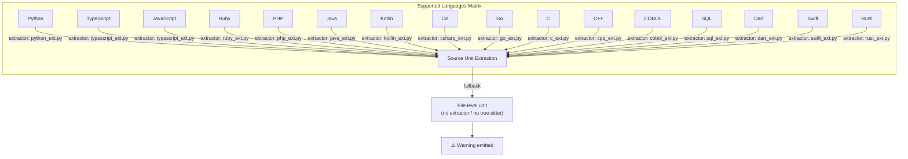

# Chapter 6: Compatibility (互換性)

本章では specback が対応する言語・ランタイム・依存関係・CI/CD 環境を定義する。specback は AI コーディングエージェント（OpenCode, Claude Code, Codex CLI, GitHub Copilot, Cursor）上で動作するスキルであり、かつ任意の言語で書かれたコードベースを解析の対象とする。したがって互換性には **ホストエージェント互換性**、**解析対象言語互換性**、**依存関係互換性** の三軸が存在する。

ホストエージェントは specback を実行するランタイムであり、各エージェントが提供するツールセットによって specback の全機能が利用可能かどうかが決まる。解析対象言語は specback がコードベースから読み取る言語であり、ファイル拡張子とフレームワークマニフェストの二段階で識別される。依存関係互換性は specback 自身が動作に必要とするサードパーティライブラリの有無とバージョンに関する軸であり、コア機能は Python 標準ライブラリのみで動作する一方、精密抽出には tree-sitter 系パッケージが任意で利用される。

---

## 6.1 対応言語 / ランタイム（ホストエージェント）

specback のスキル自体は `install.sh` により各エージェントのスキルディレクトリに配置される。以下のエージェントがインストール対象として明示的にサポートされている [REF: install.sh:88-97]。

| エージェント | 最小バージョン | 対応状況 | インストール先（user） | インストール先（project） |
|-------------|--------------|---------|---------------------|------------------------|
| Python（ランタイム） | 3.8+ | active | — | — |
| OpenCode | 1.x | active | `~/.opencode/skills/specback` | `.opencode/skills/specback` |
| Claude Code | latest | active | `~/.claude/skills/specback` | `.claude/skills/specback` |
| Codex CLI | latest | active | `~/.codex/skills/specback` | `.codex/skills/specback` |
| GitHub Copilot | latest | active | `~/.copilot/skills/specback` | `.github/skills/specback` |
| Cursor | latest | active | `~/.cursor/skills/specback` | `.cursor/skills/specback` |
| Other (.agents/skills/) | — | experimental | `~/.agents/skills/specback` | `.agents/skills/specback` |

各エージェントのインストールパスは `install.sh` の `USER_PATHS()` および `PROJ_PATHS()` 関数で定義されている [REF: install.sh:115-139]。インストーラは `--agent` フラグで対象を指定し、`--level` でユーザー全体またはプロジェクトローカルを選択できる [REF: install.sh:36-85]。ユーザーレベルのインストールは `~/.{agent}/skills/specback/` に配置され、全プロジェクトで利用可能になる。プロジェクトレベルのインストールはリポジトリルートの `.{agent}/skills/specback/` に配置され、チームメンバーと共有される。`--level both` を指定すると両方にインストールされ、ユーザーレベルが優先される。

インストーラは `install_skill()` 関数で `cp -r` によりスキルファイルをコピーする [REF: install.sh:155-156]。`--dry-run` フラグを指定すると実際のコピーは行わず、インストール予定のパスのみを表示する。`--install-deps` フラグはコピー後に `pip install -r requirements.txt` を実行し、tree-sitter 文法パッケージを導入する [REF: install.sh:160-175]。

```bash
# インストール例
./install.sh --agent claude,opencode --level both
./install.sh --agent all --level project
./install.sh --agent copilot --level user --dry-run
```

---

## 6.2 依存関係

specback のコアスクリプトは **Python 標準ライブラリのみで動作する**。以下の依存関係はすべて optional であり、欠落時はファイルレベルのフォールバックユニットを生成する [REF: requirements.txt:1-8]。

| ライブラリ | バージョン | 目的 | 必須/任意 |
|-----------|----------|------|---------|
| `@opencode-ai/plugin` | 1.18.9 | OpenCode プラグイン統合 | optional |
| `tree-sitter` (Python) | — | 精密ソースコード解析（ast ベース抽出） | optional |
| `tree-sitter-python` | — | Python 文法パーサー | optional |
| `tree-sitter-typescript` | — | TypeScript/JavaScript 文法パーサー | optional |
| `tree-sitter-ruby` | — | Ruby 文法パーサー | optional |
| `tree-sitter-php` | — | PHP 文法パーサー | optional |
| `tree-sitter-java` | — | Java 文法パーサー | optional |
| `tree-sitter-c-sharp` | — | C# 文法パーサー | optional |
| `tree-sitter-go` | — | Go 文法パーサー | optional |
| `tree-sitter-kotlin` | — | Kotlin 文法パーサー | optional |
| `tree-sitter-c` | — | C 文法パーサー | optional |
| `tree-sitter-cpp` | — | C++ 文法パーサー | optional |
| `tree-sitter-dart` | — | Dart 文法パーサー | optional |
| `tree-sitter-swift` | — | Swift 文法パーサー | optional |
| `tree-sitter-rust` | — | Rust 文法パーサー | optional |

`@opencode-ai/plugin` は OpenCode のスキル定義で参照される [REF: package.json:2-4]。`tree-sitter` 系は `requirements.txt` で管理され、`install.sh --install-deps` または `pip install -r requirements.txt` で導入する [REF: install.sh:160-175]。

### 6.2.1 依存関係ツリー

specback の依存関係は三層構造を持つ。最下層は Python 標準ライブラリのみで構成され、すべてのスクリプトが必須として依存する。中間層は tree-sitter コアライブラリであり、AST ベースの精密抽出を提供する。最上層は各言語の tree-sitter 文法パッケージであり、各 extractor が対応言語のパースに使用する。

extractor が tree-sitter なしで呼び出された場合、`prescan()` は空の context を返し、`extract()` は単一のファイルレベルフォールバックユニットを生成する。この動作は `_file_level_unit()` 関数で実装され、`kind` は `{language}_file`、`role` は `module`、`tier` は `macro` となる [REF: pipeline.py:43-57]。この fallback チェーンにより、tree-sitter が部分的にしかインストールされていない環境でも、インストール済み言語の抽出精度は維持される。

依存関係は以下の階層構造を持つ：

```mermaid
graph TD
    subgraph "Core（必須）"
        Python38["Python 3.8+ stdlib"]
    end
    subgraph "Optional"
        TS["tree-sitter"]
        TSPython["tree-sitter-python"]
        TSTS["tree-sitter-typescript"]
        TSRuby["tree-sitter-ruby"]
        TSPHP["tree-sitter-php"]
        TSJava["tree-sitter-java"]
        TSCSharp["tree-sitter-c-sharp"]
        TSGo["tree-sitter-go"]
        TSKotlin["tree-sitter-kotlin"]
        TSC["tree-sitter-c"]
        TSCPP["tree-sitter-cpp"]
        TSDart["tree-sitter-dart"]
        TSSwift["tree-sitter-swift"]
        TSRust["tree-sitter-rust"]
    end
    subgraph "Extractors"
        PythonExt["python_ext.py"]
        TSExt["typescript_ext.py"]
        RubyExt["ruby_ext.py"]
        PHPExt["php_ext.py"]
        JavaExt["java_ext.py"]
        CSharpExt["csharp_ext.py"]
        GoExt["go_ext.py"]
        KotlinExt["kotlin_ext.py"]
        CExt["c_ext.py"]
        CPPExt["cpp_ext.py"]
        DartExt["dart_ext.py"]
        SwiftExt["swift_ext.py"]
        RustExt["rust_ext.py"]
    end
    PythonExt -->|uses| Python38
    PythonExt -.->|optional| TSPython
    PythonExt -.->|optional| TS
    TSExt -.->|optional| TSTS
    TSExt -.->|optional| TS
    RubyExt -.->|optional| TSRuby
    RubyExt -.->|optional| TS
    PHPExt -.->|optional| TSPHP
    PHPExt -.->|optional| TS
    JavaExt -.->|optional| TSJava
    JavaExt -.->|optional| TS
    CSharpExt -.->|optional| TSCSharp
    CSharpExt -.->|optional| TS
    GoExt -.->|optional| TSGo
    GoExt -.->|optional| TS
    KotlinExt -.->|optional| TSKotlin
    KotlinExt -.->|optional| TS
    CExt -.->|optional| TSC
    CExt -.->|optional| TS
    CPPExt -.->|optional| TSCPP
    CPPExt -.->|optional| TS
    DartExt -.->|optional| TSDart
    DartExt -.->|optional| TS
    SwiftExt -.->|optional| TSSwift
    SwiftExt -.->|optional| TS
    RustExt -.->|optional| TSRust
    RustExt -.->|optional| TS
    Pipeline["pipeline.py"] -->|imports| Python38
    Pipeline -->|imports| Python38
```



tree-sitter がない場合、`source_map_v2` パイプラインは全スクリプトが動作した上でファイルレベルのフォールバックユニットを生成し、警告を発する [REF: pipeline.py:86-94]。extractor の自動ロード機構は各言語モジュールのインポートを試行し、tree-sitter 不足により失敗したモジュールはレジストリに登録されず、フォールバック動作に切り替わる [REF: extractors/__init__.py:71-85]。

---

## 6.3 対応言語（解析対象コードベース）

specback の source map v2 はファイル拡張子ベースの言語分類 (`LANG_BY_EXT`) とフレームワーク検出 (`detect_frameworks`) の二段階で対象コードベースの言語を特定する [REF: detect.py:19-35]。

### 6.3.1 拡張子ベース分類

以下は `source_map_v2/detect.py` の `LANG_BY_EXT` 辞書に登録されている全言語である [REF: detect.py:19-35]。各言語に対して extractor の実装状況と tree-sitter 文法の提供状況を示す。

| 言語 | 拡張子 | extractor 実装 | tree-sitter 文法 | ステータス |
|------|--------|---------------|-----------------|-----------|
| Python | `.py` | `python_ext.py` | `tree-sitter-python` | active（M3 target） |
| TypeScript | `.ts`, `.tsx` | `typescript_ext.py` | `tree-sitter-typescript` | active（M2 target） |
| JavaScript | `.js`, `.jsx`, `.mjs`, `.cjs` | `typescript_ext.py` | `tree-sitter-typescript` | active |
| Ruby | `.rb` | `ruby_ext.py` | `tree-sitter-ruby` | active |
| PHP | `.php` | `php_ext.py` | `tree-sitter-php` | active |
| Java | `.java` | `java_ext.py` | `tree-sitter-java` | active |
| Kotlin | `.kt`, `.kts` | `kotlin_ext.py` | `tree-sitter-kotlin` | active |
| C# | `.cs` | `csharp_ext.py` | `tree-sitter-c-sharp` | active |
| Go | `.go` | `go_ext.py` | `tree-sitter-go` | active |
| C | `.c`, `.h` | `c_ext.py` | `tree-sitter-c` | active |
| C++ | `.cpp`, `.hpp`, `.cxx`, `.cc` | `cpp_ext.py` | `tree-sitter-cpp` | active |
| COBOL | `.cob`, `.cbl`, `.cpy` | `cobol_ext.py` | なし（レガシーファイル対応） | active |
| SQL | `.sql` | `sql_ext.py` | なし（レガシーファイル対応） | active |
| Dart | `.dart` | `dart_ext.py` | `tree-sitter-dart` | active |
| Swift | `.swift` | `swift_ext.py` | `tree-sitter-swift` | active |
| Rust | `.rs` | `rust_ext.py` | `tree-sitter-rust` | active |

COBOL と SQL は tree-sitter 文法を提供せず、常にファイルレベルのフォールバックユニットとして抽出される。これは両言語に対して tree-sitter コミュニティの文法が未成熟または存在しないためである。これらの言語の extractor は依然として存在し、`pipeline.py` から呼び出されるが、tree-sitter を使用した AST 解析を行わず、ファイル全体を単一のモジュール単位として登録する。

各 extractor の実装状況は `extractors/__init__.py` の `_autoload()` 関数で管理される。同関数は全言語の extractor モジュールを順次インポートしようと試み、失敗したものは静かにスキップする [REF: extractors/__init__.py:71-85]。ある言語の extractor が未実装の場合（将来追加予定の言語など）、その言語のファイルはパイプラインの Layer 1（detect.py）では認識されるが、Layer 2（extractors）では処理されず、結果的にファイルレベルのフォールバックユニットが生成される [REF: pipeline.py:86-94]。

各言語に対応する extractor は `source_map_v2/extractors/` ディレクトリに実装されている [REF: extractors/__init__.py:1-88]。extractor は `Extractor` 抽象基底クラスを継承し、`prescan()` および `extract()` メソッドを実装する [REF: extractors/__init__.py:21-49]。

`prescan()` メソッドは同一言語の全ファイルを事前スキャンするためのオプショナルなパスであり、たとえば Python のクラス継承関係を解決するために使用される。`extract()` メソッドは一ファイルを受け取り、`SourceUnit` オブジェクトのリストを返す。各 `SourceUnit` は `role` と `kind` を持ち、`kind` は `taxonomy.py` の `register_kind()` で事前に登録されていなければならない [REF: extractors/__init__.py:31-48]。

`kind` の登録は `taxonomy.py` の `_KIND_REGISTRY` 辞書で一元管理される。各 extractor はモジュールインポート時に `register_kind()` を呼び出して kind を role と tier に紐付ける。同一 kind が異なる role に再登録されると `TaxonomyError` が発生し、設計上のドリフトを早期に検出する [REF: taxonomy.py:81-96]。この仕組みにより全言語の kind 定義が一元管理され、言語間の一貫性が保証される。

```python
# detect.py から抜粋 — 言語分類の単一情報源
LANG_BY_EXT: dict[str, str] = {
    ".rb": "ruby",
    ".py": "python",
    ".js": "javascript", ".jsx": "javascript", ".mjs": "javascript", ".cjs": "javascript",
    ".ts": "typescript", ".tsx": "typescript",
    ".php": "php",
    ".java": "java", ".kt": "kotlin", ".kts": "kotlin",
    ".cs": "csharp",
    ".go": "go",
    ".c": "c", ".h": "c",
    ".cpp": "cpp", ".hpp": "cpp", ".cxx": "cpp", ".cc": "cpp",
    ".cob": "cobol", ".cbl": "cobol", ".cpy": "cobol",
    ".sql": "sql",
    ".dart": "dart",
    ".swift": "swift",
    ".rs": "rust",
}
```
[REF: detect.py:19-35]

### 6.3.2 フレームワーク検出

`detect_frameworks()` はプロジェクトルートのマニフェストファイルをスキャンし、フレームワークヒントを生成する [REF: detect.py:79-165]。対応するフレームワーク一覧:

| 言語 | 検出可能なフレームワーク | 検出トリガー | 信頼度 |
|------|------------------------|-------------|--------|
| Python | FastAPI, Django, Flask, Celery | `requirements.txt` / `pyproject.toml` / `manage.py` | high |
| TypeScript/JavaScript | Next.js, NestJS, Express, Fastify, Hono, React, Vue, Expo | `package.json` の dependencies | high |
| Ruby | Ruby on Rails | `config/routes.rb` または `bin/rails` | high |
| PHP | Laravel, Symfony, CakePHP | `composer.json` | high |
| Java/Kotlin | Spring Boot, Ktor, Android | `pom.xml` / `build.gradle(.kts)` | high/medium |
| C# | ASP.NET Core | `.csproj` の AspNetCore 参照 | high |
| Go | Go (mod) | `go.mod` の存在 | medium |

各 language/framework の検出は、対応するマニフェスト内の特定トークンでトリガーされる。たとえば Python の場合は FastAPI が `requirements.txt` または `pyproject.toml` 内の `"fastapi"` 文字列で検出され、Django は加えて `manage.py` 内の Django 参照で確認される [REF: detect.py:99-116]。TypeScript/JavaScript のフレームワーク検出では `package.json` の `dependencies` を走査し、`"next"`, `"@nestjs/core"`, `"express"` などの既知パッケージ名と照合する [REF: detect.py:83-97]。

PHP のフレームワーク検出は `composer.json` 内のパッケージ名（`"laravel/framework"`, `"symfony/"`, `"cakephp/"`）で判定される [REF: detect.py:122-129]。Java/Kotlin は `pom.xml` または `build.gradle(.kts)` 内の `"spring-boot"` または `"ktor"` の存在で検出され、Android プロジェクトは `build.gradle.kts` 内の `"com.android.application"` または `AndroidManifest.xml` の存在で検出される [REF: detect.py:131-153]。C# の ASP.NET Core 検出は `.csproj` ファイルを再帰的に走査し、`"Microsoft.AspNetCore"` の参照有無を確認する [REF: detect.py:155-159]。Go の検出は最も単純で、`go.mod` の存在のみを確認する [REF: detect.py:161-163]。

フレームワーク検出の結果は `hints` リストとして `SourceMap.detected_frameworks` フィールドに格納される。各ヒントには `lang`, `framework`, `confidence`（high/medium/low）, `evidence`（検出理由の説明文）が含まれる [REF: detect.py:75-76]。`framework_for_language()` 関数はこのリストから最も信頼度の高いヒントを選択し、各言語の extractor にフレームワークコンテキストとして渡す [REF: detect.py:168-175]。

フレームワーク検出は `find_project_root()` 関数によりプロジェクトルートの特定から始まる。この関数は対象パスから上位へ最大 8 階層まで `.git` や `package.json` などのルートマーカーを探す [REF: detect.py:50-65]。これにより、ユーザーがサブディレクトリを `--target` に指定した場合でも、マニフェストが上位ディレクトリにあるプロジェクトを正しく検出できる。

```python
# detect_frameworks のシグネチャと戻り値の例
def detect_frameworks(root: Path) -> list[dict[str, Any]]:
    # 戻り値例:
    # [{"lang": "python", "framework": "fastapi",
    #   "confidence": "high", "evidence": "fastapi in requirements.txt"}]
    ...
```
[REF: detect.py:79-165]

### 6.3.3 言語マトリクス（Mermaid）



---

## 6.4 CI/CD 互換性

specback の CI パイプラインは GitHub Actions で構成される [REF: ci.yml:1-83]。

| CI 機能 | 使用ツール | 説明 |
|---------|-----------|------|
| テスト実行 | pytest | `scripts/tests/` および `source_map_v2/tests/` の全テスト |
| 型チェック | mypy | advisory（警告は非ブロッキング） |
| 秘密情報スキャン | gitleaks | PR 作成時に自動実行 |
| スキル構文チェック | bash -n | pre-commit / pre-push フックの構文検証 |
| スモークテスト | Python import | `source_map_v2` モジュールのインポート + `pytest --collect-only` |

CI は Python 3.11 および 3.12 のマトリックスで動作する [REF: ci.yml:16-17]。このマトリックスは `fail-fast: false` に設定されており、一方のバージョンで失敗しても他方の実行は継続される [REF: ci.yml:15]。

CI パイプラインの各ステップは以下の順序で実行される：最初に gitleaks による秘密情報スキャン、次に Python のセットアップと依存関係インストール、git フックの構文検証、pytest によるテスト実行、mypy による型チェック（advisory）、source_map_v2 のインポートスモークテスト、そして最後に pytest collect-only によるテスト収集確認 [REF: ci.yml:19-83]。この順序により、秘密情報漏洩やビルドエラーを早期に検出し、テスト失敗のフィードバックサイクルを短縮している。

```yaml
# ci.yml から抜粋
strategy:
  matrix:
    python-version: ["3.11", "3.12"]
```

[REF: ci.yml:16-17]

specback のインストールスクリプト (`install.sh`) は GitHub Actions 内でも使用可能であり、`--install-deps` フラグで tree-sitter 依存関係をまとめてインストールできる。CI では `pip install -r skills/specback/scripts/requirements.txt` で依存関係を導入する [REF: ci.yml:41-45]。

GitHub Actions のワークフローは Pull Request が `main` ブランチに対して作成された場合にのみトリガーされる [REF: ci.yml:3-5]。`concurrency` 設定により同じ PR に対する複数の実行はキャンセルされ、最新の実行のみが完了する [REF: ci.yml:7-9]。これにより CI リソースの無駄を防ぐ。

specback のテストスイートは二つのディレクトリに分かれている。`scripts/tests/` にはスタンドアロンスクリプト（coverage-check.py, fix-refs.py など）のテストが含まれ、`source_map_v2/tests/` には source map パイプラインのテストが含まれる。両者は CI 内で別々の pytest 実行として走る [REF: ci.yml:53-59]。各テストスイートは `-v --tb=short` フラグで詳細度を抑えた出力を行う。

```bash
# CI 内でのインストール例
pip install -r skills/specback/scripts/requirements.txt
```

---

## 6.5 バージョン互換性ポリシー

| コンポーネント | ポリシー |
|--------------|---------|
| source-map schema | 0.1.0 → 0.2.0: 後方互換性維持（新フィールド追加のみ、既存フィールドの削除・変更なし）[REF: model.py:3-10] |
| ロールタクソノミー | 新ロール追加のみ：既存ロールの削除・変更は行われない [REF: taxonomy.py:37-60] |
| Python | 3.8+（標準ライブラリのみの動作保証） |
| tree-sitter パーサー | 各言語の最新安定版に対応；バージョン固定なし |

### 6.5.1 source-map.json スキーマ後方互換性

source-map schema 0.2.0 は 0.1.0 との後方互換性を明示的に宣言している。`IdFactory` は SRC-NNNN 形式の ID を生成し、フォーマットは v0.1.0 から変更されていない [REF: model.py:118-126]。この互換性ポリシーにより、バージョンアップ後も既存の source-map.json を読み取るコンシューマ（build-traceability.py や coverage-check.py など）は修正なしで動作し続ける。

0.1.0 から 0.2.0 への移行で追加されたフィールド：

| 追加フィールド | 所属 | 目的 |
|--------------|------|------|
| `language` | SourceUnit | 言語識別子（`"python"`, `"typescript"` 等） |
| `role` | SourceUnit | ロールタクソノミーによる型付け |
| `framework` | SourceUnit | 検出されたフレームワーク名 |
| `tier` | SourceUnit | macro/middle/micro の粒度区分 |
| `endpoint` | SourceUnit | HTTP エンドポイントメタデータ（role=endpoint 時のみ） |
| `detected_frameworks` | SourceMap トップレベル | プロジェクト全体のフレームワーク検出結果 |
| `warnings` | SourceMap トップレベル | パイプライン実行中の警告メッセージ |
| `stats.by_role` | stats | ロール別のユニット数 |
| `stats.by_language` | stats | 言語別のユニット数 |

既存フィールド（`id`, `path`, `line_range`, `kind`, `name`, `signature`, `fingerprint`, `stats.files_scanned`）は削除・変更されておらず、0.1.0 用に書かれたコンシューマは 0.2.0 の出力を問題なく読める [REF: model.py:3-10]。

`SourceMap.to_dict()` のシリアライズ形式は `schema_version` フィールドをトップレベルに含むため、コンシューマはバージョン文字列で処理を分岐できる [REF: model.py:106-115]。`SourceUnit.validate()` はロールと tier の組み立て契約を施行し、不正なデータが map に含まれることを防ぐ [REF: model.py:43-52]。

### 6.5.2 Python バージョン要件

specback のスクリプトスイートは Python バージョンに関して以下の階層要件を持つ：

| レイヤー | 最小 Python | 理由 | 該当ファイル |
|---------|-----------|------|-------------|
| コア source_map_v2 モジュール | 3.8+ | `from __future__ import annotations` + 標準ライブラリのみ | `model.py`, `detect.py`, `taxonomy.py`, `pipeline.py`, `extractors/__init__.py` |
| スタンドアロンスクリプト | 3.10+ | `str | None` 等の PEP 604 ユニオン型記法を使用 | `coverage-check.py`, `snapshot-hashes.py`, `detect-drift.py`, `change-spec.py`, `fix-refs.py` |
| CI マトリックス | 3.11 / 3.12 | GitHub Actions の ubuntu-latest 上でテスト | `.github/workflows/ci.yml` |

`coverage-check.py` や `fix-refs.py` などのスタンドアロンスクリプトは `str | None` などの PEP 604 記法を使用しているため、Python 3.10 以上が必要である [REF: coverage-check.py:58-66]。一方、`source_map_v2` パッケージのコアモジュールは `from __future__ import annotations` と typing モジュールを用いて 3.8+ との互換性を維持している [REF: model.py:12-17]。

この分割には二つの意図がある。第一に、source_map_v2 をライブラリとして利用する外部プロジェクトが古い Python バージョンに縛られることを防ぐ。第二に、スタンドアロンスクリプトがモダンな型構文を享受することで、型チェッカー（mypy）の精度を向上させる。CI の mypy ステップは advisory として実行され、警告が発生してもブロッキングしない [REF: ci.yml:61-66]。

`install.sh` 自身は bash スクリプトであり、Python バージョンに依存しない。ただし `--install-deps` フラグを使用する場合、システムの `pip` が requirements.txt を解決できるバージョンである必要がある。`install.sh` は Python のバージョンチェックを行わず、`pip install` が失敗した場合もエラーを表示するにとどめる [REF: install.sh:160-175]。

開発者が specback をローカルで実行する場合、使用する Python バージョンは実行するスクリプトに応じて選択する。source_map_v2 のビルドには Python 3.8 以上、スタンドアロンスクリプトの実行には Python 3.10 以上が必要である。最も安全な選択はプロジェクトの CI が使用する Python 3.11 以上である。

### 6.5.3 tree-sitter バージョン互換性

tree-sitter 系依存関係は `requirements.txt` でバージョン固定なしで宣言されている [REF: requirements.txt:1-23]。これは以下の理由による：

- tree-sitter Python バインディングはセマンティックバージョニングに従い、マイナー/パッチ内の後方互換性が保証されている
- 各言語文法パッケージは対応する tree-sitter コアライブラリのバージョンと同期してリリースされる
- 依存関係の更新は CI の `pip install` ステップで検証される [REF: ci.yml:41-45]

tree-sitter コアライブラリと言語文法パッケージの間には暗黙のバージョン依存関係が存在する。たとえば `tree-sitter-python` の特定バージョンは `tree-sitter>=0.20,<0.22` に依存する場合がある。`requirements.txt` はこの制約を明示せず、pip の依存関係解決に委ねている。競合が発生した場合、`pip install` が失敗し、CI の smoke test で検出される。

extractor の自動ロード機構は `_autoload()` 関数で実装され、各言語モジュールのインポートを `try/except` でラップしている。これにより特定の tree-sitter 文法がインストールされていなくても、他の言語の抽出は正常に動作する [REF: extractors/__init__.py:71-85]。

tree-sitter が部分的にインストールされた状態では、インストール済み言語は AST ベースの精密抽出を行い、未インストール言語はファイルレベルフォールバックに切り替わる。この混合状態は specback の設計上許容されており、たとえば Python と TypeScript のみ tree-sitter が利用可能で、他言語がフォールバックする構成でもパイプラインは正常に完了する。警告は `SourceMap.warnings` リストに蓄積され、出力 JSON に含まれる [REF: pipeline.py:86-94]。

```python
# extractors/__init__.py から抜粋 — フォールセーフな自動ロード
for mod in ("c_ext", "cpp_ext", "python_ext", "typescript_ext", ...):
    try:
        __import__(f"{__name__}.{mod}")
    except Exception:
        pass  # tree-sitter 不足 = その言語はスキップ
```
[REF: extractors/__init__.py:78-85]

---

## 6.6 非互換性と制限

1. **tree-sitter 非インストール時の精度低下**: tree-sitter がない場合、全 extractor はファイルレベルのフォールバックユニットしか生成できず、クラス・関数・エンドポイントなどの内部構造は抽出されない [REF: pipeline.py:86-94]。
2. **extractor 未実装言語**: `LANG_BY_EXT` に登録されていない拡張子（`.tex`, `.yaml`, `.md` など）は `language_for_path()` が `None` を返し、スキャン対象から除外される [REF: detect.py:38-39]。
3. **フレームワーク検出のベストエフォート**: マニフェストを持たないプロジェクトやカスタムフレームワークは検出されず、フレームワークヒントなしで抽出が行われる [REF: detect.py:7-10]。
4. **CI は GitHub Actions 専用**: 現時点では GitLab CI, CircleCI, Jenkins 等のパイプライン定義は同梱されていない。
5. **COBOL / SQL は常にフォールバック**: tree-sitter 文法が存在しないため、これらの言語は常にファイルレベルの単位として抽出される。関数やテーブル定義などの内部構造は source map に現れない。
6. **Kotlin + Spring Boot の言語判定**: `build.gradle.kts` で Kotlin と Java が混在する場合、両方の言語ヒントが生成されるが信頼度は medium となる [REF: detect.py:138-142]。これは Kotlin プロジェクトでも Java プラグインが併用されるケースがあるためである。
7. **巨大コードベースでのパフォーマンス**: `_iter_files()` は `target.rglob("*")` で全ファイルを走査するため、10万ファイルを超えるリポジトリでは走査に長時間を要する可能性がある [REF: pipeline.py:32-40]。`exclude_globs` パラメータで `node_modules` や `vendor` などの大規模ディレクトリを除外することで緩和できる。デフォルトの除外リストには `.git`, `node_modules`, `vendor`, `__pycache__`, `dist`, `build` などが含まれる [REF: pipeline.py:20-25]。カスタム除外パターンは `build_source_map(target, exclude_globs=[...])` の第二引数で上書きできる。
8. **エージェント固有の制限**: `AskUserQuestion` を提供しないエージェントでは Phase 0 の目標設定対話がスキップされ、`goal.json` の手動編集かデフォルト値で代替される。`Task` ツールがないエージェントでは sub-agent による並列調査が行えず、すべての章調査を main agent が逐次実行する [REF: chapter-investigator.md:9]。
9. **Docker / コンテナ非対応**: specback のインストールと実行はすべてホスト OS 上で行われる。コンテナ内での実行はサポート対象外であり、`install.sh` も Dockerfile も提供されていない。
10. **Windows 非対応**: `install.sh` は bash スクリプトであり、Windows のネイティブ実行はサポートされない。WSL（Windows Subsystem for Linux）上の Linux 環境であれば動作する可能性があるが、CI マトリックスも ubuntu-latest のみである。

---

## 6.7 エージェント別ツール互換性

specback のホストエージェントはそれぞれ異なるツールセットを提供する。`SKILL.md` の `allowed-tools` フィールドで specback が要求するツールを宣言している [REF: SKILL.md:4]。

| ツール | OpenCode | Claude Code | Codex CLI | GitHub Copilot | Cursor |
|--------|----------|-------------|-----------|----------------|--------|
| Read | ✅ | ✅ | ✅ | ✅ | ✅ |
| Write | ✅ | ✅ | ✅ | ✅ | ✅ |
| Edit | ✅ | ✅ | ✅ | ✅ | ✅ |
| Bash | ✅ | ✅ | ✅ | ✅ | ✅ |
| Glob | ✅ | ✅ | ✅ | ✅ | ✅ |
| Grep | ✅ | ✅ | ✅ | ✅ | ✅ |
| Task（sub-agent） | ✅ | ✅ | ✅ | ❌ | ❌ |
| AskUserQuestion | ✅ | ✅ | ❌ | ❌ | ❌ |
| WebFetch | ✅ | ❌ | ❌ | ❌ | ❌ |
| WebSearch | ✅ | ❌ | ❌ | ❌ | ❌ |

specback のコアワークフロー（Phase 0–7）はすべてこのツールセットを使用して設計されている。`Task` ツールをサポートしないエージェント（GitHub Copilot, Cursor）では Phase 3 の sub-agent 並列調査が制限され、逐次調査にフォールバックする [REF: chapter-investigator.md:9]。`AskUserQuestion` がないエージェント（Codex CLI 他）では Phase 0 の目標設定と Phase 5 の対話が制約を受ける。`WebFetch` と `WebSearch` は現在 OpenCode のみが提供しており、他のエージェントではこれらの機能を使用する Phase が存在しないか、代替手段で対応する。

各エージェントのツール提供状況は `install.sh` のインストールロジックとは独立している。インストーラは全エージェントに同一のスキルファイル群をコピーするが、実行時のツール可用性はエージェントのランタイムに依存する。そのため specback の各 Phase はツール不在を前提とした分岐ロジックを持つ。たとえば `AskUserQuestion` が利用できない場合、Phase 0 の目標設定は `goal.json` の手動編集か、あらかじめ設定されたデフォルト値で代替される。

specback は `SKILL.md` の `allowed-tools` フィールドで要求ツールを宣言し、ホストエージェントはこの宣言に従ってツールアクセスを許可する [REF: SKILL.md:4]。`allowed-tools` にリストされていないツールは specback のワークフローで使用されない。たとえば specback は Docker 操作やクラウド API 呼び出しを一切行わない。

### 6.7.1 サブエージェント互換性

`chapter-investigator` サブエージェントは以下のツールセットで動作するよう設計されている [REF: chapter-investigator.md:9]：

```yaml
# chapter-investigator.md から抜粋
tools: Read, Write, Edit, Bash, Glob, Grep
```

[REF: chapter-investigator.md:9]

これは全エージェントが共通して提供するツールのみで構成されているため、サブエージェントの章調査機能はすべての対応エージェントで同一に動作する。サブエージェントは Read でソースコードを読み、Write でチャプターファイルを作成し、Edit で修正を行い、Bash でスクリプトを実行し、Glob と Grep でファイル検索と内容検索を行う。これらの操作は Phase 3 の章調査と Phase 4 の検証で必要十分である。

各 Phase におけるツール要件は以下の通り：

| Phase | 必須ツール | 代替不可時の挙動 |
|-------|-----------|----------------|
| 0 (Setup) | AskUserQuestion, Read, Write, Bash | AskUserQuestion 不在時は goal.json 手動編集またはデフォルト |
| 1 (Recon) | Read, Write, Bash, Glob, Grep | すべての対応エージェントで利用可能 |
| 2 (WBS) | Read, Write, Bash, Task | Task 不在時は main agent が逐次実行 |
| 3 (Investigate) | Task, Read, Write, Edit, Bash, Glob, Grep | Task 不在時は逐次調査にフォールバック |
| 4 (Verify) | Read, Bash | すべての対応エージェントで利用可能 |
| 5 (Dialogue) | AskUserQuestion, Read, Write | AskUserQuestion 不在時は Phase 5 をスキップ |
| 6 (Deliver) | Read, Write, Bash | すべての対応エージェントで利用可能 |
| 7 (Drift) | Bash, Read, Glob, Grep | すべての対応エージェントで利用可能 |

この互換性マトリクスにより、specback は最もツール制約の厳しいエージェントでも最小限の機能を提供し、ツールが豊富なエージェントでは最大限の自動化を実現する。各 Phase の分岐ロジックは `state.json` の `phase` フィールドに基づいており、エージェントのツール可用性に応じた実行パスを動的に選択する。たとえば Phase 5（Dialogue）は `AskUserQuestion` が利用可能な場合のみ実行され、利用不可の場合はスキップされて Phase 6（Deliver）に進む。同様に Phase 3（Investigate）は `Task` ツールの有無により並列実行と逐次実行を切り替える。

specback の互換性設計は「最小公倍数」アプローチに基づく。最も少ないツールを提供するエージェントでもコア機能が動作し、追加ツールがあるエージェントでは拡張機能が有効になる。この設計により、specback はスキル定義の変更なしに新たなエージェントに対応できる。

specback の互換性マトリクスは今後の拡張に対して開かれている。新たな AI コーディングエージェントが登場した場合、`install.sh` の `AGENTS` 配列と対応するパス関数にエントリを追加するだけでインストール対応が完了する。実行時ツール互換性は各 Phase の分岐ロジックで吸収されるため、スキル定義の変更は原則として不要である。

まとめると、specback の互換性は三層で確保されている。インストール層では `install.sh` が全エージェントに同一のスキルファイルを配置する。実行層では各 Phase の分岐ロジックがツール不在を吸収する。データ層では source-map schema の後方互換性とロールタクソノミーの追加専用ポリシーがバージョン間の互換性を保証する。この三層構造により、specback はエージェントエコシステムの進化に対して耐性を持つ。

以上の互換性要件を満たすことで、specback は多様な実行環境で一貫した動作を提供する。

---

## Sources Read

- `install.sh` (lines 1-354)
- `skills/specback/scripts/source_map_v2/model.py` (lines 1-126)
- `skills/specback/scripts/requirements.txt` (lines 1-23)
- `skills/specback/scripts/source_map_v2/detect.py` (lines 1-175)
- `skills/specback/scripts/source_map_v2/taxonomy.py` (lines 1-122)
- `skills/specback/scripts/source_map_v2/pipeline.py` (lines 1-105)
- `skills/specback/scripts/source_map_v2/extractors/__init__.py` (lines 1-88)
- `.github/workflows/ci.yml` (lines 1-83)
- `skills/specback/SKILL.md` (lines 1-88)
- `skills/specback/scripts/coverage-check.py` (lines 1-942)
- `skills/specback/agents/chapter-investigator.md` (lines 1-162)
