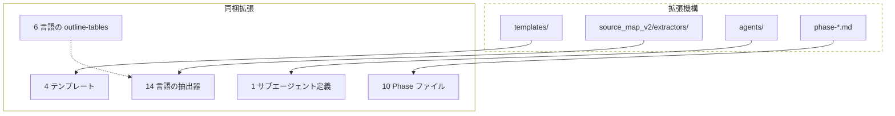
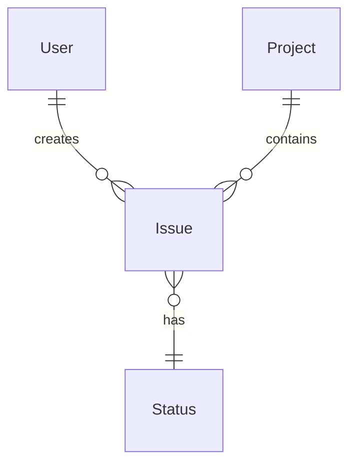
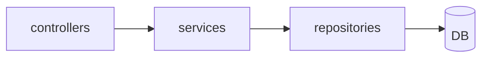
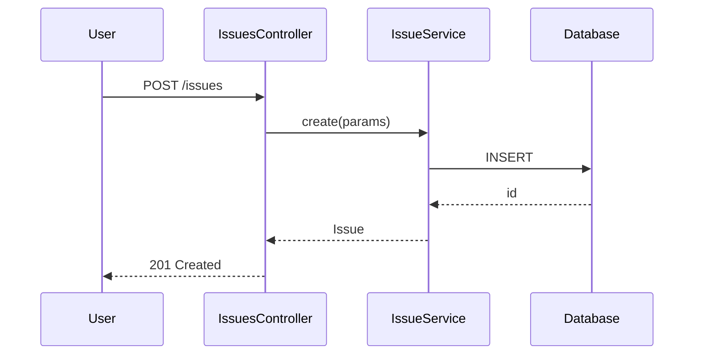

# 第9章: 拡張ポイント

## Sources Read
- `.opencode/skills/specback/SKILL.md` (lines 1-88)
- `.opencode/skills/specback/templates/web-app.md` (lines 1-232)
- `.opencode/skills/specback/references/template-catalog.md` (lines 1-234)
- `.opencode/skills/specback/references/inventory-units.md` (lines 1-633)
- `.opencode/skills/specback/references/outline-tables.md` (lines 1-340)
- `.opencode/skills/specback/subagent-behavior.md` (lines 1-63)
- `.opencode/skills/specback/agents/chapter-investigator.md` (lines 1-162)
- `.opencode/skills/specback/variants/B/README.md` (lines 1-52)
- `.opencode/skills/specback/variants/B/SKILL.phase3-stepG.md` (lines 1-80)
- `.opencode/skills/specback/variants/B/chapter-investigator.md` (lines 1-162)
- `skills/specback/scripts/source_map_v2/extractors/python_ext.py` (lines 1-219)


specback は、コードベースの性質やチームのワークフローに合わせて振る舞いを拡張できるよう設計されている。拡張はテンプレート追加、抽出器追加、サブエージェント定義、Phase 追加の 4 つの軸で行う。本章では各拡張ポイントの仕組みと、既に同梱されている拡張群を説明する。



[REF: .opencode/skills/specback/SKILL.md:55-68]

## 9.1 拡張ポイント一覧

### 9.1.1 テンプレート追加

テンプレートは `.opencode/skills/specback/templates/` 配下に YAML frontmatter を持つ Markdown ファイルとして配置される。各テンプレートは `template_name`、`template_version`、`last_updated` を frontmatter に持ち、チャプターごとに `<!-- meta: ... -->` コメントでカバー範囲を記述する [REF: .opencode/skills/specback/templates/web-app.md:1-6]。

新しいテンプレートを追加する手順は以下の通り:

1. `templates/` 以下に `{name}.md` を作成する
2. YAML frontmatter でテンプレート名とバージョンを宣言する
3. 各チャプターのアウトラインを Markdown 見出しで定義する
4. 必要に応じてチャプター冒頭に `<!-- meta: ... -->` コメントを付与する
5. `references/template-catalog.md` にエントリを追加する（ターゲット説明、選定条件、章構成を記述）[REF: .opencode/skills/specback/references/template-catalog.md:9-14]

テンプレートのバージョンは `wbs.json` に記録され、再現性を保証する [REF: .opencode/skills/specback/references/template-catalog.md:219-220]。

**将来追加が予定されているテンプレート** としては、DWH スペック、ML パイプライン、IaC (Terraform/Kubernetes)、モバイルアプリ、ブロックチェーン、ゲームデザインが挙げられている [REF: .opencode/skills/specback/references/template-catalog.md:225-233]。

#### テンプレートファイルの内部構造

各テンプレートは YAML frontmatter と Markdown 本文で構成される。frontmatter にはテンプレートのメタデータを記述する [REF: .opencode/skills/specback/references/template-catalog.md:210-217]:

```yaml
---
template_name: web-app
template_version: 0.1.0
last_updated: 2026-05-01
---
```

本文では各チャプターを Markdown 見出しで定義し、必要に応じて `<!-- meta: ... -->` コメントでカバー範囲を説明する [REF: .opencode/skills/specback/templates/web-app.md:10-15]。この構造により Phase 2 で `wbs.json` の WBS エントリと各チャプターが対応づけられる。

ユーザーが独自テンプレートを指定した場合、Phase 1 で以下の処理が行われる [REF: .opencode/skills/specback/references/template-catalog.md:164-171]:

1. テンプレートファイルのパスを取得する
2. ファイルをパースし、チャプター構成を抽出する
3. 各チャプターに meta コメントが存在するか確認する（ない場合はタイトルから推論する）
4. 抽出した構成を Phase 2 のスケルトン生成に使用する

テンプレート選定は Phase 1 で以下の決定木に従って行われる:

```
1. パッケージマニフェストが main/module/bin を定義しているか?
   → YES: アプリケーション開始コードがあるか?
        → NO:  → Library / SDK spec
        → YES: → 続行
2. ルーティング定義が存在するか?
   → YES: HTML レンダリング (views/templates) があるか?
        → YES: → Web application spec
        → NO:  → API service spec
3. スケジューラー設定 / バッチスクリプトが主か?
   → YES: → Batch-system spec
4. いずれにも該当しない/複合型
   → 複数候補を提示しユーザーに判断を仰ぐ
```

[REF: .opencode/skills/specback/references/template-catalog.md:122-142]

コンポジットプロジェクトの場合は、プライマリ/セカンダリの関係に基づいてテンプレートをマージするか、モノレポの場合はサービスごとに個別のスペックを生成する [REF: .opencode/skills/specback/references/template-catalog.md:148-160]。

### 9.1.2 新しい言語/フレームワークの抽出器

ソースコードの自動抽出は `skills/specback/scripts/source_map_v2/extractors/` 配下の言語別抽出器が担う。各抽出器は `Extractor` 基底クラスを継承し、`language` 属性と `extract()` メソッドを実装する [REF: skills/specback/scripts/source_map_v2/extractors/python_ext.py:152-215]。

抽出器は以下の規約に従う:

- `extract()` メソッドが `SourceUnit` のリストを返す
- `taxonomy.register_kind()` で emit する種別を事前登録する [REF: skills/specback/scripts/source_map_v2/extractors/python_ext.py:22-34]
- フレームワーク検出時（FastAPI / Flask / Django 等）は role を適切に振り分ける
- tree-sitter ベースのパーサーを使用し、構文上の正確な位置情報を取得する

新しい言語の抽出器を追加する手順:

1. `extractors/{lang}_ext.py` を作成する
2. `Extractor` を継承したクラスを実装する
3. 対応するテストファイルを `tests/test_{lang}_ext.py` に追加する（pre-commit hook が検査する）
4. 必要な場合は `references/inventory-units.md` に対象言語の inventory units 定義を追記する

#### 抽出器の実装パターン

`Extractor` 基底クラスは以下の責務を定義する [REF: skills/specback/scripts/source_map_v2/extractors/python_ext.py:152-215]:

- `language` — クラス属性。言語識別子（例: `"python"`）
- `extract(root_path: Path) -> list[SourceUnit]` — ソースツリーを走査し、抽出結果を返す
- `taxonomy.register_kind(name, role, tier)` — 抽出する種別と役割を事前登録する [REF: skills/specback/scripts/source_map_v2/extractors/python_ext.py:18-34]
- フレームワーク検出ロジック — FastAPI / Flask / Django 等を自動判定し `SourceUnit.role` に反映する

各 `SourceUnit` の主要フィールド:

| フィールド | 必須 | 説明 |
|-----------|------|------|
| `kind` | yes | 種別（`py_class`, `fastapi_endpoint`, `django_model` 等）|
| `name` | yes | 識別子名 |
| `file_path` | yes | ファイルパス（workspace 相対）|
| `start_line` / `end_line` | yes | ソース上の正確な行範囲 |
| `role` | no | フレームワーク上の役割（`class`, `endpoint`, `model`, `schema` 等）|
| `metadata` | no | 追加属性（decorator 情報、アノテーション等）|

抽出器は tree-sitter の文法クエリを用いて構文情報を抽出する [REF: skills/specback/scripts/source_map_v2/extractors/python_ext.py:85-110]:

```python
CLASS_QUERY = "(class_definition) @class"
FUNCTION_QUERY = "(function_definition) @function"
```

抽出結果は `source-map.json` に保存され、Phase 2 で inventory 抽出の基礎となる [REF: .opencode/skills/specback/SKILL.md:55-68]。フレームワーク特有の構造（Django の `urls.py`、Rails の `routes.rb`、Spring の `@RequestMapping` 等）は各抽出器が個別に処理する。

14言語の抽出器が同梱されている:

| ファイル | 対象言語 |
|----------|----------|
| `python_ext.py` | Python (FastAPI / Flask / Django) |
| `ruby_ext.py` | Ruby (Rails) |
| `php_ext.py` | PHP (Laravel / Symfony) |
| `java_ext.py` | Java (Spring Boot) |
| `kotlin_ext.py` | Kotlin (Spring Boot) |
| `csharp_ext.py` | C# (ASP.NET) |
| `go_ext.py` | Go |
| `rust_ext.py` | Rust |
| `c_ext.py` | C |
| `cpp_ext.py` | C++ |
| `swift_ext.py` | Swift |
| `dart_ext.py` | Dart (Flutter) |
| `typescript_ext.py` | TypeScript (Next.js / Express / Hono) |
| `cobol_ext.py` | COBOL |
| `sql_ext.py` | SQL (スキーマ抽出) |

### 9.1.3 サブエージェント定義

サブエージェントは `.opencode/skills/specback/agents/` 配下の Markdown ファイルで定義される。各定義は YAML frontmatter で `name`、`description`、`model`、`color`、`tools` を宣言する [REF: .opencode/skills/specback/agents/chapter-investigator.md:1-10]。

現在同梱されているサブエージェント:

- `chapter-investigator.md`: チャプター単位で独立したコンテキストで調査・執筆を行う汎用エージェント

Phase 3 でサブエージェントが起動される際のプロンプト構造は以下の 7 セクションから構成される [REF: .opencode/skills/specback/references/subagent-prompt.md:9-19]:

```
1. Role — 役割定義
2. Goal Context — 目標コンテキスト（reader, granularity, perspectives）
3. Chapter Assignment — チャプター割り当て（ID, title, position, output file name）
4. Inventory Items — 割り当てられた inventory 一覧
5. Task Instructions — 調査・執筆の指示
6. Output Format — 戻り値の構造（frontmatter 必須）
7. Constraints — 制約（inference と fact の区別、粒度の遵守）
```

サブエージェントは質問遭遇時に以下の決定論理で動作する [REF: .opencode/skills/specback/subagent-behavior.md:48-61]:

```python
if question.severity == "critical":
    leave the section as [BLOCKED: see Q-XXX]
    register the question in the Question Bank
    finish the rest of the chapter as much as possible
    report completion
else:
    leave a [CONFIDENCE: LOW; ASSUMED: <inference>] marker
    inferred best-effort completion of the chapter
    register the question in the Question Bank
    report completion
```

### 9.1.4 Phase 追加

各 Phase は `.opencode/skills/specback/` 直下の `phase-N-name.md` ファイルで定義される。現在 10 の Phase ファイルが存在する [REF: .opencode/skills/specback/SKILL.md:55-68]:

| Phase | Name | File |
|-------|------|------|
| 0 | Setup & Goal | `phase-0-setup.md` |
| 1 | Recon & Template | `phase-1-recon.md` |
| 2 | Plan & WBS | `phase-2-wbs.md` |
| 3 | Investigate | `phase-3-investigate.md` |
| 4 | Verify | `phase-4-verify.md` |
| 5 | Refine via Dialogue | `phase-5-dialogue.md` |
| 6 | Deliver | `phase-6-deliver.md` |
| 6.5 | Interactive Deep-Dive | `phase-6-5-deepdive.md` |
| 7 | Drift Detection | `phase-7-drift.md` / `phase-7b-ref-autofix.md` / `phase-7c-changespec.md` |

新しい Phase を追加する場合は上記の命名規則に従ったファイルを作成し、`SKILL.md` の Phase overview テーブルにエントリを追加する。Phase 間の依存関係は `state.json` の `current_phase` フィールドで管理される [REF: .opencode/skills/specback/SKILL.md:81-85]。

## 9.2 Variant B (Context Optimization Mode)

Variant B は specback の標準実行モード（モード A: メインエージェントが自らチャプター本文を執筆する）に対する代替モードである。このモードでは、各チャプターの執筆を `Task` ツール経由で独立したサブエージェントに委譲し、メインエージェントのコンテキスト消費を抑制する [REF: .opencode/skills/specback/variants/B/README.md:8-16]。

### 9.2.1 活性化条件

`goal.json` に以下のフィールドを追加することで有効化される [REF: .opencode/skills/specback/variants/B/README.md:27-37]:

```json
{
  "context_optimization_mode": "B"
}
```

Phase 3 以降、メインエージェントは `variants/B/SKILL.phase3-stepG.md` の指示に従い、`subagent_type = "chapter-investigator"` で Task を起動する。

### 9.2.2 委譲プロトコル

モード B では Phase 3 STEP G が以下の 4 ステップで進行する [REF: .opencode/skills/specback/variants/B/SKILL.phase3-stepG.md:1-4]:

1. **G-1**: チャプターごとに `chapter-investigator` サブエージェントを起動する
2. **G-2**: 戻り値から Key Findings と Detail Questions のみを抽出し、`questions.json` に追記する
3. **G-3**: `.specback/state/manifest.md` に行を追記する
4. **G-4**: チャプター本文はサブエージェントによって直接ファイルに書き込まれるため、メインエージェントは本文を会話履歴に保持しない

サブエージェントの戻り値は以下のフォーマットに従い、チャプター本文は含めない:

```
Chapter NN saved: .specback/drafts/NN-slug.md (XXX lines, NN refs, N code blocks, N mermaid)

Key findings (up to 5 bullets):
- ...

Detail questions raised (top 5; full list lives in the <!-- DETAIL_QUESTIONS --> comment):
- 1. ...

Manifest line to append:
| NN | slug | .specback/drafts/NN-slug.md | INV-xxx,INV-yyy | XXX lines | key-topic phrase |
```

[REF: .opencode/skills/specback/variants/B/chapter-investigator.md:136-156]

### 9.2.3 Manifest 管理

生成された manifest は以下の構造を持ち、Phase 4/5/6 でチャプターの概要確認に使用される [REF: .opencode/skills/specback/variants/B/SKILL.phase3-stepG.md:60-70]:

```markdown
# specback Drafts Manifest

| NN | slug | path | inventory_ids | lines | key topic |
|----|------|------|----------------|------|-----------|
| 05 | data-model | .specback/drafts/05-data-model.md | INV-012,INV-013,INV-014,INV-015 | 234 | Project / Issue / User / Role relationships |
```

### 9.2.4 トレードオフ

| 観点 | モード A (標準) | モード B (Context Optimization) |
|------|----------------|--------------------------------|
| コンテキスト消費 | チャプター本文が会話履歴に蓄積される | 本文はファイルにのみ書き込まれ、履歴には manifest のみ保持 |
| トークン使用量 | 低い（プロンプトキャッシュ共有） | 5-10 倍（サブエージェントごとに独立した LLM コンテキスト） |
| 並列実行 | インライン逐次 | 逐次（並列度 1、Task ツールの制約） |
| 品質 | チャプター間の一貫性が高い | チャプターごとに独立した推論が可能 |
| Task ツール依存 | なし | あり（利用不可時はモード A にフォールバック） |

[REF: .opencode/skills/specback/variants/B/README.md:43-51]

### 9.2.5 新規バリアントの作成手順

新たなバリアントを作成する場合、以下の手順に従う:

1. `variants/` 以下に名前付きディレクトリを作成する（例: `variants/C/`）
2. `README.md` を作成し、バリアントの目的、活性化条件、トレードオフを記述する [REF: .opencode/skills/specback/variants/B/README.md:1-17]
3. 既存の Phase をオーバーライドする場合は `SKILL.phaseN-stepX.md` ファイルを作成する [REF: .opencode/skills/specback/variants/B/SKILL.phase3-stepG.md:1-4]
4. 独自のサブエージェント定義が必要な場合は `agents/` 配下に Markdown ファイルを追加する
5. `goal.json` で活性化するためのフィールド名を決定し、README に記載する

バリアントは Phase 0 で `goal.json` のフィールドによって選択される。メインの SKILL.md は読み替えられず、各 Phase ファイル内で条件分岐によりバリアントの動作が切り替わる設計である [REF: .opencode/skills/specback/SKILL.md:55-68]。モード B と同様に、Task ツールに依存するバリアントは利用不可時にモード A へフォールバックする仕組みを設けることが推奨される。

## 9.3 既存の拡張

### 9.3.1 4 つの標準テンプレート

| テンプレート | ファイル | ターゲット |
|-------------|----------|-----------|
| Web アプリケーション | `templates/web-app.md` | 画面を通じて操作するシステム (Laravel, Django, Rails, Next.js, Spring MVC) |
| バッチシステム | `templates/batch-system.md` | スケジュール/イベント駆動のバックグラウンド処理 (cron, Airflow, Celery, Spring Batch) |
| API サービス | `templates/api-service.md` | 他システムから呼ばれるエンドポイント (REST, GraphQL, gRPC, WebSocket) |
| Library / SDK | `templates/library-sdk.md` | 他アプリケーションから消費される再利用可能コード (npm, pip, gem, NuGet) |

[REF: .opencode/skills/specback/references/template-catalog.md:9-14]

### 9.3.2 14 言語の抽出器

前述の通り、14 のプログラミング言語に対応する tree-sitter ベースの抽出器が同梱されている。各抽出器は言語固有の構文構造を解析し、`SourceUnit` のリストを生成する [REF: skills/specback/scripts/source_map_v2/extractors/python_ext.py:152-215]。抽出結果は `source-map.json` に保存され、Phase 2 の inventory 抽出の基礎となる。

### 9.3.3 6 言語の outline-tables

`references/outline-tables.md` は以下の言語/フレームワークについて、Modules / Entities / Actions / Data / Dependencies の 5 つの共通テーブル定義と抽出パターンを提供する [REF: .opencode/skills/specback/references/outline-tables.md:5-17]:

1. **Ruby / Rails** — コントローラー、モデル、ジョブ、マイグレーションの抽出パターン
2. **Python / Django** — モデル、ビュー、URLconf、シリアライザーの抽出パターン
3. **JavaScript / TypeScript / React** — コンポーネント、フック、ルート、Prisma スキーマの抽出パターン
4. **Go** — 構造体、インターフェース、ハンドラーの抽出パターン
5. **Java / Kotlin (Spring Boot)** — `@Entity`、`@RestController`、`@RequestMapping` の抽出パターン
6. **Expo / React Native** — スクリーン、ナビゲーター、ネイティブモジュールの抽出パターン

各テーブルには 🟢 VERIFIED / 🟡 INFERRED / 🔴 ASSUMED の信頼度ラベルが必須であり [REF: .opencode/skills/specback/references/outline-tables.md:21-27]、`scripts/coverage-check.py` が機械的に検証する:

- 全ファイルがテーブルのいずれかのセルにちょうど 1 回出現する
- VERIFIED 比率が KPI として表示される
- 🔴 ASSUMED 比率が 60% を超えると警告

[REF: .opencode/skills/specback/references/outline-tables.md:30-36]

また、Layer 2 として以下の Mermaid 図テンプレートが定義されている [REF: .opencode/skills/specback/references/outline-tables.md:271-316]:







## 9.4 拡張のベストプラクティス

1. **テンプレートのバージョン管理**: 各テンプレートには `template_version` フィールドを必ず記述し、`wbs.json` と整合させる [REF: .opencode/skills/specback/references/template-catalog.md:210-212]。
2. **抽出器のテスト義務**: 新規抽出器には対応するテストファイルの作成が pre-commit hook によって強制される。
3. **i18n ドキュメント**: 拡張の振る舞いを変更した場合は EN / JA 両方のドキュメントを同期する。
4. **モード B の選択的判断**: 大規模コードベース（数千ファイル以上）でのみモード B を選択する。小〜中規模ではモード A がトークン効率で優位。
5. **REF 形式の統一**: すべての `[REF: ...]` は `path:Lstart-Lend` 形式に統一する。括弧や `L` 接頭辞等のバリエーションは spec viewer のパースを破壊するため禁止 [REF: .opencode/skills/specback/agents/chapter-investigator.md:86-93]。
6. **品質ゲートの順守**: 新規拡張を追加した場合、`scripts/coverage-check.py` が機械的に検証できる形式で記述する。🔴 ASSUMED 比率が 60% を超える場合は SME 確認が必須 [REF: .opencode/skills/specback/references/outline-tables.md:30-36]。
7. **outline-tables の同期**: 抽出器を新規追加した場合は、`references/outline-tables.md` にも該当言語のテーブル定義を追記する。これにより Phase 2 の WBS 生成時に outline モードのテーブルが正しく生成される [REF: .opencode/skills/specback/references/outline-tables.md:5-17]。
8. **カスタムスクリプトの分離**: 独自の Python スクリプトを追加する場合は、`scripts/` 直下か `scripts/custom/` サブディレクトリに配置する。既存のスクリプトを直接編集せず、継承やラッパーを用いて機能拡張することを推奨する。

---

## 9.5 拡張間の互換性とガバナンス

拡張ポイントが増えるにつれ、各コンポーネント間の互換性を維持するためのガバナンスが必要となる。以下に現時点での互換性ルールを示す。

### 9.5.1 Extract API の安定契約

`Extractor` 基底クラスは `SourceUnit` のフィールドセットを公開契約として定義する [REF: skills/specback/scripts/source_map_v2/extractors/python_ext.py:152-215]。カスタム抽出器は以下の契約を順守しなければならない:

- `language` クラス属性は言語識別子として一意であること
- `extract()` の戻り値は `list[SourceUnit]` であること
- 各 `SourceUnit` の `kind` は `taxonomy.register_kind()` で事前登録済みであること [REF: skills/specback/scripts/source_map_v2/taxonomy.py:1-45]
- カスタム抽出器は既存の抽出器と同じテスト基準を満たす必要がある

### 9.5.2 Phase ファイルと state.json の依存関係

新規 Phase を追加する場合、`state-management.md` の phase→file マッピングテーブルにエントリを追加し、`SKILL.md` のフェーズ概要テーブルも同時に更新する必要がある [REF: .opencode/skills/specback/state-management.md:76-91]。この二重登録を怠ると、再開時に該当 Phase の detail file が動的ローディングされない。また、`state.json` の `current_phase` フィールドが新しい Phase 番号を正しく解釈できることも確認する必要がある。

### 9.5.3 テンプレートと抽出器の暗黙の依存

テンプレートは特定の抽出器の存在を前提としていない。例えば `web-app.md` テンプレートは Python でも Ruby でも使用できる。ただし、outline-tables は特定の言語・フレームワークに紐づいており、該当言語の抽出器が存在しない場合は `[REF: ]` が生成されない [REF: .opencode/skills/specback/references/outline-tables.md:5-17]。この非対称性は既知の設計上のトレードオフである。

### 9.5.4 拡張のテスト要件

新規拡張を追加する際は以下のテストが必須となる:

- 抽出器: `tests/test_{lang}_ext.py` を作成し、少なくとも1つのソースファイルから正しい `SourceUnit` が生成されることを検証する [REF: .githooks/pre-commit:50-58]
- テンプレート: `template-catalog.md` にエントリを追加し、選定条件と章構成を明記する [REF: .opencode/skills/specback/references/template-catalog.md:9-14]
- Phase: 追加した Phase の各ステップが期待通り動作することを手動または自動テストで確認する

### 9.5.5 バリアントの分離設計

`variants/B/` 以下のファイルは標準モードのファイルとは独立して管理される。バリアントは `goal.json` のフィールドで活性化され、標準ファイルを上書きせずに動作を変更する [REF: .opencode/skills/specback/variants/B/README.md:8-16]。この分離設計により、標準モードとバリアントモードの間でファイル競合が発生しない。

### 9.5.6 スクリプト拡張のライフサイクル

`scripts/` 配下のユーティリティスクリプトは拡張のライフサイクル管理において重要な役割を果たす。新規スクリプトを追加する場合、以下のライフサイクルに従う:

1. **開発**: `scripts/{name}.py` として作成し、スタンドアロンでテストする
2. **テスト**: `tests/test_{name}.py` を作成する（pre-commit hook が必須化）
3. **統合**: 必要に応じて Phase ファイルからスクリプト呼び出しを追加する
4. **文書化**: `README.md` または該当 Phase ファイルでスクリプトの存在と使用方法を明記する
5. **非推奨化**: 後方互換性を維持したまま、非推奨マークを追加する

このライフサイクルは specback の全コンポーネントに共通する原則であり、拡張の品質維持に寄与する [REF: .githooks/pre-commit:50-58]。

拡張のライフサイクル管理は `AGENTS.md` および `CONTRIBUTING.md` にも記載されており、コントリビュータはこれらのドキュメントに従って拡張を追加する必要がある。ライフサイクルを順守しない拡張は Phase 4 の品質ゲートで検出され、修正が要求される。

## Detail questions raised in this chapter

### Q-001 (severity: nice-to-have, category: architecture_decision)
- Question: テンプレートと抽出器の間に明示的な version 互換性チェック機構は存在するか?
- Evidence: `references/template-catalog.md` にはテンプレートバージョンの記録先 (`wbs.json`) は記述されているが、抽出器との互換性チェックには言及がない
- Inference: 現時点では暗黙の互換性に依存している可能性が高い

### Q-002 (severity: important, category: business_rule)
- Question: 14 の抽出器のうち、どの言語が本番品質と見なされ、どの言語が experimental か?
- Evidence: `python_ext.py` は FastAPI/Flask/Django のフレームワーク検出を実装しているが、`sql_ext.py` 等他の抽出器の成熟度は不明
- Inference: 全抽出器が同等の品質とは限らない; 各抽出器の `tests/` ディレクトリの有無が指標になる

<!-- DETAIL_QUESTIONS
- Q-001: テンプレートと抽出器の間に明示的な version 互換性チェック機構は存在するか?
- Q-002: 14 の抽出器のうち、どの言語が本番品質と見なされ、どの言語が experimental か?
-->
