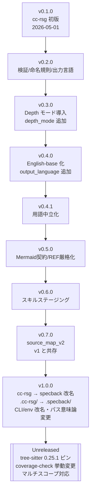

# 第10章: 移行ガイド

## Sources Read

- `CHANGELOG.md` (lines 1-end)
- `README.md` (lines 1-400)
- `skills/specback/phase-0-setup.md` (lines 99-123, 31-42)
- `skills/specback/phase-1-recon.md` (lines 55-111)
- `skills/specback/schemas/goal.schema.json` (lines 1-end)
- `skills/specback/schemas/state.schema.json` (lines 1-end)
- `skills/specback/scripts/requirements.txt` (lines 1-end)
- `skills/specback/scripts/coverage-check.py` (lines 39-51, 340-353, 464-509, 568-588)
- `install.sh` (lines 1-60)
- `install.ps1` (lines 1-30, 120-121)
- `.githooks/pre-commit` (lines 1-end)
- `.githooks/pre-push` (lines 1-end)
- `scripts/install-hooks.sh` (lines 1-30)
- `.github/workflows/ci.yml` (lines 1-40)
- `skills/specback/templates/library-sdk.md` (lines 300-326)
- `specs/13-known-constraints.md` (lines 136-160)
- `specs/01-overview.md` (lines 1-end)
- git history (`git log --oneline -45`, `git show <hash>` によるコミット内容確認)

---

## 10.1 移行の全体像とバージョン地図

specback（旧称 cc-rsg）は 2026-05-01 の v0.1.0 初版以降、約3ヶ月で v1.0.0 に到達し、その後も [Unreleased] として多数の変更が蓄積されている。本ガイドはテンプレートが定める「10.1: 旧メジャー→現行 / 10.2: 旧マイナー→現行」の2段構成 [REF: skills/specback/templates/library-sdk.md:300-326] を、実バージョン履歴に合わせて「**v0.x → v1.0.0 への移行**（10.2節）」と「**v1.0.0 → 次期リリース [Unreleased] への移行**（10.3節）」に読み替えて展開する。

バージョンと変更内容の対応は以下の通り。 [REF: CHANGELOG.md:8-51] [REF: CHANGELOG.md:53-147]

| バージョン | 日付 | 主な変更 | 移行影響度 |
|-----------|------|---------|-----------|
| v0.1.0 | 2026-05-01 | 初版 cc-rsg — Phase 1-7 パイプライン、source-map (v1)、Question Bank | — |
| v0.2.0 | 2026-06-06 | 検証スクリプト、章ファイル命名規則、Rails カタログ、出力言語選択 | 低 |
| v0.3.0 | 2026-06-08 | Depth モード (comprehensive / outline / interactive)、Phase 6.5 | 中（goal.json に `depth_mode` 追加） |
| v0.4.0 | 2026-06-09 | English-base 化、`output_language` によるバイリンガル出力 | 中（goal.json に `output_language` 追加） |
| v0.4.1 | 2026-06-11 | ランタイム依存用語の中立化 | 低 |
| v0.5.0 | 2026-06-15 | Mermaid スタイリング契約、`user_custom_deliverables`、厳格 `[REF:]` 形式 | 中 |
| v0.6.0 | 2026-06-29 | Phase 0 スキルステージング (`.specback/skill/`)、Variants/B | 低（後継 #62 で撤廃） |
| v0.7.0 | 2026-06-30 | source_map_v2（tree-sitter ベース、schema 0.2.0、9言語）— v1 と共存 | 中 |
| **v1.0.0** | 2026-07-30 | **cc-rsg → specback 改名**、状態ディレクトリ・CLI・env 変更、パス意味論変更、インストーラー刷新、フック/CI 導入 | **高（破壊的）** |
| [Unreleased] | 2026-07-30〜 | tree-sitter 0.25.1 ピン、coverage-check.py 挙動変更、警告標準化、マルチスコープ対応、JSON Schema 同梱 | 中〜高 |

[CONFIDENCE: HIGH] — 日付・内容は git history のコミット日時・メッセージと CHANGELOG の突合による。なお CHANGELOG の [Unreleased] 節には v1.0.0 リリース時点の変更（改名 #57 等）と v1.0.0 以降の変更（#61-#131 系）が混在しているため、本ガイドではコミット順（`57cb11f` = v1.0.0 リリース準備コミット）を基準に分類した。 [REF: CHANGELOG.md:8-51]



移行フロー全体は「v0.7.0 以前のスキル資産 → v1.0.0 で名前・パス・契約を刷新 → [Unreleased] で検証・依存・スコープを強化」の3段階である。以下、各段階の破壊的変更・移行手順・コード例を示す。

---

## 10.2 v0.x → v1.0.0 への移行（メジャーアップグレード）

v1.0.0 は specback 初のメジャーリリースであり、リポジトリ名・スキルディレクトリ名・状態ディレクトリ・CLI 引数・環境変数・出力パス意味論・インストーラー・開発ガバナンスを一括で刷新した。 [REF: CHANGELOG.md:33-40] [REF: README.md:316-323]

#### 10.2.1 名称変更: cc-rsg → specback

##### 破壊的変更 (Breaking changes)

- **リポジトリ名**: `nekolife1984/cc-rsg` → `nekolife1984/specback` [REF: CHANGELOG.md:33]
- **スキルディレクトリ名**: `skills/cc-rsg/` → `skills/specback/`（コミット `39a3576` にて rename、131 テスト通過を確認）
- **状態ディレクトリ**: `.cc-rsg/` → `.specback/`（Phase 0 以降の全成果物の格納先）
- **CLI 引数**: `--cc-rsg-dir` → `--specback-dir`（コミット `39a3576`。マルチスコープ時に `.specback-{name}` を渡す用途で現行でも使用 [REF: skills/specback/phase-1-recon.md:79]）
- **環境変数**: `CC_RSG_AGENT` / `CC_RSG_LEVEL` → `SPECBACK_AGENT` / `SPECBACK_LEVEL`（インストーラーのフォールバック変数として現行でも有効 [REF: install.sh:15] [REF: install.ps1:25]）
- **URL・上流同期**: `daishir0/cc-rsg` 上流同期セクション削除（完全独立化）、README 等の URL 更新（コミット `39a3576`）
- **Python 変数名**: `cc_rsg_dir` → `specback_dir`（コミット `39a3576`）
- **ネストした git サブリポジトリ** `cc-rsg/` が削除された（コミット `39a3576`）

##### 移行手順 (Migration steps)

1. リポジトリを再取得または remote URL を更新する: `git remote set-url origin https://github.com/nekolife1984/specback.git`
2. 旧スキルバンドル `skills/cc-rsg/` を `skills/specback/` にリネームする（git の rename 検出で履歴は保持される）
3. 対象プロジェクト内の旧状態ディレクトリ `.cc-rsg/` を `.specback/` にリネームする（下記コード例）
4. シェルのエイリアス・CI・タスクランナーに残る `CC_RSG_*` 環境変数と `--cc-rsg-dir` を置換する
5. カスタムスクリプトが直接参照している内部パス（`skills/cc-rsg/scripts/...`）を更新する

##### コード例

```bash
# Before (v0.7.0 以前)
export CC_RSG_AGENT=claude
export CC_RSG_LEVEL=project
python skills/cc-rsg/scripts/source-map.py --cc-rsg-dir .cc-rsg

# After (v1.0.0 以降)
export SPECBACK_AGENT=claude
export SPECBACK_LEVEL=project
python skills/specback/scripts/source-map.py --specback-dir .specback

# 状態ディレクトリ移行
mv .cc-rsg .specback
```

[CONFIDENCE: HIGH] — rename の各項目はコミット `39a3576` のメッセージ本文に列挙され、現行の install.sh / install.ps1 の env 変数名で後方確認できる。 [REF: install.sh:14-16]

#### 10.2.2 ディレクトリレイアウトと出力パスの意味論変更

##### 破壊的変更 (Breaking changes)

- **ドラフト置き場の固定**: Phase 3 の章ドラフトは `output_dir` 設定に関わらず常に `.specback/drafts/` に出力される（v0.6.0 以前は出力先連動） [REF: CHANGELOG.md:35]
- **最終成果物のパス簡素化**: 旧来の `{output_dir}/final/` サブディレクトリ方式を廃止し、最終成果物は `{output_dir}/` 直下に直接出力される [REF: CHANGELOG.md:36]
- **デフォルト維持**: デフォルト出力先は従来通り `.specback/final/`（当時の表記は `.cc-rsg/final/`）を維持し、カスタムパス指定時のみ直書きとなる [REF: CHANGELOG.md:37]

##### 移行手順 (Migration steps)

1. 既存の生成済み仕様書がある場合、旧 `{output_dir}/final/*.md` を新 `{output_dir}/*.md` に移動する
2. ドラフトは `.specback/drafts/` に集約されていることを確認する（旧レイアウトで散在したドラフトがあれば集約する）
3. 成果物パスに依存する後続処理（CI、ドキュメントリンク）を更新する

##### コード例

```bash
# Before (v0.6.0 以前): docs/specs/final/spec.md
# After (v1.0.0 以降):  docs/specs/spec.md  （drafts は常に .specback/drafts/）
mv docs/specs/final/*.md docs/specs/
rmdir docs/specs/final
```

現行の出力レイアウトは README の `.specback/` 構造節に定義されている。 [REF: README.md:116-133]

#### 10.2.3 SKILL.md の分割とランタイム用語の除去

##### 破壊的変更 (Breaking changes)

- **単一 SKILL.md → 軽量インデックス + フェーズ別ファイル**: v1.0.0 で SKILL.md は約88行のインデックスに縮小され、Phase 0-7c の詳細は `phase-*.md` に分割された（#18）。エージェントはフェーズ遷移時に該当ファイルをロードする運用となる [REF: CHANGELOG.md:21]
- **Versioning/changelog 節と License 節の SKILL.md からの削除**: 別ファイル（CHANGELOG.md / LICENSE）へ分離 [REF: CHANGELOG.md:39]
- **Claude Code 固有表現の除去**: ドキュメントとスキルから Claude Code 特有の文言が除去され、Codex CLI / OpenCode / Copilot / Cursor 等の他エージェントでも利用可能になった [REF: CHANGELOG.md:38] [REF: README.md:54]

##### 移行手順 (Migration steps)

1. 旧 SKILL.md の全文を直接参照するカスタムプロンプト・ナレッジがある場合、`phase-0-setup.md`〜`phase-7c-changespec.md` への読み替えを行う
2. 旧 SKILL.md 内の License / Versioning 節を参照する文書は CHANGELOG.md と LICENSE を参照するよう更新する
3. Claude Code 専用の指示が混在した旧バンドルを利用していた場合、v1.0.0 のバンドルで置き換える（用語が中立化されている） [REF: CHANGELOG.md:38]

#### 10.2.4 スキーマ変更: goal.json / state.json / questions.json

##### 破壊的変更 (Breaking changes)

goal.json はバージョン系列を通じてフィールドが段階的に追加されてきた。v0.x の goal.json は現行スキーマと互換性がある（追加フィールドは任意、`additionalProperties: false` のため未知フィールドのみ拒否）が、**v1.0.0 時点で必須フィールド群が確定**した。 [REF: skills/specback/schemas/goal.schema.json:71-79]

| フィールド | 追加時期 | 根拠 |
|-----------|---------|------|
| `depth_mode` | v0.3.0 | Depth モード導入 [REF: CHANGELOG.md:114] |
| `output_language` | v0.4.0 | English-base 化・バイリンガル出力 [REF: CHANGELOG.md:106] |
| `user_custom_deliverables` | v0.5.0 | カスタム成果物の強制検証 [REF: CHANGELOG.md:85] |
| `output_dir` | v1.0.0 | 出力先カスタマイズ (#10) [REF: CHANGELOG.md:25] |
| `template` | [Unreleased] | coverage-check.py のデフォルト閾値自動調整 (#83) [REF: skills/specback/schemas/goal.schema.json:65-69] |
| `multi_scope` / `scopes[]` / `current_scope` | [Unreleased] | モノレポ・マルチスコープ対応 (#106) [REF: skills/specback/phase-0-setup.md:121-123] |

##### コード例

```json
// Before (v0.2.0 頃の goal.json)
{
  "primary_reader": "maintenance_developer",
  "granularity": "detailed",
  "perspectives": ["functional_correctness"],
  "existing_docs": "none"
}

// After (v1.0.0 の goal.json) — 必須フィールド確定
{
  "output_language": "en",
  "output_dir": ".specback",
  "primary_reader": "maintenance_developer",
  "reader_action": "code_change",
  "granularity": "detailed",
  "perspectives": ["functional_correctness"],
  "existing_docs": "none",
  "user_custom_deliverables": [],
  "depth_mode": "comprehensive"
}
```

state.json は `current_phase` / `phase_progress` / `started_at` / `last_updated` を必須とし、`all_quality_gates_passed` / `session_history` を任意フィールドとして持つ。 [REF: skills/specback/schemas/state.schema.json:8-87] questions.json は `Q-\d{3}` 形式の ID と `status`（open / answered / abandoned / skipped）を中核とし、[Unreleased] でスキーマファイルが同梱された（10.3.5 参照）。 [REF: skills/specback/schemas/questions.schema.json:1-50]

##### 移行手順 (Migration steps)

1. 既存の `.specback/goal.json` を v1.0.0 スキーマに合わせて更新する（上記コード例の必須フィールドを充足させる）
2. Phase 0 を再実行すれば goal.json は自動再生成されるため、手動編集より再実行を推奨する
3. 旧バージョンの追加フィールド（例: v0.5.0 以前に存在しなかった `depth_mode`）を参照するスクリプトがある場合、未設定時のデフォルト挙動（Phase 1 末尾の自動決定）に依存するよう修正する [REF: skills/specback/phase-1-recon.md:91-98]

#### 10.2.5 インストーラーと Python 依存関係の変更

##### 破壊的変更 (Breaking changes)

- **マルチエージェントインストーラー導入**: v1.0.0 で対話式インストーラー（install.sh / install.ps1）が追加され、Claude Code / Codex CLI / OpenCode / GitHub Copilot / Cursor / Other の6種に対応 [REF: CHANGELOG.md:22] [REF: install.sh:17]
- **CLI フラグ追加**: `--agent` / `--level`（user / project / both）による非対話インストール [REF: CHANGELOG.md:17] [REF: install.sh:7-12]
- **env 変数の改名**: `CC_RSG_AGENT` / `CC_RSG_LEVEL` → `SPECBACK_AGENT` / `SPECBACK_LEVEL`（10.2.1 参照）
- **Python 依存の一元管理**: `requirements.txt` 導入と `--install-deps` オプション（#55）。ただし全スクリプトは Python 標準ライブラリのみで動作し、依存は optional（source_map_v2 の精密抽出用）という方針が確立 [REF: CHANGELOG.md:29] [REF: README.md:67-72]

##### 移行手順 (Migration steps)

1. 旧来の手動コピー運用（`.claude/skills/` への直接コピー）は引き続き可能だが、新規導入は `./install.sh` を推奨
2. source_map_v2 の言語抽出を利用する場合は `./install.sh --install-deps` で依存を導入する（Python >= 3.10、10.3.1 参照）
3. 非対話 CI 等での導入は `--agent` / `--level` フラグを使用する

##### コード例

```bash
# Before (v0.7.0 以前): 手動コピー
mkdir -p .claude/skills/ && cp -r skills/cc-rsg .claude/skills/

# After (v1.0.0 以降)
./install.sh --agent claude,opencode --level user --install-deps
# または dry-run で事前確認
./install.sh --dry-run
```

[REF: install.sh:5-15]

#### 10.2.6 Git フック・CI・開発ガバナンスの導入

v1.0.0 から以下のガバナンスが導入された。利用者（エージェント利用者）への破壊的影響はないが、**コントリビューターには必須**となる。 [REF: README.md:279-285]

- **pre-commit フック**: 新規/変更 Python スクリプトに対するテスト強制（#13）[REF: CHANGELOG.md:23] [REF: .githooks/pre-commit:21-58]
- **pre-push フック**: main への直接 push ブロック（#1）[REF: CHANGELOG.md:26] [REF: .githooks/pre-push:1-15]
- **gitleaks シークレットスキャン**: pre-commit と CI の両方に追加（#61、[Unreleased] 初頭）[REF: .githooks/pre-commit:5-19]
- **GitHub Actions CI**: pytest / mypy (advisory) / smoke import を全 PR で実行（#32）[REF: CHANGELOG.md:16] [REF: .github/workflows/ci.yml:1-25]

フックの導入は `scripts/install-hooks.sh` が行う（既存フックはバックアップの上シンボリックリンク化）。 [REF: scripts/install-hooks.sh:5-20]

##### 移行手順 (Migration steps)

1. リポジトリクローン後に `scripts/install-hooks.sh` を実行する
2. 既存の手動フックがある場合は自動バックアップ（`*.backup.<timestamp>`）を確認する
3. gitleaks 未導入環境では警告のみで続行される（`brew install gitleaks` で有効化） [REF: .githooks/pre-commit:16-19]

---

## 10.3 v1.0.0 → 次期リリース ([Unreleased]) への移行

v1.0.0 以降（コミット `d948d79` 以降、2026-07-30〜07-31）の変更は CHANGELOG の [Unreleased] 節に集約されている。特にスクリプト挙動に影響する変更が多いため、**既存の `.specback/` 成果物を持つ利用者**は以下の各項を確認すること。

#### 10.3.1 Python 依存: tree-sitter 0.25.1 ピンと Python >= 3.10

##### 破壊的変更 (Breaking changes)

- **tree-sitter コアの固定**: `tree-sitter==0.25.1` が必須ピンとなった（#125）。新世代 grammar は Language version 15 で出荷されるが、コア 0.23.x（v13-14）は `Parser()` 生成時に "Incompatible Language version 15" を投げて**エクストラクタを静かに無効化**する問題があった。0.25.1 は v14/v15 両対応かつ cp311/cp312 wheel を出荷する [REF: skills/specback/scripts/requirements.txt:10-17]
- **Python バージョン要件**: tree-sitter 0.25.1 の wheel 提供により実質 **Python >= 3.10** が source_map_v2 利用時の前提となる [REF: skills/specback/scripts/requirements.txt:17]
- **grammar 側は追従運用**: grammar 群は latest 追従とし、CI のスモークテスト（`source_map_v2/tests/test_ts_smoke.py`）が全 grammar のロードを検証して将来のドリフトを検出する [REF: skills/specback/scripts/requirements.txt:19-22]

##### 移行手順 (Migration steps)

1. `./install.sh --install-deps` を再実行、または `pip install -r skills/specback/scripts/requirements.txt` を実行する
2. Python 3.9 以前で source_map_v2 を動かしていた場合は 3.10+ へ移行する（標準ライブラリのみの運用なら 3.9 でも可）
3. インストール失敗時は install_state（missing / incompatible / import-error）の分類に従い警告が分岐するため、ログの文言で原因を切り分ける（コミット `ed82219`）

#### 10.3.2 coverage-check.py の検証挙動変更

##### 破壊的変更 (Breaking changes)

- **コードブロック行の本文カウント**: Phase 4 の本文行数ゲート（comprehensive モードの各章200行）において、コードブロック行が非空白行としてカウントされるようになった。重みは `--code-block-line-weight` で調整可能（**デフォルト 0.5**）[REF: skills/specback/scripts/coverage-check.py:51] [REF: skills/specback/scripts/coverage-check.py:340-353]
  - 実効行数 = 本文行 + int(コードブロック行 × 0.5)。カスタム成果物（`user_custom_deliverables`）にも同じ重み付けが適用される [REF: skills/specback/scripts/coverage-check.py:464-509]
- **`--target-dir-for-required` のパス制限撤廃**: 従来 `drafts` / `final` の2値のみ受け付けていたが、任意の絶対/相対パスを受け付けるようになった（#117）。`output_dir` / `target_dir` が存在しない場合は standalone パスとしてフォールバック解決する [REF: skills/specback/scripts/coverage-check.py:39]
- **テンプレート連動デフォルト閾値**: goal.json の `template` フィールドを参照し、テンプレートごとのデフォルト閾値に自動調整される（#83）[REF: skills/specback/scripts/coverage-check.py:568-588] [REF: skills/specback/schemas/goal.schema.json:65-69]

##### 移行手順 (Migration steps)

1. 旧閾値で Phase 4 を通過していた章が新判定で不合格になる場合がある（コードブロック比率が高い章ほど実効行数が増えるため、**不合格は緩和方向**）。不合格時は `--code-block-line-weight` を明示指定して再検証する
2. カスタム出力先を検証する場合は `--target-dir-for-required <任意パス>` を渡す
3. goal.json に `template` が無い場合は従来の汎用デフォルトが使われるため、既存セッションはそのまま動作する

#### 10.3.3 警告メッセージ標準の確立

##### 破壊的変更 (Breaking changes)

v0.7.0 で「未対応言語は黙って落とさず**大きな警告**を出す」方針が確立され [REF: CHANGELOG.md:60]、[Unreleased] で以下の3段階に精緻化された。

- **アクション可能なフォールバック警告（#110/#119）**: tree-sitter フォールバック時に「何が起きて・何をすればいいか」が判る警告に変更 [REF: skills/specback/scripts/source_map_v2/pipeline.py:1-30]（コミット `e5bf68d`）
- **誠実な警告（#120）**: 「grammar 欠落」と「import バグ」を区別し、空アーティファクト生成の結果も明示するようになった（コミット `446b2de`）
- **インストール失敗の分類（#125）**: `install_state` を missing / incompatible / import-error に分類し、パイプラインの警告文言を分岐（コミット `ed82219`）

##### 移行手順 (Migration steps)

1. ログ解析スクリプトが旧警告文言に依存している場合、新文言（原因分類付き）への対応を追加する
2. 「警告が出た = 何も抽出されていない」ではなく「警告の種類に応じたフォールバック動作」を前提に解釈を更新する

#### 10.3.4 マルチスコープ（モノレポ対応）

##### 破壊的変更 (Breaking changes)

- **goal.json に `multi_scope` / `scopes[]` / `current_scope` が追加**（デフォルトは `multi_scope: false` で従来動作を維持）[REF: skills/specback/phase-0-setup.md:113-123]
- **状態ディレクトリの分離**: スコープごとに `.specback-{name}/` を使用し、プロジェクトルートの `.specback/` には共有の goal.json / state.json（`current_scope` 追跡用）のみ格納 [REF: skills/specback/phase-1-recon.md:76-79]
- **スクリプト呼び出し**: `--specback-dir .specback-{name}` を渡す運用に変更 [REF: skills/specback/phase-1-recon.md:79]
- **スコープごとに異なるテンプレート可**: Phase 2 で独立検出 [REF: skills/specback/phase-1-recon.md:73]

##### 移行手順 (Migration steps)

1. モノレポを対象にしない既存利用者は**変更不要**（`multi_scope: false` のデフォルト動作）
2. モノレポ対応を有効化する場合は Phase 0 で `multi_scope: true` を選択し、Phase 1 の自動スコープ検出（`services/{name}/`, `apps/{name}/`, `packages/{name}/`（manifest 有り）, トップレベル `Dockerfile` 持ちディレクトリ）に従う [REF: skills/specback/phase-1-recon.md:58-62]
3. スコープ分割した既存 `.specback/` がある場合、`current_scope` の値に注意して resume する

#### 10.3.5 その他のスキーマ・挙動変更

| 変更 | 内容 | 根拠 |
|------|------|------|
| JSON Schema 同梱 | `schemas/goal.schema.json` / `state.schema.json` / `questions.schema.json` をバンドルに追加し、`validate-schema.py` による機械検証を実装（#82） | コミット `2be0653` [REF: skills/specback/scripts/validate-schema.py:1-20] |
| `related_source_ids` 追加 | inventory.json の InventoryItem に必須フィールド追加（#63） | コミット `1ef3293` |
| `total_files` 追加 | state.json に総ファイル数記録（depth モード決定の根拠） | [REF: skills/specback/phase-1-recon.md:92] |
| Depth モードのファイル数カウント基準 | 200ファイル閾値の判定は「ノイズディレクトリ除外後の総ファイル数」（ソースのみに限定しない）と明文化 | [REF: specs/13-known-constraints.md:138-147] |
| comprehensive モードの時間見積もり | 「hours to days」→「2-4 hours」（並列サブエージェント導入後の実測に合わせる） | [REF: skills/specback/phase-1-recon.md:94] |
| Phase 7 → Phase 5 相互作用 | ドリフト検出後の Phase 5 再実行は行わず「レポートのみ」に確定（#86） | コミット `21eabb4` |
| Active-diagram ルール | 複雑な処理を積極的に Mermaid 図で図示するルール追加（#95） | コミット `dbb5e66` |
| 新規テンプレート章 | Feature specifications 章（#90）、System design 章（#103）、Forms/Reports 章（#101）を全テンプレートに追加 | コミット `27cf2a7` / `83f5164` / `d520b33` |
| 新エクストラクタ | Kotlin（#37）、C/C++/Dart/Swift（#42）、Rust（#52）を source_map_v2 に追加 | [REF: CHANGELOG.md:12-14] |
| Knowledge Graph エクスポート | source-map.json と trace.json から JSON-LD（`knowledge-graph.jsonld`）を生成（#53） | [REF: CHANGELOG.md:15] |
| スキルステージング撤廃 | v0.6.0 の `.specback/skill/` バンドルステージングを廃止し、`.specback/.skill-path` によるパス記録に置換（#62） | [REF: CHANGELOG.md:24] |

##### 移行手順 (Migration steps)

1. v0.6.x 世代で `.specback/skill/` にステージングされた古いバンドルコピーが残っている場合は削除する（`rm -rf .specback/skill/`）
2. 新規セッションでは `.specback/.skill-path` が作成されるため、バンドルを別ディレクトリに複製する運用からはパス記録方式へ切り替える
3. `related_source_ids` 追加により、旧形式の inventory.json を読み込むカスタムツールはフィールド欠落に注意する
4. validate-schema.py を CI に組み込む場合は `--schema schemas/goal.schema.json --data-file .specback/goal.json` の形で実行する [REF: skills/specback/scripts/validate-schema.py:15-20]

---

## 10.4 過去の v0.x 内部移行の記録（v0.1.0 → v0.7.0）

v1.0.0 以前の移行はすべて**後方互換を保った追加型**であり、破壊的変更は「スキルバンドル内の規約」に限定される。参考のため各バージョンの要点を記録する。 [REF: CHANGELOG.md:101-147]

| バージョン | 主な追加・変更 | 移行時の注意点 |
|-----------|--------------|---------------|
| v0.2.0 | 章ファイル命名規則・必須3ファイル構造の強制、サブエージェント委譲、Phase 4 ループバック検証、粒度規則、Rails カタログ、フランス語対応 | 生成ドラフトのファイル名が規約準拠になる（`NN-*.md`） [REF: CHANGELOG.md:122-131] |
| v0.3.0 | Depth モード3種、Phase 6.5、outline-tables.md | goal.json に `depth_mode` が追加される [REF: CHANGELOG.md:114-116] |
| v0.4.0 | **English-base 化**、`output_language` によるバイリンガル出力、README 英語ファースト化 | スキルバンドル本体（SKILL.md / templates / references / scripts）が英語基準になり、日本語は出力言語としてのみ残る [REF: CHANGELOG.md:105-108] |
| v0.4.1 | ランタイム固有用語の中立化（standalone 利用のため） | プロンプト内のエージェント名等が汎用語に置換される [REF: CHANGELOG.md:99] |
| v0.5.0 | Mermaid スタイリング契約、`user_custom_deliverables` 強制、厳格 `[REF: path:line]` 形式（先頭 L なし）、Phase 5 スキップ防止、Variants/B | 生成ドラフトの REF 形式が `[REF: path:line]` に統一される [REF: CHANGELOG.md:84-89] |
| v0.6.0 | Phase 0 の `.specback/skill/` ステージング、REF プレースホルダ整合 | ステージングは #62 で撤廃されたため移行しないこと [REF: CHANGELOG.md:71-73] |
| v0.7.0 | **source_map_v2**（schema 0.2.0、tree-sitter、9言語、フレームワーク検出）、未対応言語の大声警告 | v1 `source-map.py` と共存・後方互換。Phase 2 は v1 の代わりに v2 を使用可能 [REF: CHANGELOG.md:57-61] |

v0.7.0 の source_map_v2 は v1.0.0 で Phase 2 の inventory.json に役割型付けとして接続された（#36）ため、v0.7.0 時点の「v2 出力を直接参照する」独自運用は v1.0.0 以降はインベントリ経由に読み替えること。 [REF: CHANGELOG.md:34]

---

## 10.5 移行チェックリスト

以下のチェックリストで移行完了を確認できる。

| # | 確認項目 | 対応バージョン |
|---|---------|---------------|
| 1 | リポジトリ URL・リモート名が `nekolife1984/specback` である | v1.0.0 |
| 2 | `skills/cc-rsg/` の残存参照がない（`grep -rn "cc-rsg"` で CHANGELOG と履歴以外ヒットしない） | v1.0.0 |
| 3 | `.cc-rsg/` が `.specback/` に移行済み（または新規作成） | v1.0.0 |
| 4 | `CC_RSG_*` 環境変数・`--cc-rsg-dir` が `SPECBACK_*` / `--specback-dir` に置換済み | v1.0.0 |
| 5 | goal.json が現行スキーマの必須フィールドを満たす（validate-schema.py で検証可能） | v1.0.0 / [Unreleased] |
| 6 | 旧 `{output_dir}/final/` の成果物が `{output_dir}/` 直下へ移動済み | v1.0.0 |
| 7 | `install.sh --install-deps` で tree-sitter 0.25.1 が導入され、Python が 3.10+ | [Unreleased] |
| 8 | `.specback/skill/` の旧ステージングコピーが削除済み（`.skill-path` 方式へ） | [Unreleased] |
| 9 | Phase 4 再検証でコードブロック行の重み付け（デフォルト 0.5）を理解した上で閾値判定している | [Unreleased] |
| 10 | コントリビューターの場合、フック（pre-commit / pre-push / gitleaks）と CI が動作する | v1.0.0 / [Unreleased] |

[CONFIDENCE: HIGH] — 各項目は本ガイドの対応節の REF に遡って検証できる。

---

### この章で生じた詳細質問

1. **CHANGELOG の [Unreleased] 節と v1.0.0 の境界**: CHANGELOG には v1.0.0 セクションが存在せず、[Unreleased] 節に v1.0.0 リリース時点の変更（#57 改名など）と v1.0.0 以降の変更が混在している。本ガイドではリリース準備コミット `57cb11f` を境界として git history で分類したが、CHANGELOG 側に v1.0.0 セクションが新設されるかは未確定。 [REF: CHANGELOG.md:8-51]

2. **移行ツールの有無**: 状態ディレクトリの rename や goal.json のスキーマ更新を自動化するマイグレーションスクリプトは提供されていない（手動移行のみ）。`validate-schema.py` は検証はできるが変換はしない。 [REF: skills/specback/scripts/validate-schema.py:1-20]

3. **ファイル数カウント基準の記述の所在**: cbf9b43（#84）で phase-1-recon.md に追加された「What counts as a file」の明文化は、後続のマルチスコープ対応コミット `5271726` で phase ファイルから削除され、現在は specs/13-known-constraints.md にのみ残っている。ドキュメントの二重管理により記述が散逸するリスクがある。 [REF: specs/13-known-constraints.md:138-147]

4. **v0.6.0 ステージング利用者の残存**: `.specback/skill/` ステージングでバンドル複製していた v0.6.x 利用者が、#62 の `.skill-path` 方式に気づかず旧コピーを使い続けると、バンドル更新が反映されない。チェックリスト項目8の周知が今後も必要。 [REF: CHANGELOG.md:24]

specback の移行情報の一次ソースは CHANGELOG.md と git history である。スキーマの最新定義は skills/specback/schemas/ 配下の JSON Schema ファイルを参照すること。
