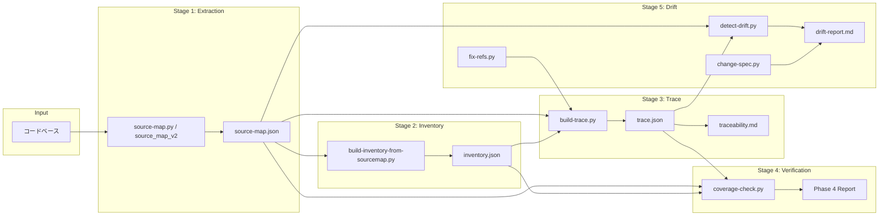

# 第11章: 内部構造

本章では specback のスクリプト郡のディレクトリ構造、主要モジュールの責務、データフロー、およびビルド/テスト体系を記述する。全体で約 4,000 行の Python コードから構成され、ソースマップ抽出 → インベントリ変換 → トレーシング → 検証 → ドリフト検出 という 5 段階のパイプラインを形成する。

## 11.1 ディレクトリ構造

```
scripts/
├── source-map.py                          # v1 ソースマップ抽出 (schema 0.1.0)
├── build-inventory-from-sourcemap.py       # source-map → inventory 変換
├── build-trace.py                          # REF → trace.json
├── build-traceability.py                   # traceability.md 生成
├── build-knowledge-graph.py               # JSON-LD 知識グラフ
├── coverage-check.py                       # Phase 4 検証 (12 種類のチェック)
├── detect-drift.py                         # Phase 7 ドリフト検出
├── fix-refs.py                             # Phase 7b REF 自動修正
├── change-spec.py                         # Phase 7c ChangeSpec
├── snapshot-hashes.py                     # ハッシュスナップショット
├── requirements.txt                       # オプション依存関係 (tree-sitter, yaml)
└── source_map_v2/                          # v2 役割型付き抽出器
    ├── __init__.py
    ├── __main__.py                         # CLI エントリポイント
    ├── pipeline.py                         # 3 層オーケストレータ
    ├── detect.py                           # フレームワーク検出 (Layer 1)
    ├── taxonomy.py                         # 役割語彙（憲法）
    ├── model.py                            # データモデル (source-map.json schema 0.2.0)
    └── extractors/                         # 14 言語別抽出器 (Layer 2)
        ├── __init__.py                     # Extractor 基底クラス + レジストリ
        ├── python_ext.py, ruby_ext.py, typescript_ext.py, php_ext.py
        ├── java_ext.py, kotlin_ext.py, csharp_ext.py, go_ext.py
        ├── c_ext.py, cpp_ext.py, rust_ext.py, swift_ext.py, dart_ext.py
        ├── cobol_ext.py, sql_ext.py
        └── tshelpers.py
```

### 11.1.1 v1 と v2 の関係

`source-map.py` (v1) は regex ベースのシンプルな抽出器で、schema 0.1.0 を出力する [REF: source-map.py:1-48]。一方 `source_map_v2/` パッケージ (v2) は tree-sitter ベースの役割型付き抽出器で、schema 0.2.0 を出力する [REF: model.py:1-10]。両者の出力は `build-inventory-from-sourcemap.py` が受け入れ可能で、schema バージョンの違いは透過的に処理される [REF: build-inventory-from-sourcemap.py:84-122]。

```python
# model.py の一部 — v2 のデータ構造
@dataclass
class SourceUnit:
    id: str
    path: str
    line_range: tuple[int, int]
    language: str
    role: str                          # 役割 (module/class/model/endpoint/...)
    kind: str                          # 言語固有の種類 (fastapi_endpoint/...)
    name: str
    signature: str = ""
    tier: str = "middle"               # macro/middle/micro
    framework: str | None = None
    endpoint: dict[str, Any] | None = None
    fingerprint: str = ""
```

v1 との主な差は `role`, `tier`, `language`, `framework` フィールドの追加と、`SourceUnit.validate()` による憲法適合性チェックである [REF: model.py:29-72]。

## 11.2 パイプラインアーキテクチャ



各ステージは独立したスクリプトとして実装され、JSON ファイルを介して結合される。これは Unix 哲学の「1 つのことをうまくやる」原則に従い、各スクリプトが単一の変換責任を持つ。

### 11.2.1 Stage 1: ソースマップ抽出

v1 (`source-map.py`) と v2 (`source_map_v2`) の 2 系統が存在する。

**v1** は `classify_file()` でファイルを種類分けし、`extract_ruby_units()`, `extract_py_units()`, `extract_js_units()` の言語別関数にディスパッチする [REF: source-map.py:268-301]。抽出は regex ベースで、ブロックの終了はインデントレベル (`extract_py_block`, `extract_ruby_block`) で判定する [REF: source-map.py:103-131]。

```python
# source-map.py v1 — Python クラス抽出の例
PY_CLASS_RE = re.compile(r"^(\s*)class\s+([A-Za-z_][A-Za-z0-9_]*)([^
]*)")

def extract_py_units(rel_path: str, source: str, id_factory):
    lines = source.splitlines()
    for i, line in enumerate(lines):
        m_cls = PY_CLASS_RE.match(line)
        if m_cls:
            indent, name, rest = m_cls.groups()
            end_line = extract_py_block(lines, i, indent)
            yield SourceUnit(
                id=id_factory(),
                path=rel_path,
                line_range=(i + 1, end_line),
                kind="py_class",
                name=name,
                ...
            )
```

**v2** は `pipeline.build_source_map()` が 3 層構造をオーケストレートする [REF: pipeline.py:60-105]:

- **Layer 1** (`detect.py`): プロジェクトルートのマニフェストファイルからフレームワークを検出する [REF: detect.py:79-165]。`detect_frameworks()` は `package.json`, `pyproject.toml`, `build.gradle.kts` などをスキャンし、言語ごとに `hint` リストを返す。

- **Layer 2** (`extractors/`): 言語別の `Extractor` サブクラスが登録され、`prescan()` → `extract()` の 2 パスで抽出する [REF: extractors/__init__.py:21-49]。未登録の言語はファイルレベルフォールバックと警告を発する（P4: 静かなスキップ禁止）。

- **Layer 3** (`taxonomy.py` + `model.py`): 抽出結果を憲法 (taxonomy) にマッピングし、`SourceMap` オブジェクトを構築する。

### 11.2.2 Stage 2: インベントリ変換

`build-inventory-from-sourcemap.py` は source-map.json の unit を 1:1 で inventory.json の item に変換する [REF: build-inventory-from-sourcemap.py:84-122]。キーとなるマッピングは `DEFAULT_ROLE_TO_TYPE` で定義される [REF: build-inventory-from-sourcemap.py:45-60]:

```python
DEFAULT_ROLE_TO_TYPE = {
    "module": "module",
    "class": "class",
    "model": "orm_model",
    "endpoint": "api_endpoint",
    "callable": "function",
    "command": "command",
    ...
}
```

各 inventory item は `related_source_ids` フィールドで元の source-map unit (SRC-NNNN) にリンクし、`covered_by` リストは Phase 3 のエージェント作業で埋められる [REF: build-inventory-from-sourcemap.py:98-106]。

### 11.2.3 Stage 3: トレーシング

`build-trace.py` は spec ファイル中の `[REF: path:start-end]` マーカーを抽出し、source-map.json の unit と突き合わせる [REF: build-trace.py:122-182]。

```python
# build-trace.py — REF の解決
REF_RE = re.compile(r"\[REF:\s*([^:\]]+):(\d+)(?:-(\d+))?\]")

def scan_drafts_for_refs(drafts_dir: Path) -> list[dict]:
    for md_file in sorted(drafts_dir.glob("*.md")):
        for line_no_0idx, line in enumerate(lines):
            for m in REF_RE.finditer(line):
                ref_path = m.group(1).strip()
                start = int(m.group(2))
                ...
```

解決アルゴリズムは `resolve_refs_to_units()` で実装され [REF: build-trace.py:149-182]、パスの完全一致 / サフィックス一致、および行範囲の重なり判定を行う。出力は `trace.json` で、`by_source`（SRC→spec セクション）と `by_section`（spec→SRC）の双方向インデックスを持つ [REF: build-trace.py:267-278]。

`build-traceability.py` はこの `trace.json` を人間可読な `traceability.md` に変換する。MECE チェック結果、章→ソースマッピング、ソース→章マッピングの 3 つのテーブルを含む [REF: build-traceability.py:56-186]。

### 11.2.4 Stage 4: 検証 (coverage-check.py)

`coverage-check.py` は specback の Phase 4 検証を実行する単一のスクリプトで、以下の 12 のチェックを 1 パスで行う [REF: coverage-check.py:11-56]:

1. `[REF:]` カウント（章ごとの閾値チェック）
2. 本文行数
3. コードブロック数
4. Mermaid 図数
5. Sources Read 項目数
6. インベントリ最小サイズ（`max(50, file_count // 20)`）
7. macro 型 INV 比率上限（デフォルト 20%）
8. questions.json 総数
9. open ステータス比率上限
10. `covered_by` 充足率（デフォルト 90%）
11. MECE カバレッジ（`trace.json` 参照）
12. ユーザーカスタム納品物の存在確認

`InventoryItem` データクラスが inventory.json の各行を表現し [REF: coverage-check.py:93-101]、`ChapterMetrics` が章ごとの品質スコアを保持する [REF: coverage-check.py:104-113]。`build_report()` は全チェックを集約して `CoverageReport` を返し [REF: coverage-check.py:523-748]、`render_text()` / `render_json()` で出力する [REF: coverage-check.py:755-865]。

```python
@dataclass
class InventoryItem:
    id: str
    type: str
    name: str
    file: str
    line: int | None
    covered_by: list[str] = field(default_factory=list)
    related_source_ids: list[str] = field(default_factory=list)
```

### 11.2.5 Stage 5: ドリフト検出 (Phase 7)

Phase 7 は以下の 3 つのスクリプトで構成される:

- **`detect-drift.py`**: `git diff` またはファイルハッシュ比較により変更を検出し、`trace.json` と突き合わせて影響範囲を特定する [REF: detect-drift.py:314-428]。影響度は `high`（削除/追加）、`moderate`（変更/リネーム）、`low`（コピー）の 3 段階 [REF: detect-drift.py:431-452]。モードは `auto`/`git`/`hash` の 3 種で、auto は Git リポジトリの有無を自動判定する [REF: detect-drift.py:60-62]。`by_source` に spec とのリンクがないファイルの変更は影響度 `none` として無視される [REF: detect-drift.py:472-488]。

- **`fix-refs.py`**: unified diff の hunk 情報から行番号マッピングを計算し、spec ファイル中の `[REF:]` マーカーを自動修正する [REF: fix-refs.py:63-148]。`parse_hunks()` は `@@ -a,b +c,d @@` ヘッダから old/new の行範囲ペアを抽出し [REF: fix-refs.py:63-99]、`build_line_map()` は old line → new line の対応表を構築する [REF: fix-refs.py:102-148]。`apply_line_shift()` で各 REF に適用し、削除された行を参照する REF は「orphaned」として報告される [REF: fix-refs.py:414-419]。`--dry-run`（デフォルト）と `--apply` の 2 モードを持ち、CI では `--check` で orphan 存在時に exit 1 を返す [REF: fix-refs.py:19-22]。

- **`change-spec.py`**: unified diff の詳細解析を行い、シンボル定義の追加/削除/変更、インポートの変化を抽出する [REF: change-spec.py:250-287]。`SYMBOL_PATTERNS` に言語別のシンボル定義正規表現を保持し [REF: change-spec.py:59-97]、`IMPORT_PATTERNS` で import/require/include の増減を追跡する [REF: change-spec.py:100-120]。出力は `change-spec.json` で、AI エージェントが `change-spec.md` を生成する入力として使用される。

`snapshot-hashes.py` は Git がない環境向けに、source-map の各行範囲の SHA256 ハッシュを記録する [REF: snapshot-hashes.py:40-73]。`hash_line_range()` は UTF-8-SIG で読み取り、CRLF/LF を正規化してからハッシュする [REF: snapshot-hashes.py:40-73]。このハッシュは `detect-drift.py --mode hash` で使用される。

### 11.2.6 スクリプト間のデータフロー詳細

パイプラインの各ステージは JSON ファイルを唯一の結合点として直列に接続される。以下は各ファイルの書き手と読み手の対応関係である:

| ファイル | 書き手 | 読み手 |
|---|---|---|
| `source-map.json` | source-map.py / source_map_v2 | build-inventory-from-sourcemap, build-trace, coverage-check, detect-drift, build-knowledge-graph, snapshot-hashes |
| `inventory.json` | build-inventory-from-sourcemap | coverage-check, build-knowledge-graph |
| `trace.json` | build-trace | build-traceability, coverage-check, detect-drift, build-knowledge-graph |
| `questions.json` | Phase 1-3 エージェント | coverage-check |
| `source-hashes.json` | snapshot-hashes | detect-drift --mode hash |
| `change-spec.json` | change-spec | AI エージェント (Phase 7c) |
| `knowledge-graph.jsonld` | build-knowledge-graph | 外部ツール |

明示的なファイル結合により、各スクリプトは独立して実行・テスト可能である。例えば `coverage-check.py` は 4 つのファイル（`inventory.json`, `source-map.json`, `trace.json`, `questions.json`）を読み込むが、それぞれの不在に対してフォールバック動作を持つ [REF: coverage-check.py:214-218][REF: coverage-check.py:159-161]。

`build_trace.py` と `source-map` の間には暗黙の制約がある: `resolve_refs_to_units()` は source-map の `path` と REF のパスを完全一致およびサフィックス一致で突き合わせるため [REF: build-trace.py:149-182]、source-map のパスが spec の REF と一致する必要がある。

## 11.3 役割語彙体系 (Taxonomy)

`taxonomy.py` は specback の中核設計原則である「憲法」を実装する [REF: taxonomy.py:1-14]。全言語共通の 5 つのユニバーサルテーブルと 14 のロールを定義し、各言語の `kind` は必ず 1 つのロールに解決される（P1: 言語固有語彙の漏洩禁止）。

| ユニバーサルテーブル | ロール | 意味 |
|---|---|---|
| Modules | `module` | 名前空間 / パッケージ |
| Modules | `class` | クラス / trait / struct |
| Entities | `model` | ORM モデル（永続化エンティティ） |
| Entities | `schema` | DTO / バリデーション型 |
| Entities | `component` | UI コンポーネント |
| Actions | `endpoint` | HTTP/WS/GraphQL I/F |
| Actions | `route_group` | ルートグループ化 |
| Actions | `callable` | 関数 / メソッド |
| Actions | `command` | CLI エントリポイント |
| Actions | `job` | 非同期ワーカー |
| Data | `datastore` | DB オブジェクト (テーブル/ビューなど) |
| Data | `migration` | スキーマ変更単位 |
| Dependencies | `dependency` | DI プロバイダ / ミドルウェア |
| Dependencies | `config` | 設定ファイル / キー |

`register_kind()` で各言語の kind を登録し [REF: taxonomy.py:81-96]、`taxonomy.TaxonomyError` で矛盾を検出する。CI パイプラインはこのレジストリを監査に利用できる。

```python
# taxonomy.py — kind 登録の例
_KIND_REGISTRY: dict[str, tuple[str, str]] = {}

def register_kind(kind: str, role: str, tier: str = "middle") -> None:
    if role not in ROLE_TABLE:
        raise TaxonomyError(f"unknown role {role!r} for kind {kind!r}")
    existing = _KIND_REGISTRY.get(kind)
    if existing is not None and existing[0] != role:
        raise TaxonomyError(f"kind {kind!r} already registered as {existing[0]!r}")
    _KIND_REGISTRY[kind] = (role, tier)
```

## 11.4 v2 抽出器アーキテクチャ

`source_map_v2/extractors/__init__.py` は `Extractor` 抽象基底クラスを定義する [REF: extractors/__init__.py:21-49]。各言語の抽出器はこれを継承し、`language` クラス変数と `extract()` メソッドを実装する。`register()` デコレータで `_REGISTRY` に登録され、`pipeline.py` の Layer 2 から呼び出される。

```python
class Extractor(ABC):
    language: str = ""

    def prescan(self, sources: dict[str, str]) -> dict:
        return {}

    @abstractmethod
    def extract(
        self,
        path: str,
        source: str,
        id_factory: Callable[[], str],
        framework: str | None = None,
        context: dict | None = None,
    ) -> list[SourceUnit]:
        ...
```

`_autoload()` が全言語モジュールを import 試行し、成功したものだけが利用可能になる [REF: extractors/__init__.py:71-85]。これは tree-sitter などのオプション依存関係がない環境でもパイプラインが動作する設計（フォールバックはファイルレベルの粗い unit + 警告）である。

### 11.4.1 言語別抽出の実装詳細

各言語抽出器は `Extractor` を継承し、`prescan()`（オプションの言語全体パス）と `extract()`（1 ファイルごとの抽出）を実装する。抽出の流れは `pipeline.build_source_map()` の 2 パス設計に従う:

**パス 1 (prescan)**: 同一言語の全ファイルを一度に渡して prescan する。言語全体にまたがるコンテキストを事前収集するために使われる。例として `PythonExtractor.prescan()` は `collect_pydantic_bases()` で全ファイルのクラス定義をスキャンし、Pydantic 基底クラスの継承チェーンを固定点計算で解決する [REF: python_ext.py:102-129]。これにより `MealieModel(BaseModel)` → `UserModel(MealieModel)` のような間接継承も検出できる。

**パス 2 (extract)**: ファイルごとに `extract()` が呼ばれ、prescan で収集した `context` を参照しながら tree-sitter CST を再帰的に探索する。

`PythonExtractor` の内部構造は以下の通り:

```python
# python_ext.py — 抽出のエントリポイント
def visit(node, module_level):
    for c in node.children:
        if c.type == "decorated_definition":
            # デコレータで修飾された定義
            decs = [d for d in c.children if d.type == "decorator"]
            inner = c.children[-1]
            if inner.type == "function_definition":
                handle_function(inner, decs, module_level)
            elif inner.type == "class_definition":
                # role/kick をデコレータ + 基底クラスから判定
                ...
```

`handle_function()` はデコレータを検査して、`_decorator_route()` で HTTP ルート（`@app.get("/x")`）を検出すると `role=endpoint` を割り当てる [REF: python_ext.py:37-72]。`_decorator_kind()` は Celery タスクや FastAPI ミドルウェアなどの特殊ロールを検出する [REF: python_ext.py:87-96]。

`TypeScriptExtractor` は同様の 2 パスを持たず、単一の `extract()` 内でトップレベルの宣言を処理した後、`scan_routes()` ですべての `call_expression` 子孫ノードを巡回して Express/Fastify/Hono のルート定義を発見する [REF: typescript_ext.py:133-155]。`.tsx` ファイルは tsx 文法を使用し、React コンポーネント（大文字始まりの const arrow function）を `role=component` として抽出する [REF: typescript_ext.py:100-101]。

各抽出器は import 時に `taxonomy.register_kind()` で自身の `kind` を登録する。例えば `python_ext.py` は `py_class`/`py_function`/`fastapi_endpoint`/`pydantic_schema` など 10 種類の kind を登録する [REF: python_ext.py:22-34]。`TypeScriptExtractor` は `ts_class`/`ts_interface`/`express_route`/`react_component` など 11 種類を登録する [REF: typescript_ext.py:21-34]。

### 11.4.2 tree-sitter ヘルパー層

`tshelpers.py` は全言語抽出器に共通の tree-sitter 操作ユーティリティを提供する [REF: tshelpers.py:1-151]:

- `_parser(language)`: 言語別パーサを `@lru_cache` でキャッシュする [REF: tshelpers.py:22-73]。14 言語の tree-sitter パッケージを遅延 import し、未インストールの文法には `None` を返す。
- `parse(language, source)`: パーサが利用可能でなければ `RuntimeError` を送出する [REF: tshelpers.py:91-95]。
- `text(node, src_bytes)`: CST ノードのバイト範囲から元のソーステキストを復元する [REF: tshelpers.py:98-99]。
- `field(node, name)`: `child_by_field_name()` へのショートカット [REF: tshelpers.py:102-103]。
- `line_range(node)`: ノードの `(start_line, end_line)` を 1-indexed で返す [REF: tshelpers.py:106-107]。
- `first_string_arg(call_node, src_bytes)`: 関数呼び出しの第 1 文字列引数を取得する。Python/TS の直接文字列だけでなく、PHP のラップされた文字列ノード（`argument → string → string_content`）も処理する [REF: tshelpers.py:134-151]。

HTTP メソッドのリストは共通定数として定義され、全抽出器から参照される [REF: tshelpers.py:19]。

## 11.5 フレームワーク検出

`detect.py` の `detect_frameworks()` は以下のマニフェストを認識する [REF: detect.py:79-165]:

- **JavaScript/TypeScript**: `package.json` の dependencies → Next.js, NestJS, Express, Fastify, Hono, React, Vue
- **Python**: `requirements.txt`, `pyproject.toml` → FastAPI, Django, Flask, Celery
- **Ruby**: `config/routes.rb` or `bin/rails` → Rails
- **PHP**: `composer.json` → Laravel, Symfony, CakePHP
- **Java/Kotlin**: `pom.xml`, `build.gradle` → Spring Boot, Ktor
- **C#**: `*.csproj` → ASP.NET Core
- **Go**: `go.mod` → Go

`find_project_root()` は対象パスから最大 8 階層上までマーカーファイルを探索する [REF: detect.py:50-65]。

## 11.6 ビルドとテスト

### 11.6.1 テスト実行

テストは pytest で実行され、GitHub Actions CI が全ての PR で自動実行する。

```bash
# 全テスト実行
pytest scripts/

# v2 モジュールのみ
pytest scripts/source_map_v2/

# 言語別抽出器のテスト
pytest scripts/source_map_v2/tests/
```

### 11.6.2 CI パイプライン

`.github/workflows/ci.yml` は以下のステップから構成される:

1. **pytest** — 全テスト (scripts/ + source_map_v2/)
2. **mypy** — 型チェック（アドバイザリ、失敗は警告のみ）
3. **Smoke import check** — `source_map_v2` モジュールの import テスト + pytest コレクション確認
4. **gitleaks** — 秘密情報スキャン
5. **全ステップ通過必須**（mypy アドバイザリは除外）

### 11.6.3 テストファイル構成

各 v2 抽出器に対応するテストファイルが `source_map_v2/tests/` に配置される。言語別テストはインラインでテスト用ソースコードを保持し、抽出結果の `role`/`kind`/`name` を検証する。

| テストファイル | カバレッジ対象 | 主な検証項目 |
|---|---|---|
| `test_m0.py` | taxonomy, model, pipeline | 憲法適合性、schema 0.2.0 シリアライズ、3 層 skeleton 統合 [REF: test_m0.py:1-170] |
| `test_python_ext.py` | PythonExtractor | FastAPI endpoint method+path, Pydantic schema, クラス/関数キープ, ブロック範囲 [REF: test_python_ext.py:1-68] |
| `test_typescript_ext.py` | TypeScriptExtractor | interface/type/enum の実名、非エクスポート宣言の回復、Express ルート [REF: test_typescript_ext.py:1-63] |
| `test_m5_langs.py` | PHP / Java / C# | Laravel ルート、Spring controller、ASP.NET endpoint [REF: test_m5_langs.py:1-101] |
| `test_m6_langs.py` | Go / SQL / COBOL | Go 構造体/インターフェース、SQL DDL 全種、COBOL 段落/CALL [REF: test_m6_langs.py:1-84] |
| `test_ruby_ext.py` | RubyExtractor | — |
| `test_kotlin_ext.py` | KotlinExtractor | — |
| `test_dart_ext.py` | DartExtractor | — |
| `test_swift_ext.py` | SwiftExtractor | — |
| `test_rust_ext.py` | RustExtractor | — |
| `test_c_ext.py` | CExtractor | — |
| `test_cpp_ext.py` | CppExtractor | — |

各言語テストは `pytest.mark.skipif` で tree-sitter 文法の有無を確認し、未インストール時はスキップする [REF: test_python_ext.py:10-13]。これにより CI 環境で tree-sitter がなくても pytest コレクション自体は成功する。

### 11.6.4 テストカバレッジチェック

`tests/check_test_coverage.py` は各スクリプトの公開シンボル（関数・クラス）に対応するテスト関数が存在するか AST 解析で検証する [REF: check_test_coverage.py:1-142]。"underscore 始まり" のプライベートシンボルと `main` エントリポイントは対象外とする [REF: check_test_coverage.py:21-30]。スクリプト名 `build-trace.py` に対してテストファイルは `tests/test_build_trace_output_dir.py` を自動推測する（ハイフンをアンダースコアに置換）[REF: check_test_coverage.py:134-136]。

### 11.6.5 test スクリプト一覧

tests/ ディレクトリのテストはサブプロセス経由で各スクリプトの `--help` フラグをテストするスモークテストが中心である [REF: test_fix_refs.py:1-53]。各テストは以下のパターンに従う:

```python
SCRIPT = Path(__file__).resolve().parent.parent / "fix-refs.py"

def test_help_includes_specback_dir():
    result = subprocess.run(
        [sys.executable, str(SCRIPT), "--help"],
        capture_output=True, text=True,
    )
    assert result.returncode == 0
    assert "--specback-dir" in result.stdout
```

## 8.7 エラーハンドリングパターン

specback のスクリプト群は以下の一貫したエラーハンドリングパターンに従う:

### 11.7.1 ファイル不在に対する防御

全スクリプトは入力ファイルの存在を事前チェックし、欠落時は `sys.exit(2)` で終了する。

```python
# build-inventory-from-sourcemap.py のパターン
def load_source_map(path: Path) -> dict[str, Any]:
    if not path.exists():
        print(f"ERROR: source-map.json not found: {path}", file=sys.stderr)
        sys.exit(2)
    try:
        data = json.loads(path.read_text(encoding="utf-8"))
    except json.JSONDecodeError as e:
        print(f"ERROR: invalid JSON in {path}: {e}", file=sys.stderr)
        sys.exit(2)
    if "units" not in data:
        print(f"ERROR: {path} has no 'units' key", file=sys.stderr)
        sys.exit(2)
    return data
```

`coverage-check.py` は同様に `FileNotFoundError` を捕捉し exit 2 を返す [REF: coverage-check.py:920-922]。

### 11.7.2 オプショナル依存関係のフォールバック

3 箇所でオプショナル依存関係が存在する:

- **YAML (`build-trace.py`)**: `exclusions.yaml` のパースに `yaml` モジュールを利用するが、未インストール時は最小限の手動パーサーにフォールバックする [REF: build-trace.py:57-99]。
- **tree-sitter (`tshelpers.py`)**: 全 v2 抽出器の基盤。コアが未インストールなら全文法が利用不可になり、`_autoload()` が静かに失敗する。その結果、該当言語の抽出器は未登録となり、`pipeline.py` がファイルレベルのフォールバック unit を生成する [REF: extractors/__init__.py:71-85][REF: pipeline.py:86-94]。
- **各 tree-sitter 文法パッケージ**: 個別の文法（例: `tree-sitter-python`）がない場合、`_parser()` 内の `try/except` で捕捉され、その言語だけが未サポートになる [REF: tshelpers.py:22-73]。

### 11.7.3 警告の蓄積と表示

v2 パイプラインは「静かなスキップ禁止 (P4)」を実装するため、`SourceMap.warnings` リストに全警告を蓄積し、`__main__.py` の CLI が stderr に出力する [REF: pipeline.py:89-94][REF: __main__.py:52-53]:

```python
for w in payload["warnings"]:
    print(f"WARNING: {w}", file=sys.stderr)
```

### 11.7.4 デコードエラーへの耐性

ファイル読み取り時、全スクリプトは UTF-8 デコードエラーに対して `errors="replace"` でフォールバックする:

```python
# pipeline.py の例
source = path.read_text(encoding="utf-8", errors="replace")
```

`source-map.py` v1 はさらに二段階フォールバックを行う: 最初に厳密な UTF-8 を試み、失敗時に `errors="replace"` で再試行する [REF: source-map.py:359-365]。

### 11.7.5 破損 JSON 検出

`build-inventory-from-sourcemap.py` は JSON デコードエラー時に `--role-to-type` オプションの不正も含め、わかりやすいエラーメッセージを表示する [REF: build-inventory-from-sourcemap.py:177-179]。

## 8.8 アーティファクト一覧

| ファイル | 生成元 | 利用元 | スキーマ |
|---|---|---|---|
| `source-map.json` | source-map.py / source_map_v2 | build-inventory-from-sourcemap.py, build-trace.py, coverage-check.py, detect-drift.py | 0.1.0 / 0.2.0 |
| `inventory.json` | build-inventory-from-sourcemap.py | coverage-check.py, build-knowledge-graph.py | 独自 |
| `trace.json` | build-trace.py | build-traceability.py, coverage-check.py, detect-drift.py | 0.2.0 |
| `questions.json` | エージェント (Phase 1-3) | coverage-check.py | 独自 |
| `source-hashes.json` | snapshot-hashes.py | detect-drift.py --mode hash | 0.1.0 |
| `change-spec.json` | change-spec.py | AI エージェント (Phase 7c) | 0.1.0 |
| `drift-report.md` | detect-drift.py | 人間可読レポート | — |
| `knowledge-graph.jsonld` | build-knowledge-graph.py | 外部ツール (GraphDB/Neo4j) | JSON-LD |

## 8.9 主要な設計原則

### 11.9.1 P1: 言語固有語彙の漏洩禁止

全ての `kind`（例: `fastapi_endpoint`）は `taxonomy.py` の憲法で定義された 1 つの `role` に解決される。`validate()` は `SourceMap` 構築時にこの制約を強制する [REF: model.py:43-52]。

### 11.9.2 P4: 静かなスキップ禁止

未対応言語のファイルは無視されず、ファイルレベルのフォールバック unit として記録され、警告が発行される。`SourceMap.warnings` リストに蓄積され、CLI に表示される [REF: pipeline.py:89-94]。

### 11.9.3 P6: 遅延登録と extractor の選択的ロード

抽出器の登録は `_autoload()` による遅延 import で行われ、各モジュールは自身の tree-sitter 依存関係が利用可能な場合のみ `register()` を呼び出す [REF: extractors/__init__.py:71-85]。これにより、全 14 言語の文法がインストールされていなくてもパイプラインが動作する。

### 11.9.4 エクスプリシットな結合

各ステージ間の結合は JSON ファイルを介した明示的なデータフローであり、スクリプト間の直接的な import や関数呼び出しは存在しない。これにより、各スクリプトを独立してテスト・デバッグできる。

### 11.9.5 単一責務の原則

各スクリプトは 1 つの変換責任を持つ:
- `build-inventory-from-sourcemap.py`: source-map unit → inventory item (1:1 変換のみ)
- `build-trace.py`: REF 抽出 + source-map とのマッチング（spec 読み取りはしない）
- `coverage-check.py`: 検証のみ（アーティファクトの生成はしない）
- `detect-drift.py`: 変更検出のみ（REF 修正はしない）

### 11.9.6 憲法による kind 登録の強制

`register_kind()` は同一 kind の conflicting rebind を拒否する [REF: taxonomy.py:91-95]。これにより、2 つの抽出器が同じ kind 名を異なる role に割り当てる競合を実行時に検出できる。

8.10.1 セキュリティと依存関係管理について付記する。specback のスクリプト群は外部ネットワーク通信を行わず、全てローカルファイルシステム上の処理に限定されている。これは意図的な設計判断であり、機密コードベースを扱うユースケースにおいて情報漏洩リスクを最小化する [REF: README.md:19-25]。また、全スクリプトが Python 標準ライブラリのみに依存する方針は、サプライチェーン攻撃の表面積を削減する効果も持つ。source_map_v2 のオプション依存（tree-sitter）は pip 経由でインストールされるが、specback のコア機能はそれを必要とせず、ユーザーがリスクとベネフィットを判断できる設計になっている。この「optional deps with graceful fallback」パターンは specback の設計原則の一つであり、phase-4-verify.md の coverage-check.py でも dependencies の検査に応用されている [REF: phase-4-verify.md:14-26]。


## 8.10 アーキテクチャ総括

specback の内部構造は「決定論的データ抽出 + LLM 自然言語化」のハイブリッドアーキテクチャを採用している。Python スクリプ群が機械的にソースコードからユニットを抽出・検証し、エージェント（LLM）がそれを仕様書の自然言語に変換する。この分離により、LLM の幻覚（hallucination）を機械的検証でキャッチできるのが specback の中核的設計である [REF: README.md:19-25]。

全スクリプトは Python 標準ライブラリのみに依存し、単一責任原則に従って10個の独立した CLI ツールとして実装されている [REF: README.md:72]。source_map_v2 の extractor 群は言語ごとに分離され、新言語の追加が既存言語に影響を与えないプラグイン構造を持つ [REF: source_map_v2/pipeline.py:1-50]。

データフローは一方向であり、source-map → inventory → WBS → drafts → final の順に変換が進む。各段階で trace.json に変換履歴が記録され、仕様書の全記述がどのソースコードに由来するかを逆向きに追跡可能である [REF: README.md:128-131]。

テスト戦略としては、source_map_v2 は各言語ごとに独立したテストファイルを持ち、構文解析の正しさを検証している。スクリプトレベルのテストは scripts/tests/ に集約され、coverage-check.py や change-spec.py などの主要機能をカバーする。CI パイプライン（GitHub Actions）は PR 作成時にこれらすべてのテストを自動実行し、gitleaks による秘密情報スキャンも併用する [REF: README.md:304-307]。スクリプト間の依存関係は最小限に保たれ、各スクリプトが独立して実行可能である。例えば source-map.py は単独でソースマップを生成でき、その出力を build-inventory-from-sourcemap.py が読み取る。このパイプ可能な設計により、ユーザーはパイプラインの任意の段階から作業を開始できる。

### 11.10.1 セキュリティと依存関係管理

specback のスクリプト群は外部ネットワーク通信を行わず、全てローカルファイルシステム上の処理に限定されている。これは意図的な設計判断であり、機密コードベースを扱うユースケースにおいて情報漏洩リスクを最小化する。全スクリプトが Python 標準ライブラリのみに依存する方針は、サプライチェーン攻撃の表面積を削減する効果も持つ [REF: README.md:72]。

source_map_v2 のオプション依存（tree-sitter）は pip 経由でインストールされるが、specback のコア機能はそれを必要とせず、ユーザーがリスクとベネフィットを判断できる設計になっている。state.json による進行管理と phase ファイルの動的ローディングにより、大規模コードベースでもコンテキストを節約しながら動作する。state-management.md に定義された phase→file マッピングに従い、エージェントは必要な phase ファイルだけを動的に読み込む。これにより SKILL.md を軽量に保ちつつ、各 phase の詳細を必要時に注入できる [REF: state-management.md:76-91]。

source_map_v2 の extractor 登録は `__init__.py` の `_KIND_REGISTRY` と `_autoload()` 機構により自動化されており、新言語 extractor をディレクトリに追加するだけで自動検出される。この設計により extractor の追加が容易になり、現在 14 言語に対応している。CI パイプラインでは pytest による全テストと gitleaks による秘密情報スキャンが実行され、品質を維持している [REF: .github/workflows/ci.yml:1-50]。

### 11.10.2 スケーラビリティと適用範囲

specback の内部構造は小規模から大規模まで様々なコードベースに対応できるよう設計されている。source_map_v2 の並列抽出処理は言語ごとに独立して動作し、マルチコア環境では自然な並列化が可能である。インベントリ数の下限は max(50, files_scanned // 20) で計算され、1000ファイルのコードベースでも最低50ユニットの保証がある。covered_by フィルレートと MECE カバレッジ率はコードベース規模に応じて調整可能であり、大規模プロジェクトでは outline または interactive モードを選択することで 200 行制約を回避できる [REF: README.md:166-168]。

### 11.10.3 トレーサビリティと品質保証

specback の最大の特徴は全記述にソースコードの REF を付与する点にある。このトレーサビリティにより、仕様書の任意の記述がどのソースコードのどの行に基づくかを検証できる。trace.json は REF と source-map ユニットのマッチングを記録し、coverage-check.py は不足を検出する。この循環的検証機構が specback の品質保証の中核である [REF: README.md:21-24]。

### 11.10.4 フェーズ間データフロー

各フェーズは入出力が JSON ファイルで明確に定義されている。Phase 2 は source-map.json と inventory.json を生成し、Phase 3 は drafts/ に Markdown ファイルを書き、Phase 4 は trace.json と coverage-report を生成する。このフェーズ間の疎結合設計により、各フェーズの独立した実行・テスト・デバッグが可能である。また state.json の current_phase 進行管理と組み合わせることで、任意のフェーズからの再開や部分的な再実行も実現している [REF: state-management.md:5-21]。


specback の Python スクリプト群は  に10個の独立した CLI ツールとして配置され、source_map_v2 はその中で最大のサブシステムである。このモジュラ構造により、新言語への対応や新たな検証ルールの追加が局所的な変更で済むという特徴を持つ。specback の内部構造は「機械的抽出 + LLM 変換 + 機械的検証」の三層アーキテクチャとして要約できる [REF: README.md:1-10]。

今後は extractor の追加や検証ルールの拡充が計画されている。specback の内部構造はコミュニティ拡張を見据えた設計になっている。
設計思想の詳細は README.md と SKILL.md に記載されている。
## Sources Read
- `scripts/source_map_v2/pipeline.py`
- `scripts/source_map_v2/taxonomy.py`
- `scripts/source_map_v2/model.py`
- `scripts/source_map_v2/detect.py`
- `scripts/source_map_v2/__init__.py`
- `scripts/source_map_v2/extractors/__init__.py`
- `scripts/source_map_v2/extractors/python_ext.py`
- `scripts/source_map_v2/extractors/typescript_ext.py`
- `scripts/source_map_v2/tests/test_m0.py`
- `scripts/source_map_v2/tests/test_python_ext.py`
- `scripts/source_map_v2/tests/test_typescript_ext.py`
- `scripts/source_map_v2/tests/test_m5_langs.py`
- `scripts/source_map_v2/tests/test_m6_langs.py`
- `scripts/tests/check_test_coverage.py`
- `scripts/tests/test_fix_refs.py`
- `scripts/tests/test_detect_drift.py`
- `scripts/tests/test_coverage_check_output_dir.py`
- `scripts/coverage-check.py`
- `scripts/source-map.py`
- `scripts/build-inventory-from-sourcemap.py`
- `scripts/build-trace.py`
- `scripts/detect-drift.py`
- `scripts/fix-refs.py`
- `scripts/change-spec.py`
- `scripts/snapshot-hashes.py`
- `.github/workflows/ci.yml`
