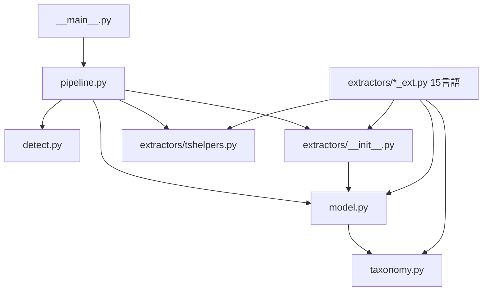
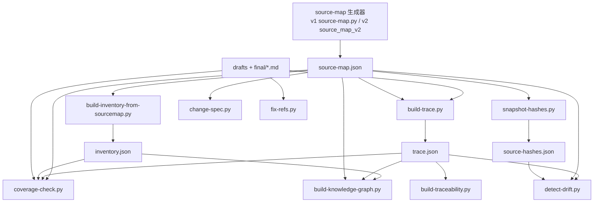

# 第12章: システム設計

## Sources Read

- `skills/specback/templates/library-sdk.md` (lines 352-489)
- `skills/specback/agents/chapter-investigator.md` (lines 160-264)
- `skills/specback/references/outline-tables.md` (lines 1-40, 460-576)
- `skills/specback/SKILL.md` (lines 1-105)
- `skills/specback/phase-3-investigate.md` (lines 130-297)
- `skills/specback/phase-4-verify.md` (lines 80-107)
- `skills/specback/schemas/state.schema.json` (lines 1-78)
- `skills/specback/scripts/tests/test_validate_schema.py` (lines 1-40)
- `skills/specback/scripts/coverage-check.py` (lines 1-100, 518-615, 895-905)
- `skills/specback/scripts/detect-drift.py` (lines 1-80, 840-939)
- `skills/specback/scripts/change-spec.py` (lines 1-80)
- `skills/specback/scripts/fix-refs.py` (lines 1-70, 470-480)
- `skills/specback/scripts/snapshot-hashes.py` (lines 1-120, 230-240)
- `skills/specback/scripts/source-map.py` (lines 1-75)
- `skills/specback/scripts/build-trace.py` (lines 1-75)
- `skills/specback/scripts/build-traceability.py` (lines 1-60)
- `skills/specback/scripts/validate-schema.py` (lines 1-70)
- `skills/specback/scripts/build-inventory-from-sourcemap.py` (lines 1-60)
- `skills/specback/scripts/build-knowledge-graph.py` (lines 1-70)
- `skills/specback/scripts/source_map_v2/pipeline.py` (lines 1-148)
- `skills/specback/scripts/source_map_v2/detect.py` (lines 1-175)
- `skills/specback/scripts/source_map_v2/model.py` (lines 1-126)
- `skills/specback/scripts/source_map_v2/taxonomy.py` (lines 1-122)
- `skills/specback/scripts/source_map_v2/extractors/__init__.py` (lines 1-88)
- `skills/specback/scripts/source_map_v2/extractors/tshelpers.py` (lines 1-110)
- `skills/specback/scripts/source_map_v2/extractors/python_ext.py` (lines 1-60)
- `skills/specback/scripts/source_map_v2/__main__.py` (lines 1-59)
- `skills/specback/scripts/requirements.txt` (lines 1-37)
- `.specback/drafts/03-module-architecture.md` (lines 1-348)
- `specs/01-overview.md` (lines 1-120)
- `specs/00-metadata.md` (lines 1-14)
- `specs/13-known-constraints.md` (lines 1-473)
- `.github/workflows/ci.yml` (lines 1-83)

---

本章は specback の「WHY / HOW」を扱う。第3章（モジュール構成）が WHAT（何があり、どう繋がっているか）を俯瞰し、第11章（内部構造）が個々のモジュールの内部実装を記述するのに対し、本章は**コードと docstring から観測可能な設計判断**を ADR として抽出し、横断的パターン・セキュリティ・性能・統合・トレードオフを体系的に論じる。

抽出方法は `references/outline-tables.md` の「System design extraction patterns」に従い、import 分析（`rg "^import |^from "`）、パターン検出（except/raise・print・TODO 等の出現数）、マーカー走査（`rg "TODO|FIXME|HACK|XXX"`）を実スクリプト群に対して実行した。 [REF: skills/specback/references/outline-tables.md:509-576]

## 12.1 Architecture Decision Records (ADR)

コードと docstring から観測可能な設計判断を時系列順に列挙する。**decision はコードで機械検証可能だが、rationale は docstring に明記されたものを除き推測である**。docstring に根拠が明記されている行は 🟡、推測に留まるものは 🔴 とし、🟢 は存在しない（正式な ADR 文書はリポジトリに存在しない）。

| ID | Topic | Decision (as observed in code) | Rationale (inferred) | Alternatives (inferred) | Confidence | Supporting REF |
|----|-------|------------------------------|---------------------|----------------------|-----------|---------------|
| ADR-001 | tree-sitter をオプション依存に | tree-sitter と各 grammar は `requirements.txt` の任意依存として分離され、未導入時は source_map_v2 がファイルレベル単位へフォールバックして警告を出す。**コアは 0.25.1 に固定 pin、grammar は最新追従** | 依存が無くても全スクリプトが stdlib のみで動作することを保証する（配布戦略）。コア固定は grammar の Language version 15 と旧コア 0.23.x の非互換により抽出器が**黙って無効化**される事故への対策 | 必須依存化 / grammar も固定 pin / フォールバックなし（エラー化） | 🟡 (docstring に根拠明記) | [REF: skills/specback/scripts/requirements.txt:1-22] [REF: skills/specback/scripts/source_map_v2/extractors/tshelpers.py:1-6] |
| ADR-002 | v1 / v2 ソースマップの並存 | 正規表現ベースの `source-map.py`（schema 0.1.0）と tree-sitter ベースの `source_map_v2/`（schema 0.2.0）が並存する。v2 の CLI は v1 と**フラグ互換**（`--target` / `--output` / `--exclude-globs`）を持ち差し替え可能 | v1 は「tree-sitter は依存を増やすため使わない。保守可能な正規表現抽出に留める」と明言し、依存ゼロ環境での動作を保証する。v2 は v1 の正規表現が落とす async エンドポイント等を回収する（M3 の狙い） | v1 の削除 / v2 への一本化 | 🟡 (docstring に根拠明記) | [REF: skills/specback/scripts/source-map.py:8-10] [REF: skills/specback/scripts/source_map_v2/__main__.py:5-7] [REF: skills/specback/scripts/source_map_v2/extractors/python_ext.py:1-9] |
| ADR-003 | JSON 契約ファイルを真実の源に | スクリプト間の結合は import ではなく **source-map.json / inventory.json / trace.json 等の JSON ファイル契約**を介する。全スタンドアロンスクリプトは stdlib のみを import し、`source_map_v2` を import するスクリプトはゼロ（実測） | フェーズの部分再実行・再開可能性をファイル交換で実現する（第3章のデータ契約チェーン）。LLM の自然言語出力（drafts）と機械処理の出力をファイルシステム上で分離する | 共通ライブラリ化 / メモリ共有 / サービス化 | 🔴 (構造は観測されるが意図は文書化されていない) | [REF: skills/specback/scripts/build-inventory-from-sourcemap.py:5-15] [REF: .specback/drafts/03-module-architecture.md:268-287] |
| ADR-004 | ロールタクソノミー「憲法」 | `taxonomy.py` が言語中立の role 語彙（14 role → 5 普遍テーブル）を一元定義し、全抽出器は `register_kind()` で kind を role に束縛する。不正 role は `TaxonomyError` で即拒否 | 「per-language vocabulary を漏らさない」（P1 設計規則）。機械抽出・LLM インベントリ・outline テーブルが同一語彙を話すことを保証する | 抽出器ごとの自由な role 命名 / ロールなしの kind 直書き | 🟡 (設計規則は docstring に明記、根拠は 🔴) | [REF: skills/specback/scripts/source_map_v2/taxonomy.py:1-14] [REF: skills/specback/scripts/source_map_v2/taxonomy.py:81-96] [REF: skills/specback/references/outline-tables.md:7-17] |
| ADR-005 | サブエージェント委譲アーキテクチャ | Phase 3 は章ごとに隔離された `chapter-investigator` サブエージェントへ委譲し、全 `task()` を**単一ターンで並列発行**する。task ツール非存在時のみメインエージェントが直接執筆 | 「メインエージェントで全章を書くとコンテキストが劣化する。各章を独立コンテキストで調査すると品質が上がる」と明記。壁時計時間は並列度に反比例（8章・同時5で ~32分 → ~8分） | 逐次ディスパッチ / 単一タスクへの章束ね（いずれも禁止と明記） | 🟡 (phase 文書に根拠明記) | [REF: skills/specback/phase-3-investigate.md:142-143] [REF: skills/specback/phase-3-investigate.md:188-224] |
| ADR-006 | カバレッジゲートを品質ゲートに | `coverage-check.py` が 11 項目の機械検証（REF 数・本文行数・コードブロック数・Mermaid 数・Sources Read 数・MECE 等）を exit code で判定し、**合格するまで Phase 5 へ進めない**。閾値は CLI で上書き可能かつ `goal.json` のテンプレート・depth_mode を認識する | 仕様書そのものを CI ゲート相当で検証し「抜け漏れ防止」の価値基準を機械的に担保する。library-sdk テンプレートは MECE 閾値を緩和（0.9→0.3 / 0.7→0.4） | 人手レビューのみ / 閾値のハードコード | 🟡 (phase 文書に根拠明記) | [REF: skills/specback/scripts/coverage-check.py:1-34] [REF: skills/specback/scripts/coverage-check.py:557-596] [REF: skills/specback/phase-4-verify.md:100-103] |
| ADR-007 | 警告は「loud, never silent」 | フォールバックやエラーを黙って握りつぶさず、必ず stderr に `WARNING:` / `ERROR:` を出す。未対応言語は「1回だけ（重複抑制）」警告し、tree-sitter 未導入・非互換・インポートエラー・欠落の**4状態を区別**して診断メッセージを出す | 「no silent exclusion — P4 in the design」。特に抽出器が黙って無効化される事故（Issue #123）への対症療法として、`install_state()` が欠落と「導入済みだが壊れている」を区別する | 警告なしのサイレントフォールバック / 例外による即中断 | 🟡 (docstring に明記) | [REF: skills/specback/scripts/source_map_v2/extractors/__init__.py:1-11] [REF: skills/specback/scripts/source_map_v2/__main__.py:5-8] [REF: skills/specback/scripts/source_map_v2/pipeline.py:86-135] [REF: skills/specback/scripts/source_map_v2/extractors/tshelpers.py:96-110] |
| ADR-008 | stdlib-only 依存ポリシー | 全スタンドアロンスクリプトと source_map_v2 の非抽出部分が Python 標準ライブラリのみで動作する。`yaml`（exclusions.yaml 用）と tree-sitter のみオプション import | ユーザー環境に追加パッケージを強制しない配布戦略（インストーラはコピーのみ）。例外処理でオプション依存を検出する（`try: import yaml / except ImportError`） | pip 必須化 / ランタイム同梱 | 🟡 (docstring に明記) | [REF: skills/specback/scripts/build-trace.py:56-61] [REF: skills/specback/scripts/change-spec.py:25-29] [REF: skills/specback/scripts/requirements.txt:1-8] |
| ADR-009 | git diff とハッシュの二刀流ドリフト検出 | `detect-drift.py` はモード自動選択（`--mode auto`）で git diff（git モード）と SHA256 ハッシュ比較（hash モード）を切り替える。優先順位: 明示指定 → .git + generated_at_commit → source-hashes.json 存在 → git | Git 非利用プロジェクトでもドリフト検出を可能にする（snapshot-hashes.py が source-map.json の各 SRC-ID 行範囲をハッシュ化）。ハッシュは BOM 除去・CRLF/LF 正規化で非決定性を排除 | git モードのみ / フルファイル比較 | 🟡 (docstring に根拠明記) | [REF: skills/specback/scripts/detect-drift.py:1-35] [REF: skills/specback/scripts/detect-drift.py:843-879] [REF: skills/specback/scripts/snapshot-hashes.py:40-73] |
| ADR-010 | 機械処理は「事実のみ・解釈しない」 | `change-spec.py` は diff から構造化事実（change-spec.json）のみを抽出し、自然言語の解釈は一切書かない。`build-traceability.py` も「Never write it by hand」と明記し、人間可読成果物を機械生成に限定する | 「intentionally mechanical — it extracts *facts only*, never interpretation. All natural-language explanation is left to the AI agent」と docstring に明記。LLM とスクリプトの責務境界を固定する | スクリプトが自然言語も生成 / LLM が全行程を担当 | 🟡 (docstring に明記) | [REF: skills/specback/scripts/change-spec.py:8-10] [REF: skills/specback/scripts/build-traceability.py:13-14] [REF: skills/specback/scripts/build-trace.py:1-12] |
| ADR-011 | Phase 3 進行ゲート | 全章（標準・予約・ユーザーカスタム）が `.specback/drafts/` に非空ボディ（コードフェンス外 10 行以上）を持つことを確認するまで Phase 3 完了を宣言してはならない。違反は即 Phase 4 失敗をトリガーする | 章がスタブのまま「完了」と宣言する契約違反を防ぎ、品質ゲートの前提（全章ドラフト存在）を機械的に保証する。Phase 4 の coverage-check は存在しないファイルを検査できないため、このゲートが先行条件となる | ゲートなし（Phase 4 の失敗で間接検出）/ ボディ行数を検査スクリプト化 | 🟡 (phase 文書に根拠明記) | [REF: skills/specback/phase-3-investigate.md:292] [REF: skills/specback/phase-4-verify.md:100] |
| ADR-012 | JSON Schema による静的検証 | `schemas/*.schema.json`（goal / state / questions）が状態ファイルの契約を定義し、`validate-schema.py` が draft-07 サブセットを自前実装して検証する。state.json の `session_history` は `additionalProperties: false` で未知フィールドを拒否する | 状態ファイルのスキーマ進化を破壊的変更として検出可能にする。検証はテストスイート（test_validate_schema.py）と開発フローで実行される | jsonschema ライブラリ依存 / スキーマなし（自由形式 JSON） | 🟡 (docstring とテストに根拠) | [REF: skills/specback/scripts/validate-schema.py:1-40] [REF: skills/specback/schemas/state.schema.json:1-60] [REF: skills/specback/scripts/tests/test_validate_schema.py:1-40] |

ADR 抽出の根拠となる docstring の実例を以下に示す。設計規則が明文化されているため、rationale の確度を 🟡 にできる [REF: skills/specback/scripts/source_map_v2/extractors/__init__.py:1-11]:

```python
# source_map_v2/extractors/__init__.py 冒頭の設計コメント（抜粋）
# Design rules:
#   P1. per-language vocabulary must never leak into a shared module
#   P3. extractors must be register-based (self-registration)
#   P4. no silent exclusion — always warn on fallback
```

このコメントにより「各抽出器が独自の kind 語彙を持ち込まない」「抽出器は自己登録する」「フォールバック時は警告を出す」の3規則がコードに根拠付きで残る。P4 は ADR-007（loud, never silent）の一次根拠である。

[CONFIDENCE: LOW] — 全 ADR の decision はコードで検証済み（🟡/🔴 は rationale の確度）。ADR-003 のみ構造から推測される意図であり 🔴。正式な ADR 文書・設計メモはリポジトリに存在せず、SME 確認が望ましい。なお、`phase-4-verify.md` は本章について「ADR セクションは 🔴 が多くなり得る。🔴 比率警告は本章では情報提供のみ」と明記している。 [REF: skills/specback/phase-4-verify.md:105]

## 12.2 Module / component dependency

### 抽出方法

`references/outline-tables.md` の言語別 import パターン（Python: `rg "^import |^from "` → 自プロジェクト内パスのみ残す）を全スクリプトに適用した。 [REF: skills/specback/references/outline-tables.md:513-523]

実際の走査コマンドと結果は以下の通りである:

```bash
# スタンドアロンスクリプト群の import 走査（自プロジェクト内のみ抽出）
rg "^import |^from " skills/specback/scripts/*.py -N | grep -v "from \.|import \." | head -20
# 結果: argparse / json / re / sys / pathlib / hashlib / subprocess / dataclasses / typing のみ
# （全スクリプトが標準ライブラリのみを import することを実測確認）
```

**実測結果の要約**: スタンドアロンスクリプト 11 本の import は**すべて標準ライブラリのみ**である（`argparse` / `json` / `re` / `sys` / `pathlib` / `hashlib` / `subprocess` / `dataclasses` / `typing` 等）。自プロジェクトへの import は source_map_v2 パッケージ**内部**にのみ存在する。第3章が「build-inventory-from-sourcemap.py は唯一 source_map_v2 を import する」と記載しているが、実測では同スクリプトは stdlib のみを import し、source-map.json を**データ契約として**読む（詳細質問 1 参照）。 [REF: skills/specback/scripts/build-inventory-from-sourcemap.py:32-38]

### 12.2-a: import グラフ（コード依存・source_map_v2 パッケージ内部）

パッケージ内の import は以下の一方向レイヤリングを持つ。閉路はない。



- `pipeline.py` が layer 1（`detect.detect_frameworks`）→ layer 2（`extractors.get_extractor(language).extract`）→ layer 3（taxonomy 写像 + SourceMap 組み立て）を配線するオーケストレータである。 [REF: skills/specback/scripts/source_map_v2/pipeline.py:1-10]
- `model.py` が `taxonomy` に依存し、`SourceUnit.validate()` が `TaxonomyError` を送出する。 [REF: skills/specback/scripts/source_map_v2/model.py:43-52]
- 各言語抽出器（`*_ext.py`）は import 時に `register()` で自己登録し、`taxonomy.register_kind()` で kind を role に束縛する。Python 抽出器は 10 kind（`py_class`, `fastapi_endpoint`, `pydantic_schema`, `django_model`, `celery_task` 等）を登録する。 [REF: skills/specback/scripts/source_map_v2/extractors/python_ext.py:21-34] [REF: skills/specback/scripts/source_map_v2/extractors/__init__.py:55-64]
- `_autoload()` は 15 抽出器モジュールを `try/except Exception: pass` で逐次 import する。tree-sitter 非導入言語は単に未登録になり、パイプラインがファイルレベル単位へフォールバックする。 [REF: skills/specback/scripts/source_map_v2/extractors/__init__.py:71-88]
- 依存の向きは **pipeline → detect / extractors / model → taxonomy** の一方向のみ。`taxonomy` は他モジュールに依存しない最下層であり、`detect` も stdlib のみ。循環依存は**コードレベルでは存在しない**。 [REF: skills/specback/scripts/source_map_v2/detect.py:12-17]

### 12.2-b: データフロー依存（JSON 契約レベル）

スクリプト間の実質的な結合は import ではなくファイル契約である。第3章 3.2-b の俯瞰図をファイル単位で精密化すると以下の 15 ノードになる（SKILL.md の Split 規則の上限に合わせた）。 [REF: skills/specback/SKILL.md:50-62]



- **source-map 生成は v1 / v2 の兄弟関係**。両者は互いに依存せず、出力形式（JSON ファイル）のみを共有する。v2 の `__main__.py` は v1 のフラグを模倣して「差し替え可能」に設計されている。 [REF: skills/specback/scripts/source_map_v2/__main__.py:1-8] [REF: skills/specback/scripts/source-map.py:19-23]
- **トレーサビリティチェーン**: drafts の `[REF: ...]` → `build-trace.py` が正規表現抽出（`REF_RE`）→ `trace.json`（by_source 逆引き + MECE 集計）→ `build-traceability.py` が人間可読 `traceability.md` を自動生成する。 [REF: skills/specback/scripts/build-trace.py:64-65] [REF: skills/specback/scripts/build-trace.py:1-12] [REF: skills/specback/scripts/build-traceability.py:1-18]
- **保守チェーン**: `snapshot-hashes.py`（SHA256）→ `detect-drift.py`（git/hash 二刀流）→ `fix-refs.py`（REF 自動修正）→ `change-spec.py`（変更事実の抽出）のデータ依存を持つ。 [REF: skills/specback/scripts/snapshot-hashes.py:3-7] [REF: skills/specback/scripts/detect-drift.py:3-9] [REF: skills/specback/scripts/change-spec.py:3-10]
- **循環依存の有無**: データフローレベルでも閉路はない。ただし**自己文書化ループ**（drafts が coverage-check.py の入力となり、検証結果が specs/ に反映され、specs/ が再び drafts の REF 対象になる）は specback が自分自身に適用されることによる意図的なフィードバックループであり、コード依存ではない。 [REF: .specback/drafts/03-module-architecture.md:249-254]

### 依存の強度ラベル

| エッジ | 種別 | 強度 | 備考 |
|--------|------|------|------|
| pipeline → detect / extractors / model | direct import | strong | パッケージ内の唯一のコード結合 |
| model → taxonomy | direct import | strong | 型検証（TaxonomyError）を担う |
| 全スタンドアロンスクリプト → JSON 契約 | data (file) | medium | スキーマ版数の互換が前提（v0.1.0 / v0.2.0 両対応） |
| build-trace → PyYAML | optional import | weak | 非導入時は HAS_YAML=False で動作継続 |
| v1 ↔ v2 | なし（出力のみ共有） | none | 兄弟関係、非循環 |

### 依存設計の解釈

この依存構造から読み取れる設計判断は以下の 3 点である。

1. **「コード依存はパッケージ内に閉じ、パッケージ間はファイル契約で繋ぐ」という非対称設計**。コード結合が強いのは source_map_v2 内部のみであり、スタンドアロンスクリプト群は互いに import しない。これは ADR-003（JSON 契約）の直接の帰結であり、スクリプト単体の実行可能性（部分再開・CI での個別実行）を保証する。 [REF: skills/specback/scripts/build-inventory-from-sourcemap.py:5-15]
2. **v1 / v2 のスキーマ互換は「フィールド追加のみ」で維持される**。model.py は「0.1.0 と後方互換。レガシーフィールドは維持し、新フィールドは追加のみで再利用しない」と docstring に明記する。このため `build-inventory-from-sourcemap.py` は v0.1.0 / v0.2.0 の両方を単一コードパスで処理できる。 [REF: skills/specback/scripts/source_map_v2/model.py:1-10] [REF: skills/specback/scripts/build-inventory-from-sourcemap.py:84-91]
3. **依存の向きが「指示層 → 処理層」と「処理層 → 状態層」に一貫する**。第3章の 3 層アーキテクチャ（指示 = 文書群 / 処理 = スクリプト群 / 状態 = JSON 群）の層間依存は、文書がスクリプトを起動し、スクリプトが JSON を読み書きする一方向のみであり、逆方向（JSON が文書を制御する等）は存在しない。 [REF: .specback/drafts/03-module-architecture.md:43-62]

## 12.3 Cross-cutting design patterns

全スクリプト（11 本 + source_map_v2 5 モジュール）に対する出現数カウント（`rg -c`）と整合性の評価結果を示す。 [REF: skills/specback/references/outline-tables.md:546-561]

| Pattern | Detection method | 観測結果（出現数） | Consistency / Coverage / Exceptions |
|---------|----------------|-------------------|-------------------------------------|
| Error handling | `except` / `raise` / exit code | `coverage-check.py` 10, `snapshot-hashes.py` 6, `taxonomy.py` 6, `validate-schema.py` 5, `build-knowledge-graph.py` 4, `build-trace.py` 4, ほか各 2-3 | **Consistency: 高い**。全スクリプトが「stderr に `ERROR:` を print → exit code 2（使用法エラー）/ 1（検証失敗）/ 0（成功）」の 3 値規約に従う [REF: skills/specback/scripts/coverage-check.py:53-57]。**Coverage**: 入出力 I/O と JSON パースのみ try/except で局所化され、残りは fail-fast。**Exception**: (a) `taxonomy.TaxonomyError` が唯一のカスタム例外クラス [REF: skills/specback/scripts/source_map_v2/taxonomy.py:77-78]、(b) `_autoload()` は import 例外を**意図的に全吞み**する（フォールバック設計の一部）[REF: skills/specback/scripts/source_map_v2/extractors/__init__.py:82-85] |
| Logging | `logger` / `logging` / `print` | `logging` モジュール使用ゼロ。`print` は stderr 向け `WARNING:` / `ERROR:` 形式: `detect-drift.py` 14, `fix-refs.py` 13, `source-map.py` 11, `validate-schema.py` 7, ほか | **Consistency: 完全に統一**。ログレベル・フォーマッタ・ファイル出力は存在せず、「プレフィックス付き stderr print」が唯一の方式。**Coverage**: 全 16 ファイルがこの規約を守る。**Exception**: なし（ADR-007 の loud-never-silent と整合）[REF: skills/specback/scripts/source_map_v2/__main__.py:52-53] |
| Validation | validator クラス / assert / スキーマ | `validate-schema.py` が JSON Schema の draft-07 サブセットを自前実装（`type` / `enum` / `required` / `additionalProperties` / `pattern` / `format: date-time` / `$ref`）[REF: skills/specback/scripts/validate-schema.py:24-40]。実行時検証は `SourceUnit.validate()` → `TaxonomyError` | **3 層の検証**が併存: (1) JSON Schema による静的検証、(2) dataclass の `validate()` による実行時検証 [REF: skills/specback/scripts/source_map_v2/model.py:43-52]、(3) `coverage-check.py` の REF 正規表現検証 [REF: skills/specback/scripts/coverage-check.py:80]。**Coverage gap**: `schemas/` と `validate-schema.py` は存在するが、どの phase 文書も明示的に呼び出していない（詳細質問 2 参照） |
| Dependency injection | DI コンテナ / コンストラクタ注入 | なし（DI パターン不使用） | 代替として**レジストリパターン**を採用: `Extractor` ABC + `register()` デコレータ + `get_extractor()` による自己登録プラグイン機構。`prescan()` が言語全体のコンテキストを `extract()` に注入する点が DI に近い役割を担う [REF: skills/specback/scripts/source_map_v2/extractors/__init__.py:21-49] |
| Retry / resilience | `retry` / `backoff` / `timeout` / `fallback` | retry/backoff/timeout はゼロ。resilience は**グレースフルデグラデーション**のみ | `install_state()` が「欠落 / 非互換 / インポートエラー / OK」の 4 状態を区別し [REF: skills/specback/scripts/source_map_v2/extractors/tshelpers.py:96-110]、`pipeline.py` が状態別の診断警告を出す [REF: skills/specback/scripts/source_map_v2/pipeline.py:92-135]。リトライではなく**フォールバック + 人間への診断情報**で耐障害性を確保する設計 |
| Batch / chunk | `batch` / `chunk` / `prescan` | `pipeline.py` の 2 パス構成: pass 1 が言語別にソースを集約 → pass 2 が言語単位で `prescan()` → ファイル単位 `extract()` | 言語ごとの一括 prescan により Pydantic 基底クラスの解決等の**クロスファイル文脈**を実現する [REF: skills/specback/scripts/source_map_v2/extractors/__init__.py:31-38]。`build-trace.py` も 1 パスで by_source / by_section / MECE 集計を同時生成する [REF: skills/specback/scripts/build-trace.py:1-12] |

### 横断パターンの総括

上記 6 パターンの観測から、specback の横断設計は「**一つの方式を選び、それを全モジュールで徹底する**」という方針で統一されていることが分かる。エラー処理は「stderr print + exit code」、ログは「プレフィックス付き stderr print」、耐障害性は「フォールバック + 診断」と、それぞれ方式が 1 つであり、モジュール間で方式が混在する箇所は観測されなかった。例外は (a) `_autoload()` の意図的な例外吞み込み、(b) オプション依存（yaml / tree-sitter）の import ガードの 2 点のみで、いずれも「オプション機能の欠如が全体を止めない」という ADR-001 / ADR-008 と整合する意図的な逸脱である。

一方で **Coverage gap** も 1 点観測される: 検証パターンは 3 層併存（JSON Schema / dataclass validate / REF 正規表現）であり、層ごとに実行タイミングの所有者が異なる。特に JSON Schema 層は、どの phase 文書からも呼び出されないため「存在するが実行されない検証」になっている可能性が高い（詳細質問 2 参照）。 [REF: skills/specback/scripts/validate-schema.py:1-17]

## 12.4 Security design

specback のスクリプト群は**ローカル・オフラインの CLI ツール**であり、攻撃面は構造的に小さい。ネットワーク I/O・認証・Web 面は存在しない。 [REF: skills/specback/references/outline-tables.md:557-559]

| Aspect | Detection method | 観測結果 | Confidence |
|--------|----------------|---------|-----------|
| Input sanitisation | `escape` / `sanitize` / パラメタライズドクエリ | 不要（外部入力なし）。ファイル読み込みは `encoding="utf-8", errors="replace"` で安全にデコード [REF: skills/specback/scripts/source_map_v2/pipeline.py:80-83]。パス操作は `pathlib.Path` ベースで、シェル経由の文字列連結なし | 🟢 |
| Secrets management | `.env` / `SECRET` / `API_KEY` / env 読み出し | **ゼロ**。`os.environ` / `getenv` の使用なし、認証情報の読み書き処理なし（`detect.py` の `token` はフレームワーク検出用のループ変数であり資格情報ではない）。CI では gitleaks によるシークレットスキャンが PR ごとに実行される [REF: .github/workflows/ci.yml:32-34] | 🟢 |
| Encryption at rest | `encrypt` / `decrypt` / `hash` | 暗号化は不使用。ハッシュは**整合性検証用**のみ: ソースユニット fingerprint は sha1 先頭 16 桁 [REF: skills/specback/scripts/source_map_v2/model.py:24-25]、ドリフト検出は SHA256（1 行あたり 4KB 上限）[REF: skills/specback/scripts/snapshot-hashes.py:36-37] | 🟢 |
| Transport security | HTTPS / TLS / SSL | 該当なし（ネットワーク通信ゼロ。`requests` / `urllib` / `httpx` / `socket` の import なし — 実測） | 🟢 |
| CORS / CSP | CORS ミドルウェア / CSP ヘッダ | 該当なし（Web サーバーではない） | 🟢 |
| Authorisation guards | 認可ガード / 認証フロー | 該当なし（認証面を持たない）。セキュリティ上の同等物は**出力ファイルの機械検証**（coverage-check / fix-refs --check）と**サプライチェーン対策**（tree-sitter コアの固定 pin、requirements.txt の検証済み組合せ注記）である [REF: skills/specback/scripts/requirements.txt:10-17] | 🟢 |

補足: スクリプトが `subprocess.run()` で git を呼ぶ 4 箇所はすべて**リスト引数**であり、`shell=True` は 1 箇所も存在しない（シェルインジェクション面なし）。 [REF: skills/specback/scripts/detect-drift.py:84] [REF: skills/specback/scripts/fix-refs.py:202] [REF: skills/specback/scripts/change-spec.py:440-462]

### セキュリティ設計の総括

specback のセキュリティ面は「**攻撃面を持たないこと**」と「**供給源の検証**」の 2 点に集約される。前者はネットワーク・認証・Web 面が一切ないこと（スクリプトはユーザーが自ら起動するローカル CLI であり、信頼境界は「ユーザーの手元」と「解析対象コードベース」の間にしかない）、後者は (a) tree-sitter コアの固定 pin による依存の検証済み組合せ保証 [REF: skills/specback/scripts/requirements.txt:10-17]、(b) CI の gitleaks シークレットスキャン [REF: .github/workflows/ci.yml:32-34]、(c) ハッシュによる整合性検証（sha1 fingerprint / sha256 ドリフト検出）[REF: skills/specback/scripts/source_map_v2/model.py:24-25] である。

解析対象のコードベースは「信頼できない入力」とも言えるが、スクリプトはそれを**テキストとしてのみ**扱い、`errors="replace"` でデコードするため、コードベースに埋め込まれた悪意あるバイナリや不正エンコーディングによる実行パスへの影響は構造的に排除されている。 [REF: skills/specback/scripts/source_map_v2/pipeline.py:80-83]

## 12.5 Performance design

specback の性能特性は「**LLM トークン消費が支配的**」であり、スクリプト自体の計算量は線形で軽量である。 [REF: specs/13-known-constraints.md:109-120]

| Pattern | Detection method | 観測結果（使用モジュール） | Confidence |
|---------|----------------|---------------------------|-----------|
| Caching | `cache` / `lru_cache` / `memoize` | `functools.lru_cache` を `_parser()` と `install_state()` に適用（grammar のパーサ生成とインストール状態診断を 1 回だけ実行）[REF: skills/specback/scripts/source_map_v2/extractors/tshelpers.py:84-110]。`importlib` のモジュールキャッシュも実質キャッシュとして機能 | 🟢 |
| N+1 prevention | `eager_load` / `prefetch` / `select_related` | 該当なし（DB アクセスなし）。類似設計として **言語別 prescan によるクロスファイル文脈の一括解決**がある [REF: skills/specback/scripts/source_map_v2/extractors/__init__.py:31-38] | 🟢 |
| Async processing | `async` / `thread` / `worker` / `queue` | **スクリプト内はゼロ**（全処理が同期的）。並列性はエージェント層のみ: Phase 3 の `task()` 並列ディスパッチが唯一の並列実行点であり、ここがトークン消費の 80-90% を占める [REF: skills/specback/phase-3-investigate.md:220-222] [REF: specs/13-known-constraints.md:343-351] | 🟢 |
| Bulk operations | `bulk_` / `batch_` / `chunk` | 2 パス抽出（言語別集約 → prescan → ファイル別抽出）[REF: skills/specback/scripts/source_map_v2/pipeline.py:72-84]。ハッシュは行範囲単位で 1 行 4KB に切り詰めて安定性と速度を両立 [REF: skills/specback/scripts/snapshot-hashes.py:37-38] | 🟢 |
| Connection pooling | `pool` / `max_connections` | 該当なし（コネクションなし） | 🟢 |
| Query optimisation | `EXPLAIN` / `index` | 該当なし（DB なし）。代わりに**決定的順序**（`sorted(target.rglob("*"))`）で出力の再現性を保証する [REF: skills/specback/scripts/source_map_v2/pipeline.py:35] | 🟢 |
| Concurrency control | `lock` / `mutex` / `transaction` | 該当なし（単一プロセス・逐次実行）。排他制御の不在は Dual-consumer 運用の非推奨理由として第13章に明記されている [REF: specs/13-known-constraints.md:297-302] | 🟢 |

性能上のトレードオフとして、以下がコードまたは第13章から観測される:

- **Phase 3 のトークン消費**: サブエージェントごとに隔離コンテキストを持つため総消費が標準セッションの 5〜10 倍になる。回避策は `outline` モード + Phase 6.5 深掘り（トークン 90% 削減）。 [REF: specs/13-known-constraints.md:109-120] [REF: specs/13-known-constraints.md:351]
- **ドリフト検出のモード選択**: git diff は差分のみ、ハッシュモードは全ユニット再ハッシュ。Git 非利用環境ではハッシュモードが唯一の選択肢であり、ファイル数に比例したコストがかかる。 [REF: skills/specback/scripts/detect-drift.py:843-879]
- **コードブロック行の重み付け**: 本文行数ゲートはコードブロック行を 0.5 倍でカウントし、コード中心の章と散文中心の章の公平性を取る。 [REF: skills/specback/scripts/coverage-check.py:340-353]

### 決定性と性能の関係

スクリプト群は**性能より再現性を優先**する設計である。`sorted(target.rglob("*"))` による決定的走査順 [REF: skills/specback/scripts/source_map_v2/pipeline.py:35]、`IdFactory` による逐次 SRC-NNNN 採番 [REF: skills/specback/scripts/source_map_v2/model.py:118-126]、ハッシュの改行正規化（BOM 除去・CRLF/LF 等価・行末空白は維持）[REF: skills/specback/scripts/snapshot-hashes.py:48-65] は、いずれも「同じ入力から同じ出力」を保証するための措置であり、実行ごとに結果が揺れる LLM フェーズ（Phase 3）と、決定論が要求される機械フェーズの境界を明確にする。

並列化をスクリプト層に持たせない判断も、この文脈で理解できる。マルチプロセス化すれば大規模リポジトリの抽出は高速化するが、エージェントのコンテキスト・トークン消費（13.1.9）が支配的コストである現状では、スクリプト層の並列化による利得は限定的であり、決定性を損なうリスクの方が大きい。並列性は Phase 3 の task ディスパッチという**エージェント層にのみ**配置されている。 [REF: skills/specback/phase-3-investigate.md:188-220]

## 12.6 Integration design

specback の統合面は「**ファイルベース + ローカル CLI + オプションの外部ツール輸出**」に集約される。外部 HTTP 通信・メッセージキューは存在しない。

| Aspect | Detection method | 観測結果 | Confidence |
|--------|----------------|---------|-----------|
| External HTTP calls | `requests` / `httpx` / `axios` / `fetch` | **ゼロ**（全スクリプトにネットワーク import なし — 実測）。エージェントの WebFetch / WebSearch のみがネットワーク面 [REF: skills/specback/SKILL.md:4] | 🟢 |
| Message queue usage | `publish` / `subscribe` / `kafka` / `sqs` | なし | 🟢 |
| File-based integration | CSV / XML / JSON / YAML 読み書き | **JSON 契約**が主軸: source-map.json / inventory.json / trace.json / state.json / questions.json / change-spec.json / source-hashes.json。オプションで YAML（`exclusions.yaml`、PyYAML 非導入時は無視）[REF: skills/specback/scripts/build-trace.py:41-42] [REF: skills/specback/scripts/build-trace.py:56-61]。**JSON-LD 輸出**: `build-knowledge-graph.py` が GraphDB / Neo4j / GBrain / Obsidian 等の SPARQL / Cypher 対応ツール向けに knowledge-graph.jsonld を生成する [REF: skills/specback/scripts/build-knowledge-graph.py:1-44] | 🟢 |
| Protocol distribution | REST / GraphQL / gRPC / SOAP 分類 | すべて「ローカル CLI + ファイルシステム」。外部プロトコルはゼロ。git CLI のみ subprocess で統合（`git diff --name-status` / `git diff --unified`）[REF: skills/specback/scripts/detect-drift.py:75-79] | 🟢 |
| Resiliency | `timeout` / `retry` / `fallback` | タイムアウト・リトライなし。フォールバック戦略: (a) tree-sitter 非導入 → ファイルレベル単位 [REF: skills/specback/scripts/source_map_v2/pipeline.py:86-138]、(b) git 非利用 → ハッシュモード [REF: skills/specback/scripts/detect-drift.py:858-879]、(c) CI での diff 直接パイプ（`git diff -U0 | fix-refs.py --diff - --check`）[REF: skills/specback/scripts/fix-refs.py:21-22] | 🟡 |

統合の設計原則は ADR-003（JSON 契約）と ADR-010（事実のみ）に集約される。特に `build-knowledge-graph.py` の JSON-LD 出力は、specback を「仕様書生成」に閉じず、ナレッジグラフ基盤への**輸出ゲートウェイ**として位置づける点で唯一の外部統合ポイントである。 [REF: skills/specback/scripts/build-knowledge-graph.py:60-66]

## 12.7 Known trade-offs and constraints

### マーカー走査結果

`rg "TODO|FIXME|HACK|WORKAROUND|XXX|OPTIMIZE|DEPRECATED"` を全スクリプトに実行した結果、**TODO / FIXME / HACK / XXX / WORKAROUND / OPTIMIZE のヒットはゼロ**であった。ヒットしたのは「`[DEPRECATED]` とマークせよ」という**出力メッセージ文字列**のみであり、コード上の既知欠陥マーカーは存在しない。 [REF: skills/specback/references/outline-tables.md:559]

```bash
# マーカー走査（2行コンテキスト付き）
rg -n "TODO|FIXME|HACK|WORKAROUND|XXX|OPTIMIZE" skills/specback/scripts/*.py \
  skills/specback/scripts/source_map_v2/**/*.py || echo "no markers found"
# 結果: コード上のマーカーはゼロ（[DEPRECATED] 文字列のみ検出）
```

| 箇所 | 内容 | 種別 |
|------|------|------|
| `detect-drift.py:629` | 削除されたソースを参照するセクションへの指示「`[DEPRECATED]` とマークするか参照を削除せよ」 | 運用ガイダンス |
| `detect-drift.py:688` | 孤立 REF への指示「コンテンツが歴史的参照として有効なら `[DEPRECATED]` とマーク」 | 運用ガイダンス |
| `fix-refs.py:476` | 孤立 REF レポートの説明「存在しない行を参照するマーカーは `[DEPRECATED]` を検討」 | 運用ガイダンス |

つまり specback の**トレードオフは TODO コメントではなく docstring と第13章に文書化**されている。これは「仕様書生成ツールが自らの未解決事項を仕様書本体（99-unresolved.md）へ集約する」という specback の設計（第13章 13.2）と整合する。 [REF: specs/13-known-constraints.md:132-134]

マーカーゼロの解釈には注意が必要である。マーカーが無いことは「既知の欠陥が無い」ことを必ずしも意味せず、単に「マーカーを残す文化がない」可能性もある。実際、`snapshot-hashes.py` の空ユニット警告 [REF: skills/specback/scripts/snapshot-hashes.py:235-239] や `build-knowledge-graph.py` の欠落ファイル警告 [REF: skills/specback/scripts/build-knowledge-graph.py:89] のように、エッジケースへの対処はマーカーではなく**実行時警告**として実装されている。トレードオフの記録場所が「コードコメント」から「実行時出力 + 仕様書」に移行している点が、本ツールの設計上の特徴である（詳細質問 3 参照）。

### 既知のトレードオフ一覧（重要度順）

#### CRITICAL

| トレードオフ | 内容 | 緩和策 | REF |
|-------------|------|--------|-----|
| tree-sitter 非導入時の粒度低下 | フォールバック時はクラス・関数・エンドポイントが抽出されずインベントリがファイル単位に粗化、REF 引用精度が低下 | `./install.sh --install-deps` または `pip install -r requirements.txt`。警告は loud（ADR-007） | [REF: specs/13-known-constraints.md:19-35] [REF: skills/specback/scripts/requirements.txt:1-8] |

#### MAJOR

| トレードオフ | 内容 | 緩和策 | REF |
|-------------|------|--------|-----|
| Phase 3 トークン消費 | 隔離コンテキストにより総消費 5〜10 倍。従量課金で顕著 | `outline` モード + Phase 6.5 深掘りで 90% 削減 | [REF: specs/13-known-constraints.md:109-120] |
| Phase 4 ループバックに回数上限なし | 仕様上は無限ループの可能性 | phase-4-verify.md の「最大 3 回」規約で運用側を制約 | [REF: specs/13-known-constraints.md:457] [REF: skills/specback/phase-4-verify.md:82] |
| フレームワーク検出はベストエフォート | 既知マニフェストのパターンマッチのみ。カスタム FW はヒントなし | 検出は「証拠付き」で監査可能、決して例外を投げない | [REF: skills/specback/scripts/source_map_v2/detect.py:7-9] [REF: specs/13-known-constraints.md:45-60] |

#### MINOR

| トレードオフ | 内容 | 緩和策 | REF |
|-------------|------|--------|-----|
| v1 / v2 の並存コスト | 2 系統の保守が必要。v1 は正規表現のため抽出精度が低い | v1 は依存ゼロ環境向けに意図的に維持（フラグ互換で差し替え可能） | [REF: skills/specback/scripts/source-map.py:8-10] [REF: skills/specback/scripts/source_map_v2/__main__.py:5-7] |
| 未登録拡張子はスキャン対象外 | `LANG_BY_EXT` 外（`.yaml` / `.md` / `.json` 等）は暗黙に除外され、設定ファイルのロジックが分析対象外に | `detect.py` の `LANG_BY_EXT` への手動追加 | [REF: skills/specback/scripts/source_map_v2/detect.py:38-39] [REF: specs/13-known-constraints.md:62-81] |
| Question Bank 自動マージは限定的 | 「明らかに同一」のみ自動グルーピング。類似疑問はユーザー判断 | クラスター提示による対話効率化 | [REF: skills/specback/SKILL.md:33] [REF: specs/13-known-constraints.md:83-87] |
| 孤立 REF の自動削除はしない | fix-refs は孤立 REF をレポートするが削除は行わず、`[DEPRECATED]` 化は人間の判断に委ねる | `--check` で CI に組み込み検出を自動化 | [REF: skills/specback/scripts/fix-refs.py:470-480] [REF: skills/specback/scripts/fix-refs.py:18-22] |

### 本章で観測された文書間の不整合

第3章は「build-inventory-from-sourcemap.py は唯一 source_map_v2 を import する」と記載するが、実測では同スクリプトの import は stdlib のみであり、source-map.json をデータ契約として読む（`build_inventory()` が「schema 0.2.0（v2）と 0.1.0（v1）の両方を処理する」と docstring に明記）。これは**JSON 契約設計（ADR-003）の裏付け**となる事実であり、第3章の記述は修正が望ましい。 [REF: skills/specback/scripts/build-inventory-from-sourcemap.py:84-91] [REF: .specback/drafts/03-module-architecture.md:244]

---

## 12.8 設計判断のまとめ

本章で観測された設計判断を、根拠の確度と影響範囲で整理する。

| ADR | 判断 | 確度 | 影響範囲 | 将来の見直し条件 |
|-----|------|:----:|----------|------------------|
| ADR-001 | tree-sitter はオプション依存、コア固定 pin | 🟡 | 配布戦略・抽出精度・インストール手順 | grammar が Language version 16+ を要求した場合 |
| ADR-002 | v1 / v2 ソースマップ並存（フラグ互換） | 🟡 | 全スクリプトの入力契約 | v1 の保守コストが無視できなくなった場合 |
| ADR-003 | JSON 契約ファイルが真実の源 | 🔴 | スクリプト間結合・再開可能性 | 部分再実行が不要になった場合 |
| ADR-004 | ロールタクソノミー一元管理 | 🟡 | 抽出器・インベントリ・outline テーブル | 言語数が 20 を超えた場合の拡張性検証 |
| ADR-005 | サブエージェント並列委譲 | 🟡 | Phase 3 の実行時間・トークン消費 | 並列度・API コストの変化 |
| ADR-006 | カバレッジゲートを品質ゲートに | 🟡 | 生成フローの進行条件 | テンプレート種別の増加 |
| ADR-007 | 警告は loud, never silent | 🟡 | ユーザー向け診断品質 | 警告疲れが観測された場合 |
| ADR-008 | stdlib-only 依存ポリシー | 🟡 | 全スクリプトの実装制約 | 必須依存の導入判断 |
| ADR-009 | git diff / ハッシュ二刀流 | 🟡 | ドリフト検出の動作モード | ハッシュモードの性能問題 |
| ADR-010 | 機械処理は事実のみ | 🟡 | スクリプトと LLM の責務境界 | 自然言語生成の自動化要求 |
| ADR-011 | Phase 3 進行ゲート | 🟡 | フェーズ進行の契約 | 章数の大幅増加 |
| ADR-012 | JSON Schema 静的検証 | 🟡 | 状態ファイルの進化管理 | スキーマ変更の頻度増加 |

### 設計判断の一貫性

以上の 12 判断は以下の 4 本の柱に集約される:

1. **「依存を増やさない」**: 配布をコピーで完結させ（ADR-008）、必要な高度解析だけをオプション依存で取り込む（ADR-001）。利用者環境への要求は「ファイル読み書きができる」ことだけである。 [REF: skills/specback/scripts/requirements.txt:1-8]
2. **「ファイルシステムが契約」**: スクリプト間・フェーズ間の結合を JSON 契約に集約し（ADR-003）、スキーマで進化を管理する（ADR-012）。これにより部分再実行と再開可能性が成立する。 [REF: skills/specback/scripts/build-inventory-from-sourcemap.py:5-15]
3. **「機械は事実のみ、解釈は LLM」**: 抽出・集計・検証は決定的なスクリプトが担い（ADR-010）、自然言語の解釈と仕様書生成はエージェントが担う。責務境界を固定することで検証可能性を保つ。 [REF: skills/specback/scripts/change-spec.py:8-10]
4. **「失敗を隠さない」**: フォールバックも警告で明示し（ADR-007）、品質ゲートで合格するまで進行を止める（ADR-006・ADR-011）。「黙って無効化」を設計レベルで排除する。 [REF: skills/specback/phase-3-investigate.md:293-296]

この 4 本柱は相互に補完する: 依存を増やさないからこそ契約がファイルに集約でき、契約がファイルにあるからこそ機械処理の責務境界が明確になり、境界が明確だからこそ失敗を明示できる。**specback の設計は「シンプルな配布 × ファイル契約 × 責務分離 × 明示的失敗」の組み合わせで成立している**。

この一貫性は偶然ではなく、docstring 内の設計規則（P1「per-language vocabulary を漏らさない」、P4「no silent exclusion」等）として明文化されている。実装者が新しいスクリプトや抽出器を追加する際も、これらの柱に沿うことが暗黙の前提となる。 [REF: skills/specback/scripts/source_map_v2/extractors/tshelpers.py:1-6] [REF: skills/specback/scripts/source_map_v2/extractors/__init__.py:1-11]

### 本章の限界

本章の ADR は全て「コードと docstring から観測可能な事実」に基づく。正式な ADR 文書・設計メモはリポジトリに存在せず、rationale の多くは 🟡（docstring 明記）または 🔴（構造からの推測）である。特に ADR-003（JSON 契約）は構造から強く示唆されるが文書化された根拠が無く、**SME による確認が望ましい**。将来正式な設計文書が追加された場合、本章の ADR を一次ソースに置き換えるべきである。

また、本章の観測は 2026-07-31 時点のリポジトリ状態（main ブランチ）に基づく。スクリプトの行番号・出現数はコード変更により変化し得るため、本章を参照する際は対応するコミット時点のコードを確認すること。特に抽出器の追加（言語対応の拡張）と requirements.txt の pin 変更は、ADR-001・ADR-004 の前提条件を変えるため、見直しの起点となる。

補足として、本章の作成過程で第3章との記述不整合が 1 件検出された（12.7 節参照）。これは第3章のドラフトが build-inventory-from-sourcemap.py の import 関係を誤って記述したためであり、本章の実測結果が正である。このような章間の不整合は、本章の「文書間の不整合」節に集約し、次回の自己文書化セッションで第3章側を修正する運用とする。

---

### この章の他の章との関係

| 関連章 | 関係 |
|--------|------|
| 第3章（モジュール構成） | 本章 12.2 が同章の俯瞰をファイル単位で精密化。v1/v2 並存の詳細は本章 ADR-002 |
| 第5章（Public API catalogue） | 各スクリプトの CLI フラグ・exit code 仕様 |
| 第7章（Configuration options） | `goal.json` の `template` / `depth_mode` が coverage-check の閾値解決に影響（12.1 ADR-006） |
| 第9章（Extension points） | 抽出器の自己登録機構（12.2 / 12.3 のレジストリパターン）が拡張の仕組み |
| 第11章（内部構造） | source_map_v2 の 3 層・coverage-check の 11 項目検証の実装詳細 |
| 第13章（既知の制約） | 12.7 のトレードオフの詳細版。13.8 に品質・速度トレードオフの運用論 |

<!-- DETAIL_QUESTIONS
- 1. build-inventory-from-sourcemap.py は実測では stdlib のみを import し、source_map_v2 へのコード依存を持たない（source-map.json をデータ契約として読む）。しかし第3章は「唯一 source_map_v2 を import するスタンドアロンスクリプト」と記載している。どちらが正しいのか？第3章の記述は修正すべきか？（spec_missing / 文書間不整合）
- 2. schemas/ の JSON Schema 3 種と validate-schema.py は存在するが、どの phase 文書も明示的に呼び出していない（第3章の詳細質問 5 と同一）。JSON Schema 検証はいつ・誰が実行する想定か？ADR-003（JSON 契約を真実の源に）と整合させるなら、契約変更時の検証タイミングを明文化すべきでは？（architecture_decision）
- 3. スクリプト群に TODO/FIXME/HACK マーカーがゼロ件であるのは、トレードオフを docstring と第13章に文書化する設計文化のためか、それとも単に保守プロセスでマーカーが残らないだけか？マーカーゼロを「意図的設計」と解釈してよいか？（spec_missing）
- 4. coverage-check.py のテンプレート認識閾値（TEMPLATE_THRESHOLDS）は library-sdk のみ定義され、web-app / api-service / batch-system はデフォルト（covered_by_fill 0.9 / mece 0.7）にフォールバックする。他テンプレートの閾値を個別に定義する計画はあるか？library-sdk の緩和（0.3 / 0.4）の根拠は何か？（architecture_decision）
-->
