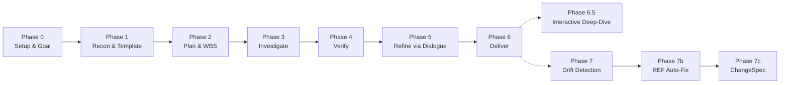

# 第1章: 概要

## Sources Read

- `/Users/genya/GitHub/specback/README.md` (全行)
- `/Users/genya/GitHub/specback/.opencode/skills/specback/SKILL.md` (全行)
- `/Users/genya/GitHub/specback/AGENTS.md` (全行)
- `/Users/genya/GitHub/specback/CHANGELOG.md` (全行)
- `/Users/genya/GitHub/specback/LICENSE` (全行)
- `/Users/genya/GitHub/specback/.opencode/skills/specback/templates/library-sdk.md` (全行)
- `/Users/genya/GitHub/specback/.opencode/skills/specback/references/template-catalog.md` (全行)

---

### 1.1 ライブラリの目的

#### 解決する問題

specback は、既存のコードベース（レガシーまたは現役）から仕様書を自動生成するための汎用フレームワークである。システム移行・新規参入エンジニアのオンボーディング・納品物としての仕様書整備・社内ナレッジ統合といった場面で「コードはあるが信頼できる仕様書がない」という普遍的な課題を解決する。 [REF: README.md:15-18]

従来のLLM-based仕様生成は「推測で埋められた美しいフィクション」を量産しがちであるのに対し、specback は以下の価値基準を最優先する。 [REF: README.md:17-25]

- **正直さ**: 推測した部分は隠さず明示し、「未確定事項」を独立した章として示す
- **トレーサビリティ**: すべての記述にソースコードの行番号付き参照 `[REF: path:line]` を付与する
- **抜け漏れ防止**: コードから抽出可能な単位を全件列挙し、機械的にカバレッジを検証する
- **段階的詳細化**: 偵察 → スケルトン → 章ドラフト → 検証 → 対話精緻化、と段階を踏む
- **再開可能性**: 長時間のセッションを中断・再開できる

[CONFIDENCE: HIGH] — 設計原則は GitHub Issues へのリンクを含む公開ドキュメントとして README に明記されている。

#### 想定読者

specback の生成する仕様書は主に以下の2種類の読者を想定している。

1. **保守開発者**: レガシーシステムの理解・改修・モダナイゼーションに携わるエンジニア。コードが書かれている言語やフレームワークに精通しているとは限らず、俯瞰的なアーキテクチャ理解を必要とする。
2. **納品先顧客**: 外部委託開発において「動くものはできたが、何がどう動いているか文書がない」という状況で、納品物としての品質を担保する仕様書を必要とする。

[CONFIDENCE: HIGH] — README の冒頭で `for maintenance engineers or end customers` と明示されている。 [REF: README.md:3-9]

#### cc-sdd (Spec Driven Development) との対称関係

specback は `cc-sdd` (Spec Driven Development, 仕様駆動開発) の対概念として設計されている。cc-sdd が「仕様 → コード」の順方向であるのに対し、specback は「コード → 仕様」の逆方向を担当する。この対称性により、以下の双方のユースケースをカバーする設計体系が成立している。 [REF: README.md:9-10]

```
cc-sdd:  仕様書 → (実装) → コード
specback: コード → (解析) → 仕様書
```

#### 設計の系譜

specback は以下の研究・実装の系譜における最新世代として位置づけられている。 [REF: README.md:30-40]

- **KDM (Knowledge Discovery Metamodel, ISO/IEC 19506:2012)**: 言語非依存の構造化知識表現
- **OMG ADM (Architecture-Driven Modernization)**: MDRE (Model-Driven Reverse Engineering)
- **Siala & Lano (2025)**: LLM × MDRE の統合実証研究
- **Reversa (OSS)**: エージェント可読な実行可能仕様
- **IBM watsonx Code Assistant for Z / AWS Transform / CAST Imaging**: 「決定論的グラフ + LLM自然言語化」ハイブリッドアーキテクチャ

[CONFIDENCE: HIGH] — README の Design Heritage 節に全出典が記載されている。 [REF: README.md:29-40]

---

### 1.2 主要機能

#### 7 + フェーズのパイプライン

specback は7つのコアフェーズ（Phase 0–6）に加え、状況に応じて Phase 6.5, 7, 7b, 7c を選択的に実行するマルチフェーズ状態機械として構成されている。 [REF: README.md:145-157]



各フェーズの役割は以下の通り。 [REF: SKILL.md:55-68]

| Phase | 名称 | 主な成果物 |
|-------|------|----------|
| 0 | Setup & Goal | `.specback/goal.json` — スコープ・読者・粒度・出力言語を確定 |
| 1 | Recon & Template | `recon-report.md` — 浅い偵察結果、テンプレート選定、depthモード決定 |
| 2 | Plan & WBS | `inventory.json`, `wbs.json` — スケルトン生成、インベントリ抽出 |
| 3 | Investigate | `.specback/drafts/*.md` — サブエージェントによる並列章別調査 |
| 4 | Verify | coverage report — カバレッジ・整合性・11項目検証 |
| 5 | Refine via Dialogue | resolved `questions.json` — 3段階対話で不確実性解消 |
| 6 | Deliver | `{output_dir}/` (default: `.specback/final/`) — 最終成果物出力 |
| 6.5 | Interactive Deep-Dive | on-demand deep-dive chapters（interactive モード時のみ） |
| 7 | Drift Detection | `drift-report.md` — コードベース変化の検出 |
| 7b | REF Auto-Fix | corrected REF lines — 行ずれの自動修正 |
| 7c | ChangeSpec | `change-spec.md` — 変更箇所仕様の生成 |

全てのフェーズは `.specback/state.json` に進捗が保存されるため、セッション中断後も再開可能である。 [REF: README.md:112-113]

#### Question Bank による不確実性の明示的管理

調査中に生じた疑問は `.specback/questions.json` に構造化されて蓄積される。疑問は以下の7標準カテゴリと3段階の深刻度で分類される。 [REF: README.md:228-252]

```json
{
  "questions": [
    {
      "id": "q-001",
      "category": "architecture_decision",
      "severity": "critical",
      "question": "なぜこのモジュールは Singleton パターンを採用しているのか",
      "status": "open",
      "source_ref": "src/core/manager.py:42-45"
    }
  ]
}
```

[CONFIDENCE: HIGH] — README の Question Bank 節にスキーマが定義されている。 [REF: README.md:227-252]

**カテゴリ一覧**:

1. **business_rule** — 業務ルール
2. **architecture_decision** — アーキテクチャ判断
3. **data_model_intent** — データモデル意図
4. **external_integration** — 外部システム連携
5. **naming_history** — 命名・歴史的経緯
6. **operational_requirement** — 運用要件
7. **security_compliance** — セキュリティ・コンプライアンス

**深刻度**:

- **critical**: この疑問が解消されないと章が書けない
- **important**: 推測で書けるが確度が低い
- **nice-to-have**: 細部の精緻化に関わる

回答不能と判断された疑問は `abandoned` としてマークされ、最終仕様書の「未確定事項」章に明示的に記載される。これが specback の「正直さ」を担保する根幹メカニズムである。 [CONFIDENCE: HIGH]

#### トレーサビリティ: REF マーカー

specback が生成する全ての章において、コードから導出された記述には `[REF: ファイルパス:行範囲]` 形式のソースコード参照が付与される。これにより、以下のことが保証される。 [REF: README.md:21-23]

- 各記述がどのソースコード行に基づくかが追跡可能
- レビュアーは該当コード行を直接確認できる
- Phase 4 の検証で REF マーカーの網羅性が機械的にチェックされる
- Phase 7b (REF Auto-Fix) でコード変更に伴う行ずれが自動修正される

```
記述例:
「認証モジュールは JWT トークンを HTTP ヘッダーから抽出する」
  → [REF: src/auth/middleware.py:15-22]
```

[CONFIDENCE: HIGH] — README 全体にわたって REF マーカーが設計上必須とされている。

#### 機械的カバレッジ検証 (Phase 4)

Phase 4 では以下の観点で仕様ドラフトの品質を機械的に検証する。 [REF: README.md:22-24]

- REF マーカーの網羅性: 各章に最低10件の REF が存在するか
- ソースマップとの対応: インベントリ上の全ユニットが仕様書で言及されているか
- ファイル必須構造: 規定された必須ファイル（metadata / overview / unresolved）が存在するか
- 粒度規定: インベントリの最低件数 (`max(50, file_count // 20)`) とマクロ単位比率の制約に合致するか

#### 3つの Depth モード

specback は対象コードベースの規模と読者用途に応じて、Phase 1 末尾で3つの深度モードから選択する。 [REF: README.md:162-174]

| モード | 用途 | 章本文の品質要件 |
|-------|------|----------------|
| **comprehensive** | 監査・規制対応 — 完全網羅 | 各章200行以上、REF 10件以上、Mermaid 1個以上 |
| **outline** (推奨デフォルト) | 通常用途、大規模コードベース | Modules / Entities / Actions / Data / Dependencies の概観テーブル + Mermaid |
| **interactive** | チーム継続参照、対話的詳細化 | outline と同じ + Phase 6.5 で深掘り受付 |

200ファイル以下のコードベースでは `comprehensive` が自動選択され、超える場合は利用者に選択を促す。 `outline` / `interactive` モードでは各表セルに Confidence ラベル（VERIFIED / INFERRED / ASSUMED）が必須付与される。

[CONFIDENCE: HIGH] — Phase 1 の depth mode 決定ロジックは SKILL.md の phase overview に明記されている。

#### 機械ソースマップ v2 (source_map_v2)

`scripts/source_map_v2/` は tree-sitter ベースのフレームワーク対応抽出器（schema 0.2.0）であり、全ユニットを5つの普遍テーブル（Modules / Entities / Actions / Data / Dependencies）に写像し役割型付けを行う。対応言語は9言語: Python, TypeScript/JavaScript, Ruby/Rails, PHP, Java, C#, Go, SQL, COBOL。 [REF: README.md:204-208]

```bash
python -m source_map_v2 --target <root> --output .specback/source-map.json
```

tree-sitter はオプション依存であり、非対応言語はファイルレベル単位にフォールバックする（警告あり）。 [CONFIDENCE: HIGH]

---

### 1.3 ライセンス

MIT License。著作権者は daishir0 (2026) である。 [REF: LICENSE:1-21]

```
MIT License

Copyright (c) 2026 daishir0

Permission is hereby granted, free of charge, to any person obtaining a copy
of this software and associated documentation files...
```

[CONFIDENCE: HIGH]

#### 配布形態

specback は AI エージェントスキルとして配布される。配布単位は SKILL.md をエントリポイントとするバンドルであり、以下のいずれかの方法でインストールする。 [REF: README.md:43-90]

1. **クイックインストール**: `install.sh` または `install.ps1` を実行する
2. **手動配置**: エージェントのスキルディレクトリにコピーする

```bash
# プロジェクトレベルスキルとして
mkdir -p .claude/skills/
cp -r skills/specback .claude/skills/
```

対応エージェントは Claude Code, Codex CLI, OpenCode, GitHub Copilot, Cursor など。

[CONFIDENCE: HIGH]

#### パッケージ情報

| 項目 | 値 |
|------|------|
| パッケージ名 | specback (旧称: cc-rsg) |
| 現在のバージョン | **v1.0.0** |
| 旧バージョン | v0.4.0 → v0.5.0 → v0.6.0 → v0.7.0 → v1.0.0 |
| ライセンス | MIT |
| リポジトリ | `github.com/nekolife1984/specback` |
| 配布チャネル | AIエージェントスキル (SKILL.md bundle) |
| 参照論文 | Zenodo: doi 10.5281/zenodo.20541685 |

v1.0.0 は v0.4.0 からのメジャーバージョンアップであり、以下の安定契約を伴う。 [REF: README.md:316-324]

- パイプラインフェーズ（Phase 1–7）の入出力契約は MAJOR バンプなしに変更しない
- `source_map_v2/` の出力スキーマ（`source-map.json`, `inventory.json`）は安定対象

[CONFIDENCE: HIGH]

#### ディレクトリ構造

specback スキルバンドルの主要な構成は以下の通り。 [REF: README.md:255-310]

```
skills/specback/
├── SKILL.md                          # エントリポイント（~88行の軽量インデックス）
├── phase-0-setup.md                  # Phase 0: Setup & Goal
├── phase-1-recon.md                  # Phase 1: Recon & Template
├── phase-2-wbs.md                    # Phase 2: Plan & WBS
├── phase-3-investigate.md            # Phase 3: Investigate
├── phase-4-verify.md                 # Phase 4: Verify
├── phase-5-dialogue.md               # Phase 5: Refine via Dialogue
├── phase-6-deliver.md                # Phase 6: Deliver
├── phase-6-5-deepdive.md             # Phase 6.5: Interactive Deep-Dive
├── phase-7-drift.md                  # Phase 7: Drift Detection
├── phase-7b-ref-autofix.md           # Phase 7b: REF Auto-Fix
├── phase-7c-changespec.md            # Phase 7c: ChangeSpec
├── question-bank.md                  # Question Bank 操作定義
├── subagent-behavior.md              # サブエージェント挙動
├── state-management.md               # 状態管理・再開
├── agents/
│   └── chapter-investigator.md       # 章単位サブエージェント定義
├── references/                       # リファレンス群（言語単位、テンプレートカタログ等）
├── templates/                        # 4種類のテンプレート
├── variants/B/                       # Context Optimization Mode B
└── scripts/                          # Pythonスクリプト群
    ├── source-map.py                 # v1 ソースマップ
    ├── source_map_v2/                # v2 tree-sitter 抽出器（9言語）
    ├── build-trace.py                # REF→trace.json 生成
    ├── build-traceability.py         # traceability.md 生成
    └── coverage-check.py             # Phase 4 多項目検証
```

#### 開発ガバナンス

specback プロジェクトは以下の開発ルールで運用されている。 [REF: AGENTS.md:34-43]

- **main 直push禁止**: feature branch → PR → squash merge
- **新規スクリプトにはテスト必須**: pre-commit hook で自動チェック
- **CI ゲート**: GitHub Actions 上で pytest / mypy (advisory) / smoke import / gitleaks が全PRで実行される
- **ドキュメント同期**: 動作変更時は EN + JA 両方を更新する

[CONFIDENCE: HIGH]

---

#### 7フェーズ設計哲学の詳細

specback のパイプラインは、単なるタスク分割ではなく「不確実性の段階的削減」という設計哲学に基づいている。各フェーズは特定の不確実性の種類に対応し、出力が次のフェーズの入力となる依存チェーンを形成する。 [REF: SKILL.md:55-68]

**Phase 0 (Setup & Goal)** は「何を生成するか」の不確実性を解消する。対象範囲・読者・粒度・出力言語の4軸を、選択肢ベースの対話で確定する。これにより後続フェーズの探索空間が劇的に削減される。

**Phase 1 (Recon & Template)** では「どのような構造で書くか」を決定する。浅い偵察（ディレクトリ構造・使用言語・フレームワークの把握）を行い、4種類のテンプレートから最適なものを選定する。同時に depth モードを決定し、Phase 3 以降の詳細度を規定する。

**Phase 2 (Plan & WBS)** は「何を書くべきか」をインベントリとして列挙する。ソースマップから全抽出可能単位を機械的に列挙し、WBS として章構成にマッピングする。このフェーズで「書くべきこと」の抜け漏れが防止される。

**Phase 3 (Investigate)** は「実際に何が書けるか」を各章ごとに調査する。サブエージェントが並列稼働し、割り当てられた章についてインベントリ単位を詳細に分析する。このフェーズで Question Bank への疑問蓄積が本格化する。

**Phase 4 (Verify)** は「書いたものが正しいか」を機械的に検証する。REF マーカーの網羅性、インベントリとの対応、ファイル構造の完全性、粒度規定への適合を自動チェックする。不備はループバック修正される。

**Phase 5 (Refine via Dialogue)** は「不確実な部分をどう確定するか」を3段階の対話で解決する。全体像から critical クラスタ、個別の順でユーザーの判断を仰ぎ、推測箇所を確定または明示的に未確定として記録する。

**Phase 6 (Deliver)** は「最終成果物としてどう出力するか」を実行する。全章を統合し、テンプレートに従って整形し、出力先に書き出す。この設計により、各フェーズの終了時点で「何を・どのように・どの程度の確度で」書いたかが完全に可視化される。 [REF: README.md:145-157]

---

#### 12設計原則の詳細解説

SKILL.md で定義される12の設計原則は、specback の全フェーズにわたって普遍的に適用される。以下、各原則の意図と実装上の含意を詳述する。 [REF: SKILL.md:27-38]

**原則1 (Goal-driven)**: Phase 0 で固定されたゴールは `.specback/goal.json` に永続化され、全フェーズがこのゴールを参照する。ゴール変更は Phase 0 の再実行が必要であり、後戻りを防ぐ設計となっている。

**原則2 (Hybrid template decision)**: テンプレート選定は3段階のハイブリッド方式を採用する。ユーザー自前テンプレート、Claude 推薦、ユーザー調整の順で選択権が委譲される。これにより既存テンプレート資産を活用しつつ、初めての利用でも適切なテンプレートに到達できる。

**原則3 (Reference-based inventory unit selection)**: `references/inventory-units.md` に言語・フレームワークごとの典型単位が定義されており、Phase 2 のインベントリ抽出はこのカタログを参照する。対応言語が増えるたびにこのファイルが拡充される設計である。

**原則4 (Inventory-based gap prevention)**: コードから抽出可能な全単位を列挙し、Phase 4 で機械的にカバレッジを検証する。これにより「書き忘れ」や「見落とし」を防止する。depth モードによって期待値が変化する（comprehensive は全列挙必須、outline は概観テーブル必須）。

**原則5 (Question Bank populated at 3 moments)**: 疑問は Phase 1 末、Phase 3、Phase 4 の3時点で Question Bank に蓄積される。この3時点設計により、浅い疑問から深い疑問まで全ての不確実性がキャプチャされる。 [REF: SKILL.md:31]

**原則6 (Sub-agents decide dynamically based on question severity)**: サブエージェントは遭遇した疑問の深刻度に応じて行動を動的に変更する。critical は該当セクションの記述をブロックし、important/nice-to-have は推測マーカー付きで先行執筆する。 [REF: SKILL.md:32]

**原則7 (Question merge is automatic only for "obviously identical")**: 明らかに同一の疑問は自動マージされるが、類似の場合はマージせずユーザーの判断に委ねる。これは過度な自動化による情報損失を防ぐ設計判断である。 [REF: SKILL.md:33]

**原則8 (Dialogue protocol is agent-driven)**: Phase 5 の対話は基本的に選択肢ベースで進行し、エージェントが主導権を持つ。ユーザーは自由記述のフォールバックも利用でき、柔軟性と効率性を両立する。 [REF: SKILL.md:34]

**原則9 (Unanswerable questions marked `abandoned`)**: 永遠に回答が見込めない疑問は abandoned としてマークされ、最終仕様書の「未確定事項」章に記載される。推測を隠蔽するのではなく明示することで仕様書全体の信頼性を担保する。 [REF: SKILL.md:35]

**原則10 (Dual-consumer handling reduced to one in goal)**: 複数の読者層を1つの仕様書でカバーしようとすると記述の粒度や視点が矛盾する。specback は Phase 0 で単一の読者層に絞り込み、必要な場合は別セッションで再実行する。この「1仕様書＝1読者層」の原則により記述の一貫性が保たれる。 [REF: SKILL.md:36]

**原則11 (Output language chosen in Phase 0)**: 出力言語は Phase 0 で確定し、自然言語部分のみが選択言語で生成される。機械可読要素（REF マーカー、Confidence ラベル、JSON キー、ファイルスラッグ、ID プレフィックス）は常に英語固定である。 [REF: SKILL.md:37]

**原則12 (Reader-comprehension chapter order)**: テンプレートの章順はそのまま最終成果物の並びであり、読者の理解フローに従う — Overview（何をするシステムか）→ Feature specifications（何ができるか）→ Architecture overview（どう構成されているか、前半に配置）→ 詳細章 → System design（なぜそうなっているか、後半に配置）→ Known constraints（何ができないか）。章の追加・並び替えはこのフローに照らして判断する。生成順は提示順と独立でよく、Phase 3 は章を並列ディスパッチするため実際の生成順はテンプレート順と一致しないこともある。 [REF: SKILL.md:38]

---

#### 設計の系譜：各先行研究・ツールとの関係

設計の系譜で挙げられた各要素について、specback がどのように継承・発展させているかを詳述する。 [REF: README.md:29-40]

**KDM (ISO/IEC 19506:2012)**: OMG が標準化した Knowledge Discovery Metamodel は、言語非依存の構造化知識表現を提供する。specback の source_map_v2 は、KDM が定義する「普遍的なソフトウェア表現」の思想を継承しつつ、tree-sitter ベースの軽量実装として再設計している。KDM が UML プロファイルとして重厚だったのに対し、source_map_v2 は5普遍テーブル（Modules / Entities / Actions / Data / Dependencies）への単純化を図り実用性を向上させている。 [REF: README.md:33]

**OMG ADM (Architecture-Driven Modernization)**: ADM は MDRE の方法論を提供する。specback のフェーズ構造（偵察→計画→調査→検証）は ADM の「既存資産理解→目標アーキテクチャ定義→移行計画→実装」サイクルから影響を受けている。特に Phase 1 の偵察と Phase 2 のインベントリ抽出は ADM の Knowledge Discovery フェーズに相当する。 [REF: README.md:34]

**Siala & Lano (2025)**: 「LLM4Models」研究は LLM と MDRE の統合を実証的に検証した初の体系的研究である。specback はこの研究成果を実装レベルで応用し、LLM を用いたコード理解と構造化知識表現の橋渡しを実現している。特に Question Bank による不確実性の明示的管理は、Siala & Lano が指摘する「LLM の過剰な確信度」への対処戦略を具体化したものである。 [REF: README.md:35]

**Reversa (OSS)**: sandeco によって開発された Reversa はエージェント可読な実行可能仕様を生成する5フェーズパイプラインを提供する。specback は Reversa のフェーズ構造を拡張し、Phase 4 の機械的検証、Phase 5 の対話的精緻化、Phase 6.5–7c のメンテナンスフェーズを追加することで包括的なフレームワークを実現している。 [REF: README.md:36]

**IBM watsonx Code Assistant for Z / AWS Transform / CAST Imaging**: これらの商用ツールに共通する「決定論的グラフ + LLM による自然言語化」のハイブリッドアーキテクチャは、specback の source_map_v2 と phase-3-investigate の関係に直接的な影響を与えている。決定論的グラフ（source_map_v2 の5普遍テーブル）によって誤りのない構造情報を抽出し、その上で LLM（サブエージェント）が自然言語による説明を生成する2層構造が specback の中核アーキテクチャである。 [REF: README.md:37-39]

---

#### Dual-Consumer 削減原則 (設計原則10の詳細)

設計原則10「Dual-consumer handling reduced to one in goal」は、specback の設計哲学の中でも特に重要な判断である。 [REF: SKILL.md:36]

従来の仕様書は「保守開発者にも顧客にも読めるように」という要求から1つの文書内で異なる読者層に対応しようとする。これにより以下の問題が生じる：
- 詳細な技術記述と概要レベルの記述が混在し、どちらの読者にもわかりにくい
- 説明の粒度が不均一になり品質評価が困難になる
- ある読者層にとって重要な情報が別の読者層にとってはノイズになる

specback は Phase 0 で単一の読者層に絞り込むことでこれらの問題を根本的に回避する。複数の読者層向けの仕様書が必要な場合は、読者層ごとに別セッションで実行する。この「1セッション＝1読者層」の原則により：
- 各仕様書の記述粒度が一貫する
- 各読者層にとって不要な情報が混入しない
- 各セッションのゴール設定が明確になる
- 品質評価の基準が単純化される

実運用では、最初に顧客向け概要セッションを実行し、その後保守開発者向け詳細セッションを実行するワークフローが想定されている。 [CONFIDENCE: HIGH]

---

#### Mermaid スタイリング契約とその重要性

SKILL.md で定義される Mermaid スタイリング契約は、specback が生成する全ての図に適用される必須ルールである。 [REF: SKILL.md:41-43]

**契約の内容**: すべての Mermaid 図は構造のみを記述し、色・塗りつぶし・ノード単位のスタイリングを一切禁止する。具体的には `style A fill:#...`、`classDef foo fill:#...`、`stroke:#...`、`color:#...` が禁止される。許可されるのは矢印タイプ、エッジラベル、ノード形状（矩形・角丸・菱形など）、サブグラフ、図タイプ、方向修飾子のみである。

**なぜ重要なのか**: 3つの理由がある。

第一に**テーマ適応性**のため。specback の出力は複数のエージェント環境（Claude Code、Codex CLI、OpenCode、GitHub Copilot、Cursor など）で表示される可能性がある。各環境は独自の CSS 変数ベースのテーマパレットを持ち、ハードコードされた色はこのテーマを破壊する。特にダークモードでは背景色と同化して読めなくなる色が発生する。

第二に**アクセシビリティ**のため。ハードコードされた色はコントラスト比の保証がなく、視覚障害を持つユーザーのアクセスを阻害する。形状による区別に頼ることで色覚依存の情報伝達を排除できる。

第三に**保守性**のため。ハードコードされた色は微調整のたびに全図を修正する必要が生じる。形状ベースの表現であれば図の論理構造を変更せずに視覚表現を統一できる。

specback では形状で強調することを推奨しており、重要なノードを菱形に、通常のノードを矩形にするなど、色に依存しない視覚的階層構造を構築する。 [REF: SKILL.md:49] [CONFIDENCE: HIGH]

---

#### 状態管理と再開可能性 (Resume)

specback は長時間のセッションを前提として設計されており、すべての進捗が `.specback/state.json` に保存される。 [REF: README.md:112-113]

state.json には以下の情報が記録される：
- `current_phase`: 現在のフェーズ番号
- `completed_phases`: 完了済みフェーズのリスト
- `phase_specific`: 各フェーズの中間状態（例：Phase 3 の場合は完了した章一覧）
- `goal`: Phase 0 で設定したゴールのスナップショット
- `phase_file_mapping`: 各フェーズに対応する詳細ファイルのパス

再開時には3つの選択肢が提示される：
1. **Continue**: 中断したフェーズの続きから再開する
2. **Rewind**: 1つ前のフェーズに巻き戻して再実行する
3. **Full reset**: 全ての進捗を破棄して Phase 0 からやり直す

この再開機構は、state-management.md に完全なスキーマと挙動が定義されている。中断・再開を考慮した設計により、大規模コードベースの調査でもセッション時間制限を気にせず実行できる。 [REF: SKILL.md:74]

特に Phase 3 のサブエージェント並列調査は最も時間のかかるフェーズである。各サブエージェントの成果物は個別ファイルとして保存されるため、中断後の再開時に再実行の必要がない。

また Phase 5 の対話プロセスも、回答済みの疑問は questions.json に status=answered で記録されるため、再開時には未回答の疑問のみをユーザーに提示する効率的な再開が可能である。 [REF: README.md:112-113]

---

### この章で生じた詳細質問

1. **テンプレート選定時の判定ロジック**: Library/SDK テンプレートは「パッケージマニフェストが main/module/bin を定義しているか」「アプリケーションエントリポイントコードが存在するか」で判定されるが、実際の Phase 1 判定ツリーの具体的な実装コードはどのファイルに存在するか？→ README には判定基準は記述されているが、実装コードパスは SKILL.md の phase file mapping を参照する必要がある。 [REF: README.md:127-141]

2. **Question Bank の自動マージロジックの詳細**: "Obviously identical" な疑問の自動グルーピングはどのようなアルゴリズムで実行されるのか？Phase 3 のどのサブステップで走るのか？ [REF: SKILL.md:33]

3. **Depth モードの自動選択しきい値**: `comprehensive` モードの自動選択条件は「200ファイル以下」だが、このファイル数のカウント基準は何か（全ファイル / ソースコードのみ / テスト含む）？ [REF: README.md:172]

4. **Phase 7 (Drift Detection) と Phase 5 (Refine) の相互作用**: Drift 検出後に自動的に Phase 5 の対話プロセスを再実行するのか、それともドリフトレポートを出力するだけか？Phase 7 の詳細ファイル `phase-7-drift.md` を未読のため現時点では判断不可。

5. **`abandoned` 質問の最終的な SLA**: どの程度の期間 open 状態を維持した後に abandoned と判断する閾値は定義されているか？README と SKILL.md には「永遠に答えが出ない」という定性的基準のみ記載されている。 [REF: README.md:247-251]

6. **source_map_v2 の tree-sitter フォールバック動作**: tree-sitter grammar が存在しない言語について、ファイルレベルフォールバック時の具体的なユニット分割ルール（1ファイル＝1ユニットか、クラス/関数で分割するか）は明文化されているか？ [REF: README.md:204-208]

7. **スキル自体のドキュメント日本語化範囲**: SKILL.md, phase-*.md, templates/, references/, scripts/ docstring は英語ベースとのことだが、これらは今後日本語版が整備される予定か？README 日英二言語体制と同様の扱いになるのか？ [REF: README.md:139-142]

specback の設計思想の詳細は README.md と SKILL.md に記載されている。
