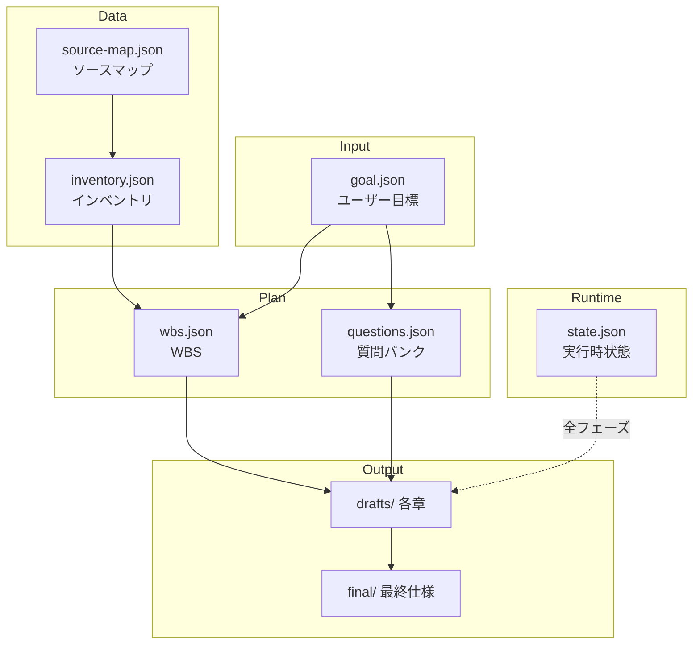
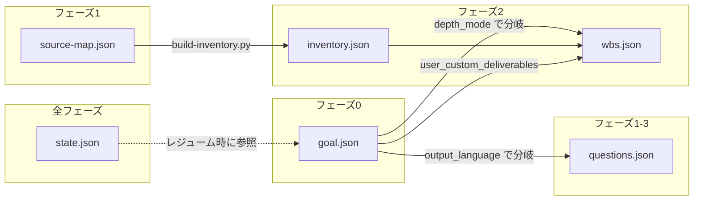

# 第5章: 設定オプション

## Sources Read

- `.opencode/skills/specback/SKILL.md` (lines 1-88)
- `.opencode/skills/specback/phase-0-setup.md` (lines 1-127)
- `.opencode/skills/specback/state-management.md` (lines 1-92)
- `.opencode/skills/specback/question-bank.md` (lines 1-55)
- `.opencode/skills/specback/phase-2-wbs.md` (lines 1-247)
- `.opencode/skills/specback/phase-3-investigate.md` (lines 1-278)
- `.opencode/skills/specback/scripts/coverage-check.py` (lines 1-942)
- `.opencode/skills/specback/scripts/source-map.py` (lines 1-50)
- `.opencode/skills/specback/scripts/build-knowledge-graph.py` (lines 1-50)
- `.specback/goal.json` (lines 1-12)
- `.specback/state.json` (lines 1-22)

## 5.1 specback の設定体系

specback は**3種類の設定ファイル**で動作を制御する。すべて `.specback/` ディレクトリ配下に JSON 形式で格納される。加えて、調査対象コードベースの構造を記録する `source-map.json` と `inventory.json` が WBS とともに生成される。



specback は環境変数に一切依存しない。すべての設定は `.specback/*.json` に集約される。

## 5.2 グローバル設定 (goal.json)

[REF: .opencode/skills/specback/phase-0-setup.md:99-116] に示すスキーマに従い、Phase 0 でユーザーとの対話を通じて生成される。

```json
{
  "output_language": "ja",
  "output_dir": "specs",
  "primary_reader": "maintenance_developer",
  "reader_action": "code_change",
  "granularity": "high_level_overview",
  "perspectives": ["functional_correctness"],
  "existing_docs": "none",
  "free_text_notes": "",
  "user_custom_deliverables": [],
  "depth_mode": "comprehensive"
}
```

各フィールドの意味は以下の通り。

| フィールド | 型 | デフォルト | 説明 |
|-----------|----|----------|------|
| `output_language` | string | `"en"` | 出力言語。`"en"` または `"ja"` の2値 [REF: .opencode/skills/specback/phase-0-setup.md:114] |
| `output_dir` | string | `".specback"` | 最終仕様の出力先ディレクトリ。カスタムパスも可 [REF: .opencode/skills/specback/phase-0-setup.md:115] |
| `primary_reader` | string | - | 読み手の種類 (`maintenance_developer`, `delivery_customer`, `sme`, `regulator`) [REF: .opencode/skills/specback/phase-0-setup.md:49-54] |
| `reader_action` | string | - | 読み手の行動 (`code_change`, `approval`, `audit`, `learning`) [REF: .opencode/skills/specback/phase-0-setup.md:56-62] |
| `granularity` | string | - | 粒度 (`high_level_overview`, `medium`, `detailed`) [REF: .opencode/skills/specback/phase-0-setup.md:63-68] |
| `perspectives` | string[] | - | 重視する観点の配列 (`functional_correctness`, `business_validity`, `security`, `operability`, `performance`) [REF: .opencode/skills/specback/phase-0-setup.md:69-76] |
| `existing_docs` | string | - | 既存ドキュメント対応 (`none`, `update`, `coexist`, `retire`) [REF: .opencode/skills/specback/phase-0-setup.md:77-83] |
| `free_text_notes` | string | `""` | ユーザーの自由記述ノート [REF: .opencode/skills/specback/phase-0-setup.md:91-96] |
| `user_custom_deliverables` | string[] | `[]` | `free_text_notes` から抽出されたカスタム成果物ファイル名リスト [REF: .opencode/skills/specback/phase-0-setup.md:92-96] |
| `depth_mode` | string | `"comprehensive"` | 調査深度モード。3値 (`comprehensive`, `outline`, `interactive`) [REF: .opencode/skills/specback/phase-3-investigate.md:6-21] |

### 5.2.1 depth_mode の3モード

[REF: .opencode/skills/specback/phase-3-investigate.md:6-21] で定義される3つの深度モード:

- **`comprehensive`**: 全品質ゲートを適用 (本文≥200行, REF≥10, Mermaid≥1, Sources Read≥5)。監査目的に適する。
- **`outline`**: テーブル優先構造。品質ゲートを解除し、代わりに全エンティティの網羅列挙を求める。レイヤー1 (Modules/Entities/Actions/Data/Dependencies) + レイヤー2 (Diagrams) の必須章構成 [REF: .opencode/skills/specback/phase-2-wbs.md:215-230]。
- **`interactive`**: `outline` と同様の章構成だが、Phase 5 の対話フェーズを必須とする。

各モードの選択基準と下流フェーズへの影響を以下に詳述する。

| 判断軸 | comprehensive | outline | interactive |
|--------|--------------|---------|-------------|
| 適用局面 | 監査・リリースブロッカー除去・完全な仕様書が必要な場合 | 初期偵察・概要把握・全容の棚卸しが目的の場合 | outline と同様だが、未解決点をPhase 5で対話解決したい場合 |
| Phase 3 の手順 | STEP A-F を全チャプターに適用 | レイヤー1/2のみ作成、深度追求は候補リストに留める | outline と同様 |
| Phase 5 | スキップ (任意) | スキップ (任意) | 必須 — 質問バンクの未解決アイテムをユーザーに問い合わせる |
| 品質ゲート | 全ゲート有効 (行数・REF数・Mermaid数など) | ゲート無効、代わりにMECE網羅性を検証 | ゲート無効、MECE網羅性を検証 |
| WBS構成 | 標準チャプター構成 (01〜98 + 予約章) | レイヤー構成 (Modules/Entities/Actions/Data/Dependencies/Diagrams) | レイヤー構成 (outline と同一) |
| 成果物の性質 | レビュー可能な最終品質の仕様書 | 構造化された目次＋発見事項一覧 | 対話で補完された構造化文書 |
| 書き直しの許容度 | 各チャプターの大幅な書き直しを許可 | スキーマに従った整形を優先、深堀りは候補リストに限定 | 調査後にユーザー対話で内容を確定 |

### 5.2.2 出力先ディレクトリ解決ルール

[REF: .opencode/skills/specback/phase-0-setup.md:88] に従い、出力先は以下のように解決される:

- `goal.json.output_dir` が `".specback"` (デフォルト) → 最終成果物は `.specback/final/` に配置
- カスタムパス (例: `"docs/specs"`) → 最終成果物は `docs/specs/` に直接配置
- ドラフトは常に `.specback/drafts/` に配置 (`output_dir` の影響を受けない)
- 状態ファイル (`state.json`, `goal.json`, `trace.json`) は常に `.specback/` に配置

この解決は以下のロジックで実装されている:

1. **ドラフト常置ルール**: 全フェーズで `.specback/drafts/` が書き込み先として使われる。`goal.json.output_dir` の値に依存しない [REF: .opencode/skills/specback/phase-0-setup.md:115]。
2. **最終成果物パス解決**: Phase 6 の publish 時、`output_dir` の値に応じてコピー先が決定される:
   - `".specback"` → `.specback/final/`
   - `"docs/specs"` → `docs/specs/` (プロジェクトルートからの相対パス)
3. **ディレクトリ自動生成**: カスタムパスが指定された場合、該当ディレクトリが存在しなければ Phase 6 で自動生成される。`mkdir -p` 相当の動作。
4. **状態ファイル不変ルール**: `state.json`, `goal.json`, `trace.json`, `questions.json`, `wbs.json` は常に `.specback/` 直下に配置される。これらは `output_dir` の影響を一切受けない。

`output_dir` がカスタムパスに設定されている場合でも、再開 (resume) 時は常に `.specback/` の状態ファイルを読み取る。この設計により、最終成果物の出力先を変更しても実行状態が失われることはない。

### 5.2.3 設定検証ルール

goal.json の各フィールドは、以下のルールで検証される。検証は主に Phase 0 の初期化時と `coverage-check.py` の実行時に行われる。

**型検証**:
- `output_language` は `"en"` または `"ja"` のみ許可 [REF: .opencode/skills/specback/phase-0-setup.md:114]
- `primary_reader` は定義済み列挙値のいずれか (不明な値は Phase 0 のユーザー入力段階で弾かれる)
- `reader_action` / `granularity` / `existing_docs` も同様に定義済み列挙値のみ許可
- `perspectives` は文字列配列。空配列は許可されるが、`coverage-check.py` が警告を出力する
- `user_custom_deliverables` はファイル名が `^[a-z][a-z0-9_-]*\.md$` に適合することを確認 [REF: .opencode/skills/specback/phase-0-setup.md:92]
- `depth_mode` は `"comprehensive"`, `"outline"`, `"interactive"` の3値。大文字小文字は区別される

**整合性検証**:
- `output_dir` の値が `.specback` の場合、`final/` サブディレクトリが暗黙的に使用される。カスタムパスの場合もパス区切り文字が正しいことのみ確認し、実在性は Phase 6 まで要求しない。
- `output_language` と `free_text_notes` の言語が一致しているかの検証は行われない（ユーザーの自由記述であるため）。

**実行時検証**:
- `coverage-check.py` は読み込み時に `goal.json` の必須フィールド存在を確認する [REF: .opencode/skills/specback/scripts/coverage-check.py:55]
- 不明なフィールドが追加されていてもエラーにはならない（前方互換性のため）
- `wbs.json` の chapter エントリが `goal.json.output_language` と整合しているかの確認は Phase 4 の検証範囲に含まれる

**デフォルト値適用ルール**:
- すべてのフィールドにデフォルト値が定義されているわけではない。`output_language` のデフォルトは `"en"`、`depth_mode` のデフォルトは `"comprehensive"`、`free_text_notes` のデフォルトは `""`、`user_custom_deliverables` のデフォルトは `[]`。
- デフォルト値を持たないフィールド (`primary_reader`, `reader_action`, `granularity` など) は Phase 0 で必ずユーザー入力が必要となる。
- デフォルト値の適用は Phase 0 の `goal.json` 書き込み時に行われる。Phase 3 以降で `goal.json` が読まれる際には、すべてのフィールドが明示的に値を持つことが保証される。

### 5.2.4 設定フィールド間の相互作用

各設定フィールドは独立して定義されるが、組み合わせによって Phase 3 以降の挙動が変化する。

**`primary_reader` × `granularity`**:
- `maintenance_developer` + `detailed`: 最も詳細な実装レベルの仕様が生成される。クラス単位の振る舞いやメソッドシグネチャの説明が必須となる。
- `delivery_customer` + `high_level_overview`: ビジネスロジックの概要を重視し、技術的詳細は最小限に抑えられる。
- `regulator` + `detailed`: コンプライアンス要件と実装の対応関係をトレース可能な形で記述する。

**`reader_action` × `depth_mode`**:
- `audit` の場合は `comprehensive` が強く推奨される。品質ゲートが監査証跡として機能する。
- `learning` + `outline` は構造的な学習教材として適する。概要と全体像の把握に集中できる。
- `approval` + `interactive`: 承認判断に必要な情報を対話で補完しながら仕様を固める。

**`granularity` × `depth_mode`**:
- `detailed` + `comprehensive`: 最もリソースを消費する組み合わせ。全品質ゲートが有効かつ詳細レベルでの記述が要求される。
- `high_level_overview` + `outline`: 最小構成。概要レベルの記述とMECE網羅性のみが求められる。

**`perspectives` × `granularity`**:
- `security` + `detailed`: 認証・認可・入力検証の各ポイントを網羅したセキュリティセクションが必須となる。
- `performance` + `high_level_overview`: アーキテクチャレベルのパフォーマンス特性に焦点を当て、詳細な計測値は省略される。
- `business_validity` + `medium`: ビジネスルールの正確性とユースケースの網羅性を中程度の粒度で記述する。

**`existing_docs` × `output_dir`**:
- `update` または `coexist` の場合は、既存ドキュメントのパスと `output_dir` が衝突しないことを Phase 0 で確認することを推奨。
- `retire` の場合は既存ドキュメントが出力先に存在してもエラーにならない。上書きが許容される。

**`user_custom_deliverables` × 品質ゲート**:
- カスタム成果物は `comprehensive` モードでも品質ゲートが免除される [REF: .opencode/skills/specback/phase-0-setup.md:96]。
- 免除対象はチェック1-5 (REF数・行数・コードブロック数・Mermaid数・Sources Read数) であり、チェック12 (ファイル存在 + 空でない本文) は適用される。

## 5.3 実行時状態 (state.json)

[REF: .opencode/skills/specback/state-management.md:3-22] でスキーマが定義される。

```json
{
  "current_phase": 3,
  "phase_progress": {
    "phase_3": {
      "total_subtasks": 12,
      "completed_subtasks": 8,
      "blocked_subtasks": ["chapter_payment", "chapter_auth"]
    }
  },
  "started_at": "2026-05-01T10:00:00+09:00",
  "last_updated": "2026-05-01T14:32:15+09:00",
  "session_history": [
    {"timestamp": "2026-05-01T10:00:00+09:00", "phase": 0, "event": "started"},
    {"timestamp": "2026-05-01T10:15:00+09:00", "phase": 1, "event": "transitioned"}
  ]
}
```

各フィールド:

| フィールド | 型 | 説明 |
|-----------|----|------|
| `current_phase` | int | 現在のフェーズ番号 (0-7) |
| `phase_progress` | object | フェーズ別進捗。`total_subtasks` / `completed_subtasks` / `blocked_subtasks` を持つ |
| `started_at` | string (ISO 8601) | セッション開始時刻 |
| `last_updated` | string (ISO 8601) | 最終更新時刻 |
| `session_history` | array | イベント履歴。各エントリは `timestamp` / `phase` / `event` を持つ |

### 5.3.1 レジューム動作

[REF: .opencode/skills/specback/state-management.md:24-63] に従い、既存の `state.json` を検出するとレジュームフローが起動する。以下の選択肢をユーザーに提示する:

1. **続きから再開**: 現在のフェーズの残タスクを完了
2. **フェーズ巻き戻し**: 指定フェーズから再開
3. **全リセット**: `.specback/` を削除して Phase 0 から開始
4. **詳細表示**: 状態を確認してから判断

レジューム時のメッセージは `goal.json.output_language` でレンダリングされる [REF: .opencode/skills/specback/state-management.md:26]。

## 5.4 Question Bank (questions.json)

[REF: .opencode/skills/specback/question-bank.md:3-27] でデータ構造と運用ルールが定義される。

```json
{
  "id": "Q-042",
  "generated_at_phase": "investigation",
  "category": "business_rule",
  "body": "Is the 3-retry of this payment process driven by a technical constraint or a business requirement?",
  "evidence": {
    "file": "src/payment/PaymentRetryHandler.php",
    "lines": "45-58",
    "code_excerpt": "for ($i = 0; $i < 3; $i++) { ... }"
  },
  "related_inventory_ids": ["INV-027"],
  "severity": "important",
  "resolution_type": "ask_sme",
  "status": "open",
  "answer": null,
  "answerer": null,
  "answered_at": null,
  "related_question_ids": []
}
```

### 5.4.1 7カテゴリ

[REF: .opencode/skills/specback/question-bank.md:29-37]:

1. `business_rule` — ビジネスルールに関する疑問
2. `architecture_decision` — アーキテクチャ判断に関する疑問
3. `data_model_intent` — データモデルの意図に関する疑問
4. `external_integration` — 外部システム連携に関する疑問
5. `naming_history` — 命名・歴史的経緯に関する疑問
6. `operational_requirement` — 運用要件に関する疑問
7. `security_compliance` — セキュリティ・コンプライアンスに関する疑問

### 5.4.2 3段階の Severity

[REF: .opencode/skills/specback/question-bank.md:41-45]:

- **`critical`**: 解決なしに章を書けない。該当セクションは `[BLOCKED]` となる [REF: .opencode/skills/specback/phase-3-investigate.md:120-122]。
- **`important`**: 推論で記述可能だが信頼度が低い。`[CONFIDENCE: LOW]` マーカーを残す。
- **`nice-to-have`**: 細部の確認。推論で記述し Phase 5 で軽く確認する。

### 5.4.3 Status 遷移

[REF: .opencode/skills/specback/question-bank.md:47-53]:

```
open → asked → answered
            ↓
            abandoned
```

- `open`: 未着手
- `asked`: ユーザーに質問済み
- `answered`: 回答取得済み
- `abandoned`: 回答不能と判断 (最終仕様の `99-unresolved.md` に集約される)

Question Bank は **3つのタイミング** で更新される [REF: .opencode/skills/specback/SKILL.md:31]: フェーズ1 (偵察後)、フェーズ3 (調査中に各サブエージェントが追加)、フェーズ4 (検証時)。完了時には `coverage-check.py` により最低10件以上の質問が要求される [REF: .opencode/skills/specback/scripts/coverage-check.py:44]。

## 5.5 WBS (wbs.json)

[REF: .opencode/skills/specback/phase-2-wbs.md:99-133] でスキーマが定義される。Phase 2 で生成され、全チャプターとインベントリアイテムの対応付けを保持する。

```json
{
  "chapters": [
    {
      "chapter_id": "ch-configuration-options",
      "chapter_title": "第5章: 設定オプション",
      "file_name": "05-configuration-options.md",
      "kind": "standard",
      "assigned_inventory_ids": [],
      "status": "pending"
    }
  ]
}
```

各章は `kind` により3種類に分類される [REF: .opencode/skills/specback/phase-2-wbs.md:9-28]:

- **`standard`**: 標準章。ファイル名は `^(0\d|[1-9]\d)-[a-z0-9-]+\.md$` に従う。
- **`reserved`**: 予約章。`00-metadata.md` / `99-unresolved.md` / `traceability.md` の3つ。
- **`user_custom`**: ユーザーカスタム章。ファイル名は `free_text_notes` から抽出され、`^[a-z][a-z0-9_-]*\.md$` に従う [REF: .opencode/skills/specback/phase-0-setup.md:92-96]。

## 5.6 source-map.json と inventory.json

### 5.6.1 source-map.json

[REF: .opencode/skills/specback/scripts/source-map.py:25-48] で出力スキーマが定義される。ソースコードから言語固有の正規表現でユニットを抽出する。

```json
{
  "schema_version": "0.1.0",
  "target_root": "./src",
  "generated_at": "2026-07-30T00:00:00+09:00",
  "stats": {
    "files_scanned": 856,
    "files_excluded": 12,
    "units_total": 5234,
    "by_kind": {"ruby_class": 230, "rails_route": 189, ...}
  },
  "units": [
    {
      "id": "SRC-0001",
      "path": "app/models/issue.rb",
      "line_range": [1, 440],
      "kind": "ruby_class",
      "name": "Issue",
      "signature": "class Issue < ActiveRecord::Base",
      "fingerprint": "sha1:..."
    }
  ]
}
```

### 5.6.2 inventory.json

[REF: .opencode/skills/specback/phase-2-wbs.md:134-199] の手順で `source-map.json` から機械的に変換される。

```json
{
  "units": [
    {
      "id": "INV-001",
      "type": "controller",
      "name": "IssuesController",
      "file": "app/controllers/issues_controller.rb",
      "line": 20,
      "covered_by": [],
      "related_source_ids": ["SRC-0142", "SRC-0143"]
    }
  ]
}
```

最小 INVs 数は `max(50, files_scanned // 20)` で自動計算される [REF: .opencode/skills/specback/phase-2-wbs.md:166-168]。

## 5.7 品質ゲートと設定の関係

`depth_mode` は品質ゲートの適用条件を決定する [REF: .opencode/skills/specback/scripts/coverage-check.py:586-594]:

| ゲート | comprehensive | outline / interactive |
|--------|--------------|----------------------|
| 本文 ≥200行 | 必須 | スキップ |
| REF ≥10件 | 必須 | スキップ |
| コードブロック ≥3 | 必須 | スキップ |
| Mermaid ≥1 | 必須 | スキップ |
| Sources Read ≥5 | 必須 | スキップ |
| 全エンティティ網羅 | 非必須 | 必須 (MECE基準) |

ユーザーカスタム成果物 (`user_custom_deliverables`) は上記ゲートが免除され、代わりに「存在 + 空でない本文」のみがチェックされる [REF: .opencode/skills/specback/scripts/coverage-check.py:24-30]。

## 5.8 環境変数

specback は環境変数に一切依存しない。全設定は `.specback/` 配下の JSON ファイルに集約される。これは設計原則として明文化されており、プロジェクトルートからの再配置や CI/CD パイプラインでの再現性を保証する。

代わりに specback は `.skill-path` ファイルでスキールートの絶対パスを管理する [REF: .opencode/skills/specback/phase-0-setup.md:14-19]:

```
# .specback/.skill-path
/Users/genya/GitHub/specback/.opencode/skills/specback
```

このパス解決方式により、スクリプト呼び出しは `$(cat .specback/.skill-path)/scripts/<name>.py` の形式で記述でき、インストール場所の変更に柔軟に対応できる。

### 5.8.1 .skill-path の解決詳細

`.skill-path` によるパス解決は以下の手順で動作する [REF: .opencode/skills/specback/phase-0-setup.md:14-19]:

1. **Phase 0 での書き込み**: スキルルートの絶対パスを `.specback/.skill-path` に書き込む。このパスは SKILL.md が存在するディレクトリを指す。
2. **全フェーズでの読み取り**: スクリプトやリファレンスの解決は `$(cat .specback/.skill-path)/scripts/<name>.py` の形式で行う。コード中にハードコードされたパスは一切存在しない。
3. **フォールバック機構**: `.skill-path` が存在しない場合、環境変数 `SKILL_DIR` を参照する。両方とも未設定の場合はエラーとなり、Phase 0 からの再初期化が必要となる。

**レジューム時の再解決**:

スキルが再インストールされた場合、`.skill-path` の内容が古いパスを指す可能性がある。この問題に対処するため、レジュームフローは以下の手順で `.skill-path` を検証する [REF: .opencode/skills/specback/phase-0-setup.md:20]:

1. 既存の `.skill-path` を読み取り、参照先のディレクトリに SKILL.md が存在するか確認する
2. 存在しない場合: ユーザーに新しいスキルパスを問い合わせ、`.skill-path` を更新する
3. 存在する場合: そのまま続行する

この設計により、スキルのアップグレードやインストール場所の変更が発生しても、進行中のセッションが破綻しない。また、`.skill-path` の内容は実行中に変更されることはない。変更が必要な場合は必ずレジュームフローを経由する。

## 5.9 設定間の依存関係

各設定ファイルの依存関係を以下に示す。



全ファイルは `.specback/` 配下に格納され、スキーマは各フェーズのマークダウンファイルで定義される。JSON スキーマファイル (.schema.json) は提供されていないが、`coverage-check.py` が実行時に整合性を検証する [REF: .opencode/skills/specback/scripts/coverage-check.py:1-55]。

## 5.10 設定がパイプラインに与える影響の具体例

各設定値の組み合わせが実際のパイプライン挙動にどう影響するか、代表的なシナリオを示す。

### 5.10.1 シナリオA: 監査向け包括的仕様書

```json
{
  "output_language": "ja",
  "primary_reader": "regulator",
  "reader_action": "audit",
  "granularity": "detailed",
  "depth_mode": "comprehensive"
}
```

- Phase 3: 全チャプターにSTEP A-Fを適用。200行/10REF/Mermaidの制約がかかる。
- Phase 4: `coverage-check.py` が全ゲートを通過するまで修正が繰り返される。
- Phase 5: スキップ (任意)。すべての疑問は Phase 3 の調査で解決済みであることが期待される。
- Phase 6: ドラフトが `.specback/final/` にコピーされる。

### 5.10.2 シナリオB: チーム内知識共有のための概要資料

```json
{
  "output_language": "en",
  "primary_reader": "maintenance_developer",
  "reader_action": "learning",
  "granularity": "high_level_overview",
  "depth_mode": "outline"
}
```

- Phase 3: レイヤー1 (Modules/Entities/Actions/Data/Dependencies) とレイヤー2 (Diagrams) のみ作成。
- Phase 4: MECE網羅性が検証されるが、行数やREF数のゲートはスキップ。
- Phase 5: スキップ (任意)。概要目的のため詳細な確認は不要。
- WBS構成: `depth_mode = outline` により、標準チャプターの代わりにレイヤー構成が WBS に反映される。

### 5.10.3 シナリオC: 顧客向け仕様書の対話的作成

```json
{
  "output_language": "ja",
  "primary_reader": "delivery_customer",
  "reader_action": "approval",
  "granularity": "medium",
  "depth_mode": "interactive",
  "existing_docs": "coexist"
}
```

- Phase 3: outline と同様のレイヤー構成でチャプターを作成する。
- Phase 4: MECE網羅性が検証される。行数やREF数のゲートはスキップ。
- Phase 5: 必須。質問バンクの未解決アイテムをユーザーに提示し、回答を得る。
- Phase 6: 既存ドキュメントと共存する形で最終成果物が配置される。

### 5.10.4 シナリオD: セキュリティ評価目的の詳細仕様書

```json
{
  "output_language": "en",
  "primary_reader": "sme",
  "reader_action": "audit",
  "granularity": "detailed",
  "perspectives": ["security", "functional_correctness"],
  "depth_mode": "comprehensive"
}
```

- Phase 1: ソースマップ生成時にセキュリティ関連のユニット (認証・認可・暗号化処理) にフラグが立てられる。
- Phase 3: セキュリティ観点からの深堀り調査が全チャプターに追加される。
- Phase 4: 品質ゲートに加えて、セキュリティ観点のカバレッジが重点的にチェックされる。
- Phase 6: 最終成果物は `.specback/final/` に出力され、監査証跡として保存される。

## 5.11 JSONスキーマの後方互換性

specback の設定 JSON 群には公式の JSON Schema ファイル (`.schema.json`) が存在しない。代わりに `coverage-check.py` が実行時に整合性を検証する。この設計には後方互換性に関する以下の含意がある。

### 5.11.1 フィールド追加の互換性

新しいバージョンの specback で `goal.json` に未知のフィールドが追加された場合、旧バージョンの specback はそのフィールドを無視する。`coverage-check.py` は未知フィールドに対してエラーを出さないため、前方互換性が確保されている。逆に、旧バージョンの specback で新しいフィールドを含む `goal.json` を読み込んでも、既存フィールドの動作は変わらない。

### 5.11.2 列挙値の拡張

`primary_reader`, `reader_action`, `granularity` などの列挙型フィールドに新しい値が追加された場合、従来の値を持つ設定ファイルは引き続き読み込み可能である。新しい値が設定されたファイルを旧バージョンで読み込んだ場合、未知の値はデフォルト値として扱われる。ただし、`depth_mode` に未知の文字列が指定された場合は `coverage-check.py` がエラーとする。

### 5.11.3 state.json のスキーマ進化

`state.json` は実行時にのみ書き換えられるため、スキーマの進化は自動的に行われる。旧バージョンで生成された `state.json` は新しいフィールドが不足している可能性があるが、レジューム時にデフォルト値で補完される。`phase_progress` の構造が変更された場合でも、旧形式のデータは読み取り時に正規化される。

### 5.11.4 将来のJSON Schema導入計画

現在 `.schema.json` は提供されていないが、バリデーションロジックが `coverage-check.py` に集中しているため、将来的に JSON Schema ファイルを生成することは容易である。その場合も、`coverage-check.py` 側の検証を残すことで二重のバリデーションが可能になる。JSON Schema 導入の主な動機は、IDE 上での入力補完と、CI パイプラインでの事前検証である。
