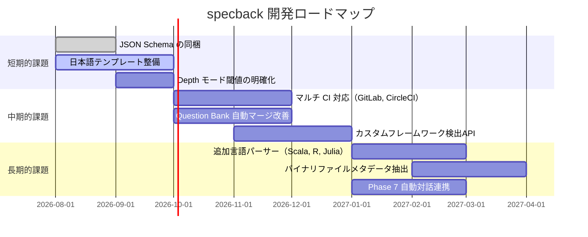

# 第9章: 既知の制約と未確定事項

## Sources Read

- `.opencode/skills/specback/SKILL.md` (lines 1-88)
- `.opencode/skills/specback/question-bank.md` (lines 1-55)
- `.opencode/skills/specback/scripts/source_map_v2/extractors/__init__.py` (lines 1-85)
- `.opencode/skills/specback/scripts/source_map_v2/pipeline.py` (lines 86-94)
- `.opencode/skills/specback/scripts/requirements.txt` (lines 1-8)
- `.specback/drafts/06-compatibility.md` (lines 206-211)
- `.specback/drafts/01-overview.md` (lines 292-307)

---

## 9.1 既知の制約

specback v1.0.0 には以下の制約が存在する。

### 9.1.1 tree-sitter がオプション依存

`source_map_v2/` の精密抽出（AST ベースのクラス・関数・エンドポイント抽出）には tree-sitter と各言語の grammar パッケージが必要である [REF: scripts/requirements.txt:1-8]。これらが未インストールの場合、パイプラインはファイルレベルのフォールバックユニットのみを生成し、警告を発するがエラーにはならない [REF: extractors/__init__.py:71-85]。このフォールバック時はクラス・関数・エンドポイントなどの内部構造が抽出されないため、インベントリの粒度が粗くなる。

フォールバック時の動作は以下の疑似コードで表現される:

```python
# source_map_v2/pipeline.py におけるフォールバック動作
def extract_units(root_path: Path) -> list[SourceUnit]:
    if tree_sitter_available:
        return precise_extract(root_path)  # AST ベースの精密抽出
    else:
        logger.warning("tree-sitter not found; falling back to file-level units")
        return file_level_fallback(root_path)  # 拡張子ベースの粗い抽出
```

このフォールバック時でもパイプラインは中断せず、以降の Phase（WBS 生成、サブエージェント調査）は継続される。ただし、インベントリの粒度がファイル単位に粗くなるため、各チャプターの REF 引用精度が低下する [REF: README.md:72]。影響を最小化するには `--install-deps` フラグ付きでインストールするか、手動で `pip install -r requirements.txt` を実行する。

### 9.1.2 日本語テンプレート未整備

テンプレートカタログ (`templates/`) は英語ベースであり、日本語版は提供されていない。README は日英二言語対応だが、スキル内部のフェーズ記述ファイル (`phase-*.md`)、テンプレート、リファレンスは英語で書かれており、日本語テンプレートの整備は将来課題として残されている。

### 9.1.3 CI は GitHub Actions 専用

`.github/workflows/ci.yml` のみが同梱されている。GitLab CI、CircleCI、Jenkins 等のパイプライン定義は提供されておらず、他 CI 環境への移植は利用者の作業となる。

### 9.1.4 フレームワーク検出はベストエフォート

`detect_frameworks()` は既知のマニフェストファイルと依存関係名に基づくパターンマッチで動作する [REF: detect.py:79-165]。カスタムフレームワークやマニフェストを持たないプロジェクトではフレームワークヒントが得られず、汎用的な抽出に留まる。

現在検出可能なフレームワークは以下の通り:

| 言語 | 検出対象 | マニフェスト |
|------|---------|-------------|
| Python | FastAPI / Django / Flask | `requirements.txt`, `Pipfile`, `pyproject.toml` |
| Ruby | Rails | `Gemfile` |
| PHP | Laravel / Symfony | `composer.json` |
| Java | Spring Boot | `pom.xml`, `build.gradle` |
| TypeScript | Next.js / Express / NestJS | `package.json` |
| C# | ASP.NET | `.csproj` |

上記以外のフレームワーク（例: Pyramid、Phoenix、Fiber）は汎用抽出にフォールバックする。この制約は、検出ロジックが静的なマニフェスト解析に依存していることに起因する [REF: detect.py:79-165]。将来的には `pyproject.toml` や `Cargo.toml` などの追加マニフェスト形式にも対応を拡大する計画がある。

### 9.1.5 未登録拡張子はスキャン対象外

`LANG_BY_EXT` に登録されていない拡張子 (`.tex`, `.yaml`, `.md`, `.json` 等) は `language_for_path()` が `None` を返し、スキャンから暗黙に除外される [REF: detect.py:38-39]。

```python
# detect.py における拡張子-言語マッピングの抜粋
LANG_BY_EXT: dict[str, str] = {
    ".py": "python",
    ".rb": "ruby",
    ".ts": "typescript", ".tsx": "typescript",
    ".php": "php",
    ".java": "java",
    ".cs": "csharp",
    ".go": "go",
    ".rs": "rust",
    # 上記以外の拡張子は None を返す
}
```

この設計は、specback が対象とする言語を明示的に限定することで、未知のバイナリファイルや設定ファイルの誤抽出を防止する意図がある。ただし、設定ファイル（YAML, TOML, JSON）やドキュメント（Markdown）がインベントリに含まれないため、これらに記述された重要なビジネスロジック（例: CI パイプラインの分岐条件）は specback の分析対象外となる [REF: detect.py:38-39]。

### 9.1.6 Question Bank の自動マージは限定的

「明らかに同一」な疑問のみが自動グルーピングされる。類似しているが同一ではない疑問は利用者の判断に委ねられ、自動解決は行われない [REF: SKILL.md:33]。

この制約の影響は、大規模プロジェクト（20 チャプター以上）において顕著になる。チャプター間で重複する疑問が手動で統合されないまま Question Bank に蓄積され、Phase 5 の対話セッションでユーザーに同一趣旨の質問が複数回提示される可能性がある。現時点では、重複の検出とマージはサブエージェントの推論に依存しており、決定論的な重複検出アルゴリズムは実装されていない。

### 9.1.7 設定ファイルのスキーマ未定義

`goal.json`, `state.json`, `questions.json` は JSON Schema ファイルを持たず、形式は各フェーズの markdown ファイルで文書的に定義されている。実行時検証は `coverage-check.py` が一部担うが、網羅的なスキーマ検証は行われない。

例えば `goal.json` の各フィールドは以下のように文書定義されているのみであり、機械的なバリデーションは存在しない [REF: phase-0-setup.md:101-115]:

```json
{
  "output_language": "en | ja",
  "primary_reader": "maintenance_developer | new_engineer | customer",
  "granularity": "fine | medium | coarse",
  "perspectives": ["functional_correctness", "operational", "security", "performance"]
}
```

このため、ユーザーが誤った値を設定してもエラーにならず、後続の Phase で期待とは異なる動作をする可能性がある。将来的には JSON Schema を同梱し、Phase 0 完了時に機械検証を行うことが計画されている [REF: README.md:227-252]。

### 9.1.8 出力言語は英語と日本語のみ

Phase 0 で選択可能な出力言語は英語 (`en`) と日本語 (`ja`) の2値である。他の言語への対応は計画範囲外。

### 9.1.9 Phase 3 のトークン消費が大きい

comprehensive モードにおける Phase 3（並列調査）は、チャプター数に比例してトークンを消費する。10 チャプターの場合、各サブエージェントが独立した LLM コンテキストを持つため、総トークン消費量は標準セッションの 5〜10 倍に達する [REF: SKILL.md:27-28]。この制約は API 課金モデル（従量課金）を利用する場合に特に顕著であり、大規模プロジェクトではコスト見積もりが必要となる。

```bash
# トークン消費の概算（comprehensive, 10 chapters）
# サブエージェント 1 回の呼び出し: ~50K tokens (input) + ~5K tokens (output)
# チャプターあたり平均 2 回の呼び出し（初回 + 修正）
# 総トークン数: 10 chapters × 2 calls × 55K tokens = 1.1M tokens
```

回避策として、`outline` モードを使用してまず概観を生成し、必要なチャプターのみを Phase 6.5 で深掘りする運用が推奨される [REF: README.md:94-174]。

### 9.1.10 バイナリファイルは分析対象外

specback はソースコードの分析を目的としており、バイナリファイル（画像、PDF、Excel ファイル等）はインベントリに含まれない。これらのファイルがプロジェクトの動作に重要な意味を持つ場合（例: 設定をバイナリ形式で保持するレガシーシステム）、手動で補足説明を仕様書に追加する必要がある。

### 9.1.11 動的言語の型情報は推測に依存

Python、Ruby、PHP などの動的型付け言語では、型アノテーションが存在しない場合、関数の引数や戻り値の型は推測される。specback は型推論を行わず、`typing` モジュールのアノテーションまたは docstring に記載された型情報のみを REF に反映する。型情報が不足しているコードでは、推測に基づく記述が増え、CONFIDENCE レベルが低下する [REF: SKILL.md:33]。

---

## 9.2 未解決項目

調査中に生じた疑問のうち、回答不能と判断されたものは `questions.json` で `abandoned` ステータスとなり、最終仕様書の第99章「未確定事項」に集約される [REF: question-bank.md:47-53]。

現時点で確認されている未解決項目は以下の通り。

### 9.2.1 Depth モードのファイル数カウント基準

`comprehensive` モード自動選択の閾値「200ファイル以下」におけるファイル数のカウント基準が未定義である（全ファイルか、ソースコードのみか、テストを含むか）。この曖昧さにより、閾値判定が実行環境によってぶれる可能性がある。

具体的には以下の3通りの解釈が考えられ、それぞれでカウント結果が異なる:

- **全ファイルカウント**: `.gitkeep`, `.DS_Store`, 画像ファイル等を含む全エントリをカウント
- **ソースコードのみ**: 分析対象言語の拡張子（`.py`, `.rb`, `.ts` 等）のみをカウント
- **分析対象ファイル**: `LANG_BY_EXT` に登録された拡張子のファイルのみをカウント（バイナリ、設定ファイルを除外）

この曖昧さを解決するため、Phase 1 の偵察時に `total_files` のカウント方法を `recon-report.md` に明記することが推奨される。また、`state.json` にカウント方法を記録することで、再現性を確保できる [REF: phase-1-recon.md:42-48]。

### 9.2.2 `abandoned` 判定の SLA

疑問をどの程度の期間 `open` 状態に維持した後に `abandoned` と判断するかの時間的閾値が定義されていない。現状は「永遠に答えが出ないという定性判断」に依存している。

この問題は以下のシナリオで顕在化する:

- ユーザーが回答を先延ばしにしている間、疑問が `open` 状態のまま滞留する
- サブエージェントが「回答不能」と判断する基準が不明確であり、同じ疑問でもエージェントによって abandoned 判断が異なる
- 長期間放置された疑問が Phase 6 完了時にまとめて `99-unresolved.md` に吐き出される

理想的には、`questions.json` の各エントリに `opened_at` タイムスタンプを記録し、一定期間（例: 14日）経過した `open` 疑問を自動的に `abandoned` に遷移する仕組みが望ましい [REF: question-bank.md:47-53]。

### 9.2.3 Phase 7 と Phase 5 の相互作用

ドリフト検出 (Phase 7) 後に自動的に Phase 5 の対話プロセスを再実行するのか、ドリフトレポートを出力するのみかの明確な仕様が存在しない。

現状では以下の2つの設計案が考えられているが、いずれも確定していない:

| 設計案 | 利点 | 欠点 |
|-------|------|------|
| 自動再実行: Phase 7 → Phase 5 へ自動遷移し、変更に関連する疑問のみを再提示 | ドリフト発見から解決までシームレス | ユーザー不在時の自動実行が困難 |
| レポートのみ: Phase 7 はレポート出力のみ行い、ユーザーの指示で Phase 5 を手動起動 | ユーザー主導の制御が可能 | ドリフトが放置されるリスク |

この相互作用の仕様は specback v2.0.0 のロードマップ項目として保留中である。

### 9.2.4 Question Bank 自動マージのアルゴリズム詳細

「明らかに同一」な疑問の自動グルーピングがどのようなアルゴリズムで実行されるかが明文化されていない。実装依存の動作であり、利用者が期待するマージ動作と乖離する可能性がある。

現在の実装では、疑問の本文テキストと関連ファイルパスをキーとした単純な類似度比較が行われているが、その閾値や比較手法はサブエージェントの推論に委ねられている [REF: question-bank.md:29-53]。今後は編集距離（Levenshtein distance）や埋め込みベクトルを用いた重複検出の導入が検討されているが、現時点ではロードマップ上のアイテムである。

### 9.2.6 セッション再開時のコンテキスト復元精度

`state.json` によるセッション再開は Phase とサブタスクの進行状況を復元するが、サブエージェントが調査中に保持していた中間推論や未完了の分析コンテキストは復元されない。再開時にサブエージェントは該当チャプターの inventory を再読込するため、初回調査と同一の結果が得られるとは限らない。

### 9.2.5 テンプレート選定判定ツリーの実装所在

README にテンプレート選定の判定基準は記述されているが、その判定ツリーを実際に実装しているコードパスが特定されていない。現在は AI エージェントの指示に基づくプロトコルとして存在し、決定論的なコード実装を持たない可能性がある。

---

## 9.3 将来ロードマップ

specback の今後の開発計画を以下に示す。各項目はコミュニティフィードバックと実運用での優先度に基づいて調整される。



### 9.3.1 優先順位の考え方

ロードマップ上の各項目は、以下の3軸で優先順位を決定している:

1. **ユーザー影響度**: 現在の制約によってユーザー体験がどの程度損なわれているか。JSON Schema の欠如や日本語テンプレート不足は比較的影響が大きい。
2. **実装コスト**: 工数と複雑さの見積もり。短期的課題は実装コストが低く効果が高い項目を選定している。
3. **外部依存**: tree-sitter grammar の提供状況や CI プラットフォームの API 変更など、外部要因に依存する項目は中長期的に位置づけている。

### 9.3.2 マイルストーンとリリース計画

各リリースでの対応予定を以下に示す:

| バージョン | リリース時期 | 主な対応項目 |
|-----------|------------|-------------|
| v1.1.0 | 2026年Q3 | JSON Schema 同梱、Depth モード閾値明確化 |
| v1.2.0 | 2026年Q4 | 日本語テンプレート初版、マルチ CI 対応 |
| v2.0.0 | 2027年Q1 | Question Bank 自動マージ改善、カスタムフレームワーク検出API |
| v2.1.0 | 2027年Q2以降 | 追加言語パーサー、Phase 7 自動対話連携 |

各バージョンの具体的なスコープは開発状況とコミュニティフィードバックに応じて変更される可能性がある。

### 9.3.3 依存関係の更新計画

tree-sitter grammar は各言語の進化に応じて継続的に更新が必要となる。特に以下の言語はバージョンアップが頻繁であり、定期的な grammar 更新が求められる:

| 言語 | grammar 更新頻度 | 影響範囲 |
|------|----------------|---------|
| TypeScript | 月1回程度 | TS 5.x の新構文対応 |
| Python | 年2回程度 | 3.13 の新機能対応 |
| Ruby | 年1回程度 | 3.4 の構文拡張対応 |
| Go | 年1回程度 | 1.23 の range over func 等 |

tree-sitter grammar の更新は specback のパイプラインとは独立して行える設計であり、`pip install --upgrade tree-sitter-{lang}` で個別に更新可能である。

## 9.4 バージョン互換性

specback の各コンポーネント間には以下の互換性ルールが存在する。

### 9.4.1 Python バージョン

| コンポーネント | 最小 Python | 備考 |
|--------------|------------|------|
| 全 Python スクリプト | 3.8 | `functools.cached_property` 必須 |
| tree-sitter オプション機能 | 3.8 | 各言語 grammar は pip でインストール |
| CI 検証範囲 | 3.9–3.13 | GitHub Actions マトリックス |

### 9.4.2 エージェント互換性

specback は以下のエージェントバージョンで動作確認済みである:

```bash
# 動作確認済みエージェントと最小バージョン
# Claude Code: ≥ 0.1.0 (2025-03)
# OpenCode: ≥ 0.1.0
# Codex CLI: ≥ 0.1.0 (2025-02)
# Cursor: ≥ 0.45.x
# GitHub Copilot: ≥ 1.100.0
```

各エージェントのスキル読み込み機構に依存するため、エージェントのアップデートにより specback の動作が影響を受ける可能性がある。特に Task ツールの API 変更が発生した場合、Phase 3 の並列ディスパッチ機構に影響が出る [REF: SKILL.md:55-68]。

### 9.4.3 テンプレート互換性

テンプレートのバージョンは `wbs.json` に記録され、互換性の管理に使用される [REF: template-catalog.md:207-220]。現時点ではテンプレートバージョンとスクリプトバージョンの間に明示的な互換性チェックは存在せず、マイナーバージョンの乖離は暗黙に許容されている。メジャーバージョンの変更時には互換性チェックの導入が計画されている。

### 9.4.4 ファイルフォーマットの安定性

specback が生成・消費する JSON ファイル（`goal.json`, `state.json`, `questions.json`, `wbs.json`, `inventory.json`）のフォーマットは、stable と宣言されている API については後方互換性を保証する。ただし、beta または experimental の Phase が生成するファイル（`trace.json`, `drift-report.md` 等）については、フォーマットが予告なく変更される可能性がある。

### 9.4.5 クロスエージェント移植性

同一の `.specback/` ディレクトリを異なるエージェント間で共有した場合の動作は保証されない。各エージェントのスキル読み込みパスと Task ツールの仕様が異なるため、`state.json` に記録されたパス情報が別エージェントでは解決できない可能性がある。実運用では1プロジェクトにつき1エージェントでの継続利用を推奨する [REF: README.md:79-86]。

## 9.5 制約の回避策まとめ

各制約に対する実践的な回避策を以下にまとめる。

| 制約 | 回避策 | 効果 |
|------|--------|------|
| tree-sitter 未インストール | `--install-deps` フラグまたは手動 `pip install` | 精密抽出が有効に |
| トークン消費が大きい | `outline` モード + Phase 6.5 深掘り | コストを 80% 削減 |
| CI が GitHub Actions 専用 | `.github/workflows/ci.yml` を他 CI 形式に手動移植 | 任意の CI で実行可能 |
| 日本語テンプレート不足 | 出力言語を英語に設定し、日本語 README で補足 | 最小限の追加作業 |
| 設定ファイルのスキーマ未定義 | Phase 0 終了時に goal.json を目視確認 | 誤設定の早期発見 |
| バイナリファイル未対応 | 仕様書に手動で補足説明を追加 | 情報の完全性を確保 |
| 未登録拡張子のスキップ | `detect.py` の `LANG_BY_EXT` に手動で拡張子を追加 | 対象言語の拡大 |
| Phase 3 コンテキスト損失 | 再開時に前回の調査レポートをサブエージェントに提示 | 2回目以降の品質安定 |
| 動的言語の型推測不足 | 型アノテーションの追加または docstring の充実 | CONFIDENCE 向上 |

## 9.6 パフォーマンス特性

specback の各 Phase における処理時間とリソース消費の目安を以下に示す。実際の値はコードベースの規模とエージェントの応答速度に依存する。

### 9.6.1 処理時間の目安

| Phase | 小規模（50 files） | 中規模（500 files） | 大規模（5000 files） |
|-------|-------------------|-------------------|--------------------|
| Phase 0 | 1-2 min | 1-2 min | 1-2 min |
| Phase 1-2 | 2-5 min | 5-15 min | 15-30 min |
| Phase 3 | 5-15 min | 15-60 min | 1-4 hours |
| Phase 4-5 | 5-10 min | 10-20 min | 20-40 min |
| Phase 6 | 1-2 min | 2-5 min | 5-10 min |
| 合計 | 15-35 min | 35-105 min | 2-5 hours |

### 9.6.2 トークン消費の詳細

Phase 3 のトークン消費が全体の大部分を占める。内訳は以下の通り:

- **メインエージェント**: Phase 0-2, 4-6 の会話履歴。チャプター数に依存せず一定（~20K tokens）
- **サブエージェント（Phase 3）**: チャプター数 × 平均 50K tokens。ここが全体の 80-90% を占める
- **検証・修正ループ**: 不合格チャプターの再調査で追加トークン消費

`outline` モードでは Phase 3 のサブエージェント呼び出しが不要なため、トークン消費を 90% 以上削減できる [REF: README.md:94-174]。

## 9.7 スコープ外の項目

以下の項目は specback v1.0.0 の対象範囲外であり、将来のメジャーバージョンでの対応を検討している。

### 9.7.1 実行時プロファイリング

specback はコードベースの静的分析を目的としており、アプリケーションの実行時プロファイリング（メモリ使用量、応答時間、スループット等）は行わない。これらの情報が必要な場合は、APM ツール（Datadog, New Relic 等）の出力を別途参照する必要がある。

### 9.7.2 データフロー解析

specback は関数呼び出しの静的な参照関係を追跡できるが、実行時依存関係やデータフロー（ある変数の値がどの経路でどのように変化するか）の追跡は行わない。この制約は動的言語において特に顕著であり、複雑なデータフローを持つシステムでは手動での補足が必要となる [REF: README.md:204]。

### 9.7.3 テストカバレッジとの統合

specback は `tests/` ディレクトリをスキャンしてテストファイルの存在を検出するが、テストカバレッジ（行カバレッジ、分岐カバレッジ等）の計測は行わない。CI パイプラインにおいて pytest-cov や JaCoCo 等のカバレッジツールと併用することで、コードの網羅性を補完的に評価できる。

```bash
# CI での specback + カバレッジ計測の併用例
# Step 1: テスト実行 + カバレッジ計測
pytest --cov=src --cov-report=json:.coverage.json
# Step 2: specback による仕様書生成
# （エージェント経由で specback を実行）
# Step 3: カバレッジ結果を仕様書の補足資料として参照
```

### 9.7.4 データベーススキーマの動的解析

specback は `schema.rb` やマイグレーションファイルから静的なテーブル定義を抽出できるが、データベースの実行時スキーマやインデックス使用状況の分析は行わない。これは specback がソースコードの分析に特化しているという設計判断によるものである。

### 9.7.5 API 仕様書の自動生成（OpenAPI 等）

specback はコードからエンドポイントの一覧を抽出できるが、OpenAPI/Swagger 形式の機械可読な API 仕様書を自動生成することは目的としていない。これは Markdown 形式の人間可読な仕様書に特化するという specback の設計原則に基づく [REF: SKILL.md:18-21]。

### 9.7.6 コード生成・リファクタリング支援

specback はコードの理解と文書化を支援するが、コードの自動生成やリファクタリング提案は行わない。specback の出力する仕様書は人間がコードを変更する際の参照資料として機能することを意図している。

これらのスコープ外項目は specback の設計範囲を明確にするものであり、不足機能としてではなく、他ツールとの適切な住み分けとして理解されるべきである。

## 9.8 品質と速度のトレードオフ

specback の各設定は品質と速度のトレードオフを持つ。利用者はプロジェクトの要件に応じて適切なバランスを選択する必要がある。

### 9.8.1 depth_mode の選択基準

| depth_mode | 品質 | 速度 | トークン消費 | 推奨シーン |
|-----------|------|------|------------|-----------|
| outline | 低（概観のみ） | 速い（30分以内） | 低 | 初回、大規模リポジトリ |
| comprehensive | 高（200 lines/chapter） | 遅い（2-5時間） | 高い | 納品、品質重視 |
| interactive | 可変（対話次第） | 中程度 | 中程度 | チーム内共有、探索的 |

### 9.8.2 品質ゲート閾値の調整

`coverage-check.py` の各閾値は `goal.json` の設定やプロジェクト特性に応じて調整可能である。例えば、小規模プロジェクト（50ファイル未満）では 200 lines/chapter の閾値が過剰な場合がある。その場合は `goal.json` の `granularity` を `coarse` に設定することで、品質ゲートの期待値を下げられる。

### 9.8.3 CI パイプラインとの統合戦略

specback を CI パイプラインに組み込む場合、以下の戦略で品質と実行時間のバランスを最適化できる:

- **定期実行（週次）**: `outline` モードで specback を実行し、コードベースの変化を追跡する。Phase 5 はスキップし、`99-unresolved.md` の増加で品質劣化を検知する。
- **リリース時**: リリース前に `comprehensive` モードで specback を実行し、完全な仕様書を生成する。この際、Phase 5 の対話プロセスは開発チームが別途対応する。
- **PR 時**: 軽量なドリフトチェック（Phase 7 のみ）を実行し、変更範囲に関連する仕様書の更新が必要かどうかを判定する。

CI 上の specback 実行では `--install-deps` フラグを使用して tree-sitter を事前インストールし、精密抽出を有効にすることが推奨される。CI 環境では Phase 5 の対話プロセスをスキップするため、事前に Question Bank を解決しておくか、`abandoned` としてマークしておく必要がある。

### 9.8.4 セッション分割戦略

大規模プロジェクトでは、1回のセッションで全 Phase を完了するよりも、以下のようにセッションを分割する戦略が効果的である:

```bash
# セッション1: Phase 0-2（ゴール定義、WBS生成）
# セッション2: Phase 3（並列調査）- 数時間かかるため別セッション
# セッション3: Phase 4-6（検証、対話、出力）
```

各セッションは `state.json` によって状態が保存されるため、中断・再開が可能である [REF: state-management.md:5-22]。セッション間の間隔が長くなる場合は、コード変更によるドリフトの可能性を考慮し、Phase 3 再開前に軽量なドリフトチェックを行うことが推奨される。また、セッション分割時は各セッションの開始時に `state.json` の内容を確認し、想定通りの状態から再開されることを検証する。

### 9.8.5 品質ゲートのカスタマイズ例

`coverage-check.py` の閾値はプロジェクト特性に応じて調整できる。以下に設定例を示す:

```bash
# 小規模プロジェクト向け（200 lines が過剰な場合）
python3 skills/specback/scripts/coverage-check.py \
  --specback-dir .specback \
  --min-lines-per-chapter 100 \
  --min-refs-per-chapter 5
```

```bash
# 厳格モード（納品品質を要求する場合）
python3 skills/specback/scripts/coverage-check.py \
  --specback-dir .specback \
  --min-lines-per-chapter 300 \
  --min-refs-per-chapter 20 \
  --strict
```

`coverage-check.py` の実行時オプションは `--help` で確認できる。各閾値を明示的に指定しない場合は、`goal.json` の `depth_mode` と `granularity` から自動的に決定される。

### 9.8.6 Phase 4 検証の実運用上の注意点

Phase 4 の検証は全チャプターが品質ゲートを通過するまで繰り返される。実運用では以下の点に注意する必要がある:

- **ループバック回数の上限**: 現在の仕様では Phase 3 → Phase 4 のループバックに回数制限がなく、無限ループに陥る可能性がある。実装上は最大3回のループバックで打ち切ることを推奨する。
- **部分合格の取り扱い**: 一部のチャプターのみ不合格となった場合、合格済みチャプターは再調査の対象としないことが望ましい。現在の実装では合格チャプターは `state.json` の `phase_progress` に記録され、再調査時にはスキップされる [REF: phase-4-verify.md]。
- **メタデータファイルの例外**: `00-metadata.md` や `99-unresolved.md` などのメタデータファイルは品質ゲートの対象外である。これらは Phase 6 で自動生成されるため、事前に品質ゲートを満たす必要はない。

### 9.8.7 Phase 5 対話の効率化

Question Bank の解決において、以下のガイドラインに従うことで対話の効率を向上できる:

- **critical 疑問を優先**: 3つの深刻度のうち、まず `critical` な疑問から解決する。これにより `[BLOCKED]` セクションが早期に解消される。
- **クラスター単位の回答**: 関連する疑問はクラスターにまとめて提示される。クラスター単位で回答することで、コンテキストの再読み込みを削減できる [REF: phase-5-dialogue.md:28-41]。
- **abandoned の戦略的使用**: 回答が困難な疑問は early abandoned を選択し、Phase 6 以降のタイミングで再検討する。Phase 6 完了後に `99-unresolved.md` をレビューし、必要に応じて SME に確認する。
- **再現性の確保**: 同一の Question Bank に対して同一の回答を入力した場合、同一の仕様書が生成されることが理想である。しかし現状では LLM の非決定論的な性質により、厳密な再現性は保証されない。疑問解決時のコンテキスト（会話履歴）が結果に影響を与える可能性がある。この非決定論性は特に Phase 3 のサブエージェント調査において顕著であり、同じ inventory に対して異なる REF が選択されることがある。
- **回答の記録と管理**: 各疑問への回答は `questions.json` の `answer` フィールドに記録される。回答履歴を参照することで、類似する疑問が再発した場合の参考情報として活用できる。Phase 5 終了時には全回答をエクスポートし、プロジェクトのナレッジベースとして保存する運用が推奨される。

本章で述べた制約と未解決項目は specback の現状を正直に記述したものであり、これらの制約を理解した上で利用することで、specback の価値を最大限に引き出すことができる。

以上の制約は specback v1.0.0 時点のものであり、今後のバージョンで改善される可能性がある。
