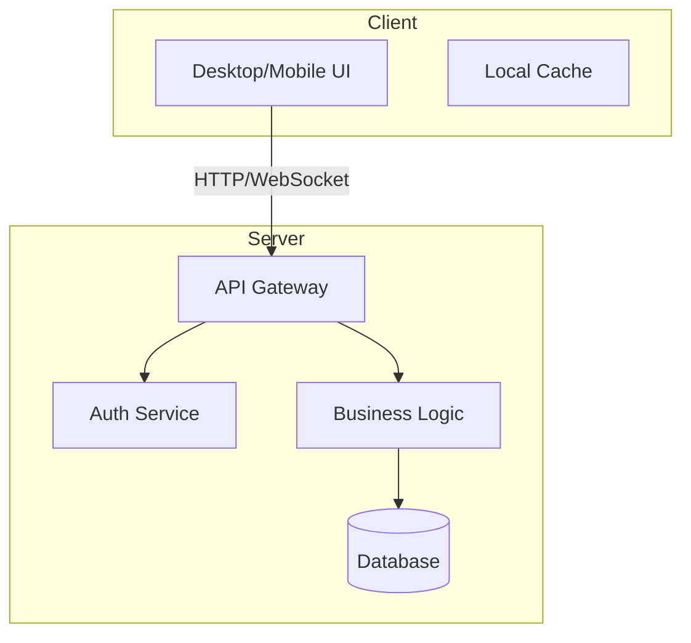

# System Architecture (composite chapter)

> Composite common chapter: used by Client-Server and 3-Tier patterns.
> Defined here so the agent can inject it when generating a composite spec.

## Purpose

Describe the overall system topology — how components are distributed across tiers, how they communicate, and how they are deployed.

Place this chapter early in the spec (after Feature specifications) so readers can orient themselves before reading per-tier detail chapters.

## What to include

### 1. System topology diagram

A high-level component diagram showing:

| Element | Description |
|---------|-------------|
| Client / Presentation tier | UI components, user-facing entry points |
| Server / Application tier | Business logic, API endpoints, service layer |
| Data tier | Databases, storage, caches |
| External integrations | Third-party services, external APIs |
| Communication protocols | HTTP, WebSocket, gRPC, message queue |

Use a Mermaid or ASCII diagram to visualise the topology.

**Client-Server example:**



**3-Tier example:**

```mermaid
graph TD
    subgraph "Presentation Tier"
        WebUI[Web UI]
        MobileUI[Mobile UI]
    end
    subgraph "Application Tier"
        GW[API Gateway]
        Auth[Auth Service]
        BizLogic[Business Logic]
    end
    subgraph "Data Tier"
        RDB[(Relational DB)]
        Cache[(Redis Cache)]
        Storage[(Object Storage)]
    end
    WebUI -->|HTTPS| GW
    MobileUI -->|HTTPS| GW
    GW --> Auth
    GW --> BizLogic
    BizLogic --> RDB
    BizLogic --> Cache
    BizLogic --> Storage
```



### 2. Tier interfaces

For each tier boundary, document:

| Boundary | Interface type | Protocol | Data format |
|----------|---------------|----------|-------------|
| Client → Server | REST / GraphQL / gRPC API | HTTP/2 | JSON / Protobuf |
| Server → Data tier | Native driver / ORM | TCP | SQL / binary |
| Server → External | REST / SOAP / Webhook | HTTPS | JSON / XML |

### 3. Deployment architecture

| Aspect | Description |
|--------|-------------|
| Deployment model | Monolith, microservices, serverless |
| Hosting | Cloud provider, on-premise, hybrid |
| Containerisation | Docker, Kubernetes, Nomad |
| CI/CD pipeline | Build → Test → Deploy per tier |
| Scaling strategy | Horizontal / vertical, auto-scaling rules |

### 4. Inter-component data flow (high-level)

Describe the high-level data path through the system:

```
User Input → Client UI → API Request → Server Logic → Data Access → Storage
                                                                    ↓
User Output ← Client UI ← API Response ← Server Logic ← Data Access ←
```

### 5. Network security

| Concern | Description |
|---------|-------------|
| TLS termination | Where and how |
| API Gateway | Rate limiting, WAF, IP whitelisting |
| Network segmentation | VPC, subnets, service mesh |
| Internal service auth | mTLS, service tokens |

## Generation guidelines

- The **system topology diagram** is the most important element — invest in getting it accurate.
- For **Client-Server** patterns, emphasise the communication boundary and protocol.
- For **3-Tier** patterns, emphasise the separation of concerns and tier interfaces.
- Reference actual deployment files (Docker Compose, Kubernetes manifests, Terraform) during Phase 3 investigation.
- Confidence labels: 🟢 VERIFIED (from actual deployment configs), 🟡 INFERRED (from project structure), 🔴 ASSUMED (from architecture guess).
