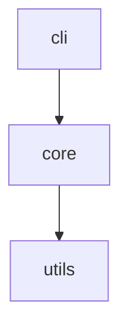
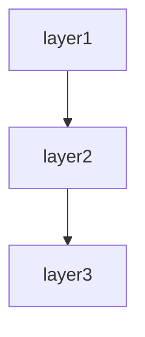

# CLI tool spec template

This template defines the chapter outline for the spec of a command-line tool consumed via terminal.

Designed for tools distributed via pip / npm / brew / cargo install, with subcommands, flags, exit codes, and machine-readable output.

---

## Chapter outline

### Chapter 1: Overview

<!-- meta: purpose and scope of the CLI tool. -->

#### 1.1 Tool purpose
- The problem this tool solves
- Intended users (developers, DevOps, end users)
- Differentiation from alternative tools

#### 1.2 Main features
- 3–5 main features
- Summary of each feature

#### 1.3 Distribution information
- Distribution channel (PyPI / npm / Homebrew / crates.io / GitHub Releases)
- Current version
- License type

---

---

### Chapter 2: Feature specifications

<!-- meta: consolidated feature-level view of the tool. Maps features to commands and data flows. -->

#### 2.1 Feature catalogue table

| Feature ID | Feature name | Category | Related commands | Auth required | Summary | Confidence |
|------------|-------------|----------|-----------------|-------------|---------|-----------|
| F-001 | (feature) | (category) | (commands) | yes/no | 1-line summary | 🟢/🟡/🔴 |
| F-002 | (feature) | (category) | (commands) | yes/no | 1-line summary | 🟢/🟡/🔴 |
| ... | ... | ... | ... | ... | ... | ... |

The catalogue table exhaustively lists every feature. Confidence labels:
- 🟢 **VERIFIED**: Feature purpose confirmed by reading the actual command handler code.
- 🟡 **INFERRED**: Feature mechanically grouped from subcommand naming or module structure.
- 🔴 **ASSUMED**: Feature inferred from use-case description; code evidence is indirect.

#### 2.2 Per-feature processing definitions

For each feature listed above, describe the processing flow structured as below. Generate at minimum the top-5 features by complexity or business criticality; list the remainder in the catalogue table only.

##### F-001: {Feature name}

**Overview**
- Business value this feature provides
- Which user / role uses it

**Trigger**
- User action / event / external call that initiates this feature

**Pre-conditions**
- Conditions that must hold before execution

**Main flow**
1. Step 1 [REF: src/path:line]
2. Step 2 [REF: src/path:line]
3. ...

**Alternative flows**
- Alt-1: When [condition] → [behaviour] [REF: src/path:line]

**Error handling**
- Error type → tool behaviour [REF: src/path:line]

**Post-conditions**
- State of the system after successful execution

**Related business rules**
- → Ch? (Domain rules section) cross-reference

**Related chapters**
- → Ch? (Command catalogue / Usage examples) cross-reference

**Confidence**: 🟢/🟡/🔴

---

### Chapter 3: Module architecture (overview)

<!-- meta: top-level structure of the tool, for reader orientation. Overview-level only: WHAT the modules are and how they relate at a glance. Detailed internals go to the Internal structure chapter (contributor detail), design rationale to System design (WHY/HOW). -->

#### 3.1 Module composition

Top-level modules / packages and their responsibilities, extracted from the directory structure.

| Module / package | Responsibility | Key files | Confidence |
|------------------|----------------|-----------|-----------|
| (module) | (responsibility) | [REF: ...] | 🟢/🟡/🔴 |
| ... | ... | ... | ... |

- CLI entry point (`bin` / `console_scripts` / `[[bin]]` field of the manifest)
- Library vs CLI separation (CLI adapter + core library split)

#### 3.2 Module dependency overview

Top-level dependency graph between modules, extracted from import analysis. Use the per-language `rg` patterns.



- Overview level only: group at package / top-level-directory granularity
- Flag circular dependencies explicitly here; detailed dependency analysis → Chapter ? (System design)

#### 3.3 Tech stack

| Item | Value | Source | Confidence |
|------|-------|--------|-----------|
| Language / runtime | (value) | [REF: ...] | 🟢 |
| CLI framework | (value) | [REF: ...] | 🟢 |
| Major dependencies | (value) | [REF: ...] | 🟢 |

- Build / distribution tooling
- Packaging format (wheel / tarball / binary / Homebrew formula)

---

### Chapter 4: Installation

<!-- meta: steps to install and start using the tool. -->

#### 4.1 Distribution channels
```bash
# pip / pipx
pip install <tool-name>
pipx install <tool-name>

# npm
npm install -g <tool-name>

# Homebrew
brew install <org>/<tap>/<tool-name>

# Cargo
cargo install <tool-name>
```

#### 4.2 Runtime requirements
- Supported language runtimes (Python version, Node.js version, etc.)
- Supported operating systems
- Required system dependencies (libffi, OpenSSL, etc.)

#### 4.3 Verification
```bash
<tool-name> --version
<tool-name> --help
```

---

### Chapter 5: Command catalogue

<!-- meta: exhaustive reference of all subcommands, arguments, options, and exit codes. The pillar of verification. -->

#### 5.1 Top-level command

```
<tool-name> [global options] <command> [subcommand options] [arguments]
```

**Global options:**
| Option | Short | Type | Default | Description |
|--------|-------|------|---------|-------------|
| `--verbose` | `-v` | count | `0` | Increase verbosity |
| `--config` | `-c` | string | (default path) | Path to config file |
| `--output` | `-o` | string | `text` | Output format (text/json) |
| ... | ... | ... | ... | ... |

**Exit codes:**
| Code | Meaning |
|:----:|---------|
| 0 | Success |
| 1 | General error |
| 2 | Misuse of shell built-ins (per sysexits) |
| ... | ... |

#### 5.2 Subcommand catalogue

| Subcommand | Arguments | Description | Confidence |
|------------|-----------|-------------|-----------|
| `add` | `<item>` | Add a new item | 🟢 |
| `list` | `[--filter]` | List all items | 🟢 |
| `delete` | `<id>` | Delete an item | 🟢 |
| ... | ... | ... | ... |

##### `{tool-name} {subcommand}` {Subcommand name}

**Usage:**
```
{tool-name} {subcommand} [options] <args>
```

**Arguments:**
| Argument | Required | Type | Description |
|----------|----------|------|-------------|
| `<item>` | yes | string | The item to add |
| ... | ... | ... | ... |

**Options:**
| Option | Short | Type | Default | Description |
|--------|-------|------|---------|-------------|
| `--priority` | `-p` | int | `0` | Priority level |
| ... | ... | ... | ... | ... |

**Exit codes:**
| Code | Condition |
|:----:|-----------|
| 0 | Success |
| 1 | Argument validation failure |
| ... | ... |

**Examples:**
```bash
{tool-name} {subcommand} <item>
{tool-name} {subcommand} <item> --priority 5
```

**Related chapters:**
- → Ch? (Usage examples / Configuration / Output format)

#### 5.3 Subcommand: help

Standard `--help` output for every subcommand. This section documents what auto-generated help includes vs what is custom-written.

---

### Chapter 6: Usage examples

<!-- meta: "read this and start using it" samples covering common workflows, pipe integration, and error cases. -->

#### 6.1 Minimal example
```bash
{tool-name} --help
```

#### 6.2 Common workflows

**Workflow 1: {name}**
```bash
{tool-name} subcommand1 args
{tool-name} subcommand2 --option value
```

**Workflow 2: {name}**
```bash
{tool-name} subcommand1 --output json | jq '.items[]'
```

#### 6.3 Pipe and redirect integration

```bash
# Pipe input
cat data.txt | {tool-name} process

# Pipe output to another tool
{tool-name} list --format json | jq '.items | length'

# Redirect output to file
{tool-name} report > report.md
```

#### 6.4 Error case recovery
```bash
# Common mistake: missing argument
{tool-name} subcommand
# → Error: missing required argument '<item>'

# Correct invocation
{tool-name} subcommand "my item"
```

#### 6.5 Non-interactive / scripting usage
```bash
# Non-interactive mode for CI/CD
{tool-name} check --ci-mode

# Machine-readable output
{tool-name} status --output json
```

---

### Chapter 7: Configuration

<!-- meta: how users configure the tool — file paths, environment variables, and precedence order. -->

#### 7.1 Configuration file

| Option | Type | Default | Description |
|--------|------|---------|-------------|
| `editor` | string | `$EDITOR` | Editor for interactive mode |
| `format` | string | `text` | Default output format |
| ... | ... | ... | ... |

- Configuration file search paths (XDG spec / OS convention)
- File format (TOML / YAML / JSON / INI)

#### 7.2 Environment variables

| Variable | Default | Description |
|----------|---------|-------------|
| `TOOLNAME_CONFIG` | (default path) | Override config file path |
| `TOOLNAME_FORMAT` | `text` | Override output format |
| ... | ... | ... |

#### 7.3 Precedence order

1. CLI flags (highest)
2. Environment variables
3. Configuration file
4. Built-in defaults (lowest)

---

### Chapter 8: Output format

<!-- meta: what the tool outputs to stdout and stderr. Unique to CLI tools — covers human-readable and machine-parseable formats. -->

#### 8.1 Standard output (stdout)

**Text mode (default)**
```
Item 1
Item 2
Item 3
```

**JSON mode (`--output json`)**
```json
{
  "items": [
    {"id": "item-1", "name": "Item 1"},
    {"id": "item-2", "name": "Item 2"}
  ]
}
```

- Field descriptions for JSON output
- Pagination / truncation markers

#### 8.2 Error output (stderr)

- Error message format
- Warning vs error distinction
- Stack trace policy (verbose mode only)

#### 8.3 Exit code semantics

| Code | Meaning | Common triggers |
|:----:|---------|----------------|
| 0 | Success | All operations completed |
| 1 | Generic error | Invalid input, operation failed |
| 2 | Usage error | Missing argument, unknown option |
| 64 | Data error | Input data malformed (sysexits.h) |
| 70 | Software error | Internal bug, configuration error |
| 75 | Temporary failure | Network timeout, rate limited |
| 77 | Permission denied | File not readable / not found |
| ... | ... | ... |

#### 8.4 Progress and status indicators

- Spinner / progress bar behaviour
- `--quiet` mode suppression
- `--verbose` / `--debug` detail levels

---

### Chapter 9: Internal structure (optional)

<!-- meta: internal architecture of the tool. For contributors. -->

#### 9.1 Directory structure
- Main directories and their responsibilities

#### 9.2 Major classes / modules

| Class | Kind | Module | Responsibility | Depends on | Source |
|:------|:----|:-------|:-------------|:----------|:-------|
| ... | ... | ... | ... | ... | [REF: ...] |

- Class diagram (Mermaid `classDiagram`) for key subsystems. Split per module if >15 classes.
- Module dependency diagram (`graph TD`) for top-level module relationships.

#### 9.3 Build and test
- Build commands
- Test commands
- Release process

---

### Chapter 10: System design

<!-- meta: architectural decisions, cross-cutting concerns, module dependencies, and design trade-offs derived from code. Complements Module architecture (which describes WHAT) by explaining WHY and HOW cross-cutting concerns are handled. -->

#### 10.1 Architecture Decision Records (ADR)

Code-derived record of design decisions. Confidence is typically low since rationale is rarely written in code; use Question Bank integration for SME confirmation.

| ID | Topic | Decision (as observed in code) | Rationale (inferred) | Alternatives (inferred) | Confidence | Supporting REF |
|----|-------|------------------------------|---------------------|----------------------|-----------|---------------|
| ADR-001 | (topic) | (decision) | (inferred rationale) | (inferred alternatives) | 🟢/🟡/🔴 | [REF: ...] |
| ... | ... | ... | ... | ... | ... | ... |

Extraction strategy:
- Search for design-related comments (`// Why:`, `# Reason:`, `/* Decision: */`)
- Read README / CONTRIBUTING / design docs for explicit rationale
- When no explicit rationale exists, mark 🔴 ASSUMED and add `[ASK SME]`

→ For CLI-specific design decisions: argument parser choice, output format design, pipe-friendly design, exit code convention.

[CONFIDENCE: LOW — ADR entries are almost always inferred unless explicitly documented]

#### 10.2 Module / component dependency

Import/require/include graph extracted from source code. Enumerates dependencies between layers or modules.

**Extraction approach:**

| Language | Pattern | Example | Confidence |
|----------|---------|---------|-----------|
| Python | `rg "^import \|^from "` then filter to own project | `import app.models` → depends on `app.models` | 🟢 |
| TypeScript/JS | `rg "^(import \|const .* = require\\()"` | `import { User } from '../models'` | 🟢 |
| Java/Kotlin | `rg "^import "` | `import com.example.service.UserService` | 🟢 |
| Ruby | `rg "^(require \|require_relative )"` | `require_relative 'models/user'` | 🟢 |
| Go | `rg ""github\\.com/.*/"` filtered to own module | `"project/internal/service"` | 🟢 |
| PHP | `rg "^(use \|require_once )"` | `use App\Service\UserService` | 🟢 |
| C# | `rg "^(using \|using static )"` | `using Project.Data.Models` | 🟢 |

Render the result as a Mermaid graph:



Label each edge with the dependency strength (direct / transitive / circular). Flag circular dependencies explicitly.

[🟢 VERIFIED] — import statements are mechanically extractable with near-zero false positives.

#### 10.3 Cross-cutting design patterns

Code-wide patterns that span multiple modules.

| Pattern | Detection method | Example REF | Confidence |
|---------|----------------|-------------|-----------|
| Error handling strategy | Search for `try`/`catch`/`except`/`raise`/`throw` patterns, custom exception classes | [REF: src/errors.py:1-50] | 🟢 |
| Logging approach | Search for `logger`/`logging`/`console.log`/`print`/`warn` calls | [REF: src/cli/logging.py:10-30] | 🟢 |
| Argument validation | Search for validator patterns, argparse `type=` callbacks, pydantic models | [REF: src/cli/validators.py] | 🟢 |
| Output formatting | Search for formatter classes, table renderers, JSON serialisers | [REF: src/cli/formatters.py] | 🟢 |
| Retry / resilience | Search for `retry`/`backoff`/`timeout` patterns | [REF: src/utils/retry.py] | 🟡 |
| Plugin / hook system | Search for hook registration, plugin discovery | [REF: src/plugins/] | 🟡 |

For each pattern found, note:
- **Consistency**: Does the whole project use one pattern, or are multiple approaches mixed?
- **Coverage**: Are there modules that SHOULD use this pattern but don't?
- **Exceptions**: Any deliberate deviations from the pattern?

[🟢 VERIFIED for most patterns] — language-level constructs are mechanically detectable.

#### 10.4 Performance design

Performance-related patterns and potential bottlenecks detected in code.

| Pattern | Detection method | Confidence |
|---------|----------------|-----------|
| Caching | Search for `cache`/`lru_cache`/`memoize` | 🟢 |
| Async / concurrent execution | Search for `async`/`await`/`thread`/`concurrent` | 🟢 |
| Streaming / lazy loading | Search for `yield`/`generator`/`lazy`/`stream` | 🟢 |
| Batch processing | Search for `batch`/`chunk`/`bulk` methods | 🟢 |
| Output pagination | Search for `pager`/`less`/`PAGER`/`--no-pager` | 🟢 |

#### 10.5 Known trade-offs and constraints

Technical trade-offs and constraints visible in code comments.

| Marker | Detection method | Meaning |
|--------|----------------|---------|
| `TODO` | `rg "TODO"` (with context) | Planned improvement |
| `FIXME` | `rg "FIXME"` | Defect or known issue |
| `HACK` / `WORKAROUND` | `rg "HACK\|WORKAROUND"` | Deliberate suboptimal solution |
| `XXX` | `rg "XXX"` | Something suspicious |
| `OPTIMIZE` | `rg "OPTIMIZE\|PERF\|SLOW"` | Performance concern |
| `@deprecated` / `DEPRECATED` | Search for deprecation markers | Planned removal |

→ Critical items → see Chapter 11 (Known constraints and unresolved items)

For each marker, include the surrounding context (next 2 lines) to explain the trade-off. Group by severity (CRITICAL / MAJOR / MINOR).

[🟢 VERIFIED — markers are mechanically extractable; context needs manual review]

---

### Chapter 11: Known constraints and unresolved items

<!-- meta: spec credibility safeguard. -->

#### 11.1 Known constraints
- Performance ceilings
- Known bugs / workarounds
- Per-platform differences (Windows path handling, macOS vs Linux)
- Terminal-width-dependent behaviour

#### 11.2 Unresolved items
- Place the `abandoned` entries from the Question Bank here

---

## Customisation guidance

### Tool also exposes a library API
- Add a "Public API catalogue" section to Chapter 5.
- Document the Python/JS API alongside the CLI.

### Multi-command suite
- Split Chapter 5 into subcommand groups (e.g., `admin`, `user`, `config` sub-groups).
- Add a "Command family overview" table before the detailed catalogue.

### Tab completion
- Add a section to Chapter 7 (Configuration) for shell completion setup.
- Document supported shells (bash / zsh / fish).

### Colourised output
- Document `NO_COLOR` / `CLICOLOR` / `TERM` environment variables in Chapter 8.
- Document the `--color` flag behaviour (auto / always / never).

Customisation is finalised in dialogue with the user after Phase 1 template selection.
