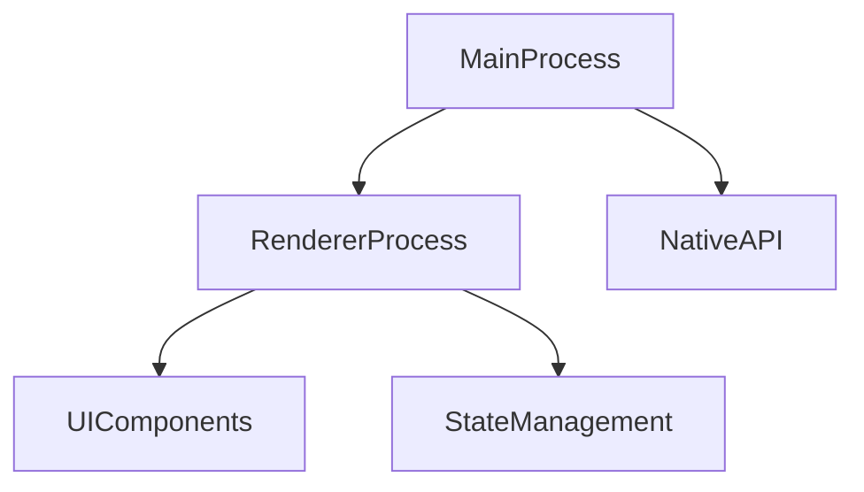
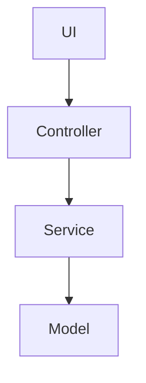

# Desktop app spec template

This template defines the chapter outline for the spec of a desktop application running on Windows, macOS, or Linux.

Designed for Electron, Tauri, Qt (C++/Python), WinForms, WPF, and macOS SwiftUI. Covers window management, platform integration, installer/auto-update, keyboard shortcuts, and accessibility.

---

## Chapter outline

### Chapter 1: Overview

<!-- meta: bird's-eye view of the desktop application. -->

#### 1.1 App purpose
- The problem this app solves
- Target users and personas
- Differentiation from competing apps

#### 1.2 Target platforms

| Platform | Min OS version | Architecture | Status |
|----------|---------------|-------------|--------|
| Windows | 10 22H2 | x64, ARM64 | active |
| macOS | 13 Ventura | Apple Silicon, Intel | active |
| Linux | Ubuntu 22.04, Fedora 38 | x64 | beta |

#### 1.3 Distribution summary
- Distribution channel (direct download, store, package manager)
- Pricing model (free, paid, subscription)

---

---

### Chapter 2: Feature specifications

<!-- meta: consolidated feature-level view of the app. Maps features to windows and data flows. -->

#### 2.1 Feature catalogue table

| Feature ID | Feature name | Category | Related windows | Auth required | Summary | Confidence |
|------------|-------------|----------|----------------|-------------|---------|-----------|
| F-001 | (feature) | (category) | (windows) | yes/no | 1-line summary | 🟢/🟡/🔴 |
| F-002 | (feature) | (category) | (windows) | yes/no | 1-line summary | 🟢/🟡/🔴 |
| ... | ... | ... | ... | ... | ... | ... |

#### 2.2 Per-feature processing definitions

For each feature listed above, describe the processing flow.

##### F-001: {Feature name}

**Overview**
- Business value this feature provides
- Which user / role uses it

**Trigger**
- User action / system event that initiates this feature

**Pre-conditions**
- Conditions that must hold before execution

**Main flow**
1. Step 1 [REF: src/path:line]
2. Step 2 [REF: src/path:line]
3. ...

**Alternative flows**
- Alt-1: When [condition] → [behaviour] [REF: src/path:line]

**Error handling**
- Error type → app behaviour [REF: src/path:line]

**Post-conditions**
- State of the system after successful execution

**Related chapters**
- → Ch? (Windows / UI components / Platform integration)

**Confidence**: 🟢/🟡/🔴

---

### Chapter 3: Module architecture

<!-- meta: top-level module structure, including process model for multi-process frameworks. -->

#### 3.1 Module composition

| Module / package | Responsibility | Key files | Confidence |
|------------------|----------------|-----------|-----------|
| (module) | (responsibility) | [REF: ...] | 🟢/🟡/🔴 |
| ... | ... | ... | ... |

#### 3.2 Process model

| Process | Framework | Responsibilities | Confidence |
|---------|-----------|-----------------|-----------|
| Main process | Electron | Window management, IPC, native APIs | 🟢 |
| Renderer process | Electron | UI rendering, user interaction | 🟢 |
| Background / worker | (framework) | Long-running tasks, file I/O | 🟢 |

For single-process frameworks (Qt, WPF, SwiftUI), note the threading model:
- UI thread (main)
- Background / worker threads
- File I/O threads

#### 3.3 Module dependency diagram

#### 3.4 Tech stack

| Item | Value | Source | Confidence |
|------|-------|--------|-----------|
| Framework | (Electron / Tauri / Qt / WPF / SwiftUI) | [REF: ...] | 🟢 |
| Language | (value) | [REF: ...] | 🟢 |
| UI toolkit | (value) | [REF: ...] | 🟢 |
| State management | (value) | [REF: ...] | 🟢 |
| Build system | (value) | [REF: ...] | 🟢 |
| Packaging | (value) | [REF: ...] | 🟢 |

---

### Chapter 4: Window management and menus

<!-- meta: every window, its lifecycle, and menu structure. -->

#### 4.1 Window catalogue

| Window ID | Window name | Type | Entry method | Resizable? | Confidence |
|-----------|-------------|------|-------------|:----------:|-----------|
| W-001 | Main | Primary | App launch | yes | 🟢 |
| W-002 | Preferences | Modal | Menu → Preferences | no | 🟢 |
| W-003 | About | Modal | Menu → About | no | 🟢 |
| ... | ... | ... | ... | ... | ... |

#### 4.2 Window lifecycle

| Window | Open trigger | Close behaviour | State save on close? | Restore on relaunch? |
|--------|-------------|----------------|:-------------------:|:--------------------:|
| Main | App launch | Hide to tray / quit | yes | yes |
| Preferences | Menu item | Dispose | no | no |

#### 4.3 Menu bar structure

| Menu | Items | Shortcuts | Platform notes |
|------|-------|----------|---------------|
| File | New, Open, Save, Save As, Export, Quit | Cmd+N, Cmd+O, Cmd+S | Quit = macOS app menu |
| Edit | Undo, Redo, Cut, Copy, Paste | Cmd+Z, Cmd+Shift+Z, Cmd+X, ... | |
| View | Toggle Sidebar, Zoom In, Zoom Out, Full Screen | Cmd+\, Cmd+=, Cmd+-, Ctrl+Cmd+F | |
| Help | Documentation, About | | |

#### 4.4 Context menus

| Context | Menu items | Trigger |
|---------|-----------|---------|
| File list item | Open, Rename, Delete, Share | Right-click / Ctrl+click |
| Sidebar | New Folder, Collapse All | Right-click |
| Editor tab | Close, Close Others, Close All | Right-click on tab |

#### 4.5 Dock / taskbar integration

- Dock icon badge (macOS: badge count, Windows: overlay icon)
- Jump list (Windows: recent files, tasks)
- Dock menu (macOS: recent items, custom actions)
- Taskbar progress (Windows: download progress indicator)

#### 4.6 System tray / menu bar extra

- Tray icon behaviour (show/hide on close, always show)
- Tray menu items
- Menu bar extra (macOS: persistent icon in menu bar)

---

### Chapter 5: UI component catalogue

<!-- meta: all custom UI components and the theming system. -->

#### 5.1 Main window layout

- Sidebar / navigation panel
- Content area / workspace
- Status bar
- Panels (output, terminal, minimap)

#### 5.2 Custom UI components

| Component | Parent window | Description | States | Confidence |
|-----------|-------------|-------------|--------|-----------|
| FileTree | Main | Hierarchical file browser | normal, selected, drag-over, disabled | 🟢 |
| EditorPane | Main | Code/text editor with syntax highlighting | normal, dirty, focused, read-only | 🟢 |
| SearchBar | Main | Global search input | active, results-shown, empty | 🟢 |
| SettingsForm | Preferences | Tabbed settings panel | unsaved, saved | 🟢 |
| ... | ... | ... | ... | ... |

#### 5.3 Theming system

| Theme component | Light value | Dark value | CSS variable / token |
|----------------|------------|-----------|---------------------|
| Background | `#FFFFFF` | `#1E1E1E` | `--bg-primary` |
| Text | `#333333` | `#CCCCCC` | `--text-primary` |
| Accent | `#007AFF` | `#0A84FF` | `--accent` |
| Border | `#D1D1D1` | `#424242` | `--border` |
| ... | ... | ... | ... |

- Custom theme support (user-created themes)
- OS dark/light mode auto-detection

#### 5.4 Dialog catalogue

| Dialog | Purpose | Modal? | Confidence |
|--------|---------|:------:|-----------|
| Open File | Select file(s) to open | yes | 🟢 |
| Save As | Choose save location and format | yes | 🟢 |
| Confirm Delete | Confirm destructive action | yes | 🟢 |
| About | Version, credits | yes | 🟢 |
| ... | ... | ... | ... |

---

### Chapter 6: Platform integration

<!-- meta: native OS features used by the app. -->

#### 6.1 File system access

| Feature | API / mechanism | Permission model |
|---------|----------------|-----------------|
| File open / save | Native file dialog | User gesture required |
| Drag and drop | File drop target on main window | User-initiated |
| File watching | FSEvents (macOS), ReadDirectoryChanges (Windows), inotify (Linux) | App-local |
| Recent files | NSDocumentController / MRU list | App config |
| File association | Info.plist CFBundleDocumentTypes (macOS), Windows Registry | Install-time |

#### 6.2 Native dialogs

| Dialog type | Framework API | Use cases |
|------------|--------------|-----------|
| Message box | `dialog.showMessageBox` (Electron) / `QMessageBox` / `MessageBox` (Win32) | Confirm, alert, error |
| File dialog | `dialog.showOpenDialog` / `QFileDialog` / `OpenFileDialog` | Open, save, folder pick |
| Colour picker | `dialog.showColorPicker` / `QColorDialog` | Theme customisation |
| Font picker | OS-native font panel | Text formatting |

#### 6.3 Clipboard and drag & drop

- Read / write clipboard (text, images, files, custom formats)
- Drag source → drag target data format negotiation
- External drag (from file manager, browser) vs internal drag (within app)

#### 6.4 OS integration features

| Feature | API | Target OS |
|---------|-----|-----------|
| Notification centre | `Notification` API / UserNotifications | macOS, Windows |
| Spotlight indexing | Core Spotlight (macOS) | macOS |
| File provider | File Provider extension (macOS) | macOS |
| Credential storage | Keychain (macOS), Credential Manager (Windows), Secret Service (Linux) | All |
| Auto-launch on login | Login items (macOS), Run registry key (Windows) | macOS, Windows |
| URL scheme / deep link | Custom protocol handler (`myapp://`) | All |
| Printing | OS print dialog | All |
| Screen capture | Native screenshot API | All |

---

### Chapter 7: State management and persistence

<!-- meta: how the app stores local data, preferences, and session state. -->

#### 7.1 Local settings / preferences

| Setting key | Type | Default | Storage | Confidence |
|-------------|------|---------|---------|-----------|
| `theme` | string | `"system"` | UserDefaults / NSUserDefaults / Registry | 🟢 |
| `fontSize` | number | `14` | Config file (JSON) | 🟢 |
| `recentFiles` | array | `[]` | Config file | 🟢 |
| `windowBounds` | object | `{x, y, w, h}` | Config file | 🟢 |
| ... | ... | ... | ... | ... |

#### 7.2 Storage backends

| Backend | Purpose | Location | Confidence |
|---------|---------|----------|-----------|
| UserDefaults / NSUserDefaults | Small key-value settings | OS-managed plist / registry | 🟢 |
| JSON / TOML config file | App preferences | `~/.config/app/`, `~/Library/Application Support/` | 🟢 |
| SQLite / Realm | Structured app data | App data directory | 🟢 |
| Local file system | User documents, projects | User-chosen paths | 🟢 |

#### 7.3 Session management

| Session data | Persistence | Restore on relaunch |
|-------------|:----------:|:-------------------:|
| Open windows | yes | yes |
| Unsaved document state | yes | yes (restore tab with dirty indicator) |
| Scroll position | optional | per-document |
| Selection / cursor | optional | per-document |
| Layout / panel visibility | yes | yes |

---

### Chapter 8: Auto-update and installer

<!-- meta: how the app is installed, updated, and signed. -->

#### 8.1 Installer format

| Platform | Installer format | Framework | Confidence |
|----------|-----------------|-----------|-----------|
| Windows | MSI / NSIS / Inno Setup / Squirrel | electron-builder / WiX Toolset | 🟢 |
| macOS | DMG / PKG / App bundle | electron-builder / create-dmg | 🟢 |
| Linux | AppImage / Flatpak / Snap / deb / rpm | electron-builder / Flatpak builder | 🟢 |

#### 8.2 Code signing

| Platform | Certificate type | Source | CI step |
|----------|----------------|--------|---------|
| Windows | EV Code Signing certificate | Azure Key Vault / YubiKey | Post-build |
| macOS | Developer ID Application certificate | Apple Developer account, notarization | Post-build |

#### 8.3 Auto-update mechanism

| Framework | Update channel | Update frequency | Rollback support |
|-----------|:-------------:|:----------------:|:----------------:|
| Squirrel / Sparkle / electron-updater / Tauri updater | stable / beta / nightly | On-launch check + periodic | yes |

#### 8.4 Update flow

1. Background check for update (shallow)
2. Download update (progress indicator)
3. Verify integrity (checksum / signature)
4. Apply update (on quit / silent / prompt user)
5. Rollback on failure

---

### Chapter 9: Networking

<!-- meta: how the app communicates with servers and other local devices. -->

#### 9.1 API communication

| Endpoint | Method | Purpose | Auth | Confidence |
|----------|--------|---------|------|-----------|
| `POST /api/v1/login` | POST | User authentication | none | 🟢 |
| `GET /api/v1/documents` | GET | Fetch document list | Bearer token | 🟢 |
| ... | ... | ... | ... | ... |

#### 9.2 Local server / P2P

| Feature | Technology | Purpose |
|---------|-----------|---------|
| Local HTTP server | Express / built-in HTTP | Local web service, companion app |
| WebSocket server | ws / Socket.IO | Real-time updates, collaborative editing |
| LAN service discovery | mDNS / Bonjour / SSDP | Peer discovery on local network |
| gRPC / named pipe | gRPC / Unix socket / named pipe | Inter-process communication |

#### 9.3 Offline behaviour

- Offline detection strategy (ping, connection status API)
- Cached data access when offline
- Sync queue for deferred operations
- Conflict resolution on reconnect

---

### Chapter 10: Keyboard shortcuts and accessibility

<!-- meta: every keyboard shortcut and accessibility features. -->

#### 10.1 Global shortcuts

| Shortcut | Action | Context | Platform |
|----------|--------|---------|----------|
| Cmd+Space | App search / command palette | Global | all |
| Ctrl+Alt+T | Toggle transparent overlay | Global | Windows, Linux |
| ... | ... | ... | ... |

#### 10.2 App-internal shortcuts

| Shortcut | Action | Context |
|----------|--------|---------|
| Cmd+N | New document | Main window |
| Cmd+S | Save | Editor focused |
| Cmd+P | Quick open | Main window |
| Cmd+Shift+P | Command palette | Main window |
| Cmd+W | Close window / tab | Main window |
| Ctrl+Tab | Next tab | Multi-tab window |
| Cmd+, | Preferences | Global |

#### 10.3 Accessibility features

| Feature | Target | Implementation | Compliance |
|---------|--------|---------------|:----------:|
| Screen reader support | VoiceOver, NVDA, Narrator | AX APIs (macOS), UIA (Windows), AT-SPI (Linux) | WCAG 2.1 AA |
| Keyboard navigation | All users | Full tab order, visible focus indicator | WCAG 2.1 AA |
| High contrast mode | Low-vision users | System high-contrast detection, custom high-contrast theme | WCAG 2.1 AA |
| Font scaling | Low-vision users | Follows OS font size setting, custom zoom level | WCAG 2.1 AA |
| Reduce motion | Motion-sensitive users | `prefers-reduced-motion` | WCAG 2.1 AA |
| Voice control | Motor-impaired users | Native voice command support (macOS Voice Control, Windows Speech) | — |

#### 10.4 Focus management

- Tab order (natural reading order)
- Focus indicators (visible, high-contrast compatible)
- Focus trap handling (modals, dialogs)
- Auto-focus on dialog open

---

### Chapter 11: Build and deployment

<!-- meta: how the app is built, packaged, and distributed. -->

#### 11.1 Build configuration

| Item | Value |
|------|-------|
| Build framework | electron-builder / tauri-bundler / CMake / MSBuild / Xcode |
| Build commands | `npm run build`, `cargo tauri build`, `msbuild app.sln` |
| CI/CD | GitHub Actions / Jenkins / Azure Pipelines |

#### 11.2 Packaging

| Platform | Output format | Post-processing |
|----------|-------------|----------------|
| Windows | `.exe` installer, portable `.exe` | Code sign, antivirus scan |
| macOS | `.dmg`, `.app` bundle | Notarization, stapling |
| Linux | `.AppImage`, `.flatpak`, `.snap`, `.deb`, `.rpm` | GPG sign |

#### 11.3 Distribution channels

| Channel | Platforms | Access control |
|---------|-----------|---------------|
| GitHub Releases | All | Public |
| Homebrew Cask | macOS | Public |
| Snap Store | Linux | Public |
| Microsoft Store | Windows | Store submission |
| Mac App Store | macOS | Store submission |
| Winget | Windows | Public |
| Direct download | All | Public (via website) |

#### 11.4 Version numbering
- Semantic versioning (MAJOR.MINOR.PATCH)
- Pre-release identifiers (alpha, beta, rc)
- Build metadata (commit hash, build number)

---

### Chapter 12: Design decisions

<!-- meta: architectural decisions, cross-cutting concerns, and design trade-offs derived from code. -->

#### 12.1 Architecture Decision Records (ADR)

| ID | Topic | Decision (as observed in code) | Rationale (inferred) | Alternatives (inferred) | Confidence | Supporting REF |
|----|-------|------------------------------|---------------------|----------------------|-----------|---------------|
| ADR-001 | (topic) | (decision) | (inferred rationale) | (inferred alternatives) | 🟢/🟡/🔴 | [REF: ...] |
| ... | ... | ... | ... | ... | ... | ... |

→ For desktop-specific decisions: Electron vs Tauri vs native, process model (single vs multi-process), IPC mechanism, auto-update framework, cross-platform UI strategy, theming system.

#### 12.2 Module / component dependency

Import graph extracted from source code.

| Language | Pattern | Confidence |
|----------|---------|-----------|
| Electron/TS | `import` statements filtered to own modules | 🟢 |
| Rust (Tauri) | `use` statements filtered to own crate | 🟢 |
| C++ (Qt) | `#include` statements filtered to own project | 🟢 |
| C# (WPF) | `using` statements filtered to own namespace | 🟢 |
| Swift | `import` statements filtered to own modules | 🟢 |

#### 12.3 Cross-cutting design patterns

| Pattern | Detection method | Confidence |
|---------|----------------|-----------|
| IPC architecture | Search for `ipcMain`/`ipcRenderer`/`postMessage`/`channel` (Electron), `invoke_handler` (Tauri) | 🟢 |
| Error handling | Search for `try`/`catch`/`except` patterns | 🟢 |
| Logging | Search for `logger`/`console.log`/`winston`/`log4j` | 🟢 |
| Event-driven | Search for `EventEmitter`/`signal`/`callback`/`delegate`/`NotificationCenter` | 🟢 |
| Plugin system | Search for plugin registration, hook interfaces | 🟡 |

#### 12.4 Performance design

| Pattern | Detection method | Confidence |
|---------|----------------|-----------|
| Lazy loading | Search for dynamic imports, lazy views | 🟢 |
| Virtual scrolling | Search for `virtual`/`window`/`recycler` in list components | 🟢 |
| Background processing | Web Workers (Electron), background threads | 🟢 |
| Asset caching | Image cache, font cache, template cache | 🟢 |
| Startup optimisation | Code splitting, deferred initialisation | 🟡 |
| Memory management | Weak references, dispose patterns, object pooling | 🟡 |

#### 12.5 Known trade-offs and constraints

| Marker | Detection method | Meaning |
|--------|----------------|---------|
| `TODO` | `rg "TODO"` | Planned improvement |
| `FIXME` | `rg "FIXME"` | Defect or known issue |
| `HACK` / `WORKAROUND` | `rg "HACK\|WORKAROUND"` | Deliberate suboptimal solution |
| `PLATFORM` | `rg "PLATFORM\|platform"` | Platform-specific workaround |

→ Critical items → see Chapter 13 (Known constraints)

---

### Chapter 13: Known constraints and unresolved items

<!-- meta: spec credibility safeguard. -->

#### 13.1 Known constraints
- Platform-specific limitations (Windows path length, macOS sandbox, Linux desktop environment fragmentation)
- Performance ceilings (large file handling, many concurrent windows)
- Known bugs / workarounds
- Feature parity gaps between platforms

#### 13.2 Unresolved items
- Place the `abandoned` entries from the Question Bank here

---

## Customisation guidance

### App is Electron with a heavy backend
- Add a "Backend service" chapter describing the companion server process.
- Document inter-process authentication.

### App uses a plug-in architecture
- Add a "Plugin API" chapter after Chapter 6.
- Document plugin lifecycle, registration, sandbox.

### Single-platform only (Windows-only or macOS-only)
- Simplify platform-specific sections (Ch1 target platforms, Ch6 OS integration, Ch8 installer, Ch11 distribution).

### Data-heavy desktop app
- Promote the "Data persistence" section from Ch7 into its own chapter.
- Document migration strategies between schema versions.

Customisation is finalised in dialogue with the user after Phase 1 template selection.
