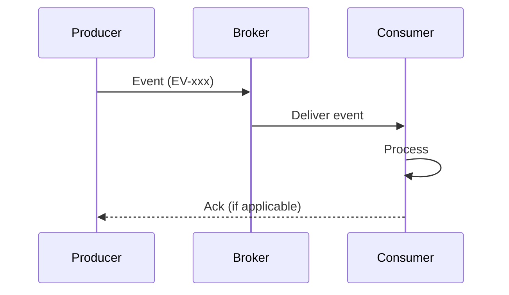
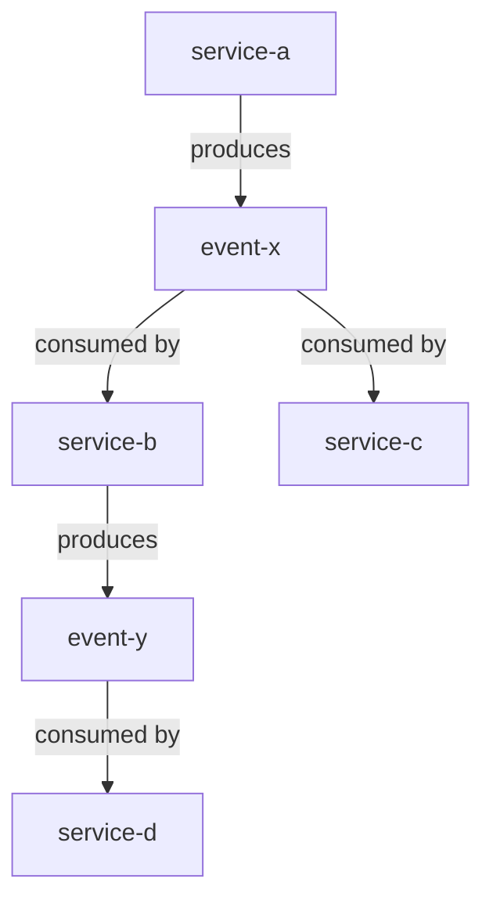
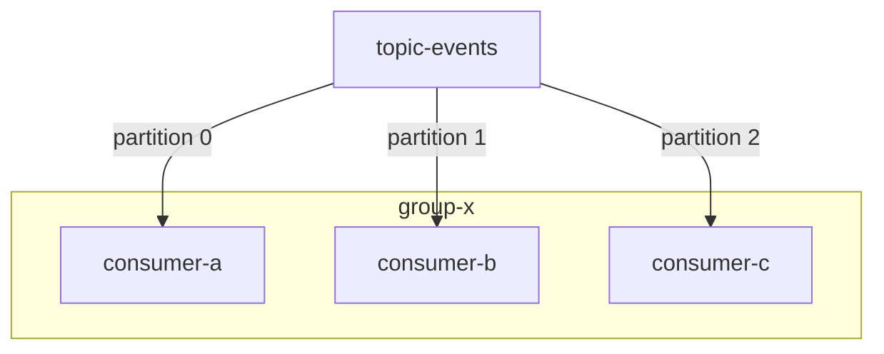

# Event-driven / Streaming spec template

This template defines the chapter outline for the spec of an event-driven or streaming system that processes messages asynchronously via a message broker or event bus.

Designed for Kafka, Pulsar, AWS EventBridge / SQS / SNS, RabbitMQ, Google Pub/Sub, Azure Event Hubs, and similar pub/sub or queuing middleware.

---

## Chapter outline

### Chapter 1: Overview

<!-- meta: purpose, event-driven adoption rationale, and high-level topology of the system. -->

#### 1.1 System purpose
- The business problem this system solves
- Why event-driven architecture was chosen over synchronous request-response
- High-level topology diagram (producers → broker → consumers)

#### 1.2 Main features
- 3-5 main features
- Summary of each feature

#### 1.3 Broker and protocol information
- Message broker / event bus technology (Kafka, Pulsar, EventBridge, SQS, RabbitMQ, ...)
- Protocol (HTTP, AMQP, MQTT, gRPC streaming, custom TCP)
- Deployment model (self-hosted, managed cloud, serverless)

---

### Chapter 2: Feature specifications

<!-- meta: consolidated feature-level view of the system. Maps features to events, producers, and consumers. -->

#### 2.1 Feature catalogue table

| Feature ID | Feature name | Category | Related events | Producer | Consumer(s) | Auth required | Summary | Confidence |
|------------|-------------|----------|---------------|----------|-------------|-------------|---------|-----------|
| F-001 | (feature) | (category) | EV-xxx | (service) | (service list) | yes/no | 1-line summary | 🟢/🟡/🔴 |
| F-002 | (feature) | (category) | EV-xxx | (service) | (service list) | yes/no | 1-line summary | 🟢/🟡/🔴 |
| ... | ... | ... | ... | ... | ... | ... | ... | ... |

#### 2.2 Feature flow diagrams

For each feature, describe the event flow using a Mermaid sequence diagram or flowchart.

---

### Chapter 3: Module architecture

<!-- meta: module composition, producer/consumer layout, and tech stack. Overview-level only. -->

#### 3.1 Module composition

| Module / package | Responsibility | Contains producers | Contains consumers | Key files | Confidence |
|------------------|---------------|-------------------|-------------------|-----------|-----------|
| (module) | (responsibility) | yes/no | yes/no | [REF: ...] | 🟢/🟡/🔴 |
| ... | ... | ... | ... | ... | ... |

#### 3.2 Producer/consumer dependency overview

#### 3.3 Tech stack

| Item | Value | Source | Confidence |
|------|-------|--------|-----------|
| Broker technology | (Kafka / Pulsar / SQS / RabbitMQ) | [REF: ...] | 🟢 |
| Client libraries | (kafka-clients, boto3, amqp, ...) | [REF: ...] | 🟢 |
| Schema registry | (Confluent SR / AWS Glue / Apicurio) | [REF: ...] | 🟡 |
| Serialization format | (Avro / Protobuf / JSON / msgpack) | [REF: ...] | 🟢 |
| Deployment | (Kubernetes / EC2 / Lambda / ECS) | [REF: ...] | 🟢 |

---

### Chapter 4: Event catalogue

<!-- meta: exhaustive list of all event types / messages the system processes, their schema, version, and compatibility policy. -->

#### 4.1 Event catalogue table

| Event ID | Event name | Schema format | Version | Producer(s) | Consumer(s) | Delivery mode | Persistence | Schema ref | Confidence |
|----------|-----------|--------------|---------|------------|------------|--------------|------------|-----------|-----------|
| EV-001 | UserRegistered | Avro | 1 | user-service | email-svc, analytics-svc | at-least-once | compacted topic | [REF: ...] | 🟢 |
| EV-002 | OrderPlaced | JSON | 2 | order-svc | fulfillment-svc, billing-svc | exactly-once | infinite | [REF: ...] | 🟢 |
| ... | ... | ... | ... | ... | ... | ... | ... | ... | ... |

#### 4.2 Schema definitions

For each schema format, include the actual schema definition or a reference:

- **Avro**: `user-registered.avsc` with fields, types, doc, and default values
- **Protobuf**: `.proto` message definitions with field numbers and comments
- **JSON Schema**: JSON Schema definitions with required fields and constraints

#### 4.3 Compatibility policy

Per event type or per schema registry:

| Event group | Compatiblity mode | Backward | Forward | Full | Notes |
|------------|------------------|----------|---------|------|-------|
| Core domain | BACKWARD | ✅ | ❌ | ❌ | Old consumers must read new events |
| Analytics | FORWARD_TRANSITIVE | ❌ | ✅ | ❌ | New consumers must read old events |
| ... | ... | ... | ... | ... | ... |

---

### Chapter 5: Producers

<!-- meta: every producer of events, their trigger conditions, payload structure, and partitioning strategy. -->

#### 5.1 Producer catalogue

| Producer ID | Service / Module | Emitted events | Trigger | Partition key | Idempotent | Retry strategy | Confidence |
|------------|-----------------|---------------|---------|--------------|-----------|---------------|-----------|
| PR-001 | user-service | EV-001, EV-003 | User registration form submit | user_id | yes | 3 retries, 2s backoff | 🟢 |
| PR-002 | order-svc | EV-002 | Order placed | order_id | yes | infinite, exponential | 🟢 |
| ... | ... | ... | ... | ... | ... | ... | ... |

#### 5.2 Producer detail (per producer)

- **Implementation**: class / function name, [REF: ...]
- **Trigger condition**: what causes the event to be emitted
- **Payload construction**: how the message body is built
- **Partitioning key**: what field is used and why
- **Batching**: batch size, linger time, compression
- **Error behaviour**: what happens when the broker is unavailable
- **Idempotency**: whether the producer is idempotent and how that is configured

---

### Chapter 6: Consumers

<!-- meta: every consumer of events, their consumer groups, processing logic, offset management, and idempotency handling. -->

#### 6.1 Consumer catalogue

| Consumer ID | Service / Module | Consumed events | Consumer group | Processing mode | Idempotent | Offset commit | DLQ | Confidence |
|------------|-----------------|----------------|---------------|----------------|-----------|--------------|-----|-----------|
| CO-001 | email-svc | EV-001 | email-group | synchronous | yes | auto (latest) | DLQ-email | 🟢 |
| CO-002 | analytics-svc | EV-001, EV-004 | analytics-group | batched | yes | manual | DLQ-analytics | 🟢 |
| ... | ... | ... | ... | ... | ... | ... | ... | ... |

#### 6.2 Consumer detail (per consumer)

- **Implementation**: class / function name, [REF: ...]
- **Subscription**: topic/queue, consumer group ID
- **Processing logic**: what the consumer does with each event
- **Concurrency**: number of threads/instances, partition assignment strategy
- **Offset management**: auto commit, manual commit, or transactional
- **Idempotency handling**: deduplication key, exactly-once semantics
- **Failure behaviour**: retry policy, dead letter queue, poison pill handling

#### 6.3 Consumer group topology

---

### Chapter 7: Serialization and schema

<!-- meta: serialization format, schema registry configuration, compatibility policies, and schema evolution strategy. -->

#### 7.1 Serialization configuration

| Aspect | Setting | Source | Confidence |
|--------|---------|--------|-----------|
| Format | Avro / Protobuf / JSON / msgpack | [REF: ...] | 🟢 |
| Schema registry URL | (URL) | [REF: ...] | 🟢 |
| Subject naming strategy | TopicName / TopicRecordName / RecordName | [REF: ...] | 🟡 |
| Default compatibility | BACKWARD / FORWARD / FULL / NONE | [REF: ...] | 🟢 |

#### 7.2 Schema evolution rules

- What changes are allowed (adding fields, removing fields, changing types)
- Field-level default values and nullability
- Naming conventions for schema subjects
- Review / approval process for schema changes
- Testing strategy for schema compatibility

#### 7.3 Wire format

- Wire format details (Confluent Avro wire format with magic byte + schema ID, Protobuf `google/protobuf/any`, etc.)
- Payload size limits and fragmentation
- Compression (gzip, snappy, zstd, lz4)

---

### Chapter 8: Delivery guarantees

<!-- meta: message delivery semantics, exactly-once configuration, dead letter queue strategy, and retry policies. -->

#### 8.1 Delivery semantics per event type

| Event ID | Producer semantics | Broker semantics | Consumer semantics | Exactly-once configured | Confidence |
|----------|-------------------|-----------------|-------------------|----------------------|-----------|
| EV-001 | at-least-once | at-least-once | idempotent consumer | no (idempotency at consumer) | 🟢 |
| EV-002 | exactly-once (idempotent) | exactly-once | exactly-once (transactional) | yes | 🟢 |
| ... | ... | ... | ... | ... | ... |

#### 8.2 Dead letter queue configuration

| DLQ name | Source | Trigger | Retention | Monitoring | Confidence |
|----------|--------|---------|-----------|-----------|-----------|
| DLQ-email | email-svc consumer | 3 retries exhausted | 7 days | PagerDuty alert | 🟢 |
| ... | ... | ... | ... | ... | ... |

#### 8.3 Retry policy

| Scope | Max retries | Backoff | Retry topic | DLQ on final failure | Notes |
|-------|------------|---------|------------|---------------------|-------|
| Default | 3 | exponential, 1s base | (topic)-retry | yes | |
| EV-003 | 10 | fixed, 30s | | no | Critical events, must not be lost |

---

### Chapter 9: Partitioning and scaling

<!-- meta: partition design, key strategy, rebalancing, and throughput considerations. -->

#### 9.1 Partition key strategy

| Event ID | Partition key | Cardinality | Rationale | Confidence |
|----------|--------------|------------|-----------|-----------|
| EV-001 | user_id | high | Ordering per user | 🟢 |
| EV-002 | order_id | high | Ordering per order | 🟢 |
| EV-005 | event_type | low | Topic-based routing | 🟡 |
| ... | ... | ... | ... | ... |

#### 9.2 Partition count and scaling

| Topic | Current partitions | Max partitions | Throughput per partition | Replication factor | Min in-sync replicas |
|-------|------------------|---------------|------------------------|-------------------|---------------------|
| (topic) | 6 | 12 | 10 MB/s | 3 | 2 |
| ... | ... | ... | ... | ... | ... |

#### 9.3 Rebalancing and scaling strategy

- How partition count can be increased (and the impact on key ordering)
- Consumer rebalancing strategy (eager, cooperative sticky, range assignor)
- How to add/remove consumers without data loss
- Partition discovery strategy for new consumers

---

### Chapter 10: Error handling and recovery

<!-- meta: error flows, circuit breakers, replay mechanisms, backpressure, and poison pill handling. -->

#### 10.1 Error handling matrix

| Error type | Detection | Immediate action | Recovery | Escalation | Confidence |
|-----------|----------|----------------|---------|-----------|-----------|
| Broker unavailable | Producer timeout | Buffer locally, retry | Reconnect, replay buffered | PagerDuty | 🟢 |
| Deserialization failure | Consumer error | Skip, send to DLQ | Manual replay from source | Ticket | 🟡 |
| Processing exception | Consumer logic | Retry N times | DLQ → manual | Alert | 🟢 |
| Poison pill message | Repeated DLQ | Auto-skip, log | Manual investigation | PagerDuty | 🟡 |

#### 10.2 Replay procedures

- How to replay messages from a specific offset or timestamp
- Idempotency considerations during replay
- Impact on downstream systems
- Testing replay in a staging environment

#### 10.3 Backpressure

- How the system handles producer speed exceeding consumer capacity
- Throttling mechanisms (producer-side, broker-side)
- Consumer-side rate limiting
- Monitoring for backpressure (consumer lag growth trends)

#### 10.4 Circuit breakers

| Circuit breaker | Protected resource | Threshold | Recovery | Half-open | Confidence |
|----------------|-------------------|-----------|----------|-----------|-----------|
| (name) | downstream API | 50% errors in 30s | 60s cooldown | 5 probe requests | 🟡 |
| ... | ... | ... | ... | ... | ... |

---

### Chapter 11: Monitoring and observability

<!-- meta: metrics, alerting, dashboards, and tooling for observing the streaming system. -->

#### 11.1 Key metrics

| Metric | Source | Threshold | Alert severity | Dashboard | Confidence |
|--------|--------|-----------|---------------|-----------|-----------|
| Consumer lag | (consumer group) | > 1000 messages | warning | Kafka Lag dashboard | 🟢 |
| Throughput (produce) | broker metrics | (baseline ± 20%) | warning | Throughput dashboard | 🟢 |
| Throughput (consume) | broker metrics | (baseline ± 20%) | warning | Throughput dashboard | 🟢 |
| Error rate | consumer logs | > 1% | critical | Error dashboard | 🟡 |
| DLQ growth | DLQ topic | > 0 for 1h | critical | DLQ dashboard | 🟢 |

#### 11.2 Observability tooling

- Metrics exposition (JMX, Prometheus, CloudWatch, Datadog)
- Distributed tracing (OpenTelemetry, Jaeger, X-Ray)
- Log aggregation (ELK, Loki, CloudWatch Logs)
- Offset management UI (Kafka UI, Burrow, Kowl, SQS console)
- Schema registry UI

#### 11.3 SLA / SLO

| Indicator | Target | Measurement period | Exclusions |
|-----------|--------|-------------------|-----------|
| End-to-end latency (p99) | < 500ms | 30 days | Scheduled maintenance |
| Message delivery rate | > 99.9% | 30 days | |
| Consumer lag | < 5000 | 1 hour | Planned rebalances |

---

### Chapter 12: Design decisions

<!-- meta: architectural decisions, cross-cutting concerns, and design trade-offs derived from code. Complements Architecture overview (which describes WHAT) by explaining WHY and HOW cross-cutting concerns are handled. -->

#### 12.1 Architecture Decision Records (ADR)

| ID | Decision | Context | Rationale | Alternatives considered | Confidence |
|----|---------|---------|-----------|----------------------|-----------|
| ADR-001 | Kafka over RabbitMQ | High throughput, replay needed | Kafka's log-based storage enables replay and multiple consumer groups | RabbitMQ, Pulsar | 🟢 |
| ADR-002 | Avro over JSON Schema | Schema registry compatibility enforcement | Avro's native schema evolution and smaller wire format | Protobuf, JSON Schema | 🟢 |
| ... | ... | ... | ... | ... | ... |

#### 12.2 Module dependency analysis

- Producer-to-consumer coupling: which services depend on which events
- Circular dependency detection
- Cross-cutting patterns (event sourcing vs. event notification)

#### 12.3 Technology selection rationale

- Broker selection (Kafka vs Pulsar vs SQS vs EventBridge vs RabbitMQ)
- Serialization format (Avro vs Protobuf vs JSON)
- Schema registry (Confluent vs AWS Glue vs Apicurio)
- Deployment model (self-hosted vs managed vs serverless)

---

### Chapter 13: Known constraints and unresolved items

<!-- meta: spec credibility safeguard. -->

#### 13.1 Known constraints

- Throughput limits (per partition, per broker, per consumer group)
- Ordering guarantee limitations (e.g. single partition ordering)
- Retention period constraints
- Schema evolution limits (breaking changes require new subjects)
- Dead letter queue retention and replay complexity
- Cross-region / multi-datacenter limitations

#### 13.2 Unresolved items

- Place the `abandoned` entries from the Question Bank here
- Each item records "why it could not be resolved", "how far we inferred", "what is needed to resolve it in the future"

---

## Customisation guidance

### Also has a synchronous API
- Add an API endpoint catalogue from the api-service template.
- Consider using the composite Client-Server pattern (#164).

### Stream processing / Kafka Streams / ksqlDB
- Add a "Stream processing topology" chapter after the Consumer chapter.
- Describe state stores, KTable/KStream joins, windowed aggregations.

### Also includes batch jobs
- Cross-reference the batch-system template for scheduled processing.
- Place batch-related events in the Event catalogue with a "batch-triggered" producer type.

### Event sourcing with CQRS
- Add an "Event store" section to the Data persistence chapter.
- Separate write model (command handler) from read model (projection).
