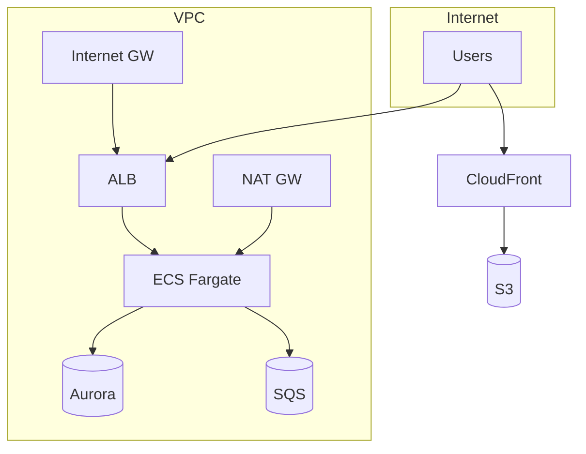

# Infrastructure spec template

This template defines the chapter outline for the spec of a system's cloud infrastructure, including resource inventory, networking, security, deployment pipelines, and environment configuration.

Designed for AWS / Azure / GCP, Terraform / CloudFormation / CDK / Pulumi, Kubernetes, and hybrid on-prem/cloud environments.

---

## Chapter outline

### Chapter 1: Overview

<!-- meta: bird's-eye view of the infrastructure. -->

#### 1.1 System purpose
- What workload this infrastructure supports
- Primary stakeholders (dev team, ops team, compliance)

#### 1.2 Cloud provider and account structure
| Provider | Account / subscription | Purpose | Region(s) |
|----------|----------------------|---------|-----------|
| AWS | production-123456789 | Production workloads | ap-northeast-1 |
| AWS | staging-987654321 | Staging / testing | ap-northeast-1 |
| ... | ... | ... | ... |

#### 1.3 High-level architecture diagram
- Network and service topology overview (Mermaid `graph TD`)
- Use subgraphs for VPC / environment boundaries

---

### Chapter 2: Resource inventory

<!-- meta: exhaustive list of all managed cloud resources. -->

#### 2.1 Compute

| Resource ID | Type | Spec / size | Quantity | Runtime | Managed by |
|:------------|:-----|:-----------|:--------:|:--------|:----------|
| web-ecs | ECS Fargate | 2 vCPU, 4GB | 2 × 2 (multi-AZ) | ECS | Terraform: ecs.tf |
| batch-worker | ECS Fargate | 4 vCPU, 8GB | 2 | ECS | Terraform: batch.tf |
| ... | ... | ... | ... | ... | ... |

#### 2.2 Networking

| Resource ID | Type | CIDR / config | Purpose | Managed by |
|:------------|:-----|:-------------|:--------|:----------|
| vpc-main | VPC | 10.0.0.0/16 | Main VPC | Terraform: vpc.tf |
| subnet-public-a | Public subnet | 10.0.1.0/24 | AZ-a public | Terraform: vpc.tf |
| subnet-private-a | Private subnet | 10.0.10.0/24 | AZ-a private | Terraform: vpc.tf |
| alb-web | ALB | internet-facing | Web traffic | Terraform: alb.tf |
| ... | ... | ... | ... | ... |

#### 2.3 Data stores

| Resource ID | Type | Spec | Storage | Multi-AZ | Managed by |
|:------------|:-----|:-----|:-------|:--------:|:----------|
| rds-main | RDS Aurora PostgreSQL | db.r6g.large | 500GB | ✅ | Terraform: rds.tf |
| redis-cache | ElastiCache Redis | cache.r6g.large | 50GB | ✅ | Terraform: cache.tf |
| s3-assets | S3 bucket | Standard | Unlimited | - | Terraform: s3.tf |
| ... | ... | ... | ... | ... | ... |

#### 2.4 Serverless / event-driven

| Resource ID | Type | Trigger | Config | Managed by |
|:------------|:-----|:--------|:-------|:----------|
| process-order | Lambda | SQS queue | 512MB, 30s timeout | Terraform: lambda.tf |
| order-queue | SQS | - | Standard queue | Terraform: sqs.tf |
| ... | ... | ... | ... | ... |

#### 2.5 Security / IAM

| Resource | Type | Policy / trust | Attached to | Managed by |
|:---------|:-----|:--------------|:------------|:----------|
| ecs-task-role | IAM Role | ecs-tasks.amazonaws.com | Web ECS tasks | Terraform: iam.tf |
| db-access-policy | IAM Policy | Allow: rds:Describe* | ecs-task-role | Terraform: iam.tf |
| ... | ... | ... | ... | ... |

---

### Chapter 3: Network topology

<!-- meta: detailed network structure and connectivity. -->

#### 3.1 VPC structure
- VPC CIDR, subnets (public/private), route tables
- NAT Gateway / Internet Gateway configuration
- VPC Endpoints (S3 Gateway, DynamoDB, etc.)

#### 3.2 Network diagram (Mermaid)

#### 3.3 Connectivity
- VPN / Direct Connect / Transit Gateway
- Inter-service communication (service mesh, VPC peering)
- External system access (third-party APIs, partner networks)

#### 3.4 DNS
- Route53 zones
- Certificate management (ACM)

---

### Chapter 4: Deployment pipeline

<!-- meta: CI/CD and release process. -->

#### 4.1 CI/CD pipeline

| Stage | Tool | Trigger | What it does | Approvals |
|:------|:-----|:--------|:------------|:---------|
| Build | GitHub Actions | Push to main | Build + test + container image | - |
| Staging deploy | ArgoCD | Auto after build | Deploy to staging ECS | - |
| Production deploy | ArgoCD | Manual approval | Deploy to prod ECS | Team lead |
| ... | ... | ... | ... | ... |

#### 4.2 Deployment strategy
- Blue/green or rolling update
- Canary releases (if used)
- Rollback procedure

#### 4.3 Container / artifact registry

| Registry | Repository | Format | Retention |
|:---------|:-----------|:-------|:---------|
| ECR | web-app | Docker image | 30 days |
| ECR | batch-worker | Docker image | 30 days |

---

### Chapter 5: Configuration and environment

<!-- meta: environment variables, secrets, and configuration management. -->

#### 5.1 Environment comparison

| Aspect | Development | Staging | Production |
|:-------|:-----------|:--------|:----------|
| AWS account | dev-... | staging-... | prod-... |
| Instance size | t3.medium | t3.large | r6g.large |
| Min/max tasks | 1/2 | 2/4 | 4/10 |
| Backup | None | Daily | Hourly |
| ... | ... | ... | ... |

#### 5.2 Secrets management
- Secrets stored in: AWS Secrets Manager / Parameter Store
- Rotation policy
- Access audit

#### 5.3 Environment variables
| Variable | Value source | Scope | Purpose |
|:---------|:------------|:------|:--------|
| DB_HOST | Secrets Manager | All envs | Database endpoint |
| LOG_LEVEL | Config map | Per env | Log verbosity |
| ... | ... | ... | ... |

---

### Chapter 6: Monitoring and observability

<!-- meta: metrics, alerts, dashboards, and logging infrastructure. -->

#### 6.1 Metrics

| Service | Metrics collected | Retention | Dashboard |
|:--------|:----------------|:---------|:----------|
| ECS | CPU, Memory, Request count | 15 months | CloudWatch / Grafana |
| RDS | Connections, IOPS, Replica lag | 15 months | CloudWatch / Grafana |

#### 6.2 Alerts

| Condition | Severity | Channel | Response time |
|:----------|:--------|:--------|:-------------|
| ECS CPU > 80% for 5 min | WARN | Slack | Next business day |
| RDS connections > 90% | CRITICAL | PagerDuty | 15 min |
| ... | ... | ... | ... |

#### 6.3 Logging infrastructure
- Log aggregation (CloudWatch Logs / Loki / Elasticsearch)
- Log retention per environment
- Audit logging

---

### Chapter 7: Disaster recovery and backup

<!-- meta: RTO/RPO, backup strategy, and recovery procedures. -->

#### 7.1 Backup strategy

| Resource | Backup method | Frequency | Retention | RPO | RTO |
|:---------|:-------------|:---------|:---------|:---|:---|
| RDS | Automated snapshot | Hourly | 30 days | 1 hour | 30 min |
| S3 | Cross-region replication | Continuous | - | 15 min | - |
| ... | ... | ... | ... | ... | ... |

#### 7.2 DR plan
- Multi-AZ vs multi-region
- Failover procedure
- Recovery runbook reference

---

### Chapter 8: Cost and sizing

<!-- meta: cost breakdown, budget, and scaling plan. -->

#### 8.1 Monthly cost estimate

| Service | Estimated cost | Notes |
|:--------|:-------------:|:------|
| ECS Fargate | $1,200 | 4 tasks × 2 vCPU |
| RDS Aurora | $800 | db.r6g.large × 2 AZ |
| ... | ... | ... |
| **Total** | **$2,500** | |

#### 8.2 Auto-scaling policy
- Target tracking: CPU > 70% → scale out
- Schedule: 9-18 JST → max tasks doubled
- Cooldown: 120 seconds

---

### Chapter 9: Known constraints and unresolved items

<!-- meta: spec credibility safeguard. -->

#### 9.1 Known constraints
- Service limits (e.g. API rate limits, max VPC size)
- Technical debt (e.g. manual steps not yet automated)
- Compliance requirements (e.g. PCI-DSS, SOC2)

#### 9.2 Unresolved items
- Place the `abandoned` entries from the Question Bank here
- Missing IaC coverage (resources managed outside of code)
