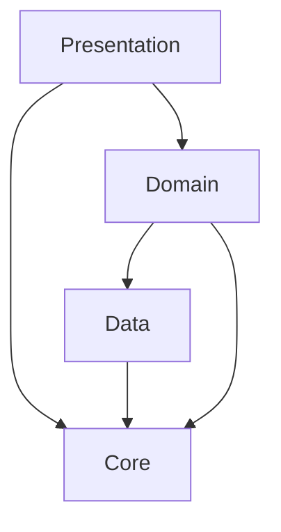
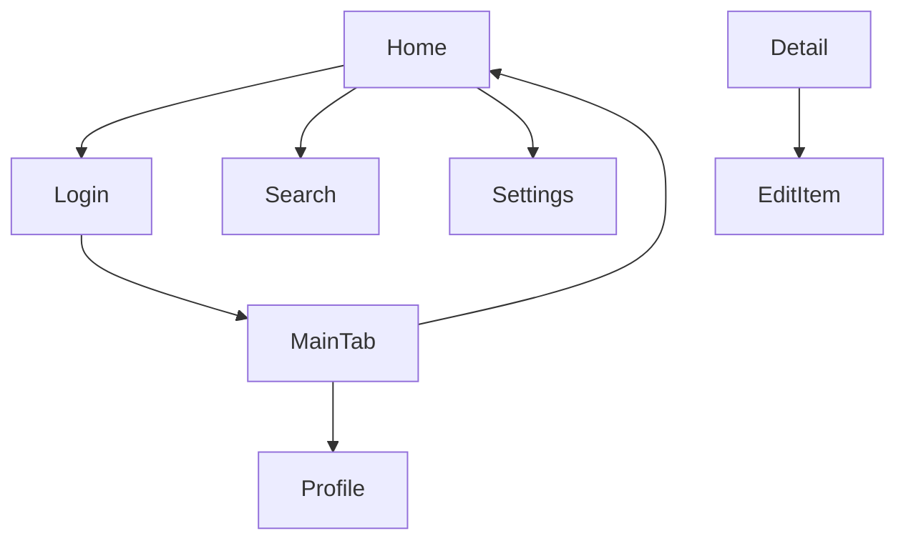
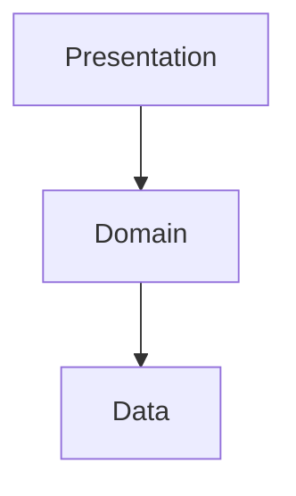

# Mobile app spec template

This template defines the chapter outline for the spec of a mobile application running on iOS, Android, or cross-platform frameworks.

Designed for Swift/SwiftUI (iOS), Kotlin/Jetpack Compose (Android), Flutter (Dart), and React Native (TypeScript/JavaScript). Covers screen navigation, state management, offline-first design, platform API integration, and store deployment.

---

## Chapter outline

### Chapter 1: Overview

<!-- meta: bird's-eye view of the mobile application. -->

#### 1.1 App purpose
- The problem this app solves
- Target users and personas
- Differentiation from competing apps

#### 1.2 Target platform and requirements
| Platform | Min OS version | Target devices | Status |
|----------|---------------|----------------|--------|
| iOS | 16.0 | iPhone, iPad | active |
| Android | 8.0 (API 26) | Phone, Tablet | active |

#### 1.3 High-level architecture diagram
- Presentation / Domain / Data layer diagram (Mermaid)
- Platform-specific architecture pattern (MVP, MVVM, MVI, Clean Architecture)

---

---

### Chapter 2: Feature specifications

<!-- meta: consolidated feature-level view of the app. Maps features to screens and data flows. -->

#### 2.1 Feature catalogue table

| Feature ID | Feature name | Category | Related screens | Auth required | Summary | Confidence |
|------------|-------------|----------|----------------|-------------|---------|-----------|
| F-001 | (feature) | (category) | (screens) | yes/no | 1-line summary | 🟢/🟡/🔴 |
| F-002 | (feature) | (category) | (screens) | yes/no | 1-line summary | 🟢/🟡/🔴 |
| ... | ... | ... | ... | ... | ... | ... |

The catalogue table exhaustively lists every feature. Confidence labels:
- 🟢 **VERIFIED**: Feature purpose confirmed by reading the actual screen/ViewModel code.
- 🟡 **INFERRED**: Feature mechanically grouped from screen naming or route structure.
- 🔴 **ASSUMED**: Feature inferred from use-case description; code evidence is indirect.

#### 2.2 Per-feature processing definitions

For each feature listed above, describe the processing flow structured as below. Generate at minimum the top-5 features by complexity or business criticality; list the remainder in the catalogue table only.

##### F-001: {Feature name}

**Overview**
- Business value this feature provides
- Which user / role uses it

**Trigger**
- User action / system event that initiates this feature

**Pre-conditions**
- Conditions that must hold before execution (network state, auth state)

**Main flow**
1. Step 1 [REF: src/path:line]
2. Step 2 [REF: src/path:line]
3. ...

**Alternative flows**
- Alt-1: When [condition] → [behaviour] [REF: src/path:line]

**Error handling**
- Error type → app behaviour [REF: src/path:line]
- Offline fallback behaviour

**Post-conditions**
- State of the system after successful execution

**Related business rules**
- → Ch? (Domain rules section) cross-reference

**Related chapters**
- → Ch? (Screens / State management / Data persistence) cross-reference

**Confidence**: 🟢/🟡/🔴

---

### Chapter 3: Module architecture

<!-- meta: top-level module structure using the layered architecture pattern common to mobile apps. -->

#### 3.1 Layer composition

| Layer | Responsibility | Key packages / modules | Confidence |
|-------|---------------|----------------------|-----------|
| Presentation | UI components, screens, ViewModels | (ui/ / screens/ / pages/) | 🟢 |
| Domain | Business logic, use-cases, entities | (domain/ / usecases/) | 🟢 |
| Data | Repositories, data sources, DTOs | (data/ / repository/) | 🟢 |
| Core / DI | Dependency injection, utilities | (di/ / core/) | 🟢 |
| Platform | Platform-specific API wrappers | (platform/ / native/) | 🟢 |

#### 3.2 Layer dependency diagram

- Presentation depends on Domain (via ViewModel → UseCase)
- Domain depends on Data (via Repository interface)
- All layers depend on Core (DI, utilities)
- Platform layer bridges native APIs

#### 3.3 Tech stack

| Item | Value | Source | Confidence |
|------|-------|--------|-----------|
| Language | (value) | [REF: ...] | 🟢 |
| UI framework | (value) | [REF: ...] | 🟢 |
| State management | (value) | [REF: ...] | 🟢 |
| Local database | (value) | [REF: ...] | 🟢 |
| Networking | (value) | [REF: ...] | 🟢 |
| Dependency injection | (value) | [REF: ...] | 🟢 |
| Testing framework | (value) | [REF: ...] | 🟢 |

---

### Chapter 4: Screen list and transitions

<!-- meta: all screens and how the user navigates between them. -->

#### 4.1 Screen catalogue

| Screen ID | Screen name | Route / path | Entry method | Confidence |
|-----------|-------------|-------------|--------------|-----------|
| S-001 | Home | `/` | App launch, tab bar | 🟢 |
| S-002 | Login | `/login` | Home → Login | 🟢 |
| S-003 | Detail | `/item/:id` | From list tap, deeplink | 🟢 |
| ... | ... | ... | ... | ... |

#### 4.2 Navigation graph

**Navigation patterns used:**
- Navigation Stack (push/pop)
- Tab bar navigation
- Modal presentation
- Bottom sheet / action sheet
- Deep link routing

#### 4.3 Tab structure

| Tab position | Tab name | Icon | Screen(s) |
|:-----------:|----------|------|-----------|
| 1 | Home | house.fill | Home |
| 2 | Search | magnifyingglass | Search, FilterSheet |
| 3 | Profile | person.fill | Profile, Settings |

#### 4.4 Deep linking

| Deep link URL | Target screen | Parameters | Confidence |
|--------------|---------------|------------|-----------|
| `myapp://item/{id}` | Detail | `id: string` | 🟢 |
| `https://myapp.com/item/{id}` | Detail (Universal Link) | `id: string` | 🟢 |
| ... | ... | ... | ... |

- Universal Link / App Link configuration
- Push notification → target screen mapping

---

### Chapter 5: State management

<!-- meta: how application state is managed across screens and lifecycle events. -->

#### 5.1 Architecture overview
- State management framework / pattern used (Riverpod / Redux / Bloc / ViewModel + StateFlow / Zustand)
- Global vs scoped state division

#### 5.2 Global state

| State slice | Store / provider | Persisted? | Initial value | Consumers |
|-------------|-----------------|-----------|--------------|-----------|
| Auth state | AuthProvider | yes (token) | `unauthenticated` | All screens |
| User preferences | SettingsStore | yes | defaults | Theme, Settings |
| Network status | ConnectivityProvider | no | `online` | Data layer |

#### 5.3 Screen / feature-level state

| Screen | Local state | Lifespan | Reconstruction strategy |
|--------|------------|----------|------------------------|
| Search | `query: string`, `results: List<Item>` | Screen visible | Re-fetch on appear |
| Detail | `item: Item?`, `isLoading: bool` | Screen visible | Load from ID param |
| ... | ... | ... | ... |

#### 5.4 State persistence and restoration
- Which state survives app kill / restart
- Which state survives configuration change (rotation, dark mode)
- Saved state handle / ViewModel saved state

---

### Chapter 6: Data persistence and offline-first

<!-- meta: local database, caching strategy, offline data access, and conflict resolution. -->

#### 6.1 Local database

| Technology | Purpose | Tables / collections | Notes |
|-----------|---------|--------------------|-------|
| CoreData / Room / SQLite | Primary offline storage | User, Item, Cache | |
| SharedPreferences / NSUserDefaults / DataStore | Small key-value data | settings, flags | |
| File system | Binary data, images | (document directory) | |

#### 6.2 Cache strategy

| Data type | TTL | Invalidation trigger | Stale-while-revalidate? |
|-----------|-----|---------------------|------------------------|
| Item list | 5 min | Pull-to-refresh, mutation | yes |
| User profile | 30 min | Logout, profile update | yes |
| Search results | session | New search query | no |

#### 6.3 Offline-first approach

- Read from cache first, then sync
- Write to local first, then enqueue sync
- Conflict detection and resolution strategy
- Sync queue persistence

#### 6.4 Conflict resolution

| Conflict type | Resolution strategy |
|--------------|-------------------|
| Local newer than remote | Keep local (last-write-wins) |
| Remote newer than local | Keep remote (server-authoritative) |
| Concurrent edits | Flag for manual merge |
| Delete vs update | Delete wins |

---

### Chapter 7: Platform API integration

<!-- meta: native device capabilities used by the app. -->

#### 7.1 Platform API catalogue

| API | Use case | Platform(s) | Permissions required | Confidence |
|-----|----------|------------|---------------------|-----------|
| Camera | Photo capture, document scan | iOS, Android | `NSCameraUsageDescription` / `CAMERA` | 🟢 |
| GPS / Location | Map, geotagging, proximity | iOS, Android | `NSLocationWhenInUseUsageDescription` / `ACCESS_FINE_LOCATION` | 🟢 |
| Biometrics | Face ID / Touch ID / Fingerprint auth | iOS, Android | `NSFaceIDUsageDescription` / `USE_BIOMETRIC` | 🟢 |
| Push notifications | Remote alerts | iOS, Android | Push capability in entitlements | 🟢 |
| Photo library | Image picker, save to camera roll | iOS, Android | `NSPhotoLibraryUsageDescription` / `READ_EXTERNAL_STORAGE` | 🟢 |
| File access | Document picker, file sharing | iOS, Android | Document picker (scoped) | 🟡 |
| Clipboard | Copy/paste, URL detection | iOS, Android | none (iOS 14+ pasteboard notice) | 🟢 |
| Sensors | Accelerometer, gyroscope, magnetometer | iOS, Android | none (session-scoped) | 🟡 |
| HealthKit / Health Connect | Health data integration | iOS, Android | Entitlement + consent | 🟡 |
| Wallet / Passkit | Passes, tickets, loyalty cards | iOS | Entitlement | 🟡 |
| NFC | Tap-to-pay, tag reading | iOS, Android | Capability entitlement | 🟡 |

#### 7.2 Permission map

| Permission | When requested | Purpose string | Opt-out behaviour |
|-----------|---------------|---------------|-------------------|
| Camera | On first camera use | "Take photos to attach to items" | Feature disabled, manual entry fallback |
| Location | On first map use | "Show your position on the map" | Map centred on default location |
| Notifications | On first launch (after onboarding) | "Keep you updated on changes" | No push, in-app banner polling |
| ... | ... | ... | ... |

- Permission request timing (pre-permission dialog, system dialog)
- Graceful degradation when permission denied

---

### Chapter 8: Push notifications

<!-- meta: push notification architecture, payload structure, and handling logic. -->

#### 8.1 Platform configuration

| Platform | Service | Certificate/key type | Environment |
|----------|---------|---------------------|-------------|
| iOS | APNs | APNs key (.p8) / certificate | Production |
| Android | FCM | Server key | Production |

#### 8.2 Notification types

| Type | Trigger | Payload structure | Display style | Tap action |
|------|---------|-----------------|--------------|-----------|
| New message | Server event | `{ "type": "message", "from": "...", "body": "..." }` | Banner + badge | Open conversation screen |
| Status update | Server event | `{ "type": "status", "item_id": "...", "status": "done" }` | Banner | Open item detail |
| Reminder | Scheduled trigger | `{ "type": "reminder", "due": "..." }` | Banner + sound | Open reminder list |
| ... | ... | ... | ... | ... |

#### 8.3 Notification handling

- App foreground: in-app banner or custom UI
- App background: system notification centre
- App killed / cold start: launch → navigate to target screen
- Notification grouping (thread identifier)
- Rich media (images, buttons, input field)

#### 8.4 Badge management
- Badge count source of truth (server-driven vs local)
- Badge clearing logic (on read-all, on app open)

---

### Chapter 9: Networking and sync

<!-- meta: how the app communicates with the server, caches responses, and synchronises in the background. -->

#### 9.1 API communication layer

| Component | Framework/library | Notes |
|-----------|-----------------|-------|
| HTTP client | URLSession / OkHttp / Dio / Apollo | |
| Serialisation | Codable / Moshi / kotlinx.serialization | |
| Authentication | Token injection (Bearer, OAuth) | |
| Interceptors / Middleware | Logging, retry, cache, auth refresh | |

#### 9.2 Cache interceptor

- HTTP cache policy (Cache-Control headers, ETag)
- Disk cache size limit
- Stale-while-revalidate pattern

#### 9.3 Background sync

| Sync type | Trigger | Direction | Conflict handling |
|-----------|---------|-----------|-------------------|
| Full sync | App launch, pull-to-refresh | Bidirectional | Server wins |
| Incremental sync | Periodic (every N min) | Download only | Local merge |
| Mutation sync | On local write (if online) | Upload only | Queue if offline |
| ... | ... | ... | ... |

- Sync queue persistence (SQLite / Realm)
- Conflict resolution strategy per entity
- Battery / data-saver awareness

#### 9.4 WebSocket / real-time

- Connection lifecycle (connect → subscribe → heartbeat → reconnect)
- Event subscription model
- Reconnection strategy (exponential backoff, jitter)

---

### Chapter 10: Build and deployment

<!-- meta: how the app is built, signed, and delivered to stores and testers. -->

#### 10.1 Build configuration

| Item | Value |
|------|-------|
| Build system | Xcode / Gradle / Fastlane / Codemagic |
| Minimum OS version | iOS 16.0 / Android 8.0 |
| Target SDK version | iOS 17 / Android 34 |
| Code signing | Automatic (Xcode) / Manual (Gradle signingConfig) |

#### 10.2 Distribution channels

| Channel | Purpose | Access control |
|---------|---------|---------------|
| App Store (iOS) | Production | Public / phased release |
| Google Play (Android) | Production | Public / staged rollout |
| TestFlight | Internal testing | App Store Connect users |
| Internal Track (Play) | Internal testing | Google Group |
| Firebase App Distribution | Ad-hoc testing | Email invite |
| Enterprise | In-house distribution | MDM-managed devices |

#### 10.3 CI/CD pipeline

| Step | Tool / service | Trigger |
|------|---------------|---------|
| Lint | SwiftLint / Detekt | PR |
| Unit test | XCTest / JUnit | PR |
| UI test | XCUITest / Espresso | PR |
| Build | Xcode / Gradle | PR, merge to main |
| Archive | Xcode / Gradle | Tagged release |
| Upload to store | Fastlane / CD | Tagged release |
| Release notes | Generated from changelog | Tagged release |

#### 10.4 Environment configuration

| Environment | API base URL | Feature flags | Push certificate |
|-------------|-------------|--------------|-----------------|
| Debug | localhost:8080 | All enabled | Development |
| Staging | staging.api.example.com | Beta features | Development |
| Production | api.example.com | Stable only | Production |

---

### Chapter 11: Design decisions

<!-- meta: architectural decisions, cross-cutting concerns, and design trade-offs derived from code. Complements Module architecture (which describes WHAT) by explaining WHY and HOW cross-cutting concerns are handled. -->

#### 11.1 Architecture Decision Records (ADR)

| ID | Topic | Decision (as observed in code) | Rationale (inferred) | Alternatives (inferred) | Confidence | Supporting REF |
|----|-------|------------------------------|---------------------|----------------------|-----------|---------------|
| ADR-001 | (topic) | (decision) | (inferred rationale) | (inferred alternatives) | 🟢/🟡/🔴 | [REF: ...] |
| ... | ... | ... | ... | ... | ... | ... |

→ For mobile-specific decisions: navigation architecture (NavigationStack vs Coordinator vs Router), state management choice, offline-first design, platform code sharing strategy, dependency injection framework, test strategy.

Extraction strategy:
- Search for design-related comments (`// Why:`, `# Reason:`, `/* Decision: */`)
- Read package-level README / ARCHITECTURE.md for explicit rationale
- When no explicit rationale exists, mark 🔴 ASSUMED and add `[ASK SME]`

[CONFIDENCE: LOW — ADR entries are almost always inferred unless explicitly documented]

#### 11.2 Module / component dependency

Import/require/include graph extracted from source code. Enumerates dependencies between layers or modules.

**Extraction approach:**

| Language | Pattern | Example | Confidence |
|----------|---------|---------|-----------|
| Swift | Project imports filtered to own modules | `import MyApp.Domain` | 🟢 |
| Kotlin | `import com.example.app.data.*` | `import com.example.app.data.repository` | 🟢 |
| Dart | `import 'package:myapp/domain/...'` | `import 'package:myapp/domain/usecases'` | 🟢 |
| TypeScript | `import { ... } from '../domain/...'` (React Native) | `import { useCases } from '@app/domain'` | 🟢 |

Label each edge with the dependency strength (direct / transitive / circular). Flag circular dependencies explicitly.

[🟢 VERIFIED] — import statements are mechanically extractable with near-zero false positives.

#### 11.3 Cross-cutting design patterns

| Pattern | Detection method | Confidence |
|---------|----------------|-----------|
| Error handling | Search for `Result`/`try`/`catch` patterns, custom error types | 🟢 |
| Logging | Search for `logger`/`Log`/`print` calls, logging framework setup | 🟢 |
| Dependency injection | Constructor injection, `@Inject`/`@Provides`/`Provider` annotations | 🟢 |
| Navigation | Search for `navigation`/`coordinator`/`router`/`pushViewController`/`navigate` | 🟢 |
| State observation | Search for `StateFlow`/`ObservableObject`/`@Published`/`ValueNotifier` | 🟢 |
| Repository pattern | Repository interfaces, `@Repository` annotations | 🟢 |
| Testing strategy | `@Test`/`test_`/`describe`/`it()`, mock framework imports | 🟢 |

#### 11.4 Performance design

| Pattern | Detection method | Confidence |
|---------|----------------|-----------|
| Image caching | Search for `SDWebImage`/`Kingfisher`/`Glide`/`Coil`/`cachedNetworkImage` | 🟢 |
| Lazy loading | Search for `LazyVStack`/`LazyColumn`/`ListView`/`FlatList` | 🟢 |
| Pagination | Search for `PagingSource`/`PagingData`/`loadMore`/`offset`/`cursor` | 🟢 |
| Background work | Search for `WorkManager`/`BGTaskScheduler`/`JobService`/`background fetch` | 🟢 |
| Memory optimisation | Search for `weak`/`unowned`/`dispose`/`cancel`/`ImageCache` size limits | 🟡 |
| Threading | Search for `DispatchQueue`/`CoroutineScope`/`async`/`OperationQueue` | 🟢 |

#### 11.5 Known trade-offs and constraints

| Marker | Detection method | Meaning |
|--------|----------------|---------|
| `TODO` | `rg "TODO"` (with context) | Planned improvement |
| `FIXME` | `rg "FIXME"` | Defect or known issue |
| `HACK` / `WORKAROUND` | `rg "HACK\|WORKAROUND"` | Deliberate suboptimal solution |
| `XXX` | `rg "XXX"` | Something suspicious |
| `OPTIMIZE` | `rg "OPTIMIZE\|PERF\|SLOW"` | Performance concern |
| `@deprecated` | Search for deprecation markers | Planned removal |

→ Critical items → see Chapter 12 (Known constraints and unresolved items)

[🟢 VERIFIED — markers are mechanically extractable; context needs manual review]

---

### Chapter 12: Known constraints and unresolved items

<!-- meta: spec credibility safeguard. -->

#### 12.1 Known constraints
- Platform-specific limitations (iOS push notification delivery guarantee, Android background execution limits)
- Performance ceilings (large dataset handling, image loading)
- Known bugs / workarounds
- Accessibility gaps
- Legacy platform version support constraints

#### 12.2 Unresolved items
- Place the `abandoned` entries from the Question Bank here

---

## Customisation guidance

### App also has a web backend
- Add a separate API service spec or composite template.
- Reference server endpoints from the Networking chapter.

### Cross-platform with shared logic
- Document the shared module (KMM / C# / C++ core) in Chapter 3.
- Describe per-platform UI implementation differences.

### Widget / extension targets
- Add a "Widgets and extensions" chapter after Chapter 7.
- Document widget timeline provider, share extension, watch companion app.

Third-party SDK integration (analytics, crash reporting, feature flags)
- Add an "SDK integration" section to the Configuration chapter.
- List each SDK with its purpose and data collection scope.

Customisation is finalised in dialogue with the user after Phase 1 template selection.
